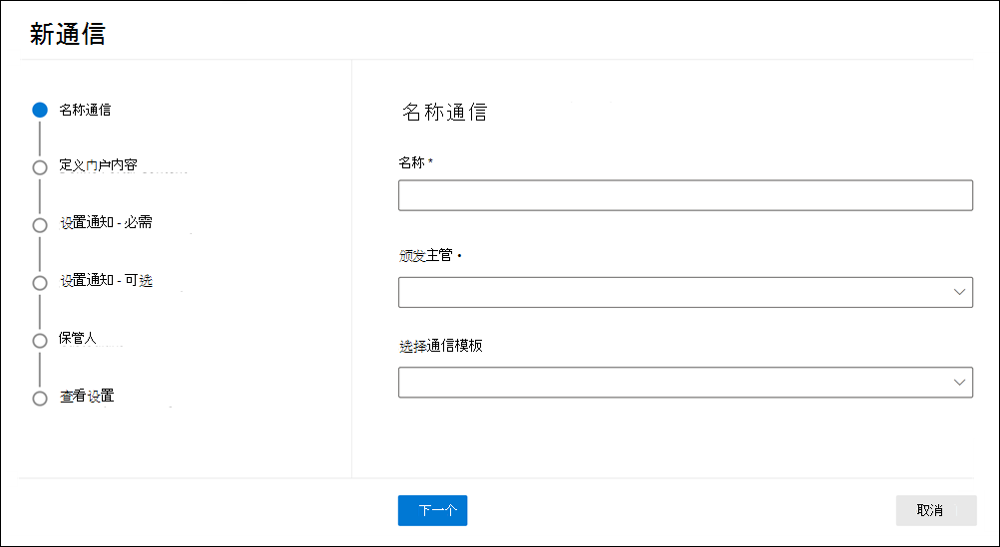

# 创建法定保留通知

通过使用Advanced eDiscovery人通信，组织可以围绕与保管人的通信管理其工作流。 通过通信工具，法律团队可以系统性地发送、收集和跟踪合法保留通知。 灵活的创建过程还允许团队自定义保留通知工作流以及发送给保管人的通知中的内容。

本文概述了保留通知工作流中的步骤。

## 步骤 1：指定通信详细信息

第一步是指定合法保留通知或其他保管人通信的适当详细信息。

1. 在Microsoft 365 合规中心中，转到"**>"**"高级"以显示组织中事例的列表。

2. 选择一个案例，单击" **通信"** 选项卡，然后单击"新建 **通信"**。

3. 在" **名称通信"** 页上，指定以下通信设置。

    - **名称**：这是通信的名称。

    - **颁发官员**：下拉列表显示贵组织中可选作通信的颁发官员的用户。 发送给保管人的每一次通信都将代表选定的颁发机构发送。 下拉列表中的用户列表由案件组的成员和组织范围内的颁发官员组成。 这些颁发者由电子数据展示管理员添加，可用于Advanced eDiscovery事例。 有关详细信息，请参阅管理 [颁发官员](advanced-ediscovery-issuing-officers.md)。

    - **选择通信** 模板：下拉列表显示"通信"库中的模板Advanced eDiscovery设置"页。 如果选择模板，该模板将显示在"定义门户内容"上，作为所创建通知文本的起点。 如果未选择模板，您必须从头开始创建通知。 有关通信模板详细信息，请参阅管理 [保管人通信模板](advanced-ediscovery-communications-library.md)。

4. 单击“**下一步**”。

## 步骤 2：定义门户内容

接下来，您可以创建并添加保留通知的内容。 在"**创建通信向导**"中的"定义门户内容"页上，指定保留通知的内容。 此内容将自动追加到颁发、重新颁发、提醒和上报通知。 此外，此内容将显示在保管人合规性门户中。 如果从通信库中选择了模板，将显示该模板，并为正在创建的通知提供起始点。

创建门户内容：

1. 在 (内容的文本框中键入或剪切) 另一个文档中的保留通知。 如果在上一向导页上选择了通信模板，将显示该模板。 你可在必要时编辑模板内容。

2. 在通知中插入合并变量以自定义通知并共享 Custodian 合规性门户。

3. 单击“**下一步**”。

  > [!TIP]
  > 若要详细了解如何自定义门户内容的内容和格式，请参阅使用 [通信编辑器](using-communications-editor.md)。

## 步骤 3：设置所需的通知

定义保留通知的内容后，可以围绕发送和管理通知流程设置工作流。 通知是发送以通知保管人并跟进的电子邮件。 添加到通信中每个保管人将收到相同的通知。

若要设置和发送保留通知，必须包含颁发、重新颁发和发布通知。

### 发布通知

创建通信后，颁发 **通知** 由指定的颁发官启动。 颁发通知是发送给保管人的第一次通信，告知其保存义务。

若要创建发布通知，请：

1. 在" **发布"** 磁贴中，单击" **编辑"**。

2. 如有必要，将其他案例成员或员工添加到 **"抄** 送"和"密件抄送 **"字段中** 。 若要向这些字段添加多个用户，请用分号分隔电子邮件地址。

3. 指定 **通知** 主题 (要求) 。

4. 指定要向保管人提供的内容或其他 (所需的) 。 在步骤 2 中定义的门户内容将添加到发布通知的末尾。

5. 单击 **“保存”**。

### Re-Issuance通知

随着案例的进展，可能需要保管人保留比之前指示更多的或更少的数据。 更新门户内容后，将发送重新通知，并通知保管人其保留义务的任何更改。

若要创建重新通知，请：

1. 在 **Reissue 磁贴中** ，单击"编辑 **"**。

2. 如有必要，将其他案例成员或员工添加到 **"抄** 送"和"密件抄送 **"字段中** 。 若要向这些字段添加多个用户，请用分号分隔电子邮件地址。

3. 指定 **通知** 主题 (要求) 。

4. 指定要向保管人提供的内容或其他 (所需的) 。 步骤 2 中定义的门户内容将添加到重新发布通知的末尾。

5. 单击 **“保存”**。

> [!NOTE]
> 如果已修改门户内容 (编辑通信向导) 中的"定义门户内容"页上的"定义门户内容"页上，则重新发布通知将自动发送给分配给通知的所有保管人。 发送通知后，将要求保管人重新确认其保留通知。 如果已设置任何提醒或升级工作流，这些工作流也将重新开始。 有关其他哪些案例管理事件触发通信的信息，请参阅 [触发通知的事件](#events-that-trigger-notifications)。

### 发布通知

在解决问题后，或者如果保管人不再受内容保护，你可以将保管人从案例释放。 如果保管人之前已发出保留通知，则释放通知可用于提醒保管人他们已解除义务。

创建发布通知：

1. 在" **发布"** 磁贴中，单击" **编辑"**。

2. 如有必要，将其他案例成员或员工添加到 **"抄** 送"和"密件抄送 **"字段中** 。 若要向这些字段添加多个用户，请用分号分隔电子邮件地址。

3. 指定 **通知** 主题 (要求) 。

4. 指定要向保管人提供的内容或其他 (所需的) 。

5. 单击 **"保存** "，然后转到下一步。

##  (可选) 步骤 4：设置可选通知

（可选）您可以通过创建和安排自动提醒和上报通知来简化工作流以跟进无响应保管人。

### Reminders

发送保留通知后，可以通过定义提醒工作流跟进无响应保管人。

若要安排提醒：

1. 在" **提醒"** 磁贴中，单击" **编辑"**。

2. 启用 **提醒工作流** ，方法为打开" **状态" (** 所需的) 。

3. 指定 **提醒间隔 (天)  (** 要求) 。 这是发送第一个和后续提醒通知之前要等待的天数。 例如，如果将提醒间隔设置为 7 天，则第一个提醒将在最初发出保留通知七天后发送。 所有后续提醒也将每七天发送一次。

4. 指定 **所需的提醒 (** 数) 。 此字段指定向无响应保管人发送的提醒数。 例如，如果将提醒数设置为 3，则保管人最多可收到三次提醒。 保管人确认保留通知后，将不再向该用户发送提醒。

5. 指定 **通知** 主题 (要求) 。

6. 指定要向保管人提供的内容或其他 (所需的) 。 步骤 2 中定义的门户内容将添加到提醒通知的末尾。

7. 单击 **"保存** "，然后执行下一步。

### 升级

在某些情况下，您可能需要其他方法来跟进无响应保管人。 如果保管人在收到指定数量的提醒后未确认保留通知，法律团队可以指定工作流，以自动向保管人及其经理发送上报通知。

若要安排升级：：

1. 在" **升级"** 磁贴中，单击" **编辑"**。

2. 通过打开 **"** 状态"开关启用 **升级** 工作流。

3. 指定 **升级间隔 (天数)  (** 要求) 。

4. 指定 **所需的升级数** (升级) 。 此字段指定向无响应保管人发送的升级数。 例如，如果将升级次数设置为 3，则最多向保管人及其经理发送升级通知三次。 保管人确认保留通知后，将不再发送升级。

5. 指定 **通知** 主题 (要求) 。

6. 指定要向保管人提供的内容或其他 (所需的) 。 步骤 2 中定义的门户内容将添加到升级通知的末尾。

7. 单击 **"保存** "，然后执行下一步。

## 步骤 5：分配保管人以接收通知

完成通知内容后，选择要向其发送通知的保管人。

添加保管人：

1. 通过单击保管人姓名旁边的复选框将保管人分配给通信。

    创建通信后，通知工作流将自动应用于选定的保管人。

2. 单击 **"下** 一步"查看通信设置和详细信息。

> [!NOTE]
> 只能添加已添加到案例且未在案例内发送其他通知的保管人。

## 步骤 6：查看设置

查看设置并单击"发送"完成通信后，系统会通过发送发布通知自动启动通信工作流。

## 触发通知的事件

下表介绍了在向保管人发送不同类型的通知时触发的案例管理过程中的事件。

|通信类型|Trigger |
|:---------|:---------|
|颁发通知|通知的初始创建。 您还可以手动重新发送保留通知。 |
|重新通知|更新"编辑通信"向导中" **定义门户** 内容 **"页上的门户** 内容。|
|发行通知|保管人从案例释放。|
|Reminders|为提醒配置的时间间隔和提醒数。|
|升级|为升级配置的时间间隔和提醒数。|
|||
