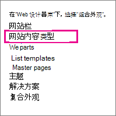
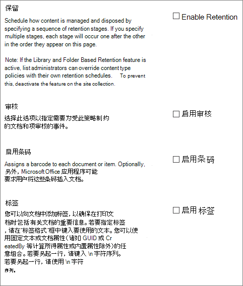
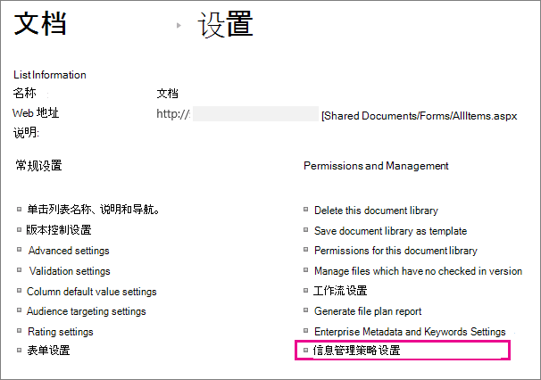

# 创建和应用信息管理策略

信息管理策略使组织能够控制内容的保留时间，审核用户对内容执行哪些操作，以及向文档添加条码或标签。 策略可帮助强制执行法律和政府法规或内部业务流程的合规性。 作为管理员，您可以设置一个策略来控制如何跟踪文档以及文档的保留时间。

可以在网站层次结构中的三个不同位置（从最广泛到最窄）创建信息管理策略：

- 创建一个策略以用于网站集中的多个内容类型。
- 为网站内容类型创建策略。
- 为列表或库创建策略。

有关详细信息，请参阅 [信息管理策略简介](intro-to-info-mgmt-policies.md)。

## 为网站集中的多个内容类型创建策略

为了确保信息策略应用于网站集中特定类型的所有文档，请考虑在网站集级别创建策略，然后将该策略应用于内容类型。 这些称为网站集策略。

1. 在网站集主页上 \> **，设置SharePoint**  \>“**网站设置**”。

    在连接到SharePoint的网站中，单击"设置"，**再** 单击"网站内容"，然后单击"网站 **设置"。** 

2. 在"网站设置页上的"网站 **集管理** \> **内容类型策略模板"下**。

   

3. 在"策略"页上， \> **创建**。

4. 输入策略的名称和说明，然后编写一个简短的策略声明，向用户解释策略用于什么。

5. 请参阅下一部分，了解如何为网站内容类型创建策略，了解如何设置要与策略关联的功能。

6. 选择“**确定**”。

## 为网站内容类型创建策略

将信息管理策略添加到内容类型后，可轻松将策略功能与多个列表或库关联。 可以选择将现有信息管理策略添加到内容类型，也可以创建特定于单个内容类型的唯一策略。

 您还可以将信息管理策略添加到特定于列表的内容类型。 这只能将策略应用于正在使用内容类型的列表中的项目。

1. 在网站集主页上 \> **，设置SharePoint**  \>“**网站设置**”。

    在连接到SharePoint的网站中，单击"设置"，**再** 单击"网站内容"，然后单击"网站 **设置"。** 

2. 在"网站设置页上的"**网站设计器库** \> **网站内容类型"下**。

   

3. 在"网站设置类型"页上，选择要添加策略的内容类型。

4. 在"网站内容类型"页上的"设置 \> **信息管理策略设置"下**。

5. 在"编辑策略"页上，输入策略的名称和说明，然后编写简要说明，向用户解释策略用于哪些内容。

6. In the next sections， select the individual policy features that you want to add to your information management policy.

   

7. 若要指定受此策略影响的文档和项目的保留期，请选择"启用保留"，然后指定保留期以及您希望在项目过期时发生的操作。 

   若要指定保留期：

   1. 选择 **"为记录添加保留阶段"。**

   2. 选择保留期选项以指定文档或项目设置为过期的时间。 请按照以下步骤之一操作：
      - 若要基于日期属性设置到期日期，请在"事件""此阶段基于项目的日期属性"下，选择文档或项目操作 (例如，"已创建或修改) "以及此操作后的时间增量 (例如，您希望项目过期的天数、月数或年 \> 数) 。
      - 若要使用自定义保留公式确定过期时间，请选择"按 **此服务器上安装的自定义保留公式设置"。**

        > [!NOTE]
        > 此选项仅在管理员已设置自定义公式时可用。

   3. " **启动工作流"** 选项仅在为已具有与其关联的工作流的列表、库或内容类型定义策略时可用。 然后，您可以选择工作流。

   4. 在" **定期"** 部分中，选择 **"重复此阶段的操作..."。** 并输入希望操作重复出现多久。

      > [!NOTE]
      >  此选项仅在所选操作可以重复时可用。 例如，不能为"永久删除" **操作设置重复周期**。

   5. 选择"**确定"。**

8. 若要对受此策略限制的文档和项目启用审核，请选择"启用审核"，然后指定要审核的事件。

   启用审核：

   1. 在"编辑策略"页上 **的**"审核"下，选择"启用审核"，然后选中要保留其审核跟踪的事件旁边的复选框。

   2. 若要提示用户将这些条码插入文档，请选择"提示用户先插入条码，然后再 **保存或打印"。**

   3. 选择 **"** 确定"将审核功能应用于策略。

   利用审核策略功能，组织可以创建和分析文档的审核跟踪，以及任务列表、问题列表、讨论组和日历等列表项。 此策略功能可提供用于记录事件的审核日志，例如内容被查看、编辑或删除的时间。

   在将审核作为信息管理策略的一部分启用时，管理员可以查看基于 Microsoft Excel 并汇总当前使用情况的策略使用率报告中的审核数据。 管理员可以使用这些报告来确定信息在组织内的使用率。 这些报告还可帮助组织验证和记录其法规合规性或调查潜在问题。

   审核日志可记录以下信息：事件名称、事件的日期和时间以及执行操作的用户的系统名称。

9. 当条码作为策略的一部分启用时，它们将被添加到文档属性中，并显示在应用条码的文档的标题区域中。 与标签一样，还可以从文档手动删除条码。 可以指定在打印或保存项目时是否提示用户包括条码，或者是否应当使用 2010 年发布程序中的"插入"选项卡手动插入Office条码。

   若要启用条码：

   1. 在"**编辑策略"** 页上 **的"条码"下**，选择 **"启用条码"。**

   2. 若要提示用户将这些条码插入文档，请选择"提示用户先插入条码，然后再 **保存或打印"。**

   3. 选择 **"** 确定"将条码功能应用于策略。

   条码策略生成 Code 39 标准条形码。 每个条形码图像均包括表示条码值的条形码符号下方的文本。 这使条形码数据即使在扫描硬件不可用时也可用。 用户可以在搜索框中手动键入条码，以查找网站上的项目。    |

10. 若要要求受此策略影响的文档具有标签，请选择"启用标签"，然后指定要用于标签的设置。

    若要启用标签，

    1. 若要要求用户向文档添加标签，请选择"提示用户在保存或打印前 **插入标签"。**

       > [!NOTE]
       > 如果您希望标签为可选的，请不要选中此复选框。 

    2. 若要锁定标签，以便插入标签后不能更改标签，请选择"添加标签后禁止 **更改标签"。**

       此设置可阻止在将标签插入客户端应用程序（如 Word、Excel 或 PowerPoint）中的项后更新标签文本。 如果您想要在更新该文档或项的属性时更新标签，请不要选中此复选框。

    3. 在"标签格式"框中，输入要显示的标签的文本。 标签可包含最多 10 列引用，每个列引用最多 255 个字符。 若要为标签创建格式，请执行以下步骤：
       - 按希望列的显示顺序键入要包括在标签中的列的名称。 将列名称放在大括号 () ，如"编辑策略"页上 {} 的示例所示。
       - 键入单词以标识方括号之外的列，如"编辑策略"页上的示例所示。

    4. 若要添加换 **行符，\n** 换行符出现位置。

    5. 选择您想要的字号和样式，并指定标签位于文档中的左侧、中间还是右侧。

       选择可以在用户计算机上使用的字体和样式。 字体的大小将影响可以在标签上显示的文本的多少。

    6. 输入标签的高度和宽度。 标签高度介于 0.25 英寸到 20 英寸之间，标签宽度介于 0.25 英寸到 20 英寸之间。 标签文本始终在标签图像内垂直居中。

    7. 选择 **"刷新** "预览标签内容。

11. 选择“**确定**”。

## 为列表、库或文件夹创建策略（基于位置的保留策略）

可以定义仅适用于特定列表、库或文件夹的保留策略。 但是，如果这样创建保留策略，将无法在其他列表、库、文件夹或网站上重复使用此策略，也无法将网站集策略应用于基于位置的策略。

如果要将单个保留策略应用于单个位置中所有类型的内容，则最可能希望使用基于位置的保留。 在大多数情况下，您需要验证是否针对所有内容类型指定了保留策略。

每个子文件夹都继承其父级的保留策略，除非你选择中断继承，在子级别定义新的保留策略。

如果要定义除保留列表或库外的信息管理策略，则需要为与该列表或库关联的每个列表内容类型定义信息管理策略。

如果您决定随时从列表或库的内容类型切换到基于位置的策略，则仅保留策略将用作基于位置的策略。 所有其他管理策略 (审核、条码和条形码) 将继承自关联的内容类型。

可通过停用"基于库和文件夹的保留"功能为网站集禁用基于位置的策略。 这使网站集管理员能够确保其内容类型策略不会由列表管理员的基于位置的策略覆盖。

至少需要"管理列表"权限才能更改列表或库的信息管理策略设置。

1. 导航到要指定信息管理策略的列表或库。

2. 在功能区上，选择 **"库**"或"**列表**" \> **选项卡设置** 或 **"列表设置"。**

   在 SharePoint Online 中，**单击**"设置"，然后单击"**列表设置"** 或"**库设置"。**

3. 在 **"权限和管理** \> **信息管理策略设置"下**。

   

4. 在"信息管理策略设置页上，确保将列表或库的保留源设置为"库和文件夹"。

   如果 **内容类型** 显示为源，请单击"**更改源**"，然后单击"库 **和文件夹"。** 请注意，内容类型保留策略将被忽略。 选择“**确定**”。

5. 在"编辑策略"页上的"基于 **库的保留计划**"下，输入所创建策略的简要说明。

6. 选择 **"添加保留阶段..."。**

   请注意，在"记录"下，可以通过选择"定义记录的不同保留阶段"选项来为记录定义不同的保留策略。

7. 在"阶段属性"对话框中，选择保留期选项以指定文档或项目何时过期。 执行下列操作之一：

   - 若要基于日期属性设置到期日期，请在"事件 此阶段基于项目的日期属性"下，选择文档或项目操作 (例如，"已创建或修改的) "以及此操作后的时间增量 (例如，您希望项目过期的天数、月数或年 \> 数) 。

   - 若要使用自定义保留公式确定过期时间，请选择"按 **此服务器上安装的自定义保留公式设置"。**

     > [!NOTE]
     >  此选项仅在管理员已设置自定义公式时可用。

   - 在 **"操作**"下，指定您希望在文档或项目过期时发生的情况。 若要允许对文档或项目执行特定操作 (如删除) ，请从列表中选择一个操作。

8. " **启动工作流"** 选项仅在为已具有与其关联的工作流的列表、库或内容类型定义策略时可用。 然后，您可以选择工作流。

9. 在 **"定期**"下 **，选择"重复此阶段的操作..."。** 并输入希望操作重复出现多久。

   > [!NOTE]
   >  此选项仅在所选操作可以重复时可用。 例如，不能为"永久删除" **操作设置重复周期**。

10. 选择“**确定**”。

## 将网站集策略应用于内容类型

如果已针对网站创建了信息管理策略作为网站集策略，您可以将其中一个策略应用于内容类型。 通过执行此操作，您可以将同一策略应用于网站集中不共享同一父内容类型的多个内容类型。

 如果要将策略应用于网站集中的多个内容类型，并且配置了 Managed Metadata Service，您可以使用内容类型发布将信息管理策略发布到多个网站集。 有关详细信息， [请参阅跨网站集应用](#apply-a-policy-across-site-collections) 策略一节。

1. 导航到包含要应用策略的内容类型的列表或库。

2. 在功能区上，选择 **"库**"或"**列表**" \> **选项卡设置** 或 **"列表设置"。**

   在 SharePoint Online 中，**单击**"设置"，然后单击"**列表设置"** 或"**库设置"。**

3. 在 **"权限和管理** \> **信息管理策略设置"下**。

   

4. 验证策略源是否设置为"**内容** 类型"，在"内容类型策略"下，选择要应用策略的内容类型。

5. 在 **"指定策略** \> **使用网站集策略"** 下，从列表中选择要应用的策略。

   > [!NOTE]
   >  如果 **"使用网站集策略** "选项不可用，则没有为网站集定义任何网站集策略。

6. 选择“**确定**”。

   如果您处理的列表或库支持管理多个内容类型，您可以在"内容类型"下选择要指定信息管理策略的内容类型。 这将直接进入上述步骤 5。

## 跨网站集应用策略

通过使用 Managed Metadata Service 应用程序设置内容类型发布，跨网站集共享内容类型。 内容类型发布可帮助您跨网站一致地管理内容和元数据，因为可以集中创建和更新内容类型，并且可以将更新发布到多个订阅网站集或 Web 应用程序。

## 从现有策略创建模板以跨网站集使用

您可以定义信息管理策略，然后根据策略创建模板，以根据需要跨多个网站集使用。 如果希望备份信息策略，可以使用此方法，也可以用作使用内容类型发布跨网站集应用一个策略的替代方法。 通过从一个网站集导出策略，然后将该策略导入到保存的位置或另一个网站集，可以创建策略的模板或备份。

> [!IMPORTANT]
> 如果使用导出/导入功能作为创建一组策略模板的方法，请记住策略模板文件中存在唯一标识符.xml标识符。 因此，如果不更改此唯一标识符，将无法多次将策略导入站点。

### 导出策略

1. 在网站集主页上，选择"设置"设置"小齿轮"，以  \> **设置"。**

   在连接到SharePoint的网站中，单击"设置"，**再** 单击"网站内容"，然后单击"网站 **设置"。** 

2. 在"网站设置页上的"**网站集管理** \> **内容类型策略模板"下**。

   

3. 选择要导出的策略滚动到底部 \> "导出 \> **"。**

4. 在提示保存或打开文件时，选择"保存"，然后选择文件保存到的位置。  请务必选择一个可供导入策略的网站集使用的位置。

5. 当显示"下载完成"对话框时，选择"关闭 **"。**

### 将策略导入到其他网站集

导入信息管理策略使您能够在任何给定网站集中的网站或列表级别将信息管理策略应用于多个内容类型。 这样做的好处有两个方面：无需重新定义和应用每个内容类型的策略，并且只需在一个地方更改策略，就可以更轻松地管理策略修改。

1. 在要应用策略的网站集的主页上，选择"设置 小型 设置齿轮"，以  \> **设置"。**

   在连接到SharePoint的网站中，单击"设置"，**再** 单击"网站内容"，然后单击"网站 **设置"。** 

2. 在"网站设置页上的"**网站集管理** \> **内容类型策略模板"下**。

3. On the Policies page \> **Import** \> **Browse** to find the XML file for the policy.

4. 选择已保存策略的 XML 文件"打开 \> **"。**

5. 在"导入网站集策略"页上 \> **，导入** 以将策略添加到网站集。

现在可以将导入的策略应用于站点或列表级别的一个或多个内容类型。

信息管理策略使组织能够控制内容的保留时间，审核用户对内容执行哪些操作，以及向文档添加条码或标签。 策略可帮助强制执行法律和政府法规或内部业务流程的合规性。 作为管理员，您可以设置一个策略来控制如何跟踪文档以及文档的保留时间。

可以在网站层次结构中的三个不同位置（从最广泛到最窄）创建信息管理策略：

- 创建一个策略以用于网站集中的多个内容类型。
- 为网站内容类型创建策略。
- 为列表或库创建策略。

有关详细信息，请参阅 [信息管理策略简介](intro-to-info-mgmt-policies.md)。
