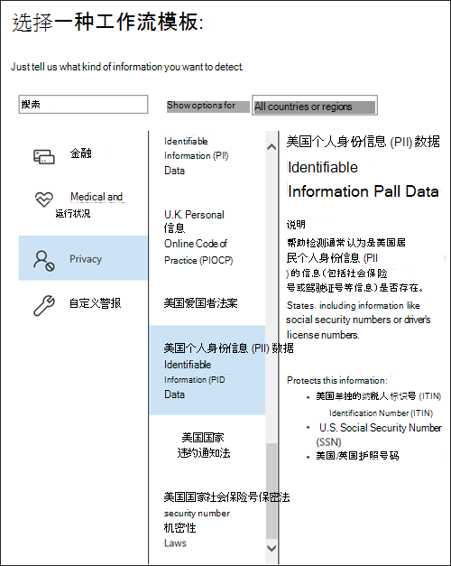
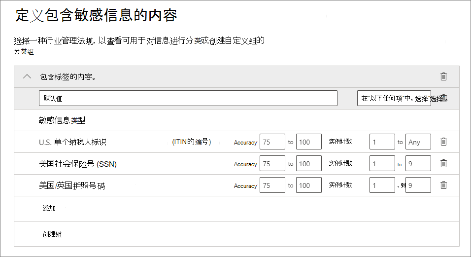
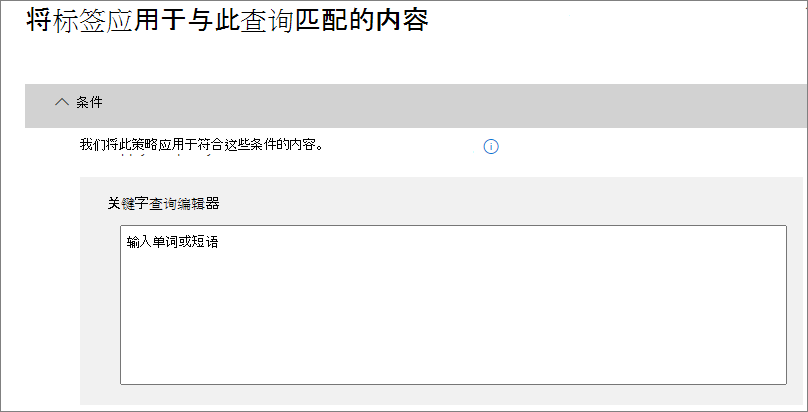

# <a name="create-publish-and-auto-apply-retention-labels"></a><span data-ttu-id="d3a84-103">创建、发布和自动应用保留标签</span><span class="sxs-lookup"><span data-stu-id="d3a84-103">Create, publish, and auto-apply retention labels</span></span>

><span data-ttu-id="d3a84-104">*[Microsoft 365 安全性与合规性许可指南](https://aka.ms/ComplianceSD)。*</span><span class="sxs-lookup"><span data-stu-id="d3a84-104">*[Microsoft 365 licensing guidance for security & compliance](https://aka.ms/ComplianceSD).*</span></span>

<span data-ttu-id="d3a84-105">使用以下信息可帮助你创建[保留标签](labels.md)，然后将其自动应用到文档和电子邮件，或发布它们以便用户可以手动应用。</span><span class="sxs-lookup"><span data-stu-id="d3a84-105">Use the following information to help you create [retention labels](labels.md), and then automatically apply them to documents and emails, or publish them so that users can manually apply them.</span></span>

<span data-ttu-id="d3a84-106">保留标签可帮助你保留所需内容并删除不需要的内容。</span><span class="sxs-lookup"><span data-stu-id="d3a84-106">Retention labels help you retain what you need and delete what you don't.</span></span> <span data-ttu-id="d3a84-107">它们还用于将项目声明为记录，作为 Microsoft 365 数据的[记录管理](records-management.md)解决方案的一部分。</span><span class="sxs-lookup"><span data-stu-id="d3a84-107">They are also used to declare an item as a record as part of a [records management](records-management.md) solution for your Microsoft 365 data.</span></span>

<span data-ttu-id="d3a84-108">创建和配置保留标签的位置取决于你是否使用记录管理。</span><span class="sxs-lookup"><span data-stu-id="d3a84-108">Where you create and configure your retention labels depend on whether you're using records management or not.</span></span> <span data-ttu-id="d3a84-109">针对这两种情况提供了说明。</span><span class="sxs-lookup"><span data-stu-id="d3a84-109">Instructions are provided for both scenarios.</span></span>

## <a name="before-you-begin"></a><span data-ttu-id="d3a84-110">准备工作</span><span class="sxs-lookup"><span data-stu-id="d3a84-110">Before you begin</span></span>

<span data-ttu-id="d3a84-111">负责创建保留标签的合规性团队成员必须有权访问安全&amp;合规中心。</span><span class="sxs-lookup"><span data-stu-id="d3a84-111">Members of your compliance team who will create retention labels need permissions to the Security &amp; Compliance Center.</span></span> <span data-ttu-id="d3a84-112">默认情况下，租户管理员有权访问此位置，并可向合规部主管及其他人员授予对安全&amp;合规中心的访问权限，而不授予租户管理员的所有权限。为此，建议转到安全&amp;合规中心内的“**权限**”页，编辑“**合规性管理员**”角色组，再向此角色组添加成员。</span><span class="sxs-lookup"><span data-stu-id="d3a84-112">By default, your tenant admin has access to this location and can give compliance officers and other people access to the Security &amp; Compliance Center, without giving them all of the permissions of a tenant admin. To do this, we recommend that you go to the **Permissions** page of the Security &amp; Compliance Center, edit the **Compliance Administrator** role group, and add members to that role group.</span></span> 
  
<span data-ttu-id="d3a84-113">有关详细信息，请参阅[向用户授予对 Office 365 安全与合规中心的访问权限](../security/office-365-security/grant-access-to-the-security-and-compliance-center.md)。</span><span class="sxs-lookup"><span data-stu-id="d3a84-113">For more information, see [Give users access to the Office 365 Security &amp; Compliance Center](../security/office-365-security/grant-access-to-the-security-and-compliance-center.md).</span></span>
  
<span data-ttu-id="d3a84-114">These permissions are required only to create and apply retention labels and a label policy.</span><span class="sxs-lookup"><span data-stu-id="d3a84-114">These permissions are required only to create and apply retention labels and a label policy.</span></span> <span data-ttu-id="d3a84-115">Policy enforcement does not require access to the content.</span><span class="sxs-lookup"><span data-stu-id="d3a84-115">Policy enforcement does not require access to the content.</span></span>

## <a name="create-and-configure-retention-labels"></a><span data-ttu-id="d3a84-116">创建和配置保留标签</span><span class="sxs-lookup"><span data-stu-id="d3a84-116">Create and configure retention labels</span></span>

1. <span data-ttu-id="d3a84-117">在 [Microsoft 365 合规中心](https://compliance.microsoft.com/)，导航到以下位置之一：</span><span class="sxs-lookup"><span data-stu-id="d3a84-117">In the [Microsoft 365 compliance center](https://compliance.microsoft.com/), navigate to one of the following locations:</span></span>
    
    - <span data-ttu-id="d3a84-118">如果你正在使用记录管理：</span><span class="sxs-lookup"><span data-stu-id="d3a84-118">If you are using records management:</span></span>
        - <span data-ttu-id="d3a84-119">“**解决方案**” > “**记录管理**” > “**文件计划**”选项卡 > + “**创建标签**” > “**保留标签**”</span><span class="sxs-lookup"><span data-stu-id="d3a84-119">**Solutions** > **Records management** > **File plan** tab > **+ Create a label** > **Retention label**</span></span>
        
    - <span data-ttu-id="d3a84-120">如果你没有使用记录管理：</span><span class="sxs-lookup"><span data-stu-id="d3a84-120">If you are not using records management:</span></span>
       - <span data-ttu-id="d3a84-121">“**解决方案**” > “**信息治理**” > “**标签**”选项卡 > +“**创建标签**”</span><span class="sxs-lookup"><span data-stu-id="d3a84-121">**Solutions** > **Information governance** > **Labels** tab > + **Create a label**</span></span>
    
    <span data-ttu-id="d3a84-122">没有立即看到你的选项？</span><span class="sxs-lookup"><span data-stu-id="d3a84-122">Don't immediately see your option?</span></span> <span data-ttu-id="d3a84-123">首先选择“**全部显示**”。</span><span class="sxs-lookup"><span data-stu-id="d3a84-123">First select **Show all**.</span></span> 

2. <span data-ttu-id="d3a84-124">按照向导中的提示进行操作。</span><span class="sxs-lookup"><span data-stu-id="d3a84-124">Follow the prompts in the wizard.</span></span> <span data-ttu-id="d3a84-125">如果你正在使用记录管理：</span><span class="sxs-lookup"><span data-stu-id="d3a84-125">If you are using records management:</span></span>
    
    - <span data-ttu-id="d3a84-126">有关文件计划描述符的信息，请参阅[使用文件计划管理保留标签](file-plan-manager.md)</span><span class="sxs-lookup"><span data-stu-id="d3a84-126">For information about the file plan descriptors, see [Use file plan to manage retention labels](file-plan-manager.md)</span></span>
    
    - <span data-ttu-id="d3a84-127">要使用保留标签将内容声明为记录，请启用“**使用标签将内容分类为“记录”**”复选框。</span><span class="sxs-lookup"><span data-stu-id="d3a84-127">To use the retention label to declare content as a record, enable the checkbox **Use label to classify content as a "Record"**.</span></span>

3. <span data-ttu-id="d3a84-128">重复这些步骤以创建更多标签。</span><span class="sxs-lookup"><span data-stu-id="d3a84-128">Repeat these steps to create more labels.</span></span>

<span data-ttu-id="d3a84-129">若要编辑现有标签，请将其选中，然后选择“**编辑标签**”启动同一向导，以便在步骤 2 中更改标签说明和任何[符合条件的设置](#updating-retention-labels-and-their-policies)。</span><span class="sxs-lookup"><span data-stu-id="d3a84-129">To edit an existing label, select it, and then select **Edit label** to start the same wizard that lets you change the label descriptions and any [eligible settings](#updating-retention-labels-and-their-policies) from step 2.</span></span> <span data-ttu-id="d3a84-130">或者，选择任意可用的**编辑**选项，直接转到相关页面进行更新。</span><span class="sxs-lookup"><span data-stu-id="d3a84-130">Alternatively, select any of the available **Edit** options to go directly to the relevant page to make your update.</span></span>

## <a name="publish-retention-labels-by-creating-a-retention-label-policy"></a><span data-ttu-id="d3a84-131">通过创建保留标签策略发布保留标签</span><span class="sxs-lookup"><span data-stu-id="d3a84-131">Publish retention labels by creating a retention label policy</span></span>

<span data-ttu-id="d3a84-132">发布保留标签，以便用户可以可以手动应用它们。</span><span class="sxs-lookup"><span data-stu-id="d3a84-132">Publish retention labels so that they can be manually applied by users.</span></span>

1. <span data-ttu-id="d3a84-133">在 [Microsoft 365 合规中心](https://compliance.microsoft.com/)，导航到以下位置之一：</span><span class="sxs-lookup"><span data-stu-id="d3a84-133">In the [Microsoft 365 compliance center](https://compliance.microsoft.com/), navigate to one of the following locations:</span></span>
    
    - <span data-ttu-id="d3a84-134">如果你正在使用记录管理：</span><span class="sxs-lookup"><span data-stu-id="d3a84-134">If you are using records management:</span></span>
        - <span data-ttu-id="d3a84-135">“**解决方案**” > “**记录管理**”> >“**标签策略**”选项卡 >“**发布标签**”</span><span class="sxs-lookup"><span data-stu-id="d3a84-135">**Solutions** > **Records management** > > **Label policies** tab > **Publish labels**</span></span>
    
    - <span data-ttu-id="d3a84-136">如果你没有使用记录管理：</span><span class="sxs-lookup"><span data-stu-id="d3a84-136">If you are not using records management:</span></span>
        - <span data-ttu-id="d3a84-137">“**解决方案**” > “**信息治理**” > “**标签策略**”选项卡 >“**发布标签**”</span><span class="sxs-lookup"><span data-stu-id="d3a84-137">**Solutions** > **Information governance** > **Label policies** tab > **Publish labels**</span></span>
    
    <span data-ttu-id="d3a84-138">没有立即看到你的选项？</span><span class="sxs-lookup"><span data-stu-id="d3a84-138">Don't immediately see your option?</span></span> <span data-ttu-id="d3a84-139">首先选择“**全部显示**”。</span><span class="sxs-lookup"><span data-stu-id="d3a84-139">First select **Show all**.</span></span> 

2. <span data-ttu-id="d3a84-140">按照向导中的提示进行操作。</span><span class="sxs-lookup"><span data-stu-id="d3a84-140">Follow the prompts in the wizard.</span></span>
    
    <span data-ttu-id="d3a84-141">有关保留标签支持的位置的信息，请参阅[保留标签和位置](labels.md#retention-label-policies-and-locations)部分。</span><span class="sxs-lookup"><span data-stu-id="d3a84-141">For information about the locations supported by retention labels, see the [Retention labels and locations](labels.md#retention-label-policies-and-locations) section.</span></span> 

<span data-ttu-id="d3a84-142">若要编辑现有保留标签策略，请将其选中，然后选择“**编辑策略**”启动同一向导，以便在步骤 2 中更改策略描述和任何[符合条件的设置](#updating-retention-labels-and-their-policies)。</span><span class="sxs-lookup"><span data-stu-id="d3a84-142">To edit an existing retention label policy, select it, and then select **Edit policy** to start the same wizard that lets you change the policy description and any [eligible settings](#updating-retention-labels-and-their-policies) from step 2.</span></span> <span data-ttu-id="d3a84-143">或者，选择任意可用的**编辑**选项，直接转到相关页面进行更新。</span><span class="sxs-lookup"><span data-stu-id="d3a84-143">Alternatively, select any of the available **Edit** options to go directly to the relevant page to make your update.</span></span>

## <a name="auto-apply-a-retention-label"></a><span data-ttu-id="d3a84-144">自动应用保留标签</span><span class="sxs-lookup"><span data-stu-id="d3a84-144">Auto-apply a retention label</span></span>

<span data-ttu-id="d3a84-145">根据指定的条件自动应用保留标签。</span><span class="sxs-lookup"><span data-stu-id="d3a84-145">Auto-apply a retention label, based on the conditions that you specify.</span></span>

1. <span data-ttu-id="d3a84-146">在 [Microsoft 365 合规中心](https://compliance.microsoft.com/)，导航到以下位置之一：</span><span class="sxs-lookup"><span data-stu-id="d3a84-146">In the [Microsoft 365 compliance center](https://compliance.microsoft.com/), navigate to one of the following locations:</span></span>
    
    - <span data-ttu-id="d3a84-147">如果你正在使用记录管理：“**信息治理**”：</span><span class="sxs-lookup"><span data-stu-id="d3a84-147">If you are using records management: **Information governance**:</span></span>
        - <span data-ttu-id="d3a84-148">“**解决方案**” > “**记录管理**” > “**标签策略**”选项卡 >“**自动应用标签**”</span><span class="sxs-lookup"><span data-stu-id="d3a84-148">**Solutions** > **Records management** > **Label policies** tab > **Auto-apply label**</span></span>
    
    - <span data-ttu-id="d3a84-149">如果你没有使用记录管理：</span><span class="sxs-lookup"><span data-stu-id="d3a84-149">If you are not using records management:</span></span>
        - <span data-ttu-id="d3a84-150">“**解决方案**” > “**信息治理**” > “**标签策略**”选项卡 >“**自动应用标签**”</span><span class="sxs-lookup"><span data-stu-id="d3a84-150">**Solutions** > **Information governance** > **Label policies** tab > **Auto-apply label**</span></span>
    
    <span data-ttu-id="d3a84-151">没有立即看到你的选项？</span><span class="sxs-lookup"><span data-stu-id="d3a84-151">Don't immediately see your option?</span></span> <span data-ttu-id="d3a84-152">首先选择“**全部显示**”。</span><span class="sxs-lookup"><span data-stu-id="d3a84-152">First select **Show all**.</span></span> 

2. <span data-ttu-id="d3a84-153">按照向导中的提示进行操作。</span><span class="sxs-lookup"><span data-stu-id="d3a84-153">Follow the prompts in the wizard.</span></span>
    
    <span data-ttu-id="d3a84-154">有关配置自动应用保留标签的条件的信息，请参阅此页面上的[配置自动应用保留标签的条件](#configuring-conditions-for-auto-apply-retention-labels)部分。</span><span class="sxs-lookup"><span data-stu-id="d3a84-154">For information about configuring the conditions that automatically apply the retention label, see the [Configuring conditions for auto-apply retention labels](#configuring-conditions-for-auto-apply-retention-labels) section on this page.</span></span>
    
    <span data-ttu-id="d3a84-155">有关保留标签支持的位置的信息，请参阅[保留标签和位置](labels.md#retention-label-policies-and-locations)部分。</span><span class="sxs-lookup"><span data-stu-id="d3a84-155">For information about the locations supported by retention labels, see the [Retention labels and locations](labels.md#retention-label-policies-and-locations) section.</span></span>

<span data-ttu-id="d3a84-156">若要编辑现有自动应用标签策略，请将其选中，然后选择“**编辑策略**”启动同一向导，以便在步骤 2 中更改策略描述和任何[符合条件的设置](#updating-retention-labels-and-their-policies)。</span><span class="sxs-lookup"><span data-stu-id="d3a84-156">To edit an existing auto-apply label policy, select it, and then select **Edit policy** to start the same wizard that lets you change the policy description and any [eligible settings](#updating-retention-labels-and-their-policies) from step 2.</span></span> <span data-ttu-id="d3a84-157">或者，选择任意可用的**编辑**选项，直接转到相关页面进行更新。</span><span class="sxs-lookup"><span data-stu-id="d3a84-157">Alternatively, select any of the available **Edit** options to go directly to the relevant page to make your update.</span></span>


## <a name="configuring-conditions-for-auto-apply-retention-labels"></a><span data-ttu-id="d3a84-158">配置自动应用保留标签的条件</span><span class="sxs-lookup"><span data-stu-id="d3a84-158">Configuring conditions for auto-apply retention labels</span></span>

<span data-ttu-id="d3a84-159">可将保留标签自动应用于包含以下各项的内容：</span><span class="sxs-lookup"><span data-stu-id="d3a84-159">You can apply retention labels to content automatically when that content contains:</span></span>
  
- [<span data-ttu-id="d3a84-160">特定类型敏感信息</span><span class="sxs-lookup"><span data-stu-id="d3a84-160">Specific types of sensitive information</span></span>](#auto-apply-labels-to-content-with-specific-types-of-sensitive-information)
    
- [<span data-ttu-id="d3a84-161">与你创建的查询匹配的特定关键字</span><span class="sxs-lookup"><span data-stu-id="d3a84-161">Specific keywords that match a query you create</span></span>](#auto-apply-labels-to-content-with-keywords-or-searchable-properties)

- [<span data-ttu-id="d3a84-162">可训练分类器的匹配项</span><span class="sxs-lookup"><span data-stu-id="d3a84-162">A match for trainable classifiers</span></span>](#auto-apply-labels-to-content-by-using-trainable-classifiers)
    


<span data-ttu-id="d3a84-164">自动应用保留标签最多可能需要 7 天才会应用到与你配置的条件相匹配的所有内容。</span><span class="sxs-lookup"><span data-stu-id="d3a84-164">It can take up to seven days for auto-apply retention labels to be applied to all content that matches the conditions you've configured.</span></span>

### <a name="auto-apply-labels-to-content-with-specific-types-of-sensitive-information"></a><span data-ttu-id="d3a84-165">将标签自动应用于包含特定类型敏感信息的内容</span><span class="sxs-lookup"><span data-stu-id="d3a84-165">Auto-apply labels to content with specific types of sensitive information</span></span>

<span data-ttu-id="d3a84-166">为敏感信息创建自动应用保留标签时，可看到与创建数据丢失防护 (DLP) 策略时相同的策略模板列表。</span><span class="sxs-lookup"><span data-stu-id="d3a84-166">When you create auto-apply retention labels for sensitive information, you see the same list of policy templates as when you create a data loss prevention (DLP) policy.</span></span> <span data-ttu-id="d3a84-167">预配置每个策略模板以查找特定类型的敏感信息。</span><span class="sxs-lookup"><span data-stu-id="d3a84-167">Each policy template is preconfigured to look for specific types of sensitive information.</span></span> <span data-ttu-id="d3a84-168">例如，此处显示的模板用于查找美国 ITIN、SSN 和护照号码。</span><span class="sxs-lookup"><span data-stu-id="d3a84-168">For example, the template shown here looks for U.S. ITIN, SSN, and passport numbers.</span></span> <span data-ttu-id="d3a84-169">若要深入了解 DLP，请参阅[数据丢失防护策略概述](data-loss-prevention-policies.md)。</span><span class="sxs-lookup"><span data-stu-id="d3a84-169">To learn more about DLP, see [Overview of data loss prevention policies](data-loss-prevention-policies.md).</span></span>
  

  
<span data-ttu-id="d3a84-171">After you select a policy template, you can add or remove any types of sensitive information, and you can change the instance count and match accuracy.</span><span class="sxs-lookup"><span data-stu-id="d3a84-171">After you select a policy template, you can add or remove any types of sensitive information, and you can change the instance count and match accuracy.</span></span> <span data-ttu-id="d3a84-172">In the example shown here, a retention label will be auto-applied only when:</span><span class="sxs-lookup"><span data-stu-id="d3a84-172">In the example shown here, a retention label will be auto-applied only when:</span></span>
  
- <span data-ttu-id="d3a84-173">The content contains between 1 and 9 instances of any of these three sensitive information types.</span><span class="sxs-lookup"><span data-stu-id="d3a84-173">The content contains between 1 and 9 instances of any of these three sensitive information types.</span></span> <span data-ttu-id="d3a84-174">You can delete the **max** value so that it changes to **any**.</span><span class="sxs-lookup"><span data-stu-id="d3a84-174">You can delete the **max** value so that it changes to **any**.</span></span>
    
- <span data-ttu-id="d3a84-175">The type of sensitive information that's detected has a match accuracy (or confidence level) of at least 75.</span><span class="sxs-lookup"><span data-stu-id="d3a84-175">The type of sensitive information that's detected has a match accuracy (or confidence level) of at least 75.</span></span> <span data-ttu-id="d3a84-176">Many sensitive information types are defined with multiple patterns, where a pattern with a higher match accuracy requires more evidence to be found (such as keywords, dates, or addresses), while a pattern with a lower match accuracy requires less evidence.</span><span class="sxs-lookup"><span data-stu-id="d3a84-176">Many sensitive information types are defined with multiple patterns, where a pattern with a higher match accuracy requires more evidence to be found (such as keywords, dates, or addresses), while a pattern with a lower match accuracy requires less evidence.</span></span> <span data-ttu-id="d3a84-177">Simply put, the lower the **min** match accuracy, the easier it is for content to match the condition.</span><span class="sxs-lookup"><span data-stu-id="d3a84-177">Simply put, the lower the **min** match accuracy, the easier it is for content to match the condition.</span></span> 
    
<span data-ttu-id="d3a84-178">要详细了解这些选项，请参阅[微调规则以增加或降低匹配的难度](data-loss-prevention-policies.md#tuning-rules-to-make-them-easier-or-harder-to-match)。</span><span class="sxs-lookup"><span data-stu-id="d3a84-178">For more information on these options, see [Tuning rules to make them easier or harder to match](data-loss-prevention-policies.md#tuning-rules-to-make-them-easier-or-harder-to-match).</span></span>
    

  
### <a name="auto-apply-labels-to-content-with-keywords-or-searchable-properties"></a><span data-ttu-id="d3a84-180">将标签自动应用于包含关键字或可搜索属性的内容</span><span class="sxs-lookup"><span data-stu-id="d3a84-180">Auto-apply labels to content with keywords or searchable properties</span></span>

<span data-ttu-id="d3a84-181">You can auto-apply labels to content that satisfies certain conditions.</span><span class="sxs-lookup"><span data-stu-id="d3a84-181">You can auto-apply labels to content that satisfies certain conditions.</span></span> <span data-ttu-id="d3a84-182">The conditions now available support applying a label to content that contains specific words, phrases, or values of searchable properties.</span><span class="sxs-lookup"><span data-stu-id="d3a84-182">The conditions now available support applying a label to content that contains specific words, phrases, or values of searchable properties.</span></span> <span data-ttu-id="d3a84-183">You can refine your query by using search operators like AND, OR, and NOT.</span><span class="sxs-lookup"><span data-stu-id="d3a84-183">You can refine your query by using search operators like AND, OR, and NOT.</span></span>

<span data-ttu-id="d3a84-184">有关查询语法的详细信息，请参阅：</span><span class="sxs-lookup"><span data-stu-id="d3a84-184">For more information on query syntax, see:</span></span>

- [<span data-ttu-id="d3a84-185">关键字查询语言 (KQL) 语法参考</span><span class="sxs-lookup"><span data-stu-id="d3a84-185">Keyword Query Language (KQL) syntax reference</span></span>](https://docs.microsoft.com/sharepoint/dev/general-development/keyword-query-language-kql-syntax-reference)

<span data-ttu-id="d3a84-186">Query-based labels use the search index to identify content.</span><span class="sxs-lookup"><span data-stu-id="d3a84-186">Query-based labels use the search index to identify content.</span></span> <span data-ttu-id="d3a84-187">For more information on valid searchable properties, see:</span><span class="sxs-lookup"><span data-stu-id="d3a84-187">For more information on valid searchable properties, see:</span></span>

- [<span data-ttu-id="d3a84-188">内容搜索的关键字查询和搜索条件</span><span class="sxs-lookup"><span data-stu-id="d3a84-188">Keyword queries and search conditions for Content Search</span></span>](keyword-queries-and-search-conditions.md)
- [<span data-ttu-id="d3a84-189">已爬网和托管属性在 SharePoint Server 中的概述</span><span class="sxs-lookup"><span data-stu-id="d3a84-189">Overview of crawled and managed properties in SharePoint Server</span></span>](https://docs.microsoft.com/SharePoint/technical-reference/crawled-and-managed-properties-overview)

<span data-ttu-id="d3a84-190">示例查询：</span><span class="sxs-lookup"><span data-stu-id="d3a84-190">Examples queries:</span></span>

- <span data-ttu-id="d3a84-191">Exchange</span><span class="sxs-lookup"><span data-stu-id="d3a84-191">Exchange</span></span>
    - <span data-ttu-id="d3a84-192">subject:"Quarterly Financials"</span><span class="sxs-lookup"><span data-stu-id="d3a84-192">subject:"Quarterly Financials"</span></span>
    - <span data-ttu-id="d3a84-193">recipients:garthf</span><span class="sxs-lookup"><span data-stu-id="d3a84-193">recipients:garthf</span></span><!--nolink--><span data-ttu-id="d3a84-194">@contoso.com</span><span class="sxs-lookup"><span data-stu-id="d3a84-194">@contoso.com</span></span>
- <span data-ttu-id="d3a84-195">SharePoint 和 OneDrive</span><span class="sxs-lookup"><span data-stu-id="d3a84-195">SharePoint and OneDrive</span></span>
    - <span data-ttu-id="d3a84-196">contenttype:contract</span><span class="sxs-lookup"><span data-stu-id="d3a84-196">contenttype:contract</span></span>
    - <span data-ttu-id="d3a84-197">site:https</span><span class="sxs-lookup"><span data-stu-id="d3a84-197">site:https</span></span><!--nolink--><span data-ttu-id="d3a84-198">://contoso.sharepoint.com/sites/teams/procurement AND contenttype:contract</span><span class="sxs-lookup"><span data-stu-id="d3a84-198">://contoso.sharepoint.com/sites/teams/procurement AND contenttype:contract</span></span>




### <a name="auto-apply-labels-to-content-by-using-trainable-classifiers"></a><span data-ttu-id="d3a84-200">使用可训练分类器向内容自动应用标签</span><span class="sxs-lookup"><span data-stu-id="d3a84-200">Auto-apply labels to content by using trainable classifiers</span></span>

<span data-ttu-id="d3a84-201">选择可训练分类器的选项后，可选择其中一个内置分类器或选择自定义分类器。</span><span class="sxs-lookup"><span data-stu-id="d3a84-201">When you choose the option for a trainable classifier, you can select one of the built-in classifiers, or a custom classifier.</span></span> <span data-ttu-id="d3a84-202">内置分类器包含**简历**、**源代码**、**有针对性的骚扰**、**侮辱**和**威胁**：</span><span class="sxs-lookup"><span data-stu-id="d3a84-202">The built-in classifiers include **Resumes**, **SourceCode**, **Targeted Harassment**, **Profanity**, and **Threat**:</span></span>


<span data-ttu-id="d3a84-204">要通过此选项自动应用标签，SharePoint Online 网站和邮箱必须至少有 10 MB 的数据。</span><span class="sxs-lookup"><span data-stu-id="d3a84-204">To automatically apply a label by using this option, SharePoint Online sites and mailboxes must have at least 10 MB of data.</span></span>

<span data-ttu-id="d3a84-205">有关可训练分类器的详细信息，请参阅[可训练分类器（预览版）入门](classifier-getting-started-with.md)。</span><span class="sxs-lookup"><span data-stu-id="d3a84-205">For more information about trainable classifiers, see [Getting started with trainable classifiers (preview)](classifier-getting-started-with.md).</span></span>

<span data-ttu-id="d3a84-206">有关示例配置，请参阅[如何做好准备并使用内置分类器](classifier-using-a-ready-to-use-classifier.md#how-to-verify-that-a-built-in-classifier-will-meet-your-needs)。</span><span class="sxs-lookup"><span data-stu-id="d3a84-206">For an example configuration, see [How to prepare for and use a built-in classifier](classifier-using-a-ready-to-use-classifier.md#how-to-verify-that-a-built-in-classifier-will-meet-your-needs).</span></span>

## <a name="how-long-it-takes-for-retention-labels-to-take-effect"></a><span data-ttu-id="d3a84-207">保留标签需要多长时间才能生效</span><span class="sxs-lookup"><span data-stu-id="d3a84-207">How long it takes for retention labels to take effect</span></span>

<span data-ttu-id="d3a84-208">保留标签在发布或自动应用后不会立即生效：</span><span class="sxs-lookup"><span data-stu-id="d3a84-208">When you publish or auto-apply retention labels, they don't take effect immediately:</span></span>
  
1. <span data-ttu-id="d3a84-209">首先，需要将标签策略从管理中心同步到策略中的位置。</span><span class="sxs-lookup"><span data-stu-id="d3a84-209">First the label policy needs to be synced from the admin center to the locations in the policy.</span></span>
    
2. <span data-ttu-id="d3a84-210">然后，该位置可能需要一段时间才能使已发布的保留标签对最终用户可用或将标签自动应用到内容。</span><span class="sxs-lookup"><span data-stu-id="d3a84-210">Then the location might require time to make published retention labels available to end users or time to auto-apply labels to content.</span></span> <span data-ttu-id="d3a84-211">所需时间长短取决于保留标签的位置和类型。</span><span class="sxs-lookup"><span data-stu-id="d3a84-211">How long this takes depends on the location and type of retention label.</span></span>
    
### <a name="published-retention-labels"></a><span data-ttu-id="d3a84-212">已发布的保留标签</span><span class="sxs-lookup"><span data-stu-id="d3a84-212">Published retention labels</span></span>

<span data-ttu-id="d3a84-213">If you publish retention labels to SharePoint or OneDrive, those labels  typically appear for end users to select within one day.</span><span class="sxs-lookup"><span data-stu-id="d3a84-213">If you publish retention labels to SharePoint or OneDrive, those labels  typically appear for end users to select within one day.</span></span> <span data-ttu-id="d3a84-214">However, allow up to seven days.</span><span class="sxs-lookup"><span data-stu-id="d3a84-214">However, allow up to seven days.</span></span> <span data-ttu-id="d3a84-215">If you publish retention labels to Exchange, it can take up to seven days for those retention labels to appear for end users, and the mailbox must contain at least 10 MB of data.</span><span class="sxs-lookup"><span data-stu-id="d3a84-215">If you publish retention labels to Exchange, it can take up to seven days for those retention labels to appear for end users, and the mailbox must contain at least 10 MB of data.</span></span>

<span data-ttu-id="d3a84-216">例如：</span><span class="sxs-lookup"><span data-stu-id="d3a84-216">For example:</span></span>
  

  
### <a name="auto-apply-retention-labels"></a><span data-ttu-id="d3a84-218">自动应用保留标签</span><span class="sxs-lookup"><span data-stu-id="d3a84-218">Auto-apply retention labels</span></span>

<span data-ttu-id="d3a84-219">如果将保留标签自动应用于符合特定条件的内容，可能需要等待长达 7 天，才能将保留标签应用于与条件匹配的所有现有内容。</span><span class="sxs-lookup"><span data-stu-id="d3a84-219">If you auto-apply retention labels to content matching specific conditions, it can take up to seven days for the retention labels to be applied to all existing content that matches the conditions.</span></span>
  

  
### <a name="how-to-check-on-the-status-of-retention-labels-published-to-exchange"></a><span data-ttu-id="d3a84-221">如何检查发布到 Exchange 的保留标签的状态</span><span class="sxs-lookup"><span data-stu-id="d3a84-221">How to check on the status of retention labels published to Exchange</span></span>

<span data-ttu-id="d3a84-222">在 Exchange Online 中，保留标签通过每 7 天运行一次的进程向最终用户提供。</span><span class="sxs-lookup"><span data-stu-id="d3a84-222">In Exchange Online, retention labels are made available to end users by a process that runs every seven days.</span></span> <span data-ttu-id="d3a84-223">通过 Powershell，可看到此进程上次运行的时间，并进而确定其再次运行的时间。</span><span class="sxs-lookup"><span data-stu-id="d3a84-223">By using Powershell, you can see when this process last ran and therefore identify when it will run again.</span></span>
  
1. <span data-ttu-id="d3a84-224">[连接到 Exchange Online PowerShell](https://go.microsoft.com/fwlink/?linkid=799773)。</span><span class="sxs-lookup"><span data-stu-id="d3a84-224">[Connect to Exchange Online PowerShell](https://go.microsoft.com/fwlink/?linkid=799773).</span></span>
    
2. <span data-ttu-id="d3a84-225">运行下面这些命令。</span><span class="sxs-lookup"><span data-stu-id="d3a84-225">Run these commands.</span></span>
    
   ```powershell
   $logProps = Export-MailboxDiagnosticLogs <user> -ExtendedProperties
   ```

   ```powershell
   $xmlprops = [xml]($logProps.MailboxLog)
   ```

   ```powershell
   $xmlprops.Properties.MailboxTable.Property | ? {$_.Name -like "ELC*"}   ```

In the results, the `ELCLastSuccessTimeStamp` (UTC) property shows when the system last processed your mailbox. If it has not happened since the time you created the policy, the labels are not going to appear. To force processing, run  `Start-ManagedFolderAssistant -Identity <user>`.
    
If labels aren't appearing in Outlook on the web and you think they should be, make sure to clear the cache in your browser (CTRL+F5).
    

## Updating retention labels and their policies

When you edit a retention label, retention label policy, or auto-apply policy, and the retention label or policy is already applied to content, your updated settings will automatically be applied to this content in addition to content that's newly identified.

Some settings can't be changed after the label or policy is created and saved, which include:
- The retention settings except the retention period, unless you've configured the label to retain or delete the content based on when it was created.
- The option to classify as a record.

## Find the PowerShell cmdlets for retention labels

To use the retention label cmdlets:
  
1. [Connect to the Office 365 Security & Compliance Center Powershell](https://docs.microsoft.com/powershell/exchange/office-365-scc/connect-to-scc-powershell/connect-to-scc-powershell)
    
2. Use these Office 365 Security & Compliance Center cmdlets:
    
    - [Get-ComplianceTag](https://docs.microsoft.com/powershell/module/exchange/get-compliancetag)
    
    - [New-ComplianceTag](https://docs.microsoft.com/powershell/module/exchange/new-compliancetag)
    
    - [Remove-ComplianceTag](https://docs.microsoft.com/powershell/module/exchange/remove-compliancetag)
    
    - [Set-ComplianceTag](https://docs.microsoft.com/powershell/module/exchange/set-compliancetag)
    
    - [Enable-ComplianceTagStorage](https://docs.microsoft.com/powershell/module/exchange/enable-compliancetagstorage)
    
    - [Get-ComplianceTagStorage](https://docs.microsoft.com/powershell/module/exchange/get-compliancetagstorage)
    
    - [Get-RetentionCompliancePolicy](https://docs.microsoft.com/powershell/module/exchange/get-retentioncompliancepolicy)
    
    - [New-RetentionCompliancePolicy](https://docs.microsoft.com/powershell/module/exchange/new-retentioncompliancepolicy)
    
    - [Remove-RetentionCompliancePolicy](https://docs.microsoft.com/powershell/module/exchange/remove-retentioncompliancepolicy)
    
    - [Set-RetentionCompliancePolicy](https://docs.microsoft.com/powershell/module/exchange/set-retentioncompliancepolicy)
    
    - [Get-RetentionComplianceRule](https://docs.microsoft.com/powershell/module/exchange/get-retentioncompliancerule)
    
    - [New-RetentionComplianceRule](https://docs.microsoft.com/powershell/module/exchange/new-retentioncompliancerule)
    
    - [Remove-RetentionComplianceRule](https://docs.microsoft.com/powershell/module/exchange/remove-retentioncompliancerule)
    
    - [Set-RetentionComplianceRule](https://docs.microsoft.com/powershell/module/exchange/set-retentioncompliancerule)
