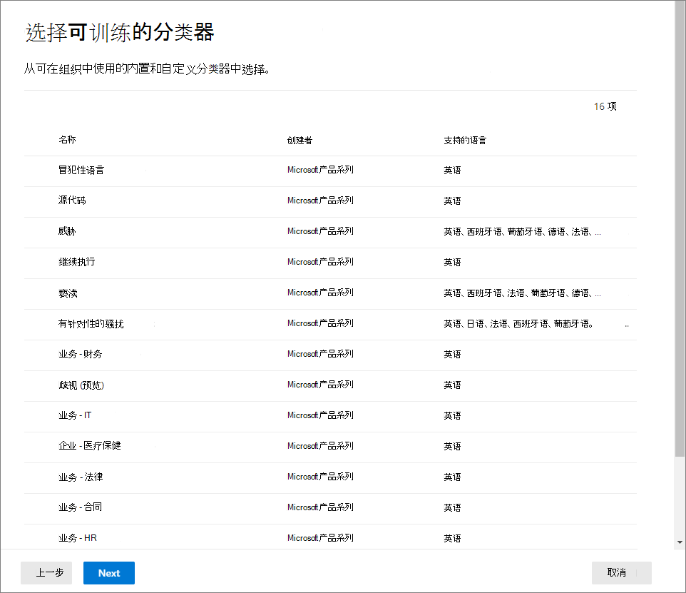

# <a name="create-publish-and-auto-apply-retention-labels"></a>创建、发布和自动应用保留标签

>*[Microsoft 365 安全性与合规性许可指南](https://aka.ms/ComplianceSD)。*

使用以下信息可帮助你创建[保留标签](labels.md)，然后将其自动应用到文档和电子邮件，或发布它们以便用户可以手动应用。

保留标签可帮助你保留所需内容并删除不需要的内容。 它们还用于将项目声明为记录，作为 Microsoft 365 数据的[记录管理](records-management.md)解决方案的一部分。

创建和配置保留标签的位置取决于你是否使用记录管理。 针对这两种情况提供了说明。

## <a name="before-you-begin"></a>准备工作

负责创建保留标签的合规性团队成员必须有权访问安全&amp;合规中心。 默认情况下，租户管理员有权访问此位置，并可向合规部主管及其他人员授予对安全&amp;合规中心的访问权限，而不授予租户管理员的所有权限。为此，建议转到安全&amp;合规中心内的“**权限**”页，编辑“**合规性管理员**”角色组，再向此角色组添加成员。 
  
有关详细信息，请参阅[向用户授予对 Office 365 安全与合规中心的访问权限](../security/office-365-security/grant-access-to-the-security-and-compliance-center.md)。
  
只有在创建和应用保留标签和标签策略时，才必须拥有这些权限。强制执行策略并不需要访问内容。

## <a name="create-and-configure-retention-labels"></a>创建和配置保留标签

1. 在 [Microsoft 365 合规中心](https://compliance.microsoft.com/)，导航到以下位置之一：
    
    - 如果你正在使用记录管理：
        - “**解决方案**” > “**记录管理**” > “**文件计划**”选项卡 > + “**创建标签**” > “**保留标签**”
        
    - 如果你没有使用记录管理：
       - “**解决方案**” > “**信息治理**” > “**标签**”选项卡 > +“**创建标签**”
    
    没有立即看到你的选项？ 首先选择“**全部显示**”。 

2. 按照向导中的提示进行操作。 如果你正在使用记录管理：
    
    - 有关文件计划描述符的信息，请参阅[使用文件计划管理保留标签](file-plan-manager.md)
    
    - 要使用保留标签将内容声明为记录，请启用“**使用标签将内容分类为“记录”**”复选框。

3. 重复这些步骤以创建更多标签。

若要编辑现有标签，请将其选中，然后选择“**编辑标签**”启动同一向导，以便在步骤 2 中更改标签说明和任何[符合条件的设置](#updating-retention-labels-and-their-policies)。 或者，选择任意可用的**编辑**选项，直接转到相关页面进行更新。

## <a name="publish-retention-labels-by-creating-a-retention-label-policy"></a>通过创建保留标签策略发布保留标签

发布保留标签，以便用户可以可以手动应用它们。

1. 在 [Microsoft 365 合规中心](https://compliance.microsoft.com/)，导航到以下位置之一：
    
    - 如果你正在使用记录管理：
        - “**解决方案**” > “**记录管理**”> >“**标签策略**”选项卡 >“**发布标签**”
    
    - 如果你没有使用记录管理：
        - “**解决方案**” > “**信息治理**” > “**标签策略**”选项卡 >“**发布标签**”
    
    没有立即看到你的选项？ 首先选择“**全部显示**”。 

2. 按照向导中的提示进行操作。
    
    有关保留标签支持的位置的信息，请参阅[保留标签和位置](labels.md#retention-label-policies-and-locations)部分。 

若要编辑现有保留标签策略，请将其选中，然后选择“**编辑策略**”启动同一向导，以便在步骤 2 中更改策略描述和任何[符合条件的设置](#updating-retention-labels-and-their-policies)。 或者，选择任意可用的**编辑**选项，直接转到相关页面进行更新。

## <a name="auto-apply-a-retention-label"></a>自动应用保留标签

根据指定的条件自动应用保留标签。

1. 在 [Microsoft 365 合规中心](https://compliance.microsoft.com/)，导航到以下位置之一：
    
    - 如果你正在使用记录管理：“**信息治理**”：
        - “**解决方案**” > “**记录管理**” > “**标签策略**”选项卡 >“**自动应用标签**”
    
    - 如果你没有使用记录管理：
        - “**解决方案**” > “**信息治理**” > “**标签策略**”选项卡 >“**自动应用标签**”
    
    没有立即看到你的选项？ 首先选择“**全部显示**”。 

2. 按照向导中的提示进行操作。
    
    有关配置自动应用保留标签的条件的信息，请参阅此页面上的[配置自动应用保留标签的条件](#configuring-conditions-for-auto-apply-retention-labels)部分。
    
    有关保留标签支持的位置的信息，请参阅[保留标签和位置](labels.md#retention-label-policies-and-locations)部分。

若要编辑现有自动应用标签策略，请将其选中，然后选择“**编辑策略**”启动同一向导，以便在步骤 2 中更改策略描述和任何[符合条件的设置](#updating-retention-labels-and-their-policies)。 或者，选择任意可用的**编辑**选项，直接转到相关页面进行更新。


## <a name="configuring-conditions-for-auto-apply-retention-labels"></a>配置自动应用保留标签的条件

可将保留标签自动应用于包含以下各项的内容：
  
- [特定类型敏感信息](#auto-apply-labels-to-content-with-specific-types-of-sensitive-information)
    
- [与你创建的查询匹配的特定关键字](#auto-apply-labels-to-content-with-keywords-or-searchable-properties)

- [可训练分类器的匹配项](#auto-apply-labels-to-content-by-using-trainable-classifiers)
    


自动应用保留标签最多可能需要 7 天才会应用到与你配置的条件相匹配的所有内容。

### <a name="auto-apply-labels-to-content-with-specific-types-of-sensitive-information"></a>将标签自动应用于包含特定类型敏感信息的内容

为敏感信息创建自动应用保留标签时，可看到与创建数据丢失防护 (DLP) 策略时相同的策略模板列表。 预配置每个策略模板以查找特定类型的敏感信息。 例如，此处显示的模板用于查找美国 ITIN、SSN 和护照号码。 若要深入了解 DLP，请参阅[数据丢失防护策略概述](data-loss-prevention-policies.md)。
  

  
选择策略模板后，既可以添加或删除任意类型敏感信息，也可以更改实例计数和匹配准确度。在下面的示例中，保留标签仅在以下情况下自动应用：
  
- 内容包含的这三种类型敏感信息的实例数介于 1 和 9 个之间。可删除“最大”**** 值，这样就会变为“任意”****。
    
- 检测到的敏感信息类型的匹配准确度（或可信度）至少为 75。许多敏感信息类型都是通过多个模式进行定义，其中模式的匹配准确度越高，需要发现的证据（如关键字、日期或地址）就越多，而模式的匹配准确度越低，需要发现的证据就越少。简而言之，“最小”**** 匹配准确度越低，内容就越容易与条件匹配。 
    
要详细了解这些选项，请参阅[微调规则以增加或降低匹配的难度](data-loss-prevention-policies.md#tuning-rules-to-make-them-easier-or-harder-to-match)。
    

  
### <a name="auto-apply-labels-to-content-with-keywords-or-searchable-properties"></a>将标签自动应用于包含关键字或可搜索属性的内容

可将标签自动应用于满足特定条件的内容。目前可用的条件支持将标签应用于包含特定字词、短语或可搜索属性值的内容。可使用搜索运算符（如 AND、OR 和 NOT）优化查询。

有关查询语法的详细信息，请参阅：

- [关键字查询语言 (KQL) 语法参考](https://docs.microsoft.com/sharepoint/dev/general-development/keyword-query-language-kql-syntax-reference)

基于查询的标签使用搜索索引来标识内容。有关有效可搜索属性的详细信息，请参阅：

- [内容搜索的关键字查询和搜索条件](keyword-queries-and-search-conditions.md)
- [已爬网和托管属性在 SharePoint Server 中的概述](https://docs.microsoft.com/SharePoint/technical-reference/crawled-and-managed-properties-overview)

示例查询：

- Exchange
    - subject:"Quarterly Financials"
    - recipients:garthf<!--nolink-->@contoso.com
- SharePoint 和 OneDrive
    - contenttype:contract
    - site:https<!--nolink-->://contoso.sharepoint.com/sites/teams/procurement AND contenttype:contract


### <a name="auto-apply-labels-to-content-by-using-trainable-classifiers"></a>使用可训练分类器向内容自动应用标签

选择可训练分类器的选项后，可选择其中一个内置分类器或选择自定义分类器。 内置分类器包含**简历**、**源代码**、**有针对性的骚扰**、**侮辱**和**威胁**：



要通过此选项自动应用标签，SharePoint Online 网站和邮箱必须至少有 10 MB 的数据。

有关可训练分类器的详细信息，请参阅[可训练分类器（预览版）入门](classifier-getting-started-with.md)。

有关示例配置，请参阅[如何做好准备并使用内置分类器](classifier-using-a-ready-to-use-classifier.md#how-to-verify-that-a-built-in-classifier-will-meet-your-needs)。

## <a name="how-long-it-takes-for-retention-labels-to-take-effect"></a>保留标签需要多长时间才能生效

保留标签在发布或自动应用后不会立即生效：
  
1. 首先，需要将标签策略从管理中心同步到策略中的位置。
    
2. 然后，该位置可能需要一段时间才能使已发布的保留标签对最终用户可用或将标签自动应用到内容。 所需时间长短取决于保留标签的位置和类型。
    
### <a name="published-retention-labels"></a>已发布的保留标签

如果将保留标签发布到 SharePoint 或 OneDrive，可能需要等待 1 天时间，这些保留标签才会向最终用户显示。此外，如果向 Exchange 发布保留标签，可能需要等待 7 天，这些保留标签才会向最终用户显示，并且邮箱至少必须包含 10MB 数据。
  

  
### <a name="auto-apply-retention-labels"></a>自动应用保留标签

如果将保留标签自动应用于符合特定条件的内容，可能需要等待 7 天，才能将保留标签应用于与条件匹配的所有现有内容。
  

  
### <a name="how-to-check-on-the-status-of-retention-labels-published-to-exchange"></a>如何检查发布到 Exchange 的保留标签的状态

在 Exchange Online 中，保留标签通过每 7 天运行一次的进程向最终用户提供。 通过 Powershell，可看到此进程上次运行的时间，并进而确定其再次运行的时间。
  
1. [连接到 Exchange Online PowerShell](https://go.microsoft.com/fwlink/?linkid=799773)。
    
2. 运行下面这些命令。
    
   ```powershell
   $logProps = Export-MailboxDiagnosticLogs <user> -ExtendedProperties
   ```

   ```powershell
   $xmlprops = [xml]($logProps.MailboxLog)
   ```

   ```powershell
   $xmlprops.Properties.MailboxTable.Property | ? {$_.Name -like "ELC*"}
   ```

在结果中，`ELCLastSuccessTimeStamp` (UTC) 属性显示系统上次处理你邮箱的时间。 如果自创建策略起未处理，则不会显示标签。 若要强制处理，请运行 `Start-ManagedFolderAssistant -Identity <user>`。
    
如果标签没有显示在 Outlook 网页版中，但你认为标签应显示，请务必清除浏览器中的缓存 (Ctrl+F5)。
    

## <a name="updating-retention-labels-and-their-policies"></a>更新保留标签及其策略

在编辑保留标签、保留标签策略或自动应用策略，并且该保留标签或策略已应用到内容时，更新后的设置将自动应用于此内容以及新标识的内容。

某些设置无法在创建并保存标签或策略后更改，包括：
- 除保留期外的保留设置，除非已将标签配置为根据创建的时间保留或删除内容。
- 用于分类为记录的选项。

## <a name="find-the-powershell-cmdlets-for-retention-labels"></a>查找保留标签的 PowerShell cmdlet

要使用保留标签 cmdlet，请执行以下操作：
  
1. [连接到 Office 365 安全与合规中心 Powershell](https://docs.microsoft.com/powershell/exchange/office-365-scc/connect-to-scc-powershell/connect-to-scc-powershell)
    
2. 使用这些 Office 365 安全与合规中心 cmdlet：
    
    - [Get-ComplianceTag](https://docs.microsoft.com/powershell/module/exchange/get-compliancetag)
    
    - [New-ComplianceTag](https://docs.microsoft.com/powershell/module/exchange/new-compliancetag)
    
    - [Remove-ComplianceTag](https://docs.microsoft.com/powershell/module/exchange/remove-compliancetag)
    
    - [Set-ComplianceTag](https://docs.microsoft.com/powershell/module/exchange/set-compliancetag)
    
    - [Enable-ComplianceTagStorage](https://docs.microsoft.com/powershell/module/exchange/enable-compliancetagstorage)
    
    - [Get-ComplianceTagStorage](https://docs.microsoft.com/powershell/module/exchange/get-compliancetagstorage)
    
    - [Get-RetentionCompliancePolicy](https://docs.microsoft.com/powershell/module/exchange/get-retentioncompliancepolicy)
    
    - [New-RetentionCompliancePolicy](https://docs.microsoft.com/powershell/module/exchange/new-retentioncompliancepolicy)
    
    - [Remove-RetentionCompliancePolicy](https://docs.microsoft.com/powershell/module/exchange/remove-retentioncompliancepolicy)
    
    - [Set-RetentionCompliancePolicy](https://docs.microsoft.com/powershell/module/exchange/set-retentioncompliancepolicy)
    
    - [Get-RetentionComplianceRule](https://docs.microsoft.com/powershell/module/exchange/get-retentioncompliancerule)
    
    - [New-RetentionComplianceRule](https://docs.microsoft.com/powershell/module/exchange/new-retentioncompliancerule)
    
    - [Remove-RetentionComplianceRule](https://docs.microsoft.com/powershell/module/exchange/remove-retentioncompliancerule)
    
    - [Set-RetentionComplianceRule](https://docs.microsoft.com/powershell/module/exchange/set-retentioncompliancerule)
