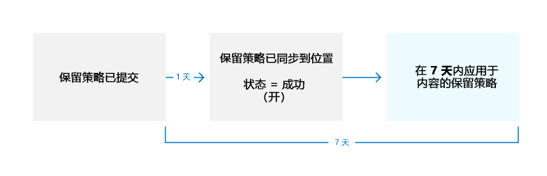

# <a name="create-and-configure-retention-policies"></a>创建和配置保留策略

>*[Microsoft 365 安全性与合规性许可指南](/office365/servicedescriptions/microsoft-365-service-descriptions/microsoft-365-tenantlevel-services-licensing-guidance/microsoft-365-security-compliance-licensing-guidance)。*

使用保留策略通过主动决定是保留内容、删除内容还是保留然后删除内容来管理组织的数据。

保留策略在容器级别分配相同的保留设置，以通过该容器中的内容自动继承，使你能够高效率地完成这一操作。 例如，SharePoint 网站中的所有项目、用户的 Exchange 邮箱中的所有电子邮件、用于 Microsoft Teams 的团队的所有频道邮件。 如果不确定是使用容器级别的保留策略，还是使用项级别的保留标签，请参阅保留 [和保留标签](retention.md#retention-policies-and-retention-labels)。

若要深入了解保留策略以及 Microsoft 365 中保留的工作原理，请参阅 [保留策略和保留标签](retention.md)。

> [!NOTE]
> 本页上的信息适用于合规性管理员。 如果你不是管理员，并且希望了解为使用的应用配置保留策略的信息，请联系技术支持、IT 部门或管理员。 如果在 Teams 聊天和频道消息中看见保留策略消息，可能会发现查看 [Teams 中有关保留策略的消息](https://support.microsoft.com/office/teams-messages-about-retention-policies-c151fa2f-1558-4cf9-8e51-854e925b483b)。

## <a name="before-you-begin"></a>准备工作

组织的全局管理员具有创建和编辑保留策略的完全权限。 如果您不是以全局管理员身份登录，请参阅[信息治理的权限信息](get-started-with-information-governance.md#permissions-for-retention-policies-and-retention-labels)。

在创建保留策略之前，请决定是否 **自适应** 或 **静态**。 有关详细信息，请参阅 [保留](retention.md#adaptive-or-static-policy-scopes-for-retention)的自适应或静态策略范围。 如果决定使用自适应策略，则必须在创建保留策略之前创建一个或多个自适应作用域，然后在创建保留策略过程中选择它们。 有关说明，请参阅[自适应作用域的配置信息](retention-settings.md#configuration-information-for-adaptive-scopes)。

## <a name="create-and-configure-a-retention-policy"></a>创建和配置保留策略

虽然保留策略可以支持在保留策略中标识为"位置"的多个服务，但无法创建包含所有受支持位置的单个保留策略：

- Exchange 电子邮件
- SharePoint 网站
- OneDrive 帐户
- Microsoft 365 组
- Skype for Business
- Exchange 公用文件夹
- Teams 通道消息
- Teams 聊天
- Teams 专用频道消息
- yammer 社区消息
- Yammer 用户消息

如果你在创建保留策略时选择 Teams 或 Yammer 位置，其他位置将被自动排除。 这意味着遵循的说明取决于你需要包括 Teams 还是 Yammer 位置：

- [有关 Teams 位置的保留策略的说明](#retention-policy-for-teams-locations)
- [有关 Yammer 位置的保留策略的说明](#retention-policy-for-yammer-locations)
- [有关 Teams 和 Yammer 以外位置的保留策略的说明](#retention-policy-for-locations-other-than-teams-and-yammer)

> [!NOTE]
> 使用自适应策略而不是静态策略时，可以将单个保留策略配置为同时包括 Teams 和 Yammer 位置。 对于 Teams 和 Yammer 位置需要自己的保留策略的静态策略，情况并非如此。

如果你有多个保留策略，但同时你又有使用保留标签，请参阅[保留原则或优先原则？](retention.md#the-principles-of-retention-or-what-takes-precedence)了解多个保留设置应用于同一内容时的结果。

### <a name="retention-policy-for-teams-locations"></a>Teams 位置的保留策略

> [!NOTE]
> 保留策略现在支持 [共享频道](/MicrosoftTeams/shared-channels)，此功能目前处于预览状态。为 **Teams 频道消息** 位置配置保留设置时，如果团队具有任何共享频道，则从其父团队继承保留设置。

1. 从 [Microsoft 365 合规中心](https://compliance.microsoft.com/) 选择“**信息治理**” > “**保留策略**”。

2. 选择 **新的保留策略** 以启动 **创建保留策略** 配置，并命名新的保留策略。

3. 对于 **选择要创建页的保留策略的类型**，请选择 **自适应** 或 **静态**，具体取决于在开始说明之前从 [所做的选择](#before-you-begin)。 如果尚未创建自适应作用域，则可以选择 **自适应** 但由于没有任何自适应作用域可供选择，因此无法使用此选项完成配置。

4. 具体取决于所选范围：
    
    - 如果选择 **自适应**: 在 **选择自适应策略作用域和位置** 页面上，选择 **添加作用域**，然后选择一个或多个已创建的自适应作用域。 然后，选择一个或多个位置。 可以选择的位置取决于添加的[范围类型](retention-settings.md#configuration-information-for-adaptive-scopes)。 例如，如果只添加了 **用户** 的作用域类型，则可以选择 **Teams 聊** 天，但不能 **Teams 频道消息**。 
    
    - 如果选择 **静态**： 在" **选择应用策略的位置** 页上，为 Teams 选择一个或多个位置：
        - **Teams 频道消息**: 来自标准和共享频道聊天的消息以及标准和共享频道会议的消息，但不包括来自具有其自己策略位置的 [私人频道](/microsoftteams/private-channels) 的消息。
        - **Teams 聊天**: 来自私人 1:1 聊天、群组聊天和会议聊天的消息。
        - **Teams 专用频道消息**: 来自私人频道聊天和私人频道会议的消息。
        
       默认情况下，[所有团队和所有用户](retention-settings.md#a-policy-that-applies-to-entire-locations)会被选择，但你但是你可以通过选择 [“**选择**”和“**排除**” 选项](retention-settings.md#a-policy-with-specific-inclusions-or-exclusions)”来进行优化。

5. 对于 **决定是要保留内容、删除内容还是同时执行这两个操作** 页面，请指定用于保留和删除内容的配置选项。

   你可以创建一个保留策略，指明仅保留而不删除内容、将内容保留指定的时间段后删除，或者仅在指定的时间段后删除内容。有关详细信息，请参阅[保留和删除内容的设置](retention-settings.md#settings-for-retaining-and-deleting-content)。

6. 完成配置并保存设置。

有关何时对 Teams 使用保留策略并了解最终用户体验的指南，请参阅 [管理 Microsoft Teams](/microsoftteams/retention-policies) 保留策略。

有关保留对 Teams 的工作原理的技术详细信息，包括通过演练确定保留和计时信息时支持哪些邮件元素，请参阅 [了解 Microsoft Teams](retention-policies-teams.md)。

#### <a name="known-configuration-issues"></a>已知的配置问题

- 虽然可以选择从上次修改项目时开始保留期的选项，但始终使用 **从项目创建时** 的值。 对于已编辑的邮件，将保存一份带有原始时间戳的原始邮件副本，以标识创建此预编辑邮件的时间，并且该编辑后邮件具有较新的时间戳。

- 在为 Teams 聊天位置选择“**编辑**”时，可能看到来宾和非邮箱用户。 保留策略并非专为这些用户设计，因此请不要选择他们。


#### <a name="additional-retention-policy-needed-to-support-teams"></a>支持团队所需的其他保留策略

Teams 不只是聊天和频道消息。 如果你有从 Microsoft 365 组（以前称为 Office 365 组）创建的团队，则应使用 **Microsoft 365 组** 位置来额外配置一个包括该 Microsoft 365 组的保留策略。 此保留策略适用于组的邮箱、网站和文件中的内容。

如果你有团队网站未连接到 Microsoft 365 组，则需要一个包括 **SharePoint 网站** 或 **OneDrive 帐户** 位置的保留策略来保留和删除 Teams 中的文件：

- 聊天中共享的文件存储在共享文件的用户的 OneDrive 帐户中。

- 上传到频道的文件存储在团队的 SharePoint 网站中。

> [!TIP]
> 当特定团队未连接到 Microsoft 365 组时，可以将保留策略应用于该特定团队的文件，方法是选择该团队的 SharePoint 网站以及该团队中用户的 OneDrive 帐户。

应用于 Microsoft 365 组、SharePoint 网站或 OneDrive 帐户的保留策略可能会先删除在 Teams 聊天或频道消息中引用的文件，然后再删除这些消息。 在这种情况下，该文件仍显示在 Teams 消息中，但当用户选择该文件时，将收到“找不到文件”错误。 此行为并非特定于保留策略，用户从 SharePoint 或 OneDrive 中手动删除文件时，也可能发生这种情况。

### <a name="retention-policy-for-yammer-locations"></a>Yammer 位置的保留策略

> [!NOTE]
> 因为保留策略的原因而删除消息时，Yammer 的保留策略目前不会通知用户。
>
> 若要使用此功能，Yammer 网络必须为[“本机模式”](/yammer/configure-your-yammer-network/overview-native-mode)，而不是“混合模式”。

1. 从 [Microsoft 365 合规中心](https://compliance.microsoft.com/) 选择“**信息治理**” > “**保留策略**”。

2. 选择 **新保留策略** 创建新的保留策略。

3. 对于 **选择要创建页的保留策略的类型**，请选择 **自适应** 或 **静态**，具体取决于在开始说明之前从 [所做的选择](#before-you-begin)。 如果尚未创建自适应作用域，则可以选择 **自适应** 但由于没有任何自适应作用域可供选择，因此无法使用此选项完成配置。

4. 具体取决于所选范围：
    
    - 如果选择 **自适应**: 在 **选择自适应策略作用域和位置** 页面上，选择 **添加作用域**，然后选择一个或多个已创建的自适应作用域。 然后，选择一个或多个位置。 可以选择的位置取决于添加的[范围类型](retention-settings.md#configuration-information-for-adaptive-scopes)。 例如，如果只添加了 **用户** 的作用域类型，则可以选择 **Yammer 用户消息**，但不能 **Yammer 社区消息**。 
    
    - 如果选择 **静态**：在" **选择应用策略** 位置"页上，切换 Yammer 的一个或两个位置： **Yammer 社区消息** ， **Yammer 用户消息**。
        
        默认情况下，将选中所有社区和用户，但你可以通过指定要包括或排除的社区和用户来优化此设置。
        
        对于 Yammer 用户消息： 
        - 如果将默认值保留 **所有用户**，则不包括 Azure B2B 来宾用户。 
        - 如果为 **所有用户** 选择 **编辑**，则可以向外部用户应用保留策略（如果你知道其帐户）。

5. 对于 **决定是要保留内容、删除内容还是同时执行这两个操作** 页面，请指定用于保留和删除内容的配置选项。 
    
    你可以创建一个保留策略，指明仅保留而不删除内容、将内容保留指定的时间段后删除，或者仅在指定的时间段后删除内容。有关详细信息，请参阅[保留和删除内容的设置](retention-settings.md#settings-for-retaining-and-deleting-content)。

6. 完成配置并保存设置。

有关 Yammer 的保留策略工作方式的详细信息，请参阅[了解 Yammer 的保留](retention-policies-yammer.md)。

#### <a name="additional-retention-policies-needed-to-support-yammer"></a>支持 Yammer 所需的其他保留策略

Yammer 不仅仅是社区消息和私人消息。若要保留和删除 Yammer 网络的电子邮件，请使用 **Microsoft 365 组** 位置来配置额外的保留策略，该策略包括任何用于 Yammer 的 Microsoft 365 组。 

若要保留和删除存储在 Yammer 中的文件，则需要包含 **Microsoft 365 组** 位置或 **OneDrive 帐户** 位置的保留策略：

- 私人消息中共享的文件存储在共享文件的用户的 OneDrive 帐户中。 

- 上传到社区的文件存储在 Yammer 社区的与组连接的 SharePoint 网站中。

应用于 SharePoint 网站或 OneDrive 帐户的保留策略可能会先删除在 Yammer 消息中引用的文件，然后再删除这些消息。 在这种情况下，该文件仍显示在 Yammer 消息中，但当用户选择该文件时，将收到“找不到文件”错误。 此行为并非特定于保留策略，用户从 SharePoint 或 OneDrive 中手动删除文件时，也可能发生这种情况。

### <a name="retention-policy-for-locations-other-than-teams-and-yammer"></a>Teams 和 Yammer 之外的位置保留策略

对于适用于以下任何服务的保留策略，请按照以下说明进行操作：

- Exchange：电子邮件和公共文件夹
- SharePoint：网站
- OneDrive：帐户
- Microsoft 365 组
- Skype for Business

1. 从 [Microsoft 365 合规中心](https://compliance.microsoft.com/) 选择“**信息治理**” > “**保留策略**”。

2. 选择 **新的保留策略** 以启动 **创建保留策略** 配置，并命名新的保留策略。

3. 对于 **选择要创建页的保留策略的类型**，请选择 **自适应** 或 **静态**，具体取决于在开始说明之前从 [所做的选择](#before-you-begin)。 如果尚未创建自适应作用域，则可以选择 **自适应** 但由于没有任何自适应作用域可供选择，因此无法使用此选项完成配置。 自适应策略不支持 Exchange 公用文件夹或 Skype for Business 的位置。

4. 具体取决于所选范围：
    
    - 如果选择 **自适应**: 在 **选择自适应策略作用域和位置** 页面上，选择 **添加作用域**，然后选择一个或多个已创建的自适应作用域。 然后，选择一个或多个位置。 可以选择的位置取决于添加的[范围类型](retention-settings.md#configuration-information-for-adaptive-scopes)。 例如，如果仅添加了 **用户** 的作用域类型，则可以选择 **Exchange 电子邮件** ，但不能 **sharePoint 网站**。 
    
    - 如果选择 **静态**：在" **选择位置** "页上，打开或关闭除 Teams 和 Yammer 位置之外的任何位置。 对于每个位置，可将其保持为默认的“[将策略应用到整个位置](retention-settings.md#a-policy-that-applies-to-entire-locations)”，或者“[指定所包含的和所排除的](retention-settings.md#a-policy-with-specific-inclusions-or-exclusions)”。
    
    特定于位置的信息：
    - [交换电子邮件和交换公共文件夹](retention-settings.md#configuration-information-for-exchange-email-and-exchange-public-folders)
    - [SharePoint 网站和 OneDrive 账户](retention-settings.md#configuration-information-for-sharepoint-sites-and-onedrive-accounts)
    - [Microsoft 365 组](retention-settings.md#configuration-information-for-microsoft-365-groups)
    - [Skype for Business](retention-settings.md#configuration-information-for-skype-for-business)

5. 对于 **决定是要保留内容、删除内容还是同时执行这两个操作** 页面，请指定用于保留和删除内容的配置选项。
    
    你可以创建一个保留策略，指明仅保留而不删除内容、将内容保留指定的时间段后删除，或者仅在指定的时间段后删除内容。有关详细信息，请参阅本页上的[保留和删除内容的设置](retention-settings.md#settings-for-retaining-and-deleting-content)。

6. 完成配置并保存设置。

## <a name="how-long-it-takes-for-retention-policies-to-take-effect"></a>保留策略需要多长时间才能生效

创建并提交保留策略后，最长可能需要 7 天才会应用该保留策略：
  


首先，需要将保留策略分发到所选位置，然后将其应用于内容。 始终可以通过从合规中心的“**保留策略**”页面选择保留策略来检查保留策略的分发状态。 在浮出控件窗格中，如果看到状态中包含 **（错误）**，并且在位置的详细信息中看到一条消息，指出部署策略或尝试重新部署策略所需的时间比预期长，请尝试运行 [Set-AppRetentionCompliancePolicy](/powershell/module/exchange/set-appretentioncompliancepolicy) 或 [Set-RetentionCompliancePolicy](/powershell/module/exchange/set-retentioncompliancepolicy) PowerShell 命令，重新尝试策略分发：

1. [连接到安全与合规中心 PowerShell](/powershell/exchange/connect-to-scc-powershell)。

2. 运行下列命令之一：
    
    - 对于策略位置 **Teams 专用频道消息**、**Yammer 用户消息** 和 **Yammer 社区消息**：
    
        ```PowerShell
        Set-AppRetentionCompliancePolicy -Identity <policy name> -RetryDistribution
        ```
    
    - 对于所有其他策略位置，例如 **Exchange 电子邮件**、**SharePoint 网站**、和 **Teams 频道消息** 等:
    
        ```PowerShell
        Set-RetentionCompliancePolicy -Identity <policy name> -RetryDistribution
        ```

## <a name="updating-retention-policies"></a>更新保留策略

如果保留策略中的设置已应用于内容，则策略配置的更改将自动应用于此内容以及新识别的内容。

某些设置在创建并保存策略后无法进行更改，包括保留策略的名称、作用域类型（自适应或静态）和保留设置（保持期除外）。

## <a name="next-steps"></a>后续步骤

如果 Exchange、SharePoint、OneDrive 或 Microsoft 365 组的某些项目需要与你配置的保留策略设置不同的保留设置，[创建这些异常的保留标签](create-retention-labels-information-governance.md)。

但是，如果要针对业务、法律或法规记录保留要求对高价值项目进行生命周期管理， [使用文件计划创建和管理](file-plan-manager.md)的保留标签。
