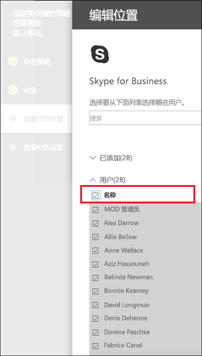
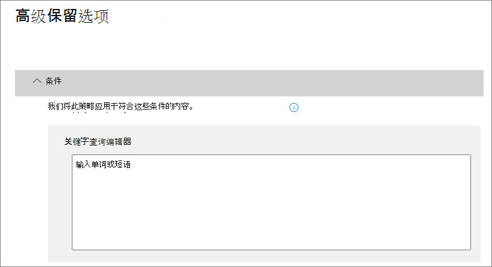

# <a name="create-and-configure-retention-policies"></a><span data-ttu-id="fa3e7-103">创建和配置保留策略</span><span class="sxs-lookup"><span data-stu-id="fa3e7-103">Create and configure retention policies</span></span>

><span data-ttu-id="fa3e7-104">*[Microsoft 365 安全性与合规性许可指南](https://aka.ms/ComplianceSD)。*</span><span class="sxs-lookup"><span data-stu-id="fa3e7-104">*[Microsoft 365 licensing guidance for security & compliance](https://aka.ms/ComplianceSD).*</span></span>

<span data-ttu-id="fa3e7-105">使用保留策略来主动决定是保留内容还是删除内容 — 亦或是先保留再删除内容。</span><span class="sxs-lookup"><span data-stu-id="fa3e7-105">Use a retention policy to decide proactively whether to retain content, delete content, or both - retain and then delete the content.</span></span> 

<span data-ttu-id="fa3e7-106">有关保留策略工作方式的信息，请参阅[了解保留策略](retention-policies.md)。</span><span class="sxs-lookup"><span data-stu-id="fa3e7-106">For information about how retention policies work, see [Learn about retention policies](retention-policies.md).</span></span>

## <a name="before-you-begin"></a><span data-ttu-id="fa3e7-107">准备工作</span><span class="sxs-lookup"><span data-stu-id="fa3e7-107">Before you begin</span></span>

<span data-ttu-id="fa3e7-108">负责创建和管理保留策略的合规性团队成员必须有权访问 [Microsoft 365 合规中心](https://compliance.microsoft.com/)。</span><span class="sxs-lookup"><span data-stu-id="fa3e7-108">Members of your compliance team who will create and manage retention policies need permissions to the [Microsoft 365 compliance center](https://compliance.microsoft.com/).</span></span> <span data-ttu-id="fa3e7-109">默认情况下，租户管理员（全局管理员）有权访问此位置，并可向合规专员和其他人提供访问权限，而不为其提供租户管理员的所有权限。若要授予实现此有限管理的权限，建议将用户添加到**合规性管理员**管理角色组。</span><span class="sxs-lookup"><span data-stu-id="fa3e7-109">By default, the tenant admin (global administrator) has access to this location and can give compliance officers and other people access without giving them all the permissions of a tenant admin. To grant permissions for this limited administration, we recommend that you add users to the **Compliance Administrator** admin role group.</span></span> <span data-ttu-id="fa3e7-110">有关说明，请参阅[向用户授予对安全与合规中心的访问权限](https://docs.microsoft.com/microsoft-365/security/office-365-security/grant-access-to-the-security-and-compliance-center)。</span><span class="sxs-lookup"><span data-stu-id="fa3e7-110">For instructions, see [Give users access to the Security & Compliance Center](https://docs.microsoft.com/microsoft-365/security/office-365-security/grant-access-to-the-security-and-compliance-center).</span></span>

<span data-ttu-id="fa3e7-111">只有在创建和应用保留策略时才需要这些权限。</span><span class="sxs-lookup"><span data-stu-id="fa3e7-111">These permissions are required only to create and apply a retention policy.</span></span> <span data-ttu-id="fa3e7-112">配置保留策略的人员不需要访问该内容。</span><span class="sxs-lookup"><span data-stu-id="fa3e7-112">The person configuring the retention policy doesn't require access to the content.</span></span>

## <a name="create-and-configure-a-retention-policy"></a><span data-ttu-id="fa3e7-113">创建和配置保留策略</span><span class="sxs-lookup"><span data-stu-id="fa3e7-113">Create and configure a retention policy</span></span>

1. <span data-ttu-id="fa3e7-114">从 [Microsoft 365 合规中心](https://compliance.microsoft.com/)中，选择“**策略**” > “**保留**”。</span><span class="sxs-lookup"><span data-stu-id="fa3e7-114">From the [Microsoft 365 compliance center](https://compliance.microsoft.com/), select **Policies** > **Retention**.</span></span>

2. <span data-ttu-id="fa3e7-115">选择“**新保留策略**”或编辑现有保留策略。</span><span class="sxs-lookup"><span data-stu-id="fa3e7-115">Select **New retention policy** or edit an exiting retention policy.</span></span>

3. <span data-ttu-id="fa3e7-116">对于“**设置**”，请先指定用于保留和删除内容的配置选项。</span><span class="sxs-lookup"><span data-stu-id="fa3e7-116">For **Settings**, first specify the configuration options for retaining and deleting content.</span></span> <span data-ttu-id="fa3e7-117">你可以创建一个保留策略，指明仅保留而不删除内容、将内容保留指定的时间段后删除，或者仅在指定的时间段后删除内容。</span><span class="sxs-lookup"><span data-stu-id="fa3e7-117">You can create a retention policy that just retains content without deleting, retains and then deletes after a specified period of time, or just deletes content after a specified period of time.</span></span> <span data-ttu-id="fa3e7-118">有关详细信息，请参阅本页上的[保留和删除内容的设置](#settings-for-retaining-and-deleting-content)：</span><span class="sxs-lookup"><span data-stu-id="fa3e7-118">For more information, see [Settings for retaining and deleting content](#settings-for-retaining-and-deleting-content) on this page:</span></span>
    
    <span data-ttu-id="fa3e7-119">然后，确定应将保留策略应用于所有内容还是满足特定条件的内容。</span><span class="sxs-lookup"><span data-stu-id="fa3e7-119">Then, decide whether the retention policy should apply to all content, or content that meets specific conditions.</span></span> <span data-ttu-id="fa3e7-120">有关这些高级保留设置的详细信息，请参阅本页上的[用于识别满足特定条件的内容的高级设置](#advanced-settings-to-identify-content-that-meets-specific-conditions)。</span><span class="sxs-lookup"><span data-stu-id="fa3e7-120">For more information about these advanced retention settings, see [Advanced settings to identify content that meets specific conditions](#advanced-settings-to-identify-content-that-meets-specific-conditions) on this page.</span></span> 

4. <span data-ttu-id="fa3e7-121">对于“**选择位置**”页面，选择应将保留策略应用到组织中的所有受支持位置，还是想要指定位置。</span><span class="sxs-lookup"><span data-stu-id="fa3e7-121">For the **Choose locations** page, select whether the retention policy should apply to all supported locations across your organization, or you want to specify the locations.</span></span> <span data-ttu-id="fa3e7-122">如果选择特定位置，还可以指定包括和排除项。</span><span class="sxs-lookup"><span data-stu-id="fa3e7-122">If you choose specific locations, you can also specify includes and excludes.</span></span> 
    
    <span data-ttu-id="fa3e7-123">对于 Microsoft Teams：</span><span class="sxs-lookup"><span data-stu-id="fa3e7-123">For Microsoft Teams:</span></span> 
    - <span data-ttu-id="fa3e7-124">如果想要删除或保留 Teams 频道消息或 Teams 聊天，则必须选择可供选择特定位置的选项。</span><span class="sxs-lookup"><span data-stu-id="fa3e7-124">You must select the option to choose specific locations if you want to delete or retain Teams channel messages or Team chats.</span></span> <span data-ttu-id="fa3e7-125">如果选择这些选项之一作为位置，则其他位置将被自动排除，因为包含此 Teams 数据的保留策略不能包含其他位置。</span><span class="sxs-lookup"><span data-stu-id="fa3e7-125">When you select either of these options as locations, the other locations are automatically excluded because a retention policy that includes this Teams data can't include other locations.</span></span> 
    - <span data-ttu-id="fa3e7-126">请注意，对于 **Teams 频道消息**，将包括来自标准频道的消息，但不包括来自[专用频道](https://docs.microsoft.com/microsoftteams/private-channels)的消息。</span><span class="sxs-lookup"><span data-stu-id="fa3e7-126">Note that for **Teams channel messages**, message from standard channels but not [private channels](https://docs.microsoft.com/microsoftteams/private-channels) are included.</span></span> <span data-ttu-id="fa3e7-127">保留策略目前不支持专用频道。</span><span class="sxs-lookup"><span data-stu-id="fa3e7-127">Currently, private channels aren't supported by retention policies.</span></span>
    
    <span data-ttu-id="fa3e7-128">有关在组织或特定位置的保留策略之间进行选择的详细信息，请参阅本页上的[将保留策略应用于整个组织或特定位置](#applying-a-retention-policy-to-an-entire-organization-or-specific-locations)。</span><span class="sxs-lookup"><span data-stu-id="fa3e7-128">For more information about choosing between a retention policy for the organization or for specific locations, see [Applying a retention policy to an entire organization or specific locations](#applying-a-retention-policy-to-an-entire-organization-or-specific-locations) on this page.</span></span>
    
    <span data-ttu-id="fa3e7-129">有关 **Office 365 组**和 **Skype for Business** 的特定信息，请参阅以下部分 [Microsoft 365 组的配置信息](#configuration-information-for-microsoft-365-groups)和 [Skype for Business 的配置信息](#configuration-information-for-skype-for-business)。</span><span class="sxs-lookup"><span data-stu-id="fa3e7-129">For information specific to **Office 365 groups** and **Skype for Business**, see the following sections, [Configuration information for Microsoft 365 groups](#configuration-information-for-microsoft-365-groups) and [Configuration information for Skype for Business](#configuration-information-for-skype-for-business).</span></span>

5. <span data-ttu-id="fa3e7-130">完成向导以保存设置。</span><span class="sxs-lookup"><span data-stu-id="fa3e7-130">Complete the wizard to save your settings.</span></span>

<span data-ttu-id="fa3e7-131">当你有多个保留策略时，请参阅[保留原则或优先原则？](retention-policies.md#the-principles-of-retention-or-what-takes-precedence)</span><span class="sxs-lookup"><span data-stu-id="fa3e7-131">When you have more than one retention policy, see [The principles of retention, or what takes precedence?](retention-policies.md#the-principles-of-retention-or-what-takes-precedence)</span></span>

### <a name="configuration-information-for-microsoft-365-groups"></a><span data-ttu-id="fa3e7-132">Microsoft 365 组的配置信息</span><span class="sxs-lookup"><span data-stu-id="fa3e7-132">Configuration information for Microsoft 365 groups</span></span>

<span data-ttu-id="fa3e7-133">若要保留或删除 Microsoft 365 组（以前称为 Office 365 组）的内容，请在选择保留策略的位置时，选择“**Office 365 组**”位置。</span><span class="sxs-lookup"><span data-stu-id="fa3e7-133">To retain or delete content for a Microsoft 365 group (formerly Office 365 group), select the **Office 365 groups** location when you choose locations for your retention policy.</span></span> <span data-ttu-id="fa3e7-134">即使 Microsoft 365 组有 Exchange 邮箱，涵盖整个 **Exchange 电子邮件**位置的保留策略也不会包含 Microsoft 365 组邮箱中的内容。</span><span class="sxs-lookup"><span data-stu-id="fa3e7-134">Even though a Microsoft 365 group has an Exchange mailbox, a retention policy that includes the entire **Exchange email** location won't include content in Microsoft 365 group mailboxes.</span></span> <span data-ttu-id="fa3e7-135">此外，尽管 **Exchange 电子邮件**位置最初允许你指定包括或排除组邮箱，但在尝试保存保留策略时，你将收到一条错误消息，表明“RemoteGroupMailbox”不是有效的 Exchange 位置选项。</span><span class="sxs-lookup"><span data-stu-id="fa3e7-135">In addition, although the **Exchange email** location initially allows you to specify a group mailbox to be included or excluded, when you try to save the retention policy, you receive an error that "RemoteGroupMailbox" is not a valid selection for the Exchange location.</span></span>

<span data-ttu-id="fa3e7-136">应用于 Microsoft 365 组的保留策略包含组的邮箱和网站。</span><span class="sxs-lookup"><span data-stu-id="fa3e7-136">A retention policy applied to a Microsoft 365 group includes both the group mailbox and site.</span></span> <span data-ttu-id="fa3e7-137">应用于 Microsoft 365 组的保留策略将保护由 Microsoft 365 组（包括 Microsoft Teams）创建的资源。</span><span class="sxs-lookup"><span data-stu-id="fa3e7-137">A retention policy applied to a Microsoft 365 group protects the resources created by a Microsoft 365 group, which includes Microsoft Teams.</span></span>

### <a name="configuration-information-for-skype-for-business"></a><span data-ttu-id="fa3e7-138">Skype for Business 的配置信息</span><span class="sxs-lookup"><span data-stu-id="fa3e7-138">Configuration information for Skype for Business</span></span>

<span data-ttu-id="fa3e7-139">与 Exchange 电子邮件不同，将 Skype 位置的状态切换为“开”并不能添加所有用户，但启用相应位置后，就可以手动选择要保留哪些用户的对话：</span><span class="sxs-lookup"><span data-stu-id="fa3e7-139">Unlike Exchange email, you can't toggle the status of the Skype location on to include all users, but when you turn on that location, you then manually choose the users whose conversations you want to retain:</span></span>


  
<span data-ttu-id="fa3e7-141">选择“选择用户”时，选择列标题中的“名称”\*\*\*\* 框可快速包含所有用户\*\*\*\*。</span><span class="sxs-lookup"><span data-stu-id="fa3e7-141">When you select **Choose users**, you can quickly include all users by selecting the **Name** box in the column header.</span></span> <span data-ttu-id="fa3e7-142">但是，请务必了解每个用户在策略中都被算作一个特定的包含内容。</span><span class="sxs-lookup"><span data-stu-id="fa3e7-142">However, it's important to understand that each user counts as a specific inclusion in the policy.</span></span> <span data-ttu-id="fa3e7-143">因此，当包括的用户超过 1,000 位时，会应用上一部分中所述的限制。</span><span class="sxs-lookup"><span data-stu-id="fa3e7-143">Therefore, if you include over 1,000 users, the limits noted in the previous section apply.</span></span> <span data-ttu-id="fa3e7-144">这里所说的选择所有 Skype 用户不同于组织范围的策略在默认情况下包含所有 Skype 用户。</span><span class="sxs-lookup"><span data-stu-id="fa3e7-144">Selecting all Skype users here is not the same as if an org-wide policy were able to include all Skype users by default.</span></span> 
  

  
<span data-ttu-id="fa3e7-p111">请注意，Outlook 中的“对话历史记录”\*\*\*\* 文件夹是一项与 Skype 存档无关的功能。“对话历史记录”\*\*\*\* 可以由最终用户禁用，但 Skype 存档是通过将 Skype 对话副本存储在用户无法访问但电子数据展示可访问的隐藏文件夹中而完成。</span><span class="sxs-lookup"><span data-stu-id="fa3e7-p111">Note that **Conversation History**, a folder in Outlook, is a feature that has nothing to do with Skype archiving. **Conversation History** can be turned off by the end user, but archiving for Skype is done by storing a copy of Skype conversations in a hidden folder that is inaccessible to the user but available to eDiscovery.</span></span>


## <a name="settings-for-retaining-and-deleting-content"></a><span data-ttu-id="fa3e7-148">保留和删除内容的设置</span><span class="sxs-lookup"><span data-stu-id="fa3e7-148">Settings for retaining and deleting content</span></span>

<span data-ttu-id="fa3e7-149">通过在保留策略中选择保留和删除内容的设置，保留策略将在指定的时间段内具有以下配置之一：</span><span class="sxs-lookup"><span data-stu-id="fa3e7-149">By choosing the settings for retaining and deleting content in your retention policy, your retention policy will have one of the following configurations for a specified period of time:</span></span>

- <span data-ttu-id="fa3e7-150">仅保留</span><span class="sxs-lookup"><span data-stu-id="fa3e7-150">Retain-only</span></span>
- <span data-ttu-id="fa3e7-151">保留后删除</span><span class="sxs-lookup"><span data-stu-id="fa3e7-151">Retain and then delete</span></span>
- <span data-ttu-id="fa3e7-152">仅删除</span><span class="sxs-lookup"><span data-stu-id="fa3e7-152">Delete-only</span></span>

### <a name="retaining-content-for-a-specific-period-of-time"></a><span data-ttu-id="fa3e7-153">将内容保留一段特定时间</span><span class="sxs-lookup"><span data-stu-id="fa3e7-153">Retaining content for a specific period of time</span></span>

<span data-ttu-id="fa3e7-154">配置保留策略时，可选择无限期地保留内容，也可将内容保留特定天数、月数或年限。</span><span class="sxs-lookup"><span data-stu-id="fa3e7-154">When you configure a retention policy, you choose to retain content indefinitely or for a specific number of days, months, or years.</span></span> <span data-ttu-id="fa3e7-155">内容的保留期限是从内容创建的时间开始计算，而不是从应用保留策略的时间开始计算。</span><span class="sxs-lookup"><span data-stu-id="fa3e7-155">The duration for how long content is retained is calculated from the age of the content, not from when the retention policy is applied.</span></span> <span data-ttu-id="fa3e7-156">可以选择根据内容创建的时间或（针对 OneDrive 和 SharePoint）最后一次修改内容的时间来计算保留期限。</span><span class="sxs-lookup"><span data-stu-id="fa3e7-156">You can choose whether the age is based on when the content was created or (for OneDrive and SharePoint) when it was last modified.</span></span>

<span data-ttu-id="fa3e7-157">示例：</span><span class="sxs-lookup"><span data-stu-id="fa3e7-157">Examples:</span></span>
  
- <span data-ttu-id="fa3e7-158">SharePoint：如果希望将某个网站集中的内容自上次修改以来保留七年，并且该网站集中的某个文档在六年内未进行修改，则该文档在不修改的情况下将仅再保留 1 年。</span><span class="sxs-lookup"><span data-stu-id="fa3e7-158">SharePoint: If you want to retain content in a site collection for seven years since it was last modified, and a document in that site collection hasn't been modified in six years, the document will be retained for only another year if it's not modified.</span></span> <span data-ttu-id="fa3e7-159">如果再次对该文档进行编辑，则会根据最新修改日期计算文档期限，并将再保留 7 年。</span><span class="sxs-lookup"><span data-stu-id="fa3e7-159">If the document is edited again, the age of the document is calculated from the new last modified date, and it will be retained for another seven years.</span></span>
  
- <span data-ttu-id="fa3e7-160">Exchange：如果想将邮箱中的内容保留七年，而有封邮件是六年前发送的，则该邮件将只再保留一年。</span><span class="sxs-lookup"><span data-stu-id="fa3e7-160">Exchange: If you want to retain content in a mailbox for seven years, and a message was sent six years ago, the message will be retained for only one year.</span></span> <span data-ttu-id="fa3e7-161">对于 Exchange 内容，期限基于传入电子邮件的接收日期或传出电子邮件的发送日期。</span><span class="sxs-lookup"><span data-stu-id="fa3e7-161">For Exchange content, the age is based on the date received for incoming email, or the date sent for outgoing email.</span></span> <span data-ttu-id="fa3e7-162">根据最后一次修改的时间来保留内容这一方式只适用于 OneDrive 和 SharePoint 中的网站内容。</span><span class="sxs-lookup"><span data-stu-id="fa3e7-162">Retaining content based on when it was last modified applies only to site content in OneDrive and SharePoint.</span></span>
  
<span data-ttu-id="fa3e7-163">保留期结束后，选择是否要永久删除内容：</span><span class="sxs-lookup"><span data-stu-id="fa3e7-163">At the end of the retention period, you choose whether you want the content to be permanently deleted:</span></span>
  

  
### <a name="deleting-content-thats-older-than-a-specific-age"></a><span data-ttu-id="fa3e7-165">删除超过特定年限的内容</span><span class="sxs-lookup"><span data-stu-id="fa3e7-165">Deleting content that's older than a specific age</span></span>

<span data-ttu-id="fa3e7-166">保留策略既可以先保留再删除内容，也可以删除旧内容，而不保留它。</span><span class="sxs-lookup"><span data-stu-id="fa3e7-166">A retention policy can both retain and then delete content, or delete old content without retaining it.</span></span>
  
<span data-ttu-id="fa3e7-167">如果保留策略删除内容，请务必了解为保留策略指定的时间期限是从文件创建或修改时开始计算，而不是从策略分配时开始计算。</span><span class="sxs-lookup"><span data-stu-id="fa3e7-167">If your retention policy deletes content, it's important to understand that the time period specified for a retention policy is calculated from the time when the content was created or modified, not the time since the policy was assigned.</span></span>
  

  
<span data-ttu-id="fa3e7-169">例如，假设创建了一个保留策略 - 该策略会在三年后删除内容，然后将该策略分配到所有 OneDrive 帐户，这些帐户中含有许多四五年前创建的内容。</span><span class="sxs-lookup"><span data-stu-id="fa3e7-169">For example, suppose that you create a retention policy that deletes content after three years, and then assign that policy to all OneDrive accounts, which contain a lot of content that was created four or five years ago.</span></span> <span data-ttu-id="fa3e7-170">在这种情况下，第一次分配保留策略后将会有许多内容被删除。</span><span class="sxs-lookup"><span data-stu-id="fa3e7-170">In this case, a lot of content will be deleted soon after assigning the retention policy for the first time.</span></span> <span data-ttu-id="fa3e7-171">为此，请务必了解删除内容的保留策略会对内容造成重大影响。</span><span class="sxs-lookup"><span data-stu-id="fa3e7-171">For this reason, it's important to understand that a retention policy that deletes content can have a considerable impact on your content.</span></span> 
  
<span data-ttu-id="fa3e7-p116">因此，首次将保留策略分配到网站集之前，应先考虑现有内容的年限，以及保留策略可能会对此内容产生的影响。我们还建议在分配策略前向用户传达新策略，让用户有时间评估策略可能会产生的影响。请注意，在创建保留策略前检查策略设置时会看到以下警告。</span><span class="sxs-lookup"><span data-stu-id="fa3e7-p116">Therefore, before you assign a retention policy to a site collection for the first time, you should first consider the age of the existing content and how the policy may impact that content. You may also want to communicate the new policy to your users before assigning it, to give them time to assess the possible impact. Note this warning that appears when you review the settings for your retention policy just before creating it.</span></span>
  

  
## <a name="advanced-settings-to-identify-content-that-meets-specific-conditions"></a><span data-ttu-id="fa3e7-176">用于识别满足特定条件的内容的高级设置</span><span class="sxs-lookup"><span data-stu-id="fa3e7-176">Advanced settings to identify content that meets specific conditions</span></span>

<span data-ttu-id="fa3e7-177">保留策略可应用于其中所含位置上的全部内容，你也可以选择将保留策略只应用于包含特定关键字或[特定类型敏感信息](what-the-sensitive-information-types-look-for.md)的内容。</span><span class="sxs-lookup"><span data-stu-id="fa3e7-177">A retention policy can apply to all content in the locations that it includes, or you can choose to apply a retention policy only to content that contains specific keywords or [specific types of sensitive information](what-the-sensitive-information-types-look-for.md).</span></span>
  

  
### <a name="identify-content-that-contains-specific-keywords"></a><span data-ttu-id="fa3e7-179">识别包含特定关键字的内容</span><span class="sxs-lookup"><span data-stu-id="fa3e7-179">Identify content that contains specific keywords</span></span>

<span data-ttu-id="fa3e7-180">可以只对满足特定条件的内容应用保留策略，然后只对这些内容执行保留操作。</span><span class="sxs-lookup"><span data-stu-id="fa3e7-180">You can apply a retention policy only to content that meets specific conditions, and then take retention actions on just that content.</span></span> <span data-ttu-id="fa3e7-181">可用的条件支持将保留策略应用于包含特定字词或短语的内容。</span><span class="sxs-lookup"><span data-stu-id="fa3e7-181">The conditions available support applying a retention policy to content that contains specific words or phrases.</span></span> <span data-ttu-id="fa3e7-182">你可以使用 AND、OR 和 NOT 等搜索运算符优化查询。</span><span class="sxs-lookup"><span data-stu-id="fa3e7-182">You can refine your query by using search operators like AND, OR, and NOT.</span></span> <span data-ttu-id="fa3e7-183">有关这些运算符的详细信息，请参阅[内容搜索的关键字查询和搜索条件](keyword-queries-and-search-conditions.md)。</span><span class="sxs-lookup"><span data-stu-id="fa3e7-183">For more information on these operators, see [Keyword queries and search conditions for Content Search](keyword-queries-and-search-conditions.md).</span></span>
  
<span data-ttu-id="fa3e7-184">即将支持添加可搜索属性（例如，**subject:**）。</span><span class="sxs-lookup"><span data-stu-id="fa3e7-184">Support for adding searchable properties (for example, **subject:**) is coming soon.</span></span>
  
<span data-ttu-id="fa3e7-185">基于查询的保留策略使用搜索索引来标识内容。</span><span class="sxs-lookup"><span data-stu-id="fa3e7-185">Query-based retention uses the search index to identify content.</span></span>
  

  
### <a name="identify-content-that-contains-sensitive-information"></a><span data-ttu-id="fa3e7-187">识别包含敏感信息的内容</span><span class="sxs-lookup"><span data-stu-id="fa3e7-187">Identify content that contains sensitive information</span></span>

<span data-ttu-id="fa3e7-p118">此外，还可以将保留策略只应用于包含[特定类型敏感信息](what-the-sensitive-information-types-look-for.md)的内容。例如，可选择将唯一保留要求只应用于包含个人信息（如纳税人标识号、身份证号或护照号）的内容。</span><span class="sxs-lookup"><span data-stu-id="fa3e7-p118">You can also apply a retention policy only to content that contains [specific types of sensitive information](what-the-sensitive-information-types-look-for.md). For example, you can choose to apply unique retention requirements only to content that contains personal information, such as taxpayer identification numbers, social security numbers, or passport numbers.</span></span>
  

  
<span data-ttu-id="fa3e7-191">注意：</span><span class="sxs-lookup"><span data-stu-id="fa3e7-191">Notes:</span></span>
  
- <span data-ttu-id="fa3e7-192">敏感信息的高级保留设置不适用于 Exchange 公用文件夹或 Skype for Business，因为这些位置不支持敏感信息类型。</span><span class="sxs-lookup"><span data-stu-id="fa3e7-192">Advanced retention for sensitive information doesn't apply to Exchange public folders or Skype for Business because those locations don't support sensitive information types.</span></span>
    
- <span data-ttu-id="fa3e7-193">Exchange Online 使用邮件流规则（也称为传输规则）来识别敏感信息，因此这种方式仅适用于传输过程中的邮件，而不适用于已存储在邮箱中的所有邮件。</span><span class="sxs-lookup"><span data-stu-id="fa3e7-193">Exchange Online uses mail flow rules (also known as transport rules) to identify sensitive information, so this works only on messages in transit—not on all items already stored in a mailbox.</span></span> <span data-ttu-id="fa3e7-194">对于 Exchange Online，这意味着保留策略可以识别敏感信息，并且只对邮箱应用策略**之后**收到的邮件执行保留操作。</span><span class="sxs-lookup"><span data-stu-id="fa3e7-194">For Exchange Online, this means that a retention policy can identify sensitive information and take retention actions only on messages that are received **after** the policy is applied to the mailbox.</span></span> <span data-ttu-id="fa3e7-195">上一部分所述的基于查询的保留不受此限制，因为它是通过使用搜索索引来识别内容的。</span><span class="sxs-lookup"><span data-stu-id="fa3e7-195">Query-based retention described in the previous section doesn't have this limitation because it uses the search index to identify content.</span></span> 
    
## <a name="applying-a-retention-policy-to-an-entire-organization-or-specific-locations"></a><span data-ttu-id="fa3e7-196">将保留策略应用于整个组织或特定位置</span><span class="sxs-lookup"><span data-stu-id="fa3e7-196">Applying a retention policy to an entire organization or specific locations</span></span>

<span data-ttu-id="fa3e7-197">可以将保留策略轻松地应用于整个组织、位置整体，或只应用于特定位置或用户。</span><span class="sxs-lookup"><span data-stu-id="fa3e7-197">You can easily apply a retention policy to an entire organization, entire locations, or only to specific locations or users.</span></span>
  
### <a name="org-wide-policy"></a><span data-ttu-id="fa3e7-198">组织范围策略</span><span class="sxs-lookup"><span data-stu-id="fa3e7-198">Org-wide policy</span></span>

<span data-ttu-id="fa3e7-199">保留策略的最强大功能之一是，它可以应用于 Microsoft 365 中的所有位置，包括：</span><span class="sxs-lookup"><span data-stu-id="fa3e7-199">One of the most powerful features of a retention policy is that it can apply to locations across Microsoft 365, including:</span></span>
  
- <span data-ttu-id="fa3e7-200">Exchange 电子邮件</span><span class="sxs-lookup"><span data-stu-id="fa3e7-200">Exchange email</span></span>
    
- <span data-ttu-id="fa3e7-201">SharePoint 网站集</span><span class="sxs-lookup"><span data-stu-id="fa3e7-201">SharePoint site collections</span></span>
    
- <span data-ttu-id="fa3e7-202">OneDrive 帐户</span><span class="sxs-lookup"><span data-stu-id="fa3e7-202">OneDrive accounts</span></span>
    
- <span data-ttu-id="fa3e7-203">Microsoft 365 组（应用于组的邮箱和相关 SharePoint 网站中的内容。）</span><span class="sxs-lookup"><span data-stu-id="fa3e7-203">Microsoft 365 groups (applies to content in the group's mailbox and associated SharePoint site.)</span></span>
    
- <span data-ttu-id="fa3e7-204">Exchange 公用文件夹</span><span class="sxs-lookup"><span data-stu-id="fa3e7-204">Exchange public folders</span></span>
    


<span data-ttu-id="fa3e7-206">组织范围保留策略的其他重要功能包括：</span><span class="sxs-lookup"><span data-stu-id="fa3e7-206">Other important features of an org-wide retention policy include:</span></span>
  
- <span data-ttu-id="fa3e7-207">策略可包含任意多个邮箱或网站。</span><span class="sxs-lookup"><span data-stu-id="fa3e7-207">There is no limit to the number of mailboxes or sites the policy can include.</span></span>
    
- <span data-ttu-id="fa3e7-208">对于 Exchange，在保留策略应用后新建的任何邮箱都会自动继承策略。</span><span class="sxs-lookup"><span data-stu-id="fa3e7-208">For Exchange, any new mailbox created after the policy is applied will automatically inherit the policy.</span></span>
  
### <a name="a-policy-that-applies-to-entire-locations"></a><span data-ttu-id="fa3e7-209">应用于位置整体的策略</span><span class="sxs-lookup"><span data-stu-id="fa3e7-209">A policy that applies to entire locations</span></span>

<span data-ttu-id="fa3e7-210">选择位置时，可以轻松包含或排除整体位置，例如 Exchange 电子邮件或 OneDrive 帐户。</span><span class="sxs-lookup"><span data-stu-id="fa3e7-210">When you choose locations, you can easily include or exclude an entire location, such as Exchange email or OneDrive accounts.</span></span> <span data-ttu-id="fa3e7-211">若要执行此操作，将该位置的“**状态**”切换为开或者关。</span><span class="sxs-lookup"><span data-stu-id="fa3e7-211">To do so, toggle the **Status** of that location on or off.</span></span> 
  
<span data-ttu-id="fa3e7-212">与组织范围的策略相同，如果策略应用到任意组合的整体位置，则可应用策略的邮箱数或网站数不存在限制。</span><span class="sxs-lookup"><span data-stu-id="fa3e7-212">Like an org-wide policy, if a policy applies to any combination of entire locations, there is no limit to the number of mailboxes or sites the policy can include.</span></span> 

<span data-ttu-id="fa3e7-213">例如，如果对所有的 Exchange 电子邮件和所有的 SharePoint 网站应用策略，则无论网站和邮箱的数量有多少，都会对其应用策略。</span><span class="sxs-lookup"><span data-stu-id="fa3e7-213">For example, if a policy includes all Exchange email and all SharePoint sites, all sites and mailboxes will be included, no matter how many.</span></span> <span data-ttu-id="fa3e7-214">并且对于 Exchange，在应用策略后创建的任何新邮箱都将自动继承该策略。</span><span class="sxs-lookup"><span data-stu-id="fa3e7-214">And for Exchange, any new mailbox created after the policy is applied will automatically inherit the policy.</span></span>

### <a name="a-policy-with-specific-inclusions-or-exclusions"></a><span data-ttu-id="fa3e7-215">包含或排除特定位置、用户或组的策略</span><span class="sxs-lookup"><span data-stu-id="fa3e7-215">A policy with specific inclusions or exclusions</span></span>

<span data-ttu-id="fa3e7-216">你还可以将保留策略应用于特定用户、特定 Microsoft 365 组或特定网站。</span><span class="sxs-lookup"><span data-stu-id="fa3e7-216">You can also apply a retention policy to specific users, specific Microsoft 365 groups, or specific sites.</span></span> <span data-ttu-id="fa3e7-217">若要执行此操作，请将该位置的“**状态**”切换为开，然后使用链接来包含或排除特定用户、Microsoft 365 组或者网站。</span><span class="sxs-lookup"><span data-stu-id="fa3e7-217">To do so, toggle the **Status** of that location on, and then use the links to include or exclude specific users, Microsoft 365 groups, or sites.</span></span> 
  
<span data-ttu-id="fa3e7-218">但是，如果保留策略包括或排除的特定位置超过 1,000 个，则使用此配置会有一些限制：</span><span class="sxs-lookup"><span data-stu-id="fa3e7-218">However, using this configuration, there are some limits when your retention policy includes or excludes over 1,000 specific locations:</span></span>
  
- <span data-ttu-id="fa3e7-219">保留策略的最大数量：</span><span class="sxs-lookup"><span data-stu-id="fa3e7-219">Maximum numbers for the retention policy:</span></span>
    - <span data-ttu-id="fa3e7-220">1,000 个邮箱</span><span class="sxs-lookup"><span data-stu-id="fa3e7-220">1,000 mailboxes</span></span>
    - <span data-ttu-id="fa3e7-221">1,000 个 Microsoft 365 组</span><span class="sxs-lookup"><span data-stu-id="fa3e7-221">1,000 Microsoft 365 groups</span></span>
    - <span data-ttu-id="fa3e7-222">1000 个用户的 Teams 私人聊天</span><span class="sxs-lookup"><span data-stu-id="fa3e7-222">1,000 users for Teams private chats</span></span>
    - <span data-ttu-id="fa3e7-223">100 个网站（OneDrive 或 SharePoint）</span><span class="sxs-lookup"><span data-stu-id="fa3e7-223">100 sites (OneDrive or SharePoint)</span></span>

<span data-ttu-id="fa3e7-224">租户支持的最大策略数：10,000。</span><span class="sxs-lookup"><span data-stu-id="fa3e7-224">There is a maximum number of policies that are supported for a tenant: 10,000.</span></span> <span data-ttu-id="fa3e7-225">这些项目包括保留策略、保留标签策略和自动应用保留策略。</span><span class="sxs-lookup"><span data-stu-id="fa3e7-225">These items include retention policies, retention label policies, and auto-apply retention policies.</span></span>

<span data-ttu-id="fa3e7-226">如果你的保留策略可能受到这些限制，请选择适用于整个位置的配置选项，或使用组织范围的策略。</span><span class="sxs-lookup"><span data-stu-id="fa3e7-226">If your retention policies are likely to be subject to these limitations, choose the configuration options that apply to entire locations, or use an org-wide policy.</span></span>

## <a name="updating-retention-policies"></a><span data-ttu-id="fa3e7-227">更新保留策略</span><span class="sxs-lookup"><span data-stu-id="fa3e7-227">Updating retention policies</span></span>

<span data-ttu-id="fa3e7-228">如果你编辑保留策略，并且内容已遵循保留策略中的原始设置，则除了新识别的内容之外，更新后的设置将自动应用于此内容。</span><span class="sxs-lookup"><span data-stu-id="fa3e7-228">If you edit a retention policy and content is already subject to the original settings in your retention policy, your updated settings will be automatically applied to this content in addition to content that's newly identified.</span></span>

<span data-ttu-id="fa3e7-229">此更新通常非常快，但可能需要数天。</span><span class="sxs-lookup"><span data-stu-id="fa3e7-229">Usually this update is fairly quick but can take several days.</span></span> <span data-ttu-id="fa3e7-230">完成跨 Microsoft 365 位置的策略复制后，你将看到 Microsoft 365 合规中心中的保留策略状态从“**打开（挂起）**”变为“**打开（成功）**”。</span><span class="sxs-lookup"><span data-stu-id="fa3e7-230">When the policy replication across your Microsoft 365 locations is complete, you'll see the status of the retention policy in the Microsoft 365 compliance center change from **On (Pending)** to **On (Success)**.</span></span>

## <a name="find-the-powershell-cmdlets-for-retention-policies"></a><span data-ttu-id="fa3e7-231">查找保留策略的 PowerShell cmdlet</span><span class="sxs-lookup"><span data-stu-id="fa3e7-231">Find the PowerShell cmdlets for retention policies</span></span>

<span data-ttu-id="fa3e7-232">使用“保留策略” cmdlet：</span><span class="sxs-lookup"><span data-stu-id="fa3e7-232">To use the retention policies cmdlets:</span></span>
  
1. [<span data-ttu-id="fa3e7-233">连接到 Office 365 安全与合规中心 PowerShell</span><span class="sxs-lookup"><span data-stu-id="fa3e7-233">Connect to the Office 365 Security & Compliance Center PowerShell</span></span>](https://docs.microsoft.com/powershell/exchange/office-365-scc/connect-to-scc-powershell/connect-to-scc-powershell)
    
2. <span data-ttu-id="fa3e7-234">使用这些 Office 365 安全与合规中心 cmdlet：</span><span class="sxs-lookup"><span data-stu-id="fa3e7-234">Use these Office 365 Security & Compliance Center cmdlets:</span></span>
    
    - [<span data-ttu-id="fa3e7-235">Get-RetentionCompliancePolicy</span><span class="sxs-lookup"><span data-stu-id="fa3e7-235">Get-RetentionCompliancePolicy</span></span>](https://docs.microsoft.com/powershell/module/exchange/get-retentioncompliancepolicy)
    
    - [<span data-ttu-id="fa3e7-236">New-RetentionCompliancePolicy</span><span class="sxs-lookup"><span data-stu-id="fa3e7-236">New-RetentionCompliancePolicy</span></span>](https://docs.microsoft.com/powershell/module/exchange/new-retentioncompliancepolicy)
    
    - [<span data-ttu-id="fa3e7-237">Remove-RetentionCompliancePolicy</span><span class="sxs-lookup"><span data-stu-id="fa3e7-237">Remove-RetentionCompliancePolicy</span></span>](https://docs.microsoft.com/powershell/module/exchange/remove-retentioncompliancepolicy)
    
    - [<span data-ttu-id="fa3e7-238">Set-RetentionCompliancePolicy</span><span class="sxs-lookup"><span data-stu-id="fa3e7-238">Set-RetentionCompliancePolicy</span></span>](https://docs.microsoft.com/powershell/module/exchange/set-retentioncompliancepolicy)
    
    - [<span data-ttu-id="fa3e7-239">Get-RetentionComplianceRule</span><span class="sxs-lookup"><span data-stu-id="fa3e7-239">Get-RetentionComplianceRule</span></span>](https://docs.microsoft.com/powershell/module/exchange/get-retentioncompliancerule)
    
    - [<span data-ttu-id="fa3e7-240">New-RetentionComplianceRule</span><span class="sxs-lookup"><span data-stu-id="fa3e7-240">New-RetentionComplianceRule</span></span>](https://docs.microsoft.com/powershell/module/exchange/new-retentioncompliancerule)
    
    - [<span data-ttu-id="fa3e7-241">Remove-RetentionComplianceRule</span><span class="sxs-lookup"><span data-stu-id="fa3e7-241">Remove-RetentionComplianceRule</span></span>](https://docs.microsoft.com/powershell/module/exchange/remove-retentioncompliancerule)
    
    - [<span data-ttu-id="fa3e7-242">Set-RetentionComplianceRule</span><span class="sxs-lookup"><span data-stu-id="fa3e7-242">Set-RetentionComplianceRule</span></span>](https://docs.microsoft.com/powershell/module/exchange/set-retentioncompliancerule)


## <a name="lock-a-retention-policy-by-using-powershell"></a><span data-ttu-id="fa3e7-243">使用 PowerShell 锁定保留策略</span><span class="sxs-lookup"><span data-stu-id="fa3e7-243">Lock a retention policy by using PowerShell</span></span>

<span data-ttu-id="fa3e7-244">如果需要使用“[保留锁定](retention-policies.md#use-preservation-lock-to-comply-with-regulatory-requirements)”来满足法规要求，则必须使用 PowerShell。</span><span class="sxs-lookup"><span data-stu-id="fa3e7-244">You must use PowerShell if you need to use [Preservation Lock](retention-policies.md#use-preservation-lock-to-comply-with-regulatory-requirements) to comply with regulatory requirements.</span></span>

1. <span data-ttu-id="fa3e7-245">[连接到 Office 365 安全与合规中心 PowerShell](https://docs.microsoft.com/powershell/exchange/office-365-scc/connect-to-scc-powershell/connect-to-scc-powershell?view=exchange-ps)。</span><span class="sxs-lookup"><span data-stu-id="fa3e7-245">[Connect to Office 365 Security & Compliance Center PowerShell](https://docs.microsoft.com/powershell/exchange/office-365-scc/connect-to-scc-powershell/connect-to-scc-powershell?view=exchange-ps).</span></span>

2. <span data-ttu-id="fa3e7-246">运行 `Get-RetentionCompliancePolicy`，列出保留策略并查找要锁定的策略的名称。</span><span class="sxs-lookup"><span data-stu-id="fa3e7-246">List your retention policies and find the name of the policy that you want to lock by running `Get-RetentionCompliancePolicy`.</span></span>
    
   
    
3. <span data-ttu-id="fa3e7-248">若要在保留策略上启用保留锁定，请运行 `Set-RetentionCompliancePolicy` 并将 `RestrictiveRetention` 参数设置为 true。</span><span class="sxs-lookup"><span data-stu-id="fa3e7-248">To place a Preservation Lock on a retention policy, run `Set-RetentionCompliancePolicy` with the `RestrictiveRetention` parameter set to true.</span></span> <span data-ttu-id="fa3e7-249">例如：</span><span class="sxs-lookup"><span data-stu-id="fa3e7-249">For example:</span></span>

   ```powershell
   Set-RetentionCompliancePolicy -Identity "<Name of Policy>" – RestrictiveRetention $true
   ```
   
   
    
   <span data-ttu-id="fa3e7-251">运行该 cmdlet 后，请选择“**全是**”：</span><span class="sxs-lookup"><span data-stu-id="fa3e7-251">After you run that cmdlet, choose **Yes to All**:</span></span>
    
   

<span data-ttu-id="fa3e7-253">现在，为保留策略提供了“保留锁定”功能。</span><span class="sxs-lookup"><span data-stu-id="fa3e7-253">A Preservation Lock is now placed on the retention policy.</span></span> <span data-ttu-id="fa3e7-254">如果运行 `Get-RetentionCompliancePolicy`，则 `RestrictiveRetention` 参数将设置为 true。</span><span class="sxs-lookup"><span data-stu-id="fa3e7-254">If you run `Get-RetentionCompliancePolicy`, the `RestrictiveRetention` parameter is set to true.</span></span> <span data-ttu-id="fa3e7-255">例如：</span><span class="sxs-lookup"><span data-stu-id="fa3e7-255">For example:</span></span>

```powershell
Get-RetentionCompliancePolicy -Identity "<Name of Policy>" |Fl
```


  

