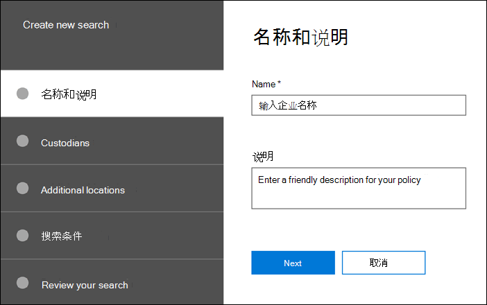

# 创建搜索

在 **案例的"** 搜索"选项卡上，可以通过单击"新建搜索"并遵循向导创建新搜索。

## 命名搜索并给出说明

每个具有案例的搜索都应具有唯一的名称。 可以选择提供搜索说明。 

## 选择要搜索的保管人和位置

通过指定已添加到案例的保管人，选择要搜索的保管人内容位置。 通过选择保管人，您将针对映射到保管人的所有数据源运行搜索。 还可以选择将搜索范围缩小到每个保管人所选的数据源。 若要详细了解如何添加保管人并管理其数据源，请参阅 [使用保管人](managing-custodians.md)。

## 选择非地理位置

在某些情况下，您可能需要搜索不与保管人关联的数据源。 在这种情况下，您可以指定要搜索的位置，或选择搜索特定 Microsoft 服务 (（如搜索所有 Exchange 邮箱或所有 SharePoint 网站和 OneDrive 帐户）) 。

## 定义搜索查询和条件

您可以使用预构建的条件卡或 KQL 中的关键字查询语言定义关键字查询和搜索 (条件) 。 有关详细信息，请参阅生成 [搜索查询](building-search-queries.md)。
