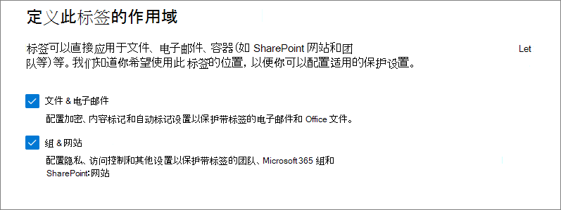
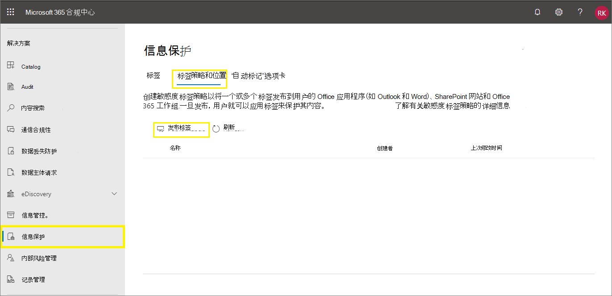
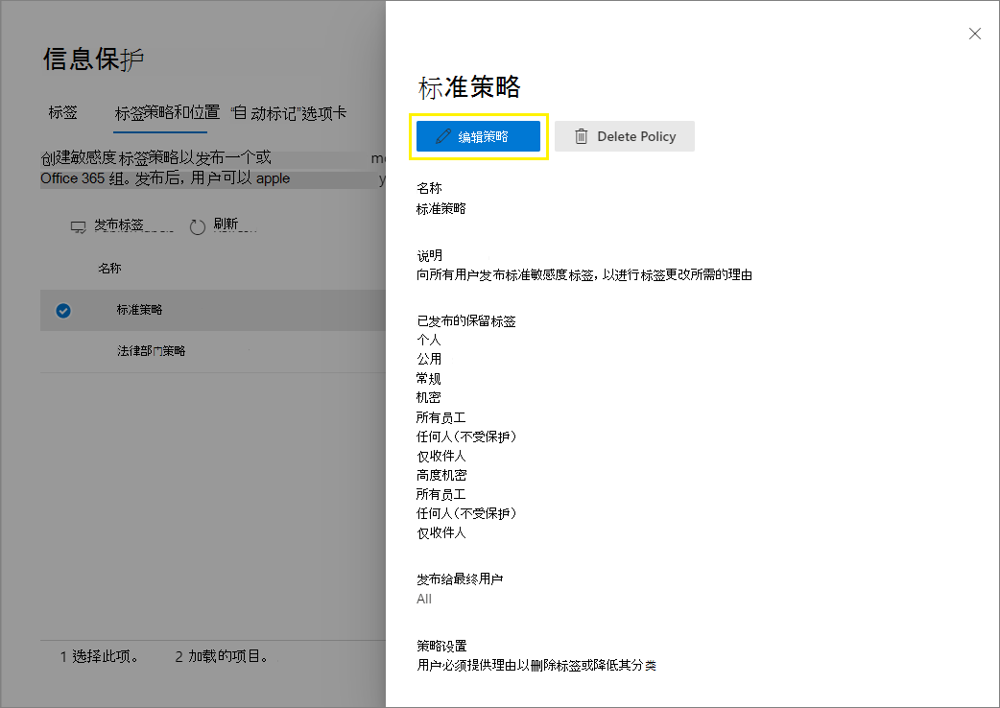

# <a name="create-and-configure-sensitivity-labels-and-their-policies"></a>创建和配置敏感度标签及其策略

>*[Microsoft 365 安全性与合规性许可指南](/office365/servicedescriptions/microsoft-365-service-descriptions/microsoft-365-tenantlevel-services-licensing-guidance/microsoft-365-security-compliance-licensing-guidance)。*

所有 Microsoft 信息保护解决方案（有时缩写为 MIP）通过使用 [敏感度标签](sensitivity-labels.md)实现。 要创建并发布这些标签，请转到<a href="https://go.microsoft.com/fwlink/p/?linkid=2077149" target="_blank">Microsoft 365 合规中心</a>。 还可以使用旧门户 Office 365 安全与合规中心。

首先，创建和配置要在应用和其他服务中使用的敏感度标签。 例如，希望用户在 Office 应用中看到和采用的标签。 

然后，创建一个或多个包含标签和你配置的策略设置的标签策略。 这是用于发布所选用户和位置的标签和设置的标签策略。

## <a name="before-you-begin"></a>准备工作

组织的全局管理员具有创建和管理敏感度标签各方面的完全权限。 如果你未以全局管理员的身份登录，请参阅[创建和管理敏感度标签所需的权限](get-started-with-sensitivity-labels.md#permissions-required-to-create-and-manage-sensitivity-labels)。

## <a name="create-and-configure-sensitivity-labels"></a>创建和配置敏感度标签

1. 从 [Microsoft 365 合规中心](https://compliance.microsoft.com/)中，选择 **解决方案** > **信息保护**
    
    如果看不到此选项，请先选择“**全部显示**”。

2. 在 **标签** 页面，选择 **+ 创建标签**，以启动“新建灵敏度标签”配置。 

    例如，从 Microsoft 365 合规中心：

    

    > [!NOTE]
    > 默认情况下，租户没有任何标签，并且必须由你创建。 示例图片中的标签显示 [从 Azure 信息保护迁移](/azure/information-protection/configure-policy-migrate-labels)的默认标签。

3. 在 **定义此标签的范围** 页面上，选择的选项将确定可以配置的设置的标签范围以及它们发布后的可见位置：

    

    - 如果已选中 **文件和电子邮件**，则可以配置适用于支持敏感度标签的应用 (如 Office Word 和 Outlook) 的设置。 如果未选择此选项，将看到这些设置的第一页，但无法进行配置，用户无法在这些应用中选择标签。

    - 如果已选中 **组和站点**，则可以配置适用于 Microsoft 365 组和网站 (Teams 和 SharePoint) 的设置。 如果未选择此选项，将看到这些设置的第一页，但无法进行配置，且用户无法为组和站点选择标签。

    有关 **图表化数据资产** 范围的信息，请参阅 [在 Azure Purview 中自动标记内容](/azure/purview/create-sensitivity-label)。

4. 按照配置提示进行标签设置。

    有关标签设置的详细信息，请参阅概述信息中的 [敏感度标签有何用途](sensitivity-labels.md#what-sensitivity-labels-can-do) 并使用 UI 中针对单个设置的帮助。

5. 重复以上步骤以创建更多标签。但是，如果想要创建子标签，请先选择父标签，然后点击“**...**”并选择“**更多操作**”，然后选择“**添加子标签**”。

6. 创建所需的所有标签后，请查看其顺序，如有必要，请向上或向下移动它们。 若要更改标签的顺序，请选择“**...**”进行 **更多操作**”，然后选择 “**上移**”或 “**下移**”。 有关详细信息，请参阅概述信息中的“[标签优先级（顺序非常重要）](sensitivity-labels.md#label-priority-order-matters)”。

若要编辑现有标签，请将其选中，然后选择“**编辑标签**”按钮：


此按钮将启动 **编辑敏感度标签** 配置，可用于更改步骤 4 中的所有标签设置。

除非你了解对用户的影响，否则不要删除标签。 有关更多信息，请参阅[移除和删除标签](#removing-and-deleting-labels)部分。 

> [!NOTE]
> 如果要编辑已使用标签策略发布的标签，则在完成该配置时不需要执行额外步骤。 例如，不需要将其添加到新的标签策略，以便对相同用户提供所做的更改。 但是，请留出长达 24 小时的时间将更改复制到所有应用和服务。

发布标签之前，无法在应用程序或服务中使用。 若要发布标签，必须将其[添加到标签策略](#publish-sensitivity-labels-by-creating-a-label-policy)。

> [!IMPORTANT]
> 在此“**标签**”选项卡上，不要选择“**发布标签**”选项卡（或在编辑标签时的“**发布标签**”按钮），除非你需要创建新的标签策略。 仅当用户需要不同的标签或不同的策略设置时，才需要多个标签策略。 旨在创建尽可能少的标签策略 - 组织只有一个标签策略的情况并不少见。

### <a name="additional-label-settings-with-security--compliance-center-powershell"></a>附加标签设置在安全与合规中心 PowerShell 中可用

附加标签设置可在[安全与合规中心 PowerShell](/powershell/exchange/scc-powershell) 中的[设置标签](/powershell/module/exchange/set-label)中使用。

例如：

- 使用 *LocaleSettings* 参数来进行跨国部署，以便用户可查看使用本地语言的标签名称和工具提示。 [下列部分](#example-configuration-to-configure-a-sensitivity-label-for-different-languages)有一个示例配置，用于为法语、意大利语和德语指定标签名称和工具提示文本。

- 仅限 Azure 信息保护统一标识客户端，支持大量[高级设置](/azure/information-protection/rms-client/clientv2-admin-guide-customizations)列表，其中包括设置标签颜色，以及在使用标签时应用自定义属性。 有关完整列表，请参阅该客户端管理员指南的[标签 可用高级设置](/azure/information-protection/rms-client/clientv2-admin-guide-customizations#available-advanced-settings-for-labels)。

#### <a name="example-configuration-to-configure-a-sensitivity-label-for-different-languages"></a>配置不同语言的灵敏度标签的配置示例

下面的示例显示了名为“Public”的标签的 PowerShell 配置以及工具提示的占位符文本。 在此示例中，将为法语、意大利语和德语配置标签名称和工具提示文本。

进行此配置后，如果用户拥有使用这些显示语言的 Office 应用，则会看到他们的标签名称和工具提示使用相同的语言。 类似地，当你已安装 Azure 信息保护统一标签客户端以标记文件资源管理器中的文件时，如果用户具有这些语言版本的 Windows，则他们在使用右键单击来进行标记时将会看到其标签名称和工具提示以本地语言显示。

对于需要支持的语言，请使用 Office [语言标识符](/deployoffice/office2016/language-identifiers-and-optionstate-id-values-in-office-2016#language-identifiers)（也称为语言标记），并指定你自己的标签名称和工具提示翻译。

在 PowerShell 中运行命令之前，必须先[连接到安全与合规中心 PowerShell](/powershell/exchange/connect-to-scc-powershell)。

```powershell
$Languages = @("fr-fr","it-it","de-de")
$DisplayNames=@("Publique","Publico","Oeffentlich")
$Tooltips = @("Texte Français","Testo italiano","Deutscher text")
$label = "Public"
$DisplayNameLocaleSettings = [PSCustomObject]@{LocaleKey='DisplayName';
Settings=@(
@{key=$Languages[0];Value=$DisplayNames[0];}
@{key=$Languages[1];Value=$DisplayNames[1];}
@{key=$Languages[2];Value=$DisplayNames[2];})}
$TooltipLocaleSettings = [PSCustomObject]@{LocaleKey='Tooltip';
Settings=@(
@{key=$Languages[0];Value=$Tooltips[0];}
@{key=$Languages[1];Value=$Tooltips[1];}
@{key=$Languages[2];Value=$Tooltips[2];})}
Set-Label -Identity $Label -LocaleSettings (ConvertTo-Json $DisplayNameLocaleSettings -Depth 3 -Compress),(ConvertTo-Json $TooltipLocaleSettings -Depth 3 -Compress)
```

## <a name="publish-sensitivity-labels-by-creating-a-label-policy"></a>通过创建标签策略来发布敏感度标签

1. 从 [Microsoft 365 合规中心](https://compliance.microsoft.com/)中，选择 **解决方案** > **信息保护**
    
    如果看不到此选项，请先选择“**全部显示**”。

2. 依次选择 **标签策略** 选项卡和 **发布标签**，以启动 **创建策略** 配置:

    例如，从 Microsoft 365 合规中心：

    

    > [!NOTE]
    > 默认情况下，租户没有任何标签策略，且必须由你创建。 

3. 在 **选择要发布的敏感度标签** 页面上，选择 **选择要发布的敏感度标签** 链接。 选择可在应用和服务中可以使用的标签，随后选择“**添加**”。

    > [!IMPORTANT]
    > 如果选择子标签，请确保也选择其父标签。

4. 查看所选标签，若要进行任何更改，请选择“**编辑**”。否则，请选择“**下一步**”。

5. 按照提示配置策略设置。

    所看到的策略设置会匹配你选择的标签的范围。 例如，如果选择了仅用于 **文件和电子邮件** 范围，则默认情况下看不到策略设置 **“”将此标签应用到组和网站”** 和 **“要求用户将标签应用到他们的组和网站”**。

    有关这些设置的详细信息，请参阅概述信息中的 [标签策略有何用途](sensitivity-labels.md#what-label-policies-can-do) 并使用 UI 中针对单个设置的帮助。

    对于为 **Azure Purview 素材（预览版）** 配置的标签：这些标签没有任何关联的策略设置。

6. 如果不同的用户或范围需要不同的策略设置，请重复这些步骤。 例如，希望为一组用户创建附加标签，或用户为子集创建不同的默认标签。 或者，如果你配置的标签具有不同的范围。

7. 如果创建多个可能导致用户发生冲突的标签策略，请查看策略顺序，并根据需要向上或向下移动。 若要更改标签策略的顺序，请选择“**...**”进行 **更多操作**”，然后选择 “**上移**”或 “**下移**”。 有关详细信息，请参阅概述信息中的“[标签策略优先级（顺序非常重要）](sensitivity-labels.md#label-policy-priority-order-matters)”。

完成 **创建策略** 配置会自动发布标签策略。 若要更改已发布的策略，只需对其进行编辑。 没有特定发布或重新发布操作可供选择。

若要编辑现有标签策略，请将其选中，然后选择“**编辑策略**”按钮： 



此按钮将启动 **创建策略** 配置，可用于编辑所包含的标签和标签设置。 完成配置后，所有更改都将自动复制到所选用户和服务。

对 Windows、macOS、iOS 和 Android 上的 Office 应用使用内置标签时，刷新浏览器时，用户会在 4 个小时内看到新标签，而在 Word、Excel 和 PowerPoint Web 版上，1 小时内就可以看到新标签。但是，请留出长达 24 小时的时间将更改复制到所有应用和服务。

其他支持敏感度标签的应用和服务可能会有自己的更新计划，更新频率超过每 24 小时一次，并触发策略更新。 有关详细信息，请参阅它们的文档。 例如，对于 Azure 信息保护统一标签客户端，请参阅 [Azure 信息保护客户端的详细对比](/azure/information-protection/rms-client/use-client#detailed-comparisons-for-the-azure-information-protection-clients)中的 **策略更新** 行。

> [!TIP]
> 请记住，计时依赖关系有时可能会延迟敏感度标签和标签策略的正常工作。 例如，为应用加密的标签填充新的组和组成员身份更改、网络复制延迟和带宽限制，以及 [Azure 信息保护服务的组成员身份缓存](/azure/information-protection/prepare#group-membership-caching-by-azure-information-protection)。
> 
> 由于有许多外部依赖项，并且每个依赖项都有自己的计时周期，因此建议先等待 24 小时，然后再针对最近的更改标签和标签策略进行故障排除。

### <a name="additional-label-policy-settings-with-security--compliance-center-powershell"></a>附加标签策略设置在安全与合规中心 PowerShell 中可用

附加标签策略设置可在[安全与合规中心 PowerShell](/powershell/exchange/scc-powershell) 中的[Set-LabelPolicy](/powershell/module/exchange/set-labelpolicy) cmdlet 中使用。

Azure 信息保护统一标记客户端支持许多[高级设置](/azure/information-protection/rms-client/clientv2-admin-guide-customizations)，包括从其他标签解决方案进行迁移，以及在 Outlook 中弹出警告、证明或阻止发送电子邮件的消息。 有关完整列表，请参阅该客户端管理员指南的 “[适用于标签策略的高级设置](/azure/information-protection/rms-client/clientv2-admin-guide-customizations#available-advanced-settings-for-label-policies)”。

## <a name="use-powershell-for-sensitivity-labels-and-their-policies"></a>为灵敏度标签及其策略使用 PowerShell

现在，你可以使用 [安全性 & 合规性中心 PowerShell](/powershell/exchange/scc-powershell) 创建和配置你在标签管理中心里看到的所有设置。 这意味着，除了将 PowerShell 用于标记管理中心里不可用的设置外，你现在还可以完全编写灵敏度标签和灵敏度标签策略的创建和维护脚本。 

请参阅以下文档，获取受支持的参数和值：

- [New-Label](/powershell/module/exchange/new-label)
- [New-LabelPolicy](/powershell/module/exchange/new-labelpolicy)
- [Set-Label](/powershell/module/exchange/set-label)
- [Set-LabelPolicy](/powershell/module/exchange/set-labelpolicy)

如果你需要编写对敏感度标签或灵敏度标签策略的删除脚本，则还可使用 [Remove-Label](/powershell/module/exchange/remove-label) 和 [Remove-LabelPolicy](/powershell/module/exchange/remove-labelpolicy)。 但是，在你删除灵敏度标签前，请务必阅读以下部分。

## <a name="removing-and-deleting-labels"></a>移除和删除标签

在生产环境中，不太可能需要从标签策略中移除敏感度标签，也不太可能需要删除敏感度标签。 更有可能是在初始测试阶段需要执行这两项操作之一。 请务必了解执行这两项操作之一时所发生的情况。

从标签策略中移除标签比删除标签的风险要小；如果需要，稍后始终可以将标签添加回标签策略中：

- 如果从标签策略中移除标签，让标签不再发布给最初指定的用户，那么当标签策略下次刷新时，标签就不再可供这些用户在 Office 应用程序中选择。 不过，如果已将标签应用于文档或电子邮件，那么标签不会从此类内容中移除。 由标签应用的任何加密都会保留，且基础保护模板也会保持已发布状态不变。 

- 对于已移除但以前应用于内容的标签，在 Word、Excel 和 PowerPoint 中使用内置标签的用户仍会在状态栏中看到已应用标签名称。 同样，已移除但以前应用于 SharePoint 网站的标签仍会在“敏感度”列中显示标签名称。

相比之下，如果删除标签：

- 如果标签应用了加密，则会存档基础保护模板，这样以前受保护的内容就仍能打开。 因为有此已存档保护模板，所以无法创建同名的新标签。 虽然可以使用 [PowerShell](/powershell/module/aipservice/remove-aipservicetemplate) 删除保护模板，但请不要这样做，除非你确定无需打开使用已存档模板加密的内容。

- 对于桌面应用程序：元数据中的标签信息会保留，但由于无法再进行标签 ID 到名称的映射，导致用户看不到显示的已应用标签名称（例如，在状态栏中），因此用户会假定内容未标记。 如果标签应用了加密，则会保留加密，且用户仍会在内容打开时看到当前已存档保护模板的名称和说明。

- 对于 Office 网页版：用户在状态栏或“**敏感度**”列中看不到标签名称。 元数据中的标签信息仅在标签未应用加密的情况下保留。 如果标签应用了加密，且你已[为 SharePoint 和 OneDrive 启用敏感度标签](sensitivity-labels-sharepoint-onedrive-files.md)，那么元数据中的标签信息就会遭移除，且加密也会遭撤消。 

从标签策略中移除敏感度标签或删除敏感度标签时，这些更改最多可能需要 24 小时才能复制到所有用户和服务。

## <a name="next-steps"></a>后续步骤

若要根据具体情况配置和使用敏感度标签，请使用下列文章：

- [使用敏感度标签中的加密限制对内容的访问](encryption-sensitivity-labels.md)

- [将敏感度标签自动应用于内容](apply-sensitivity-label-automatically.md)

- [将灵敏度标签与团队、组和网站配合使用](sensitivity-labels-teams-groups-sites.md)

- [启用 SharePoint 和 OneDrive 中 Office 文件的灵敏度标签](sensitivity-labels-sharepoint-onedrive-files.md)

若要监视标签使用方式，请参阅 [数据分类入门](data-classification-overview.md)。
