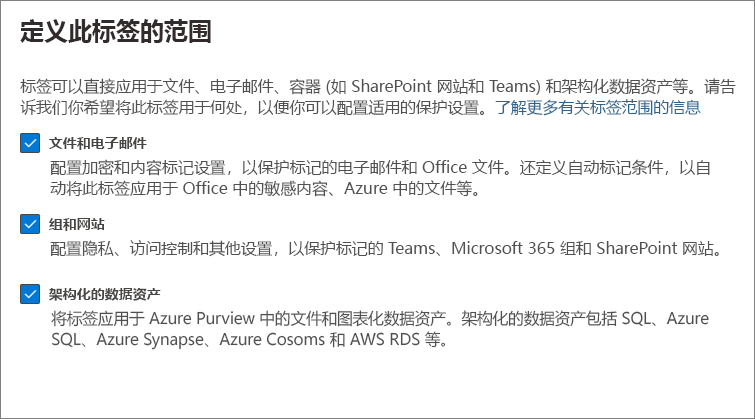

# <a name="create-and-configure-sensitivity-labels-and-their-policies"></a><span data-ttu-id="a8b23-103">创建和配置敏感度标签及其策略</span><span class="sxs-lookup"><span data-stu-id="a8b23-103">Create and configure sensitivity labels and their policies</span></span>

><span data-ttu-id="a8b23-104">*[Microsoft 365 安全性与合规性许可指南](https://aka.ms/ComplianceSD)。*</span><span class="sxs-lookup"><span data-stu-id="a8b23-104">*[Microsoft 365 licensing guidance for security & compliance](https://aka.ms/ComplianceSD).*</span></span>

<span data-ttu-id="a8b23-105">所有 Microsoft 信息保护解决方案（有时缩写为 MIP）通过使用 [敏感度标签](sensitivity-labels.md)实现。</span><span class="sxs-lookup"><span data-stu-id="a8b23-105">All Microsoft Information Protection solutions (sometimes abbreviated to MIP) are implemented by using [sensitivity labels](sensitivity-labels.md).</span></span> <span data-ttu-id="a8b23-106">要创建并发布这些标签，请转到标签管理中心，例如 [Microsoft 365 合规中心](https://compliance.microsoft.com/)。</span><span class="sxs-lookup"><span data-stu-id="a8b23-106">To create and publish these labels, go to your labeling admin center, such as the [Microsoft 365 compliance center](https://compliance.microsoft.com/).</span></span> <span data-ttu-id="a8b23-107">此外，还可使用 Microsoft 365 安全中心或安全与合规中心。</span><span class="sxs-lookup"><span data-stu-id="a8b23-107">You can also use the Microsoft 365 security center, or the Security & Compliance Center.</span></span>

<span data-ttu-id="a8b23-108">首先，创建和配置要在应用和其他服务中使用的敏感度标签。</span><span class="sxs-lookup"><span data-stu-id="a8b23-108">First, create and configure the sensitivity labels that you want to make available for apps and other services.</span></span> <span data-ttu-id="a8b23-109">例如，希望用户在 Office 应用中看到和采用的标签。</span><span class="sxs-lookup"><span data-stu-id="a8b23-109">For example, the labels you want users to see and apply from Office apps.</span></span> 

<span data-ttu-id="a8b23-110">然后，创建一个或多个包含标签和你配置的策略设置的标签策略。</span><span class="sxs-lookup"><span data-stu-id="a8b23-110">Then, create one or more label policies that contain the labels and policy settings that you configure.</span></span> <span data-ttu-id="a8b23-111">这是用于发布所选用户和位置的标签和设置的标签策略。</span><span class="sxs-lookup"><span data-stu-id="a8b23-111">It's the label policy that publishes the labels and settings for your chosen users and locations.</span></span>

## <a name="before-you-begin"></a><span data-ttu-id="a8b23-112">准备工作</span><span class="sxs-lookup"><span data-stu-id="a8b23-112">Before you begin</span></span>

<span data-ttu-id="a8b23-113">组织的全局管理员具有创建和管理敏感度标签各方面的完全权限。</span><span class="sxs-lookup"><span data-stu-id="a8b23-113">The global admin for your organization has full permissions to create and manage all aspects of sensitivity labels.</span></span> <span data-ttu-id="a8b23-114">如果你未以全局管理员的身份登录，请参阅[创建和管理敏感度标签所需的权限](get-started-with-sensitivity-labels.md#permissions-required-to-create-and-manage-sensitivity-labels)。</span><span class="sxs-lookup"><span data-stu-id="a8b23-114">If you aren't signing in as a global admin, see [Permissions required to create and manage sensitivity labels](get-started-with-sensitivity-labels.md#permissions-required-to-create-and-manage-sensitivity-labels).</span></span>

## <a name="create-and-configure-sensitivity-labels"></a><span data-ttu-id="a8b23-115">创建和配置敏感度标签</span><span class="sxs-lookup"><span data-stu-id="a8b23-115">Create and configure sensitivity labels</span></span>

1. <span data-ttu-id="a8b23-116">在标签管理中心中，导航到“灵敏度”标签：</span><span class="sxs-lookup"><span data-stu-id="a8b23-116">In your labeling admin center, navigate to sensitivity labels:</span></span>
    
    - <span data-ttu-id="a8b23-117">Microsoft 365 合规中心：</span><span class="sxs-lookup"><span data-stu-id="a8b23-117">Microsoft 365 compliance center:</span></span> 
        - <span data-ttu-id="a8b23-118">**解决方案** > **信息保护**</span><span class="sxs-lookup"><span data-stu-id="a8b23-118">**Solutions** > **Information protection**</span></span>
        
        <span data-ttu-id="a8b23-119">如果看不到此选项，请先选择“**全部显示**”。</span><span class="sxs-lookup"><span data-stu-id="a8b23-119">If you don't immediately see this option, first select **Show all**.</span></span> 
    
    - <span data-ttu-id="a8b23-120">Microsoft 365 安全中心：</span><span class="sxs-lookup"><span data-stu-id="a8b23-120">Microsoft 365 security center:</span></span> 
        - <span data-ttu-id="a8b23-121">**分类** > **灵敏度标签**</span><span class="sxs-lookup"><span data-stu-id="a8b23-121">**Classification** > **Sensitivity labels**</span></span>
    
    - <span data-ttu-id="a8b23-122">安全与合规中心：</span><span class="sxs-lookup"><span data-stu-id="a8b23-122">Security & Compliance Center:</span></span>
        - <span data-ttu-id="a8b23-123">**分类** > **灵敏度标签**</span><span class="sxs-lookup"><span data-stu-id="a8b23-123">**Classification** > **Sensitivity labels**</span></span>

2. <span data-ttu-id="a8b23-124">在“**标签**”页面，选择“**+ 创建标签**”，以启动“新建灵敏度标签”向导。</span><span class="sxs-lookup"><span data-stu-id="a8b23-124">On the **Labels** page, select **+ Create a label** to start the New sensitivity label wizard.</span></span> 
    
    <span data-ttu-id="a8b23-125">例如，从 Microsoft 365 合规中心：</span><span class="sxs-lookup"><span data-stu-id="a8b23-125">For example, from the Microsoft 365 compliance center:</span></span>
    
    
    
    > [!NOTE]
    > <span data-ttu-id="a8b23-127">默认情况下，租户没有任何标签，并且必须由你创建。</span><span class="sxs-lookup"><span data-stu-id="a8b23-127">By default, tenants don't have any labels and you must create them.</span></span> <span data-ttu-id="a8b23-128">示例图片中的标签显示 [从 Azure 信息保护迁移](https://docs.microsoft.com/azure/information-protection/configure-policy-migrate-labels)的默认标签。</span><span class="sxs-lookup"><span data-stu-id="a8b23-128">The labels in the example picture show default labels that were [migrated from Azure Information Protection](https://docs.microsoft.com/azure/information-protection/configure-policy-migrate-labels).</span></span>

3. <span data-ttu-id="a8b23-129">在 **定义此标签的范围** 页面上，选择的选项将确定可以配置的设置的标签范围以及它们发布后的可见位置：</span><span class="sxs-lookup"><span data-stu-id="a8b23-129">On the **Define the scope for this label** page, the options selected determine the label's scope for the settings that you can configure and where they will be visible when they are published:</span></span>
    
    
    
    - <span data-ttu-id="a8b23-131">如果已选中 **“文件和 电子邮件”**，则可以在此向导中配置适用于支持敏感度标签的应用（如 Office Word 和 Outlook）的设置。</span><span class="sxs-lookup"><span data-stu-id="a8b23-131">If **Files & emails** is selected, you can configure settings in this wizard that apply to apps that support sensitivity labels, such as Office Word and Outlook.</span></span> <span data-ttu-id="a8b23-132">如果未选择此选项，向导将显示这些设置的第一页，但无法进行配置，用户无法在这些应用中选择标签。</span><span class="sxs-lookup"><span data-stu-id="a8b23-132">If this option isn't selected, the wizard displays the first page of these settings but you can't configure them and the labels won't be available for users to select in these apps.</span></span>
    
    - <span data-ttu-id="a8b23-133">如果已选中 **“组合网站”** ，则可以在此向导中配置适用于 Microsoft 365 组和网站（Teams 和 SharePoint）的设置。</span><span class="sxs-lookup"><span data-stu-id="a8b23-133">If **Groups & sites** is selected, you can configure settings in this wizard that apply to Microsoft 365 groups, and sites for Teams and SharePoint.</span></span> <span data-ttu-id="a8b23-134">如果未选择此选项，向导将显示这些设置的第一页，但无法进行配置，用户无法在组合网站中选择标签。</span><span class="sxs-lookup"><span data-stu-id="a8b23-134">If this option isn't selected, the wizard displays the first page of these settings but you can't configure them and the labels won't be available for users to select for groups and site.</span></span>
    
    <span data-ttu-id="a8b23-135">有关 **Azure Purview 素材（预览版）** 范围的详细信息，请参阅 [在 Azure Purview 中自动标记内容](https://docs.microsoft.com/azure/purview/create-sensitivity-label)。</span><span class="sxs-lookup"><span data-stu-id="a8b23-135">For information about the **Azure Purview assets (preview)** scope, see [Automatically label your content in Azure Purview](https://docs.microsoft.com/azure/purview/create-sensitivity-label).</span></span>

4. <span data-ttu-id="a8b23-136">在向导中按照提示进行标签设置。</span><span class="sxs-lookup"><span data-stu-id="a8b23-136">Follow the prompts in the wizard for the label settings.</span></span>
    
    <span data-ttu-id="a8b23-137">有关标签设置的详细信息，请参阅概述信息中的“[敏感度标签有何用途](sensitivity-labels.md#what-sensitivity-labels-can-do)”并使用向导中针对单个设置的帮助。</span><span class="sxs-lookup"><span data-stu-id="a8b23-137">For more information about the label settings, see [What sensitivity labels can do](sensitivity-labels.md#what-sensitivity-labels-can-do) from the overview information and use the help in the wizard for individual settings.</span></span>

5. <span data-ttu-id="a8b23-138">重复这些步骤以创建更多标签。</span><span class="sxs-lookup"><span data-stu-id="a8b23-138">Repeat these steps to create more labels.</span></span> <span data-ttu-id="a8b23-139">但是，如果想要创建子标签，请先选择父标签，然后点击“**...**”并选择“**更多操作**”，然后选择“**添加子标签**”。</span><span class="sxs-lookup"><span data-stu-id="a8b23-139">However, if you want to create a sublabel, first select the parent label and select **...** for **More actions**, and then select **Add sub label**.</span></span>

6. <span data-ttu-id="a8b23-140">创建所需的所有标签后，请查看其顺序，如有必要，请向上或向下移动它们。</span><span class="sxs-lookup"><span data-stu-id="a8b23-140">When you have created all the labels you need, review their order and if necessary, move them up or down.</span></span> <span data-ttu-id="a8b23-141">若要更改标签的顺序，请选择“**...**”进行 **更多操作**”，然后选择 “**上移**”或 “**下移**”。</span><span class="sxs-lookup"><span data-stu-id="a8b23-141">To change the order of a label, select **...** for **More actions**, and then select **Move up** or **Move down**.</span></span> <span data-ttu-id="a8b23-142">有关详细信息，请参阅概述信息中的“[标签优先级（顺序非常重要）](sensitivity-labels.md#label-priority-order-matters)”。</span><span class="sxs-lookup"><span data-stu-id="a8b23-142">For more information, see [Label priority (order matters)](sensitivity-labels.md#label-priority-order-matters) from the overview information.</span></span>

<span data-ttu-id="a8b23-143">若要编辑现有标签，请将其选中，然后选择“**编辑标签**”按钮：</span><span class="sxs-lookup"><span data-stu-id="a8b23-143">To edit an existing label, select it, and then select the **Edit label** button:</span></span>


<span data-ttu-id="a8b23-145">此按钮将启动“**编辑敏感度标签**”向导，可用于更改步骤 4 中的所有标签设置。</span><span class="sxs-lookup"><span data-stu-id="a8b23-145">This button starts the **Edit sensitivity label** wizard, which lets you change all the label settings in step 4.</span></span>

<span data-ttu-id="a8b23-146">除非你了解对用户的影响，否则不要删除标签。</span><span class="sxs-lookup"><span data-stu-id="a8b23-146">Don't delete a label unless you understand the impact for users.</span></span> <span data-ttu-id="a8b23-147">有关更多信息，请参阅[移除和删除标签](#removing-and-deleting-labels)部分。</span><span class="sxs-lookup"><span data-stu-id="a8b23-147">For more information, see the [Removing and deleting labels](#removing-and-deleting-labels) section.</span></span> 

> [!NOTE]
> <span data-ttu-id="a8b23-148">如果要编辑已使用标签策略发布的标签，则在完成该向导时不需要执行额外步骤。</span><span class="sxs-lookup"><span data-stu-id="a8b23-148">If you edit a label that's already published by using a label policy, no extra steps are needed when you finish the wizard.</span></span> <span data-ttu-id="a8b23-149">例如，不需要将其添加到新的标签策略，以便对相同用户提供所做的更改。</span><span class="sxs-lookup"><span data-stu-id="a8b23-149">For example, you don't need to add it to a new label policy for the changes to become available to the same users.</span></span> <span data-ttu-id="a8b23-150">但是，请留出长达 24 小时的时间将更改复制到所有应用和服务。</span><span class="sxs-lookup"><span data-stu-id="a8b23-150">However, allow up to 24 hours for the changes to replicate to all apps and services.</span></span>

<span data-ttu-id="a8b23-151">发布标签之前，无法在应用程序或服务中使用。</span><span class="sxs-lookup"><span data-stu-id="a8b23-151">Until you publish your labels, they won't be available to select in apps or for services.</span></span> <span data-ttu-id="a8b23-152">若要发布标签，必须将其[添加到标签策略](#publish-sensitivity-labels-by-creating-a-label-policy)。</span><span class="sxs-lookup"><span data-stu-id="a8b23-152">To publish the labels, they must be [added to a label policy](#publish-sensitivity-labels-by-creating-a-label-policy).</span></span>

> [!IMPORTANT]
> <span data-ttu-id="a8b23-153">在此“**标签**”选项卡上，不要选择“**发布标签**”选项卡（或在编辑标签时的“**发布标签**”按钮），除非你需要创建新的标签策略。</span><span class="sxs-lookup"><span data-stu-id="a8b23-153">On this **Labels** tab, do not select the **Publish labels** tab (or the **Publish label** button when you edit a label) unless you need to create a new label policy.</span></span> <span data-ttu-id="a8b23-154">仅当用户需要不同的标签或不同的策略设置时，才需要多个标签策略。</span><span class="sxs-lookup"><span data-stu-id="a8b23-154">You need multiple label policies only if users need different labels or different policy settings.</span></span> <span data-ttu-id="a8b23-155">旨在创建尽可能少的标签策略 - 组织只有一个标签策略的情况并不少见。</span><span class="sxs-lookup"><span data-stu-id="a8b23-155">Aim to have as few label policies as possible—it's not uncommon to have just one label policy for the organization.</span></span>

### <a name="additional-label-settings-with-security--compliance-center-powershell"></a><span data-ttu-id="a8b23-156">附加标签设置在安全与合规中心 PowerShell 中可用</span><span class="sxs-lookup"><span data-stu-id="a8b23-156">Additional label settings with Security & Compliance Center PowerShell</span></span>

<span data-ttu-id="a8b23-157">附加标签设置可在[安全与合规中心 PowerShell](https://docs.microsoft.com/powershell/exchange/scc-powershell) 中的[设置标签](https://docs.microsoft.com/powershell/module/exchange/set-label)中使用。</span><span class="sxs-lookup"><span data-stu-id="a8b23-157">Additional label settings are available with the [Set-Label](https://docs.microsoft.com/powershell/module/exchange/set-label) cmdlet from [Security & Compliance Center PowerShell](https://docs.microsoft.com/powershell/exchange/scc-powershell).</span></span>

<span data-ttu-id="a8b23-158">例如：</span><span class="sxs-lookup"><span data-stu-id="a8b23-158">For example:</span></span>

- <span data-ttu-id="a8b23-159">使用 *LocaleSettings* 参数来进行跨国部署，以便用户可查看使用本地语言的标签名称和工具提示。</span><span class="sxs-lookup"><span data-stu-id="a8b23-159">Use the *LocaleSettings* parameter for multinational deployments so that users see the label name and tooltip in their local language.</span></span> <span data-ttu-id="a8b23-160">[下列部分](#example-configuration-to-configure-a-sensitivity-label-for-different-languages)有一个示例配置，用于为法语、意大利语和德语指定标签名称和工具提示文本。</span><span class="sxs-lookup"><span data-stu-id="a8b23-160">The [following section](#example-configuration-to-configure-a-sensitivity-label-for-different-languages) has an example configuration that specifies the label name and tooltip text for French, Italian, and German.</span></span>

- <span data-ttu-id="a8b23-161">仅限 Azure 信息保护统一标记客户端，指定包括设置标签颜色，以及在应用标签时应用自定义属性的[高级设置](https://docs.microsoft.com/azure/information-protection/rms-client/clientv2-admin-guide-customizations)。</span><span class="sxs-lookup"><span data-stu-id="a8b23-161">For the Azure Information Protection unified labeling client only, specify [advanced settings](https://docs.microsoft.com/azure/information-protection/rms-client/clientv2-admin-guide-customizations) that include setting a label color, and applying a custom property when a label is applied.</span></span> <span data-ttu-id="a8b23-162">有关完整列表，请参阅该客户端管理员指南的[标签 可用高级设置](https://docs.microsoft.com/azure/information-protection/rms-client/clientv2-admin-guide-customizations#available-advanced-settings-for-labels)。</span><span class="sxs-lookup"><span data-stu-id="a8b23-162">For the full list, see [Available advanced settings for labels](https://docs.microsoft.com/azure/information-protection/rms-client/clientv2-admin-guide-customizations#available-advanced-settings-for-labels) from this client's admin guide.</span></span>

#### <a name="example-configuration-to-configure-a-sensitivity-label-for-different-languages"></a><span data-ttu-id="a8b23-163">配置不同语言的灵敏度标签的配置示例</span><span class="sxs-lookup"><span data-stu-id="a8b23-163">Example configuration to configure a sensitivity label for different languages</span></span>

<span data-ttu-id="a8b23-164">下面的示例显示了名为“Public”的标签的 PowerShell 配置以及工具提示的占位符文本。</span><span class="sxs-lookup"><span data-stu-id="a8b23-164">The following example shows the PowerShell configuration for a label named "Public" with placeholder text for the tooltip.</span></span> <span data-ttu-id="a8b23-165">在此示例中，将为法语、意大利语和德语配置标签名称和工具提示文本。</span><span class="sxs-lookup"><span data-stu-id="a8b23-165">In this example, the label name and tooltip text are configured for French, Italian, and German.</span></span>

<span data-ttu-id="a8b23-166">进行此配置后，如果用户拥有使用这些显示语言的 Office 应用，则会看到他们的标签名称和工具提示使用相同的语言。</span><span class="sxs-lookup"><span data-stu-id="a8b23-166">As a result of this configuration, users who have Office apps that use those display languages see their label names and tooltips in the same language.</span></span> <span data-ttu-id="a8b23-167">类似地，当你已安装 Azure 信息保护统一标签客户端以标记文件资源管理器中的文件时，如果用户具有这些语言版本的 Windows，则他们在使用右键单击来进行标记时将会看到其标签名称和工具提示以本地语言显示。</span><span class="sxs-lookup"><span data-stu-id="a8b23-167">Similarly, if you have the Azure Information Protection unified labeling client installed to label files from File Explorer, users who have those language versions of Windows see their label names and tooltips in their local language when they use the right-click actions for labeling.</span></span>

<span data-ttu-id="a8b23-168">对于需要支持的语言，请使用 Office [语言标识符](https://docs.microsoft.com/deployoffice/office2016/language-identifiers-and-optionstate-id-values-in-office-2016#language-identifiers)（也称为语言标记），并指定你自己的标签名称和工具提示翻译。</span><span class="sxs-lookup"><span data-stu-id="a8b23-168">For the languages that you need to support, use the Office [language identifiers](https://docs.microsoft.com/deployoffice/office2016/language-identifiers-and-optionstate-id-values-in-office-2016#language-identifiers) (also known as language tags), and specify your own translation for the label name and tooltip.</span></span>

<span data-ttu-id="a8b23-169">在 PowerShell 中运行命令之前，必须先[连接到安全与合规中心 PowerShell](https://docs.microsoft.com/powershell/exchange/connect-to-scc-powershell)。</span><span class="sxs-lookup"><span data-stu-id="a8b23-169">Before you run the commands in PowerShell, you must first [connect to Security & Compliance Center PowerShell](https://docs.microsoft.com/powershell/exchange/connect-to-scc-powershell).</span></span>


```powershell
$Languages = @("fr-fr","it-it","de-de")
$DisplayNames=@("Publique","Publico","Oeffentlich")
$Tooltips = @("Texte Français","Testo italiano","Deutscher text")
$label = "Public"
$DisplayNameLocaleSettings = [PSCustomObject]@{LocaleKey='DisplayName';
Settings=@(
@{key=$Languages[0];Value=$DisplayNames[0];}
@{key=$Languages[1];Value=$DisplayNames[1];}
@{key=$Languages[2];Value=$DisplayNames[2];})}
$TooltipLocaleSettings = [PSCustomObject]@{LocaleKey='Tooltip';
Settings=@(
@{key=$Languages[0];Value=$Tooltips[0];}
@{key=$Languages[1];Value=$Tooltips[1];}
@{key=$Languages[2];Value=$Tooltips[2];})}
Set-Label -Identity $Label -LocaleSettings (ConvertTo-Json $DisplayNameLocaleSettings -Depth 3 -Compress),(ConvertTo-Json $TooltipLocaleSettings -Depth 3 -Compress)
```

## <a name="publish-sensitivity-labels-by-creating-a-label-policy"></a><span data-ttu-id="a8b23-170">通过创建标签策略来发布敏感度标签</span><span class="sxs-lookup"><span data-stu-id="a8b23-170">Publish sensitivity labels by creating a label policy</span></span>

1. <span data-ttu-id="a8b23-171">在标签管理中心中，导航到“灵敏度”标签：</span><span class="sxs-lookup"><span data-stu-id="a8b23-171">In your labeling admin center, navigate to sensitivity labels:</span></span>
    
    - <span data-ttu-id="a8b23-172">Microsoft 365 合规中心：</span><span class="sxs-lookup"><span data-stu-id="a8b23-172">Microsoft 365 compliance center:</span></span> 
        - <span data-ttu-id="a8b23-173">**解决方案** > **信息保护**</span><span class="sxs-lookup"><span data-stu-id="a8b23-173">**Solutions** > **Information protection**</span></span>
        
        <span data-ttu-id="a8b23-174">如果看不到此选项，请先选择“**全部显示**”。</span><span class="sxs-lookup"><span data-stu-id="a8b23-174">If you don't immediately see this option, first select **Show all**.</span></span> 
    
    - <span data-ttu-id="a8b23-175">Microsoft 365 安全中心：</span><span class="sxs-lookup"><span data-stu-id="a8b23-175">Microsoft 365 security center:</span></span> 
        - <span data-ttu-id="a8b23-176">**分类** > **灵敏度标签**</span><span class="sxs-lookup"><span data-stu-id="a8b23-176">**Classification** > **Sensitivity labels**</span></span>
    
    - <span data-ttu-id="a8b23-177">安全与合规中心：</span><span class="sxs-lookup"><span data-stu-id="a8b23-177">Security & Compliance Center:</span></span>
        - <span data-ttu-id="a8b23-178">**分类** > **灵敏度标签**</span><span class="sxs-lookup"><span data-stu-id="a8b23-178">**Classification** > **Sensitivity labels**</span></span>

2. <span data-ttu-id="a8b23-179">依次选择“**标签策略**”选项卡和“**发布标签**”，以启动“创建策略”向导：</span><span class="sxs-lookup"><span data-stu-id="a8b23-179">Select the **Label policies** tab, and then **Publish labels** to start the Create policy wizard:</span></span>
    
    <span data-ttu-id="a8b23-180">例如，从 Microsoft 365 合规中心：</span><span class="sxs-lookup"><span data-stu-id="a8b23-180">For example, from the Microsoft 365 compliance center:</span></span>
        
    
    
    > [!NOTE]
    > <span data-ttu-id="a8b23-182">默认情况下，租户没有任何标签策略，且必须由你创建。</span><span class="sxs-lookup"><span data-stu-id="a8b23-182">By default, tenants don't have any label policies and you must create them.</span></span> 

3. <span data-ttu-id="a8b23-183">在想到中，选择“**选择要发布的敏感度标签**”。</span><span class="sxs-lookup"><span data-stu-id="a8b23-183">In the wizard, select **Choose sensitivity labels to publish**.</span></span> <span data-ttu-id="a8b23-184">选择可在应用和服务中可以使用的标签，随后选择“**添加**”。</span><span class="sxs-lookup"><span data-stu-id="a8b23-184">Select the labels that you want to make available in apps and to services, and then select **Add**.</span></span>
    
    > [!IMPORTANT]
    > <span data-ttu-id="a8b23-185">如果选择子标签，请确保也选择其父标签。</span><span class="sxs-lookup"><span data-stu-id="a8b23-185">If you select a sublabel, make sure you also select its parent label.</span></span>
    
4. <span data-ttu-id="a8b23-186">查看所选标签，若要进行任何更改，请选择“**编辑**”。</span><span class="sxs-lookup"><span data-stu-id="a8b23-186">Review the selected labels and to make any changes, select **Edit**.</span></span> <span data-ttu-id="a8b23-187">否则选择“**下一步**”。</span><span class="sxs-lookup"><span data-stu-id="a8b23-187">Otherwise, select **Next**.</span></span>

5. <span data-ttu-id="a8b23-188">按照提示配置策略设置。</span><span class="sxs-lookup"><span data-stu-id="a8b23-188">Follow the prompts to configure the policy settings.</span></span>
    
    <span data-ttu-id="a8b23-189">所看到的策略设置会匹配你选择的标签的范围。</span><span class="sxs-lookup"><span data-stu-id="a8b23-189">The policy settings that you see match the scope of the labels that you selected.</span></span> <span data-ttu-id="a8b23-190">例如，如果选择了仅用于 **文件和电子邮件** 范围，则默认情况下看不到策略设置 **“”将此标签应用到组和网站”** 和 **“要求用户将标签应用到他们的组和网站”**。</span><span class="sxs-lookup"><span data-stu-id="a8b23-190">For example, if you selected labels that have just the **Files & emails** scope, you don't see the policy settings **Apply this label by default to groups and sites** and **Require users to apply a label to their groups and sites**.</span></span>
    
    <span data-ttu-id="a8b23-191">有关这些设置的详细信息，请参阅概述信息中的[标签策略有何用途](sensitivity-labels.md#what-label-policies-can-do)并使用向导中针对单个设置的帮助。</span><span class="sxs-lookup"><span data-stu-id="a8b23-191">For more information about these settings, see [What label policies can do](sensitivity-labels.md#what-label-policies-can-do) from the overview information and use the help in the wizard for individual settings.</span></span>
    
    <span data-ttu-id="a8b23-192">对于为 **Azure Purview 素材（预览版）** 配置的标签：这些标签没有任何关联的策略设置。</span><span class="sxs-lookup"><span data-stu-id="a8b23-192">For labels configured for **Azure Purview assets (preview)**: These labels don't have any associated policy settings.</span></span>

7. <span data-ttu-id="a8b23-193">如果不同的用户或范围需要不同的策略设置，请重复这些步骤。</span><span class="sxs-lookup"><span data-stu-id="a8b23-193">Repeat these steps if you need different policy settings for different users or scopes.</span></span> <span data-ttu-id="a8b23-194">例如，希望为一组用户创建附加标签，或用户为子集创建不同的默认标签。</span><span class="sxs-lookup"><span data-stu-id="a8b23-194">For example, you want additional labels for a group of users, or a different default label for a subset of users.</span></span> <span data-ttu-id="a8b23-195">或者，如果你配置的标签具有不同的范围。</span><span class="sxs-lookup"><span data-stu-id="a8b23-195">Or, if you have configured labels to have different scopes.</span></span>

8. <span data-ttu-id="a8b23-196">如果创建多个可能导致用户发生冲突的标签策略，请查看策略顺序，并根据需要向上或向下移动。</span><span class="sxs-lookup"><span data-stu-id="a8b23-196">If you create more than one label policy that might result in a conflict for a user, review the policy order and if necessary, move them up or down.</span></span> <span data-ttu-id="a8b23-197">若要更改标签策略的顺序，请选择“**...**”进行 **更多操作**”，然后选择 “**上移**”或 “**下移**”。</span><span class="sxs-lookup"><span data-stu-id="a8b23-197">To change the order of a label policy, select **...** for **More actions**, and then select **Move up** or **Move down**.</span></span> <span data-ttu-id="a8b23-198">有关详细信息，请参阅概述信息中的“[标签策略优先级（顺序非常重要）](sensitivity-labels.md#label-policy-priority-order-matters)”。</span><span class="sxs-lookup"><span data-stu-id="a8b23-198">For more information, see [Label policy priority (order matters)](sensitivity-labels.md#label-policy-priority-order-matters) from the overview information.</span></span>

<span data-ttu-id="a8b23-199">完成向导会自动发布标签策略。</span><span class="sxs-lookup"><span data-stu-id="a8b23-199">Completing the wizard automatically publishes the label policy.</span></span> <span data-ttu-id="a8b23-200">若要更改已发布的策略，只需对其进行编辑。</span><span class="sxs-lookup"><span data-stu-id="a8b23-200">To make changes to a published policy, simply edit it.</span></span> <span data-ttu-id="a8b23-201">没有特定发布或重新发布操作可供选择。</span><span class="sxs-lookup"><span data-stu-id="a8b23-201">There is no specific publish or republish action for you to select.</span></span>

<span data-ttu-id="a8b23-202">若要编辑现有标签策略，请将其选中，然后选择“**编辑策略**”按钮：</span><span class="sxs-lookup"><span data-stu-id="a8b23-202">To edit an existing label policy, select it, and then select the **Edit Policy** button:</span></span> 


<span data-ttu-id="a8b23-204">此按钮将启动“**创建策略**”向导，可用于编辑所包含的标签和标签设置。</span><span class="sxs-lookup"><span data-stu-id="a8b23-204">This button starts the **Create policy** wizard, which lets you edit which labels are included and the label settings.</span></span> <span data-ttu-id="a8b23-205">完成向导后，所有更改都将自动复制到所选用户和服务。</span><span class="sxs-lookup"><span data-stu-id="a8b23-205">When you complete the wizard, any changes are automatically replicated to the selected users and services.</span></span>

<span data-ttu-id="a8b23-206">使用 Windows、macOS、iOS 和 Android 的内置标签时，用户会在 4 小时内在 Office 应用中看到新的标签，而在 Office web 版上 1 小时内就可以看到新标签。</span><span class="sxs-lookup"><span data-stu-id="a8b23-206">When you use built-in labeling for Windows, macOS, iOS and Android, users see new labels in their Office apps within four hours, and within one hour for Office on the web.</span></span> <span data-ttu-id="a8b23-207">但是，请留出长达 24 小时的时间将更改复制到所有应用和服务。</span><span class="sxs-lookup"><span data-stu-id="a8b23-207">However, allow up to 24 hours for changes to replicate to all apps and services.</span></span>

### <a name="additional-label-policy-settings-with-security--compliance-center-powershell"></a><span data-ttu-id="a8b23-208">附加标签策略设置在安全与合规中心 PowerShell 中可用</span><span class="sxs-lookup"><span data-stu-id="a8b23-208">Additional label policy settings with Security & Compliance Center PowerShell</span></span>

<span data-ttu-id="a8b23-209">附加标签策略设置可在[安全与合规中心 PowerShell](https://docs.microsoft.com/powershell/exchange/scc-powershell) 中的[Set-LabelPolicy](https://docs.microsoft.com/powershell/module/exchange/set-labelpolicy) cmdlet 中使用。</span><span class="sxs-lookup"><span data-stu-id="a8b23-209">Additional label policy settings are available with the [Set-LabelPolicy](https://docs.microsoft.com/powershell/module/exchange/set-labelpolicy) cmdlet from [Security & Compliance Center PowerShell](https://docs.microsoft.com/powershell/exchange/scc-powershell).</span></span>

<span data-ttu-id="a8b23-210">你可以指定 “[高级设置](https://docs.microsoft.com/azure/information-protection/rms-client/clientv2-admin-guide-customizations)”，这些高级设置包括为 Outlook 设置不同的默认标签，并在 Outlook 中实现弹出消息，警告、两端对齐或阻止正在发送的电子邮件，这仅可以用于 Azure 信息保护统一标记客户端。</span><span class="sxs-lookup"><span data-stu-id="a8b23-210">For the Azure Information Protection unified labeling client only, you can specify [advanced settings](https://docs.microsoft.com/azure/information-protection/rms-client/clientv2-admin-guide-customizations) that include setting a different default label for Outlook, and implement pop-up messages in Outlook that warn, justify, or block emails being sent.</span></span> <span data-ttu-id="a8b23-211">有关完整列表，请参阅该客户端管理员指南的 “[适用于标签策略的高级设置](https://docs.microsoft.com/azure/information-protection/rms-client/clientv2-admin-guide-customizations#available-advanced-settings-for-label-policies)”。</span><span class="sxs-lookup"><span data-stu-id="a8b23-211">For the full list, see [Available advanced settings for label policies](https://docs.microsoft.com/azure/information-protection/rms-client/clientv2-admin-guide-customizations#available-advanced-settings-for-label-policies) from this client's admin guide.</span></span>

## <a name="use-powershell-for-sensitivity-labels-and-their-policies"></a><span data-ttu-id="a8b23-212">为灵敏度标签及其策略使用 PowerShell</span><span class="sxs-lookup"><span data-stu-id="a8b23-212">Use PowerShell for sensitivity labels and their policies</span></span>

<span data-ttu-id="a8b23-213">现在，你可以使用 [安全性 & 合规性中心 PowerShell](https://docs.microsoft.com/powershell/exchange/scc-powershell) 创建和配置你在标签管理中心里看到的所有设置。</span><span class="sxs-lookup"><span data-stu-id="a8b23-213">You can now use [Security & Compliance Center PowerShell](https://docs.microsoft.com/powershell/exchange/scc-powershell) to create and configure all the settings you see in your labeling admin center.</span></span> <span data-ttu-id="a8b23-214">这意味着，除了将 PowerShell 用于标记管理中心里不可用的设置外，你现在还可以完全编写灵敏度标签和灵敏度标签策略的创建和维护脚本。</span><span class="sxs-lookup"><span data-stu-id="a8b23-214">This means that in addition to using PowerShell for settings that aren't available in the labeling admin centers, you can now fully script the creation and maintenance of sensitivity labels and sensitivity label policies.</span></span> 

<span data-ttu-id="a8b23-215">请参阅以下文档，获取受支持的参数和值：</span><span class="sxs-lookup"><span data-stu-id="a8b23-215">See the following documentation for supported parameters and values:</span></span>

- [<span data-ttu-id="a8b23-216">New-Label</span><span class="sxs-lookup"><span data-stu-id="a8b23-216">New-Label</span></span>](https://docs.microsoft.com/powershell/module/exchange/new-label)
- [<span data-ttu-id="a8b23-217">New-LabelPolicy</span><span class="sxs-lookup"><span data-stu-id="a8b23-217">New-LabelPolicy</span></span>](https://docs.microsoft.com/powershell/module/exchange/new-labelpolicy)
- [<span data-ttu-id="a8b23-218">Set-Label</span><span class="sxs-lookup"><span data-stu-id="a8b23-218">Set-Label</span></span>](https://docs.microsoft.com/powershell/module/exchange/set-label)
- [<span data-ttu-id="a8b23-219">Set-LabelPolicy</span><span class="sxs-lookup"><span data-stu-id="a8b23-219">Set-LabelPolicy</span></span>](https://docs.microsoft.com/powershell/module/exchange/set-labelpolicy)

<span data-ttu-id="a8b23-220">如果你需要编写对敏感度标签或灵敏度标签策略的删除脚本，则还可使用 [Remove-Label](https://docs.microsoft.com/powershell/module/exchange/remove-label) 和 [Remove-LabelPolicy](https://docs.microsoft.com/powershell/module/exchange/remove-labelpolicy)。</span><span class="sxs-lookup"><span data-stu-id="a8b23-220">You can also use [Remove-Label](https://docs.microsoft.com/powershell/module/exchange/remove-label) and [Remove-LabelPolicy](https://docs.microsoft.com/powershell/module/exchange/remove-labelpolicy) if you need to script the deletion of sensitivity labels or sensitivity label policies.</span></span> <span data-ttu-id="a8b23-221">但是，在你删除灵敏度标签前，请务必阅读以下部分。</span><span class="sxs-lookup"><span data-stu-id="a8b23-221">However, before you delete sensitivity labels, make sure you read the following section.</span></span>

## <a name="removing-and-deleting-labels"></a><span data-ttu-id="a8b23-222">移除和删除标签</span><span class="sxs-lookup"><span data-stu-id="a8b23-222">Removing and deleting labels</span></span>

<span data-ttu-id="a8b23-223">在生产环境中，不太可能需要从标签策略中移除敏感度标签，也不太可能需要删除敏感度标签。</span><span class="sxs-lookup"><span data-stu-id="a8b23-223">In a production environment, it's unlikely that you will need to remove sensitivity labels from a label policy, or delete sensitivity labels.</span></span> <span data-ttu-id="a8b23-224">更有可能是在初始测试阶段需要执行这两项操作之一。</span><span class="sxs-lookup"><span data-stu-id="a8b23-224">It's more likely that you might need to do one or either of these actions during an initial testing phase.</span></span> <span data-ttu-id="a8b23-225">请务必了解执行这两项操作之一时所发生的情况。</span><span class="sxs-lookup"><span data-stu-id="a8b23-225">Make sure you understand what happens when you do either of these actions.</span></span>

<span data-ttu-id="a8b23-226">从标签策略中移除标签比删除标签的风险要小；如果需要，稍后始终可以将标签添加回标签策略中：</span><span class="sxs-lookup"><span data-stu-id="a8b23-226">Removing a label from a label policy is less risky than deleting it, and you can always add it back to a label policy later if needed:</span></span>

- <span data-ttu-id="a8b23-227">如果从标签策略中移除标签，让标签不再发布给最初指定的用户，那么当标签策略下次刷新时，标签就不再可供这些用户在 Office 应用程序中选择。</span><span class="sxs-lookup"><span data-stu-id="a8b23-227">When you remove a label from a label policy so that the label is no longer published to the originally specified users, the next time the label policy is refreshed, users no longer see that label to select in their Office app.</span></span> <span data-ttu-id="a8b23-228">不过，如果已将标签应用于文档或电子邮件，那么标签不会从此类内容中移除。</span><span class="sxs-lookup"><span data-stu-id="a8b23-228">However, if the label has been applied to documents or emails, the label isn't removed from that content.</span></span> <span data-ttu-id="a8b23-229">由标签应用的任何加密都会保留，且基础保护模板也会保持已发布状态不变。</span><span class="sxs-lookup"><span data-stu-id="a8b23-229">Any encryption that was applied by the label remains and the underlying protection template remains published.</span></span> 

- <span data-ttu-id="a8b23-230">对于已移除但以前应用于内容的标签，在 Word、Excel 和 PowerPoint 中使用内置标签的用户仍会在状态栏中看到已应用标签名称。</span><span class="sxs-lookup"><span data-stu-id="a8b23-230">For labels that are removed but have previously been applied to content, users who are using built-in labeling for Word, Excel, and PowerPoint, still see the applied label name on the status bar.</span></span> <span data-ttu-id="a8b23-231">同样，已移除但以前应用于 SharePoint 网站的标签仍会在“敏感度”列中显示标签名称。</span><span class="sxs-lookup"><span data-stu-id="a8b23-231">Similarly, labels that are removed that were applied to SharePoint sites still display the label name in the **Sensitivity** column.</span></span>

<span data-ttu-id="a8b23-232">相比之下，如果删除标签：</span><span class="sxs-lookup"><span data-stu-id="a8b23-232">In comparison, when you delete a label:</span></span>

- <span data-ttu-id="a8b23-233">如果标签应用了加密，则会存档基础保护模板，这样以前受保护的内容就仍能打开。</span><span class="sxs-lookup"><span data-stu-id="a8b23-233">If the label applied encryption, the underlying protection template is archived so that previously protected content can still be opened.</span></span> <span data-ttu-id="a8b23-234">因为有此已存档保护模板，所以无法创建同名的新标签。</span><span class="sxs-lookup"><span data-stu-id="a8b23-234">Because of this archived protection template, you won't be able to create a new label with the same name.</span></span> <span data-ttu-id="a8b23-235">虽然可以使用 [PowerShell](https://docs.microsoft.com/powershell/module/aipservice/remove-aipservicetemplate) 删除保护模板，但请不要这样做，除非你确定无需打开使用已存档模板加密的内容。</span><span class="sxs-lookup"><span data-stu-id="a8b23-235">Although it's possible to delete a protection template by using [PowerShell](https://docs.microsoft.com/powershell/module/aipservice/remove-aipservicetemplate), don't do this unless you're sure you don't need to open content that was encrypted with the archived template.</span></span>

- <span data-ttu-id="a8b23-236">对于桌面应用程序：元数据中的标签信息会保留，但由于无法再进行标签 ID 到名称的映射，导致用户看不到显示的已应用标签名称（例如，在状态栏中），因此用户会假定内容未标记。</span><span class="sxs-lookup"><span data-stu-id="a8b23-236">For desktop apps: The label information in the metadata remains, but because a label ID to name mapping is no longer possible, users don't see the applied label name displayed (for example, on the status bar) so users will assume the content isn't labeled.</span></span> <span data-ttu-id="a8b23-237">如果标签应用了加密，则会保留加密，且用户仍会在内容打开时看到当前已存档保护模板的名称和说明。</span><span class="sxs-lookup"><span data-stu-id="a8b23-237">If the label applied encryption, the encryption remains and when the content is opened, uses still see the name and description of the now archived protection template.</span></span>

- <span data-ttu-id="a8b23-238">对于 Office 网页版：用户在状态栏或“敏感度”列中看不到标签名称。</span><span class="sxs-lookup"><span data-stu-id="a8b23-238">For Office on the web: Users don't see the label name on status bar or in the **Sensitivity** column.</span></span> <span data-ttu-id="a8b23-239">元数据中的标签信息仅在标签未应用加密的情况下保留。</span><span class="sxs-lookup"><span data-stu-id="a8b23-239">The label information in the metadata remains only if the label didn't apply encryption.</span></span> <span data-ttu-id="a8b23-240">如果标签应用了加密，且你已[为 SharePoint 和 OneDrive 启用敏感度标签](sensitivity-labels-sharepoint-onedrive-files.md)，那么元数据中的标签信息就会遭移除，且加密也会遭撤消。</span><span class="sxs-lookup"><span data-stu-id="a8b23-240">If the label applied encryption, and you've enabled [sensitivity labels for SharePoint and OneDrive](sensitivity-labels-sharepoint-onedrive-files.md), the label information in the metadata is removed and the encryption is removed.</span></span> 

<span data-ttu-id="a8b23-241">从标签策略中移除敏感度标签或删除敏感度标签时，这些更改最多可能需要一个小时才能复制到所有用户和服务。</span><span class="sxs-lookup"><span data-stu-id="a8b23-241">When you remove a sensitivity label from a label policy, or delete a sensitivity label, these changes can take up to one hour to replicate to all users and services.</span></span>

## <a name="next-steps"></a><span data-ttu-id="a8b23-242">后续步骤</span><span class="sxs-lookup"><span data-stu-id="a8b23-242">Next steps</span></span>

<span data-ttu-id="a8b23-243">若要根据具体情况配置和使用敏感度标签，请使用下列文章：</span><span class="sxs-lookup"><span data-stu-id="a8b23-243">To configure and use your sensitivity labels for specific scenarios, use the following articles:</span></span>

- [<span data-ttu-id="a8b23-244">使用敏感度标签中的加密限制对内容的访问</span><span class="sxs-lookup"><span data-stu-id="a8b23-244">Restrict access to content by using encryption in sensitivity labels</span></span>](encryption-sensitivity-labels.md)

- [<span data-ttu-id="a8b23-245">将敏感度标签自动应用于内容</span><span class="sxs-lookup"><span data-stu-id="a8b23-245">Apply a sensitivity label to content automatically</span></span>](apply-sensitivity-label-automatically.md)

- [<span data-ttu-id="a8b23-246">将灵敏度标签与团队、组和网站配合使用</span><span class="sxs-lookup"><span data-stu-id="a8b23-246">Use sensitivity labels with teams, groups, and sites</span></span>](sensitivity-labels-teams-groups-sites.md)

- [<span data-ttu-id="a8b23-247">启用 SharePoint 和 OneDrive 中 Office 文件的灵敏度标签</span><span class="sxs-lookup"><span data-stu-id="a8b23-247">Enable sensitivity labels for Office files in SharePoint and OneDrive</span></span>](sensitivity-labels-sharepoint-onedrive-files.md)

<span data-ttu-id="a8b23-248">若要监视标签使用方式，请参阅 [数据分类入门](data-classification-overview.md)。</span><span class="sxs-lookup"><span data-stu-id="a8b23-248">To monitor how your labels are being used, see [Get started with data classification](data-classification-overview.md).</span></span>
