# 创建、测试和优化 DLP 策略

DLP (数据丢失) 可帮助您防止意外或意外共享敏感信息。

DLP 检查电子邮件和文件，以查找敏感信息，如信用卡号。 使用 DLP 可以检测敏感信息，并采取措施，例如：

- 记录事件以用于审核目的
- 向发送电子邮件或共享文件的最终用户显示警告
- 主动阻止电子邮件或文件共享发生

## 权限

创建 DLP 策略的合规性团队成员需要具有对合规中心的访问权限。 默认情况下，租户管理员将具有访问权限，可授予合规部官员和其他人员访问权限。 请按以下步骤操作：
  
1. 在 Microsoft 365 中创建组并向其添加合规部主管。
    
2. 在安全 &amp; 合规中心的“**权限**”页面上创建一个角色组。 

3. 创建角色组时，请使用" **选择** 角色"部分将以下角色添加到角色组 **：DLP 合规性管理**。
    
4. 使用“**选择成员**”部分，将先前创建的 Microsoft 365 组添加到角色组中。

使用" **仅查看 DLP 合规性管理** "角色创建对 DLP 策略和 DLP 报告具有仅查看权限的角色组。

有关详细信息，请访问[向用户授予对 Office 365 合规中心的访问权限](../security/office-365-security/grant-access-to-the-security-and-compliance-center.md)。
  
需要这些权限才能创建和应用 DLP 策略，才能不强制执行策略。

## DLP 如何检测敏感信息

DLP 通过正则表达式 (RegEx) 模式匹配，以及其他指示器（如某些关键字与匹配模式的邻近度）查找敏感信息。 例如，VISA 信用卡号有 16 个数字。 但是，这些数字可以不同方式编写，例如 1111-1111-1111-1111、1111 1111 1111 1111 1111 或 1111111111111111111。

任何 16 位字符串不一定是信用卡号，它可以是技术支持系统的票证号或硬件的序列号。 为了区分信用卡号和无害的 16 位字符串，将执行 (校验和) ，以确认这些号码与各种信用卡品牌的已知模式匹配。

如果 DLP 找到关键字（如"VISA"或"AMEX"，即可能是信用卡到期日期的近日期值）时，DLP 还将使用该数据来帮助它确定字符串是否是信用卡号。

换句话说，DLP 足够智能，可识别电子邮件中这两个文本字符串的区别：

- "能否为我订购一台新笔记本电脑。 使用我的 VISA 号码 1111-1111-1111-1111，到期日期为 11/22，并发送我估计的送达日期（当你拥有它时）。"
- "我的笔记本电脑序列号为 2222-2222-2222-2222，于 2010 年 11 月 11 日购买。 问一下，我的旅行护照是否获得批准？

请参阅 ["敏感信息类型"实体定义](sensitive-information-type-entity-definitions.md) ，这些定义说明如何检测每个信息类型。

## 从数据丢失防护开始

当数据泄露的风险并不明显时，很难确定应从何处开始实施 DLP。 幸运的是，DLP 策略可以在"测试模式"下运行，从而允许您在打开它们之前评估其有效性和准确性。

Exchange Online 的 DLP 策略可通过 Exchange 管理中心进行管理。 但是，您可以通过安全与合规中心&所有工作负荷的 DLP 策略，以便本文中将使用该策略进行演示。 在安全&合规中心，您可以在数据丢失防护策略 **下找到** DLP  >  **策略**。 选择 **"创建要启动** 的策略"。

Microsoft 365 提供了一系列可用于创建策略的 [DLP](what-the-dlp-policy-templates-include.md) 策略模板。 假设你是澳大利亚企业。 可以筛选澳大利亚的模板，然后选择"财务、医疗健康"和"隐私"。

对于本演示，我将选择澳大利亚个人身份信息 (PII) 数据，其中包括澳大利亚税务文件编号 (TFN) 和驾驶证号码的信息类型。

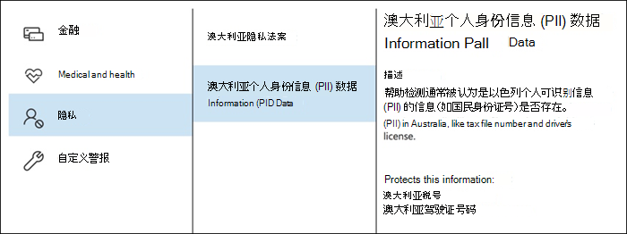

为新的 DLP 策略命名。 默认名称将匹配 DLP 策略模板，但您应该选择您自己的更具描述性的名称，因为可以从同一模板创建多个策略。

选择策略将应用于的位置。 DLP 策略可应用于 Exchange Online、SharePoint Online 和 OneDrive for Business。 我将保留此策略的配置，以应用于所有位置。

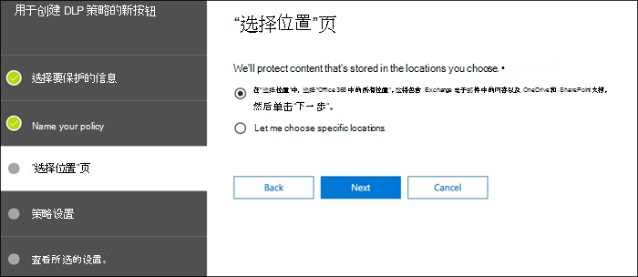

第一 **个策略设置** 步骤中，现在只需接受默认值。 您可以自定义 DLP 策略，但默认设置是一个开始的地方。

单击"下一步"后，**你将看到一个包含更多自定义 **选项的其他策略** 设置页。 对于你正在测试的策略，你可以在此处开始进行一些调整。

- 现在，我已关闭策略提示，如果你只是测试内容并且不想向用户显示任何内容，这是一个合理的步骤。 策略提示向用户显示即将违反 DLP 策略的警告。 例如，Outlook 用户会看到一条警告，指出他们附加的文件包含信用卡号，并且会导致其电子邮件被拒绝。 策略提示的目标是在不符合行为发生之前停止该行为。
- 我还将实例数从 10 个减少为 1 个，以便此策略将检测澳大利亚 PII 数据的任何共享，而不只是批量共享数据。
- 我还将另一个收件人添加到事件报告电子邮件中。

最后，我已将此策略配置为最初在测试模式下运行。 请注意，此处还有一个在测试模式下禁用策略提示的选项。 这样，你便能够灵活地在策略中启用策略提示，但在测试期间决定是显示还是禁止显示这些提示。

在最终审阅屏幕上，单击 **"创建** "以完成策略创建。

## 测试 DLP 策略

新的 DLP 策略将在大约 1 小时内开始生效。 你可以坐在一起等待正常用户活动触发它，也可以尝试自己触发它。 我之前链接到 [敏感信息类型实体定义](sensitive-information-type-entity-definitions.md)，该定义为您提供了如何触发 DLP 匹配的信息。

例如，我为本文创建的 DLP 策略将检测 TFN (澳大利亚) 。 根据文档，匹配基于以下条件。

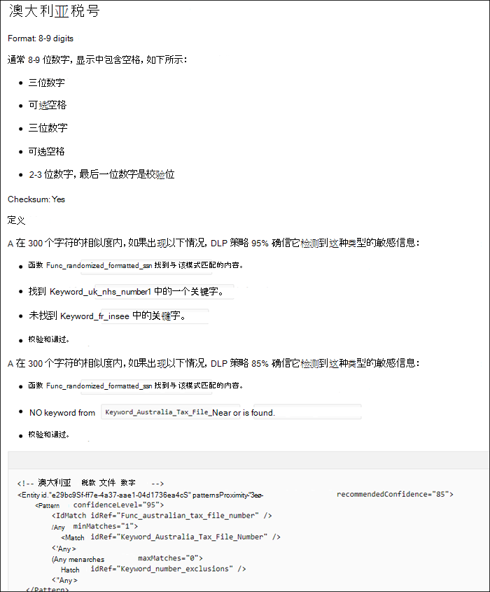
 
若要以相当好的方式演示 TFN 检测，单词为"Tax file number"且邻近位置为 9 位字符串的电子邮件将顺利浏览，而没有任何问题。 它不触发 DLP 策略的原因是，9 位字符串必须通过校验和，以指示它是有效的 TFN，而不只是一个无害的数字字符串。

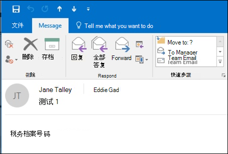

相比之下，包含单词"Tax file number"和通过校验和的有效 TFN 的电子邮件将触发策略。 对于此处的记录，我使用的 TFN 来自生成有效但并非正版 TFN 的网站。 此类网站非常有用，因为测试 DLP 策略时最常见的错误之一是使用 无效 的假号码，并且不会通过校验和 (因此不会触发策略) 。

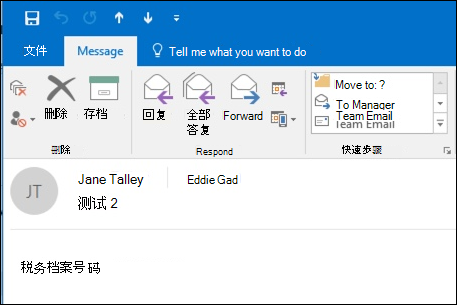

事件报告电子邮件包括检测到的敏感信息类型、检测到的实例数以及检测的可信度。

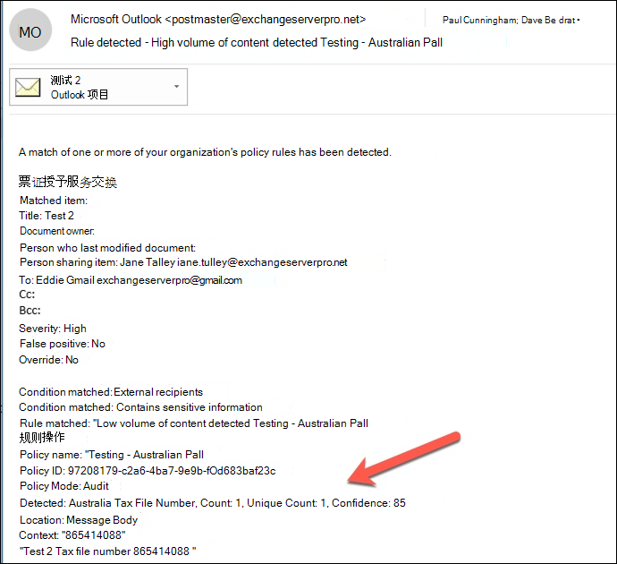

如果您将 DLP 策略保留为测试模式并分析事件报告电子邮件，您可以开始了解 DLP 策略的准确性以及策略在强制执行时的有效度。 除了事件报告之外，您还可以使用 [DLP](view-the-dlp-reports.md) 报告查看整个租户中的策略匹配项的聚合视图。

## 调整 DLP 策略

分析策略命中时，可能需要对策略的行为方式进行一些调整。 作为一个简单的示例，你可能会确定电子邮件中的一个 TFN 不是问题 (我认为它仍然存在，但为了演示) ，让我们继续操作，但两个或多个实例是一个问题。 多个实例可能是一个风险场景，例如员工通过电子邮件将 CSV 导出从 HR 数据库导出到外部方，例如外部会计服务。 当然，你更希望检测和阻止某些内容。

在安全&合规中心，可以编辑现有策略以调整行为。

 
您可以调整位置设置，以便策略仅应用于特定工作负荷或特定网站和帐户。

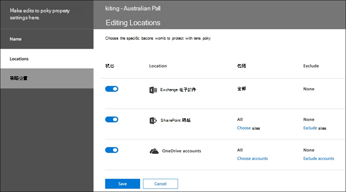

还可以调整策略设置并编辑规则，以更好地满足您的需求。

在 DLP 策略中编辑规则时，可以更改：

- 条件，包括将触发规则的敏感数据实例的类型和数量。
- 采取的操作，例如限制对内容的访问。
- 用户通知，这是在电子邮件客户端或 Web 浏览器中向用户显示的策略提示。
- 用户替代，确定用户是否可以选择继续其电子邮件或文件共享。
- 事件报告，以通知管理员。

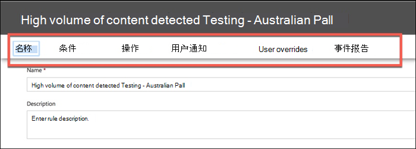

对于本演示，我向策略添加了用户通知 (注意这样做时没有适当的用户意识培训) ，并且允许用户使用业务理由或将策略标记为误报来替代策略。 请注意，如果要包含有关组织策略的其他任何信息，也可以自定义电子邮件和策略提示文本，或提示用户联系支持人员（如果他们有疑问）。

该策略包含用于处理高音量和低音量的两个规则，因此请务必使用您想要的操作编辑这两个规则。 这是根据其特征以不同方式处理案例的机会。 例如，你可能允许对低音量冲突进行覆盖，但不允许对高音量冲突进行覆盖。

此外，如果要实际阻止或限制对违反策略的内容的访问，则需要对规则配置操作以执行该操作。

将这些更改保存为策略设置后，我还需要返回到策略的主设置页面，并启用在策略在测试模式下向用户显示策略提示的选项。 这是向最终用户介绍 DLP 策略以及进行用户意识培训的有效方法，而不会冒太多影响其工作效率的误报的风险。

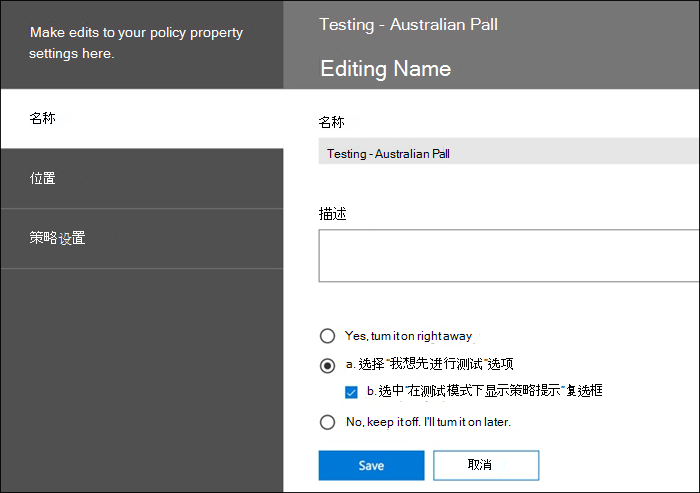

在服务器端 (或云端（如果您喜欢) ，由于处理间隔不同，更改可能不会立即生效。 如果要对向用户显示新策略提示的 DLP 策略更改，用户可能不会看到更改立即在 Outlook 客户端中生效，从而每 24 小时检查一次策略更改。 如果你想要加快测试速度，可以使用此注册表修补程序从 [PolicyNudges](https://support.microsoft.com/en-au/help/2823261/changes-to-a-data-loss-prevention-policy-don-t-take-effect-in-outlook?__hstc=18650278.46377037dc0a82baa8a30f0ef07a7b2f.1538687978676.1538693509953.1540315763430.3&__hssc=18650278.1.1540315763430&__hsfp=3446956451)项中清除最后一次下载时间戳。 下次重新启动 Outlook 并开始撰写电子邮件时，Outlook 将下载最新策略信息。

如果已启用策略提示，用户将开始在 Outlook 中看到这些提示，并且可以在出现误报时向用户报告误报。

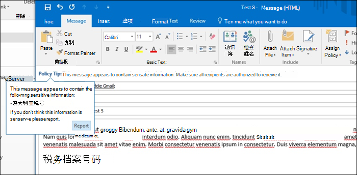

## 调查误报

DLP 策略模板并非完全开箱即用。 你很可能会发现环境中出现一些误报，这就是为什么简化 DLP 部署的方式非常重要的原因，因此请花时间充分测试和调整策略。

下面是误报的示例。 此电子邮件是无害的。 用户正在向某人提供其移动电话号码，并包括他们的电子邮件签名。

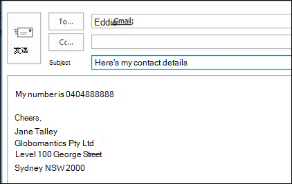
 
但用户会看到策略提示，警告他们电子邮件包含敏感信息，特别是澳大利亚驾驶证号码。

用户可以报告误报，管理员可以查看发生误报的原因。 在事件报告电子邮件中，电子邮件被标记为误报。

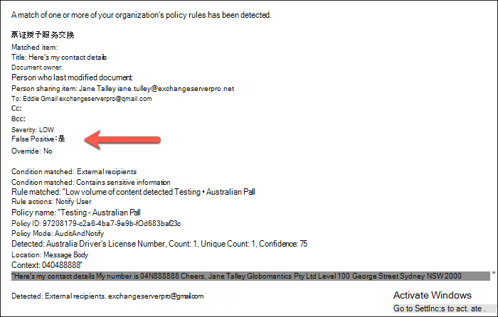

此驱动程序的许可证案例是一个很好的调查示例。 出现此误报的原因是，"澳大利亚驾驶证"类型将被任何 9 位字符串触发 (即使是 10 位字符串) 的一部分，与关键字") " (不区分大小写) 。 因此，它由电话号码和电子邮件签名触发，仅仅是因为用户恰好位于北京。

一个选项是从策略中删除澳大利亚驾驶证信息类型。 它是其中，因为它是 DLP 策略模板的一部分，但我们不强制使用它。 如果你只对税务文件编号感兴趣，而对驾驶证不感兴趣，你只需将其删除。 例如，你可以将其从策略中的低容量规则中删除，但将其保留为高音量规则，以便仍检测到多个驱动程序许可证的列表。

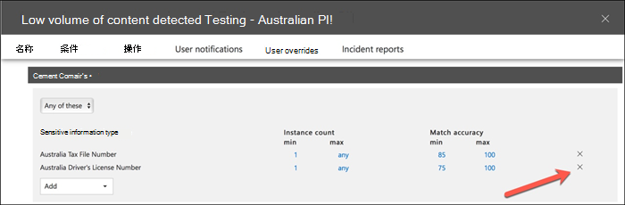
 
另一个选项是仅增加实例计数，以便仅在存在多个实例时检测到低容量的驱动程序许可证。

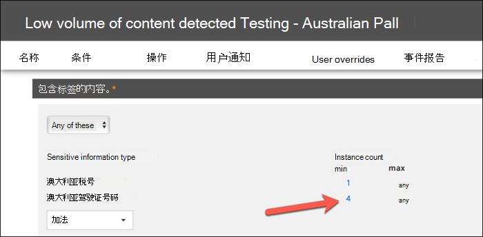

除了更改实例计数之外，还可以调整匹配准确度 (或置信水平) 。 如果敏感信息类型具有多个模式，可以在规则中调整匹配准确度，以便规则仅匹配特定模式。 例如，为了帮助减少误报，您可以设置规则的匹配准确度，以便它仅匹配具有最高可信度的模式。 了解可信度的计算方式有点复杂， (超出本文) 的范围，但下面对如何使用可信度调整规则有一个很好的 [解释](data-loss-prevention-policies.md#match-accuracy)。

最后，如果你希望更高级一点，可以自定义任何敏感信息类型，例如，可以从澳大利亚驾驶证号码的关键字列表中删除"为澳大利亚驾驶证号码的 NSW"，以消除上面触发的误报。 若要了解如何使用 XML 和 PowerShell 执行此操作，请参阅自定义 [内置敏感信息类型](customize-a-built-in-sensitive-information-type.md)。

## 打开 DLP 策略

当您对 DLP 策略准确有效地检测敏感信息类型以及最终用户准备好处理已制定的策略而满意时，您可以启用该策略。

 
如果正在等待策略何时生效，请连接到安全与合规中心 [PowerShell](https://docs.microsoft.com/powershell/exchange/connect-to-scc-powershell) &并运行 [Get-DlpCompliancePolicy cmdlet](https://docs.microsoft.com/powershell/module/exchange/get-dlpcompliancepolicy) 以查看 DistributionStatus。

启用 DLP 策略后，应自行运行一些最终测试，以确保发生预期的策略操作。 如果你尝试测试信用卡数据等内容，则有一些在线网站包含有关如何生成示例信用卡或其他个人信息的信息，这些信息将传递校验和并触发策略。

允许用户替代的策略将在策略提示中向用户显示该选项。

限制内容的策略将在策略提示中向用户显示警告，并阻止他们发送电子邮件。

## 摘要

数据丢失防护策略对于所有类型的组织都很有用。 测试某些 DLP 策略是一项低风险练习，因为您可以控制策略提示、最终用户替代和事件报告等内容。 您可以静默测试一些 DLP 策略，以查看组织中已经发生哪种类型的冲突，然后制定低误报率的策略，向用户了解允许和不允许的情况，然后将 DLP 策略推出给组织。
