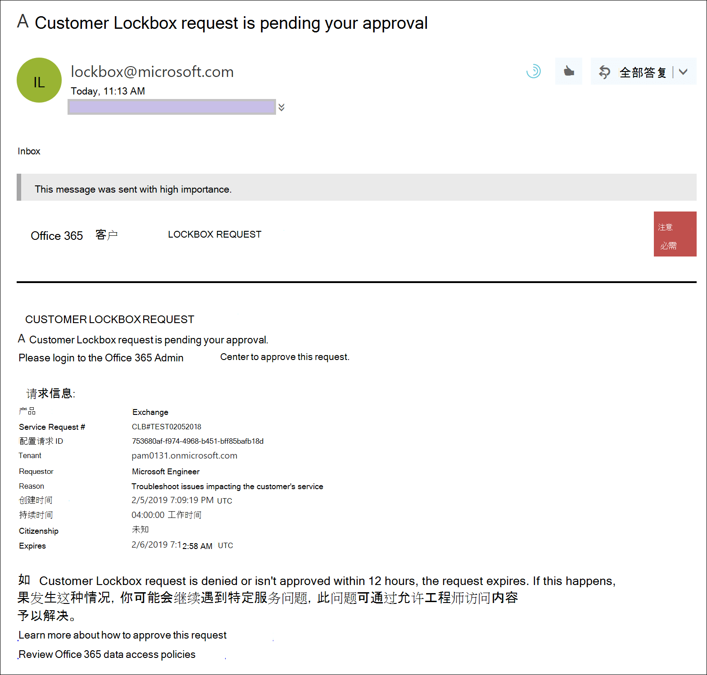
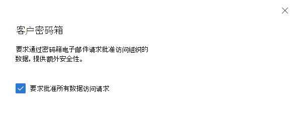
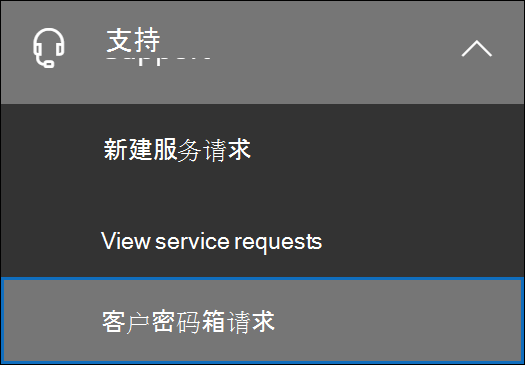
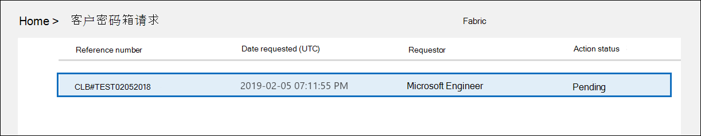
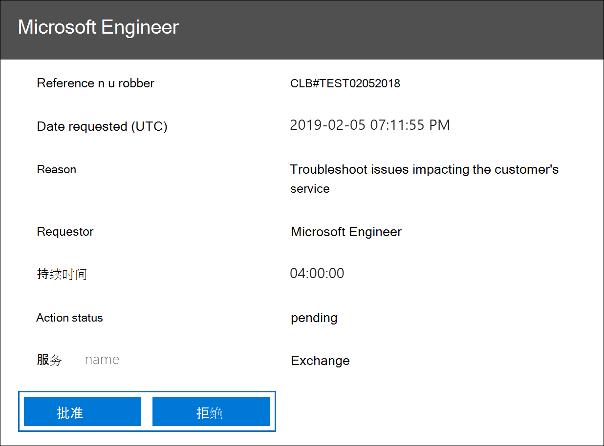
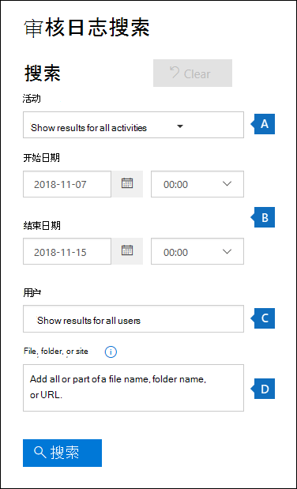
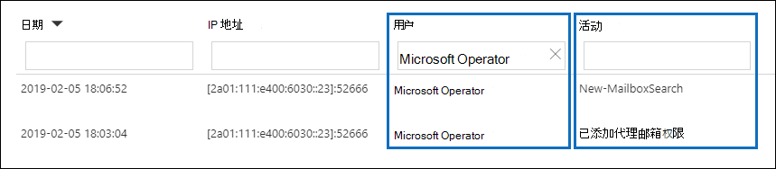
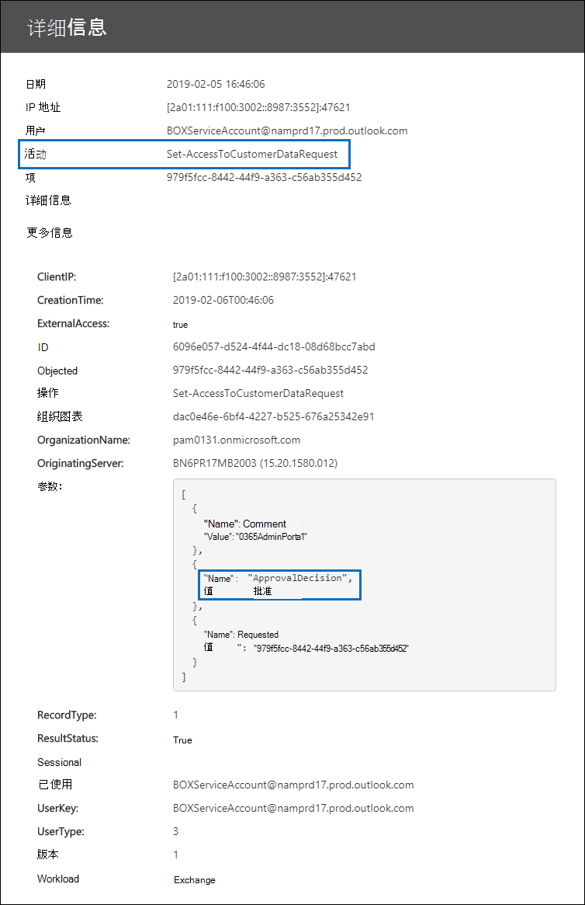

# <a name="customer-lockbox-in-office-365"></a>客户密码箱Office 365

本文提供客户密码箱的部署和配置指南。 客户密码箱支持访问 Exchange Online、SharePoint Online 和 OneDrive for Business 中数据的请求。 若要建议支持其他服务，请从[UserVoice Office 365提交请求](https://office365.uservoice.com/)。

若要了解授权用户从 Microsoft 365 产品/服务Microsoft 365的选项，请参阅安全与Microsoft 365[合规性&指南](/office365/servicedescriptions/microsoft-365-service-descriptions/microsoft-365-tenantlevel-services-licensing-guidance/microsoft-365-security-compliance-licensing-guidance)。

客户密码箱可确保未经你的明确批准，Microsoft 无法访问你的内容以执行服务操作。 客户密码箱可使你进入 Microsoft 用于确保仅授权请求允许访问你的内容的审批工作流流程。 若要了解有关 Microsoft 工作流过程的信息，请参阅[Privileged access management in Microsoft 365](privileged-access-management-solution-overview.md)。

有时，Microsoft 工程师可帮助解决和修复服务中出现的问题。 通常，工程师使用 Microsoft 已针对其服务提供了大量遥测和调试工具来修复问题。 但是，在某些情况下，需要 Microsoft 工程师访问您的内容，以确定根本原因并修复该问题。 客户密码箱要求工程师在审批工作流的最后一步请求你访问。 这样，您可以选择批准或拒绝组织请求，并提供对内容的直接访问控制。

### <a name="customer-lockbox-overview-video"></a>客户密码箱概述视频

> [!VIDEO https://www.microsoft.com/videoplayer/embed/8fecf10b-1f03-4849-8b67-76d3d2a43f26?autoplay=false]

## <a name="customer-lockbox-workflow"></a>客户密码箱工作流

这些步骤概述了 Microsoft 工程师启动客户密码箱请求时的典型工作流：

1. 组织中的某人在其 Microsoft 365 邮箱中遇到了问题。

2. 当用户排除了问题但无法解决后，就会向 Microsoft 支持部门打开支持请求。

3. Microsoft 支持工程师审查了该服务请求，并确定需要访问组织租户以修复 Exchange Online 中的问题。

4. Microsoft 支持工程师登录客户密码箱请求工具，提出数据访问请求，其中包括组织的租户名称、服务请求号和工程师需要访问数据的预计时间。

5. 在 Microsoft 支持部门经理批准该请求后，客户密码箱会向组织中指定的批准者发送一封关于 Microsoft 的未决访问请求电子邮件通知。

    

   分配了客户密码箱[访问](/office365/admin/add-users/about-admin-roles)审批者管理员角色的任何人都可以Microsoft 365 管理中心客户密码箱请求。

6. 审批者登录审批Microsoft 365 管理中心批准请求。 此步骤会触发创建审核记录，可通过搜索审核日志获得该审核记录。 有关详细信息，请参阅审核 [客户密码箱请求](#auditing-customer-lockbox-requests)。

   如果客户拒绝请求或者未在 12 小时内批准请求，该请求将过期，并且不会向 Microsoft 工程师授予任何访问权限。

   > [!IMPORTANT]
   > Microsoft 在客户密码箱电子邮件通知中不包含任何需要你登录到密码箱Office 365。

7. 来自组织的审批者批准该请求后，Microsoft 工程师将收到批准消息、在 Exchange Online 中登录到租户，并修复客户的问题。 Microsoft 工程师对修复这个问题有要求期限，之后访问将自动撤销。

> [!NOTE]
> Microsoft 工程师执行的所有操作都会记录在审计日志中。 你可以搜索和查看这些审核记录。

## <a name="turn-customer-lockbox-requests-on-or-off"></a>打开或关闭客户密码箱请求

你可以在 Microsoft 365 管理中心中启用客户密码箱控件。 当你打开客户密码箱时，Microsoft 必须在访问你的任何租户内容之前获得组织的批准。

1. 使用分配了全局管理员或客户密码箱访问审批者角色的工作或学校帐户，转到 [https://admin.microsoft.com](https://admin.microsoft.com) 并登录。

2. Choose **设置**  >  **Org 设置** Security &  >  <a href="https://go.microsoft.com/fwlink/p/?linkid=2072756" target="_blank">**Privacy**</a>.

3. 选择 **"&隐私**"，然后在左侧 **列中选择** "客户密码箱"。 选中 **"需要批准所有数据访问请求** "复选框，并保存更改以启用该功能。

    

## <a name="approve-or-deny-a-customer-lockbox-request"></a>批准或拒绝客户密码箱请求

1. 使用分配了全局管理员或客户密码箱访问审批者角色的工作或学校帐户，转到 [https://admin.microsoft.com](https://admin.microsoft.com) 并登录。

2. 选择 **"支持>客户密码箱请求"。**

    

    将显示客户密码箱请求列表。

    

3. 选择客户密码箱请求，然后选择 **批准或拒绝。** 

    

    将显示有关客户密码箱请求审批的确认消息。

    

> [!NOTE]
> 使用 Set-AccessToCustomerDataRequest cmdlet 批准、拒绝或取消 Microsoft 365 客户密码箱请求，以控制 Microsoft 支持工程师对你数据的访问权限。 有关详细信息，请参阅 [Set-AccessToCustomerDataRequest](/powershell/module/exchange/set-accesstocustomerdatarequest)。

## <a name="auditing-customer-lockbox-requests"></a>审核客户密码箱请求

客户密码箱请求对应的审核记录将记录在Microsoft 365 审核日志。 您可以使用搜索工具中的搜索审核日志[访问](search-the-audit-log-in-security-and-compliance.md)这些Microsoft 365 合规中心。 与接受或拒绝客户密码箱请求相关的操作以及 Microsoft 工程师 (访问请求获得批准时执行的操作) 也会记录在审核日志。 你可以搜索和查看这些审核记录。

### <a name="search-the-audit-log-for-activity-related-to-customer-lockbox-requests"></a>搜索审核日志客户密码箱请求相关的活动

在可以使用 审核日志 跟踪客户密码箱请求之前，需要执行一些步骤来设置审核日志记录，包括分配搜索邮箱审核日志。 有关详细信息，请参阅在中[设置基本Microsoft 365。](set-up-basic-audit.md) 完成设置后，使用以下步骤创建一个审核日志查询，以返回与客户密码箱相关的审核记录：

1. 转到 <https://compliance.microsoft.com>。
  
2. 使用已分配有相应权限的帐户登录，以搜索审核日志。

3. 在合规中心的左侧窗格中，选择"审核 **"。**

    将显示 **"** 审核" **页上的** "搜索"选项卡。

    
  
4. 配置以下搜索条件：

   1. **开始日期和****结束日期**。 选择日期和时间范围，以显示在这段时间内发生的事件。  

   2. **活动**。 将此字段留空，以便搜索返回所有活动的审核记录。 这是返回与客户密码箱请求和 Microsoft 工程师执行的相应活动相关的任何审核记录所必需的。

   3. **用户**。 将此字段留空。

   4. **文件、文件夹或网站**。 将此字段留空。

5. 单击“**搜索**”以使用搜索条件运行搜索。

    搜索结果将在片刻后显示。 在搜索完成之前，会向页面添加更多搜索结果。

6. 单击" **活动"列中** 的标题，根据"活动"列中的值按字母顺序 **对结果** 进行排序。

7. 向下滚动并查找具有 **Set-AccessToCustomerDataRequest** 活动的审核记录。 具有此活动的记录与组织中批准或拒绝客户密码箱请求的审批者相关。

8. 或者，单击"用户" **列中的标题，** 使用"用户"列中的值按字母顺序 **对** 结果进行排序。 查找 Microsoft **操作员 的值**，该值指示 Microsoft 工程师为响应批准的客户密码箱请求而执行的活动。 " **活动** "列显示工程师执行的操作。

      

9. 在结果列表中，单击审核记录以显示该记录。

### <a name="export-the-audit-log-search-results"></a>导出审核日志搜索结果

您还可以将 审核日志 搜索结果导出到 CSV 文件，然后在 Excel 中打开该文件以使用筛选和排序功能，以便更轻松地查找和查看与客户密码箱访问请求相关的审核记录。

若要导出审核记录，请使用前面的步骤搜索审核日志。 搜索完成后，选择"导出 **>"** 搜索结果页面顶部的"下载所有结果"。 导出过程完成后，您可以将 CSV 文件下载到本地计算机。 有关更详细的说明，请参阅导出 [、配置和查看审核日志记录](export-view-audit-log-records.md)。

下载文件后，可以在"操作"列中打开Excel然后筛选"操作"列以显示 **Set-AccessToCustomerDataRequest** 活动的审核记录。  您还可以使用值 **Microsoft Operator** (**UserIds** 列) 来显示 Microsoft 工程师执行的活动的审核记录。

> [!NOTE]
> 在 CSV 文件中查看审核记录时，其他信息包含在 **AuditData** 列中。 此列中的信息包含在 JSON 对象中，该对象包含多个配置为 *property：value* 对的属性，用逗号分隔。 您可以使用 Excel Power Query Editor 中的 JSON 转换功能将 **AuditData** 列的 JSON 对象中的每个属性拆分为多个列，以便每个属性都有自己的列。 这样更易于解释此信息。 有关详细说明，请参阅 Format [the exported 审核日志 using the Power Query Editor](export-view-audit-log-records.md#step-2-format-the-exported-audit-log-using-the-power-query-editor)。

### <a name="use-powershell-to-search-and-export-audit-records"></a>使用 PowerShell 搜索和导出审核记录

除了使用审核搜索工具外，Microsoft 365 合规中心在 PowerShell 中运行[Search-UnifiedAuditLog](/powershell/module/exchange/search-unifiedauditlog) cmdlet Exchange Online。 使用 PowerShell 的一个优点是，您可以专门搜索 **Set-AccessToCustomerDataRequest** 活动或由 Microsoft 工程师执行的与客户密码箱请求相关的活动。

连接到[PowerShell Exchange Online，](/powershell/exchange/connect-to-exchange-online-powershell)运行以下命令之一。 将占位符替换为特定的日期范围。

#### <a name="search-for-set-accesstocustomerdatarequest-activities"></a>搜索Set-AccessToCustomerDataRequest活动

```powershell
Search-UnifiedAuditLog -StartDate xx/xx/xxxx -EndDate xx/xx/xxxx -Operations Set-AccessToCustomerDataRequest
```

#### <a name="search-for-activities-performed-by-microsoft-engineers"></a>搜索 Microsoft 工程师执行的活动

```powershell
Search-UnifiedAuditLog -StartDate xx/xx/xxxx -EndDate xx/xx/xxxx -UserIds "Microsoft Operator"
```

有关详细信息和示例，请参阅使用 [PowerShell 搜索和导出审核日志记录](export-view-audit-log-records.md#use-powershell-to-search-and-export-audit-log-records)。

我们还提供了 PowerShell 脚本，可用于搜索审核日志结果导出到 CSV 文件。 有关详细信息，请参阅使用[PowerShell 脚本搜索审核日志。](audit-log-search-script.md)

### <a name="audit-record-for-a-customer-lockbox-request"></a>客户密码箱请求的审核记录

当组织人员批准或拒绝客户密码箱请求时，审核记录将记录在审核日志包含以下信息。

| 审核记录属性| 描述|
|:---------- |:----------|
| 日期       | 批准或拒绝客户密码箱请求的日期和时间。
| IP 地址 | 审批者用于批准或拒绝请求的计算机的 IP 地址。 |
| 用户       | 客户帐户BOXServiceAccount@ \[ \] .prod.outlook.com。            |
| 活动   | Set-AccessToCustomerDataRequest；这是批准或拒绝客户密码箱请求时记录的审核活动。                                |
| Item       | 客户密码箱请求的 Guid                             |

以下屏幕截图显示了与已批准的客户密码箱请求对应的审核记录示例。 如果客户密码箱请求被拒绝， **则 ApprovalDecision** 参数的值为 **Deny**。



### <a name="audit-record-for-an-action-performed-by-a-microsoft-engineer"></a>Microsoft 工程师执行的操作的审核记录

批准客户密码箱请求后，Microsoft 工程师执行的操作（可能导致访问客户内容）将记录在审核日志中。这些记录包含以下信息。

| 审核记录属性| 描述|
|:---------- |:----------|
| 日期       | 操作执行的日期时间。 执行此操作的时间将在客户密码箱请求得到批准后 4 小时内完成。              |
| IP 地址 | Microsoft 工程师使用的计算机的 IP 地址。 |
| 用户       | Microsoft 运算符;此值指示记录与客户密码箱请求相关。                                  |
| 活动   | Microsoft 工程师执行的活动的名称。|
| 项目       | \<empty\>                                             |

## <a name="frequently-asked-questions"></a>常见问题解答

#### <a name="which-microsoft-365-services-does-customer-lockbox-apply-to"></a>客户Microsoft 365适用于哪些服务？

客户密码箱当前在 Exchange Online、SharePoint Online 和 OneDrive for Business 中受支持。

#### <a name="is-customer-lockbox-available-to-all-customers"></a>客户密码箱是否可供所有客户使用？

客户密码箱包含在 Microsoft 365 或 Office 365 E5 订阅中，并且可以使用信息保护和合规性订阅或高级合规性附加订阅添加到其他计划中。 有关详细信息 [，请参阅计划和](https://products.office.com/business/office-365-enterprise-e5-business-software) 定价。

#### <a name="what-is-customer-content"></a>什么是客户内容？

客户内容是由服务和应用程序Microsoft 365创建的数据。 客户内容的示例包括：

- 电子邮件正文或电子邮件附件

- SharePoint 网站内容

- SharePoint 文件正文中的信息

- Skype for Business演示文稿文件正文

- 即时消息 (IM) 或语音对话

- 客户生成的 Blob 或结构化存储数据（例如 SQL 容器）

- 客户拥有的安全信息（例如证书、加密密钥和密码）

- 如果客户内容保留，则推断以及所有后续推断

有关客户中客户内容Office 365，请参阅Office 365[信任中心。](https://products.office.com/business/office-365-trust-center-privacy/)

#### <a name="who-is-notified-when-there-is-a-request-to-access-my-content"></a>Who请求访问我的内容时，是否收到通知？

将通知全局管理员和分配有客户密码箱访问审批者管理员角色的任何人。 这些用户也是可以批准客户密码箱请求的用户。

#### <a name="who-can-approve-or-reject-these-requests-in-my-organization"></a>Who我的组织中批准或拒绝这些请求吗？

全局管理员和分配有客户密码箱访问审批者管理员角色的任何人都可以批准客户密码箱请求。 客户控制其组织中这些角色分配。

#### <a name="how-do-i-opt-in-to-customer-lockbox"></a>如何选择加入客户密码箱？

全局管理员可以在"客户密码箱"或<a href="https://go.microsoft.com/fwlink/p/?linkid=2024339" target="_blank">Microsoft 365 Microsoft 365 管理中心。</a>

#### <a name="if-i-approve-a-customer-lockbox-request-what-can-the-engineer-do-and-how-will-i-know-what-the-microsoft-engineer-did"></a>如果我批准客户密码箱请求，工程师可以做什么，如何知道 Microsoft 工程师做什么？

批准客户密码箱请求后，Microsoft 工程师授予了使用预批准的 cmdlet 访问客户内容所需的权限。 Microsoft 工程师为响应客户密码箱请求而采取的操作将记录在安全与合规审核日志中&访问。

#### <a name="how-do-i-know-that-microsoft-follows-the-approval-process"></a>我如何知道 Microsoft 遵循审批流程？

可以使用客户密码箱请求历史记录交叉引用发送给组织中管理员和审批者的电子邮件审批[Microsoft 365 管理中心。](https://go.microsoft.com/fwlink/p/?linkid=2024339)

客户密码箱包含在最新的 [SOC 1 SSAE 16 审核报告中](https://servicetrust.microsoft.com/ViewPage/MSComplianceGuide?command=Download&downloadType=Document&downloadId=91592749-e86a-43ac-801e-121382614681&docTab=4ce99610-c9c0-11e7-8c2c-f908a777fa4d_SOC%20%2F%20SSAE%2016%20Reports)。 有关详细信息，可以在 Microsoft 服务信任门户 [中查找最新报告](https://servicetrust.microsoft.com/ViewPage/MSComplianceGuide?command=Download&downloadType=Document&downloadId=91592749-e86a-43ac-801e-121382614681&docTab=4ce99610-c9c0-11e7-8c2c-f908a777fa4d_SOC%20%2F%20SSAE%2016%20Reports)。

#### <a name="can-microsoft-modify-the-list-of-approvers-for-my-tenant-if-not-how-is-it-prevented"></a>Microsoft 能否修改我的租户的审批者列表？ 如果不是，如何阻止它？

只有贵组织的全局管理员可以指定谁可以批准客户密码箱请求。 这意味着只有全局管理员组的成员Azure Active Directory可以批准请求。 组织中全局管理员组的Azure Active Directory仅由您的组织管理。

#### <a name="what-if-i-need-more-information-about-a-content-access-request-to-approve-it"></a>如果我需要有关内容访问请求的更多信息来批准它，应该怎么做？

每个客户密码箱请求都包含一Microsoft 365服务请求编号。 可以联系 Microsoft 支持部门并参考此服务号码，获取有关请求详细信息。

#### <a name="when-a-customer-lockbox-request-is-approved-how-long-are-the-permissions-valid"></a>当客户密码箱请求得到批准时，权限的有效期是多久？

目前，Microsoft 工程师可获得访问权限的最长时间是 4 小时。Microsoft 工程师也可以要求更短的期限。

#### <a name="how-can-i-get-a-history-of-all-customer-lockbox-requests"></a>如何获取所有客户密码箱请求的历史记录？

所有客户密码箱请求都查看[在Microsoft 365 管理中心。](https://go.microsoft.com/fwlink/p/?linkid=2024339)

#### <a name="how-do-i-correlate-the-content-access-requests-with-the-related-audit-logs"></a>如何将内容访问请求与相关的审核日志关联？

合规性中心活动源包含客户密码箱的日志活动。 客户可以针对他们收到的电子邮件请求交叉引用活动源中的客户密码箱日志活动。

#### <a name="what-happens-when-a-customer-doesnt-respond-to-a-customer-lockbox-request"></a>当客户未响应客户密码箱请求时，会发生什么情况？

客户密码箱请求的默认持续时间为 12 小时。 如果在 12 小时内未响应请求，请求将过期。

#### <a name="what-does-microsoft-do-when-a-customer-rejects-a-customer-lockbox-request"></a>当客户拒绝客户密码箱请求时，Microsoft 会做什么？

如果客户拒绝客户密码箱请求，则不访问客户内容。 如果贵组织的用户继续遇到需要 Microsoft 访问客户内容才能解决问题的服务问题，则服务问题可能仍然存在，Microsoft 会通知用户此问题。

#### <a name="how-do-i-set-up-alerts-whenever-a-request-has-been-approved"></a>请求获得批准后如何设置警报？

没有向管理员发出警报的内置选项。 但是，管理员可以使用 [Microsoft Defender for Cloud Apps 设置警报](/cloud-app-security/getting-started-with-cloud-app-security#to-create-policies)。

#### <a name="does-customer-lockbox-protect-against-data-requests-from-law-enforcement-agencies-or-other-third-parties"></a>客户密码箱是否防止来自执法机构或其他第三方的数据请求？

不需要。 Microsoft 非常重视客户数据的第三方请求。 作为云服务提供商，Microsoft 始终宣传客户数据的隐私。 如果我们收到一个子请求，Microsoft 将始终尝试将第三方重定向到客户以获取信息。  (Brad Smith 的博客：保护客户数据免受 [政府](https://blogs.microsoft.com/blog/2013/12/04/protecting-customer-data-from-government-snooping/) 窥探) 。 我们定期 [发布有关](https://www.microsoft.com/corporate-responsibility/lerr) Microsoft 收到的执法机构请求的详细信息。

有关详细信息，[请参阅联机](https://www.microsoft.com/trustcenter/default.aspx)服务条款中有关第三方数据请求的 Microsoft 信任中心和"客户数据泄露"[](https://www.microsoft.com/Licensing/product-licensing/products.aspx)部分。

#### <a name="how-does-microsoft-ensure-that-a-member-of-its-staff-doesnt-have-standing-access-to-customer-content-in-office-365-applications"></a>Microsoft 如何确保其员工不会长期访问客户应用程序中Office 365内容？

Microsoft 通过访问控制系统和检测性措施实施广泛的预防措施，以识别和解决试图避开这些访问控制系统的尝试。 Microsoft 365遵循最小特权和实时访问原则。 因此，任何 Microsoft 人员都无权持续访问客户内容。 如果授予权限，则其持续时间有限。 

Microsoft 365使用称为 *"* 密码箱"的访问控制系统处理权限请求，这些权限授予在服务内执行操作和管理功能的能力。 操作员必须使用密码箱请求访问客户内容，然后要求第二个人对请求采取操作 (例如，在授予访问权限之前) 批准它。 第二个人不能是请求者，必须被指定为批准访问客户内容。 只有在请求得到批准后，操作员才能临时访问客户内容。 提升期到期后，密码箱将撤销访问权限。

有关 Microsoft [一](https://www.microsoft.com/licensing/product-licensing/products) 般安全实践的更多详细信息，请参阅联机服务条款。

#### <a name="under-what-circumstances-do-microsoft-engineers-need-access-to-my-content"></a>在什么情况下，Microsoft 工程师需要访问我的内容？

Microsoft 工程师需要访问客户内容的最常见情形是，客户提出需要访问进行疑难解答的支持请求。 服务的基本Microsoft 365是该服务在 Microsoft 不访问客户内容的情况下运行。 几乎所有由 Microsoft 执行的服务操作都完全自动化，并且人员参与受到高度控制，并且从客户内容中抽象。 客户Microsoft 365 Microsoft 访问的特定请求之前，不需要访问客户内容以支持服务。

#### <a name="i-already-thought-my-data-was-secure-with-the-microsoft-cloud-so-why-do-i-need-customer-lockbox"></a>我已经认为我的数据在 Microsoft 云中是安全的，那么为什么我需要客户密码箱？

客户密码箱通过为客户提供为服务操作提供显式访问授权的能力，提供了一层额外的控制。 通过证明针对显式数据访问授权已制定相关过程，客户密码箱还帮助客户履行某些合规性义务，如 HIPAA 和 FEDRAMP。
