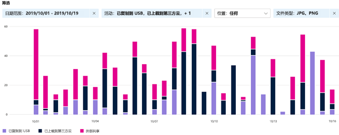
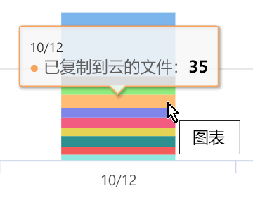
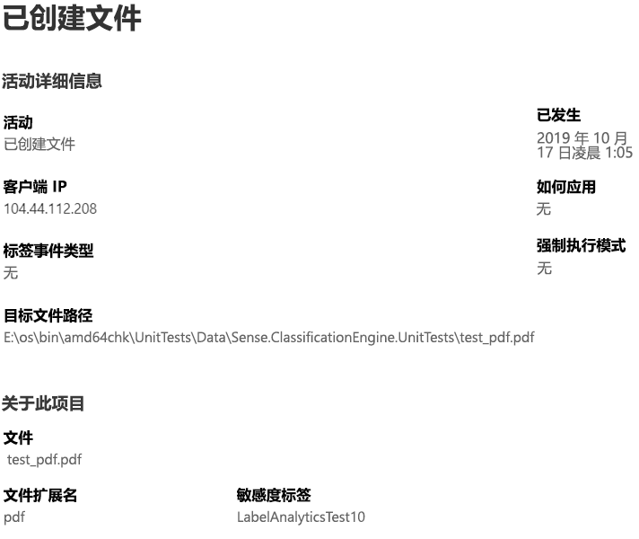

# 查看关于标记的内容的活动（预览版）

数据分类概述和内容浏览器选项卡使你可以查看已发现和已标记的内容以及该内容的位置。 活动资源管理器通过允许你监视对已标记内容所执行的操作来完善此功能套件。 活动资源管理器提供历史视图。

可通过以下方式筛选数据：

- 日期范围
- 活动类型
- 位置
- 用户
- 敏感度标签
- 保留标签

可以以列表或条形图的形式查看数据。

## 先决条件

访问和使用活动资源管理器的每个帐户，都必须拥有从以下之一订阅向其分配的许可证：

- Microsoft 365 (E5)
- Office 365 (E5)
- 高级合规性（E5）加载项
- 高级威胁智能（E5）加载项

## 活动类型

Microsoft 365 监视和报告跨 SharePoint Online、OneDrive 和终结点的 12 种活动类型。 终结点是运行 Windows 10 的用户设备。

- 已创建文件
- 已修改文件
- 已重命名文件
- 已复制到云的文件
- 不允许应用访问的文件
- 已打印的文件
- 已复制到可移动媒体的文件
- 已复制到网络共享的文件
- 已读文件
- 已复制到剪贴板的文件
- 已应用的标签
- 已更改（已升级、已降级或已删除）的标签

了解对敏感的已标记内容采取何种措施的价值在于，你可以查看已经实施的控件（例如[数据丢失防护策略](data-loss-prevention-policies.md)）是否有效。 如果无效，或者发现某项意外内容（如大量项目被标记为`highly confidential`并降级为`general`），则可管理各种策略并采取新操作来限制意外行为。

设置筛选器后，可以执行以下操作：

- 将鼠标悬停在条形图的某一部分，可查看属于该类别“”的项目数。
- 导出数据
- 从列表中选择任何给定项，并在弹出菜单中查看操作的详细信息

## 另请参阅
- [敏感度标签](sensitivity-labels.md)
- [保留标签](labels.md)
- [敏感信息类型查找的内容](what-the-sensitive-information-types-look-for.md)
- [保留策略概述](retention-policies.md)
