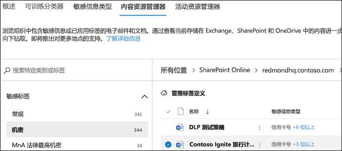
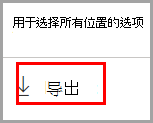
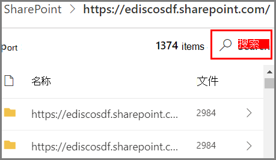

# 内容资源管理器入门

数据分类内容资源管理器可以在本机查看“概述”页上汇总的项目。

## 先决条件

有关许可要求，请参阅[信息保护：数据分类分析：通过内容和活动资源管理器](/office365/servicedescriptions/microsoft-365-service-descriptions/microsoft-365-tenantlevel-services-licensing-guidance/microsoft-365-security-compliance-licensing-guidance#information-protection-data-classification-analytics-overview-content--activity-explorer)

### 权限

若要访问“内容资源管理器”选项卡，必须在其中任一角色或角色组中向帐户分配成员身份。 

**Microsoft 365 角色组**

- 全局管理员
- 合规性管理员
- 安全管理员
- 合规性数据管理员

> [!IMPORTANT]
> 这些角色组中的成员身份不允许你查看内容资源管理器中项目的列表，或查看内容资源管理器中项目的内容。

> [!IMPORTANT]
> 只有全局管理员才能在合规中心管理或分配其他用户的权限。 有关详细信息，请参阅[授予用户访问安全与合规中心的权限](../security/office-365-security/grant-access-to-the-security-and-compliance-center.md)。
> 
### 在内容资源管理器中访问项目所需的权限

对内容资源管理器的访问权限受到高度限制，因为它允许你读取已扫描文件的内容。

> [!IMPORTANT]
> 这些权限会替代本地分配给项目的权限，后者允许查看内容。 

有两种角色可以授予对内容浏览器的访问权限，并且是使用 <a href="https://go.microsoft.com/fwlink/p/?linkid=2173597" target="_blank">Microsoft 安全与合规中心</a> 授予的：

- **内容资源浏览器列表查看器**：借助此角色组中的成员身份，可以在列表视图中查看每个项及其位置。`data classification list viewer` 角色已预先分配给此角色组。

- **内容浏览器内容查看器**：通过此角色组中的成员身份，可以查看列表中每个项的内容。已将 `data classification content viewer` 角色预分配给此角色组。

用于访问内容资源管理器的帐户必须具有其中一个或两个角色组。 这些角色组是独立角色组，不具有累积性。 例如，如果要向帐户授予仅查看项目及其位置的权限，则授予内容资源管理器列表查看器的权限。 如果你希望同一帐户也能够查看列表中项目的内容，另请授予内容资源管理器内容查看器权限。

你还可以将任一个角色或全部两个角色都分配到自定义角色组，以便对内容资源管理器的访问权限进行量身定制。

全局管理员可以分配必要的“内容资源管理器列表查看者”和“内容资源管理器内容查看者”角色组成员身份。

#### 预览版中的角色和角色组

预览版中有角色和角色组，你可以测试这些角色和角色组以微调访问控制。

下面是预览版中Microsoft 信息保护 （MIP） 角色的列表。 若要了解有关它们的详细信息，请参阅[安全与合规中心](../security/office-365-security/permissions-in-the-security-and-compliance-center.md#roles-in-the-security--compliance-center)中的角色

- 信息保护管理员
- 信息保护分析师
- 信息保护调查员
- 信息保护读者

下面是处于预览状态的 MIP 角色组的列表。 要了解详细信息，请参阅 [安全与合规中心中的角色组](../security/office-365-security/permissions-in-the-security-and-compliance-center.md#role-groups-in-the-security--compliance-center)

- 信息保护
- 信息保护管理员
- 信息保护分析师
- 信息保护调查员
- 信息保护读者

## 内容资源管理器

内容资源管理器可显示具有敏感度标签、保留标签或在你的组织中被归类为敏感信息类型的项目的当前快照。

### 敏感信息类型

[DLP 策略](dlp-learn-about-dlp.md)可帮助保护定义为 **敏感信息类型** 的敏感信息。 Microsoft 365 在多个不同区域包含[适用于众多常用敏感信息类型的定义](sensitive-information-type-entity-definitions.md)，它们随时可供使用。 例如，信用卡号、银行帐号、国民身份证号码和 Windows Live ID 服务编号。

### 敏感度标签

[灵敏度标签](sensitivity-labels.md)只是一个标记，指出项目对你的组织的价值。 该标签可手动应用，也可自动应用。 应用后，它将嵌入到文档中并始终保留在文档上。 可通过敏感度标签实现各种保护行为，例如强制水印或加密。

必须为 SharePoint 和 OneDrive 中的文件启用灵敏度标签，以使相应的数据出现在数据分类页面中。 有关详细信息，请参阅[启用 SharePoint 和 OneDrive 中 Office 文件的敏感度标签](sensitivity-labels-sharepoint-onedrive-files.md)。

### 保留标签

[保留标签](retention.md)可用于定义带标记的项目将保留多长时间以及删除项目前要采取哪些操作。 这些标签可手动应用，也可通过策略自动应用。 它们在帮助组织持续遵守法律法规要求方面发挥着作用。

### 如何使用内容资源管理器

1. 打开“**Microsoft 365 合规中心**”  > “**数据分类**” > “**内容资源管理器**”。
2. 如果知道标签的名称或敏感信息类型，可将其键入筛选框。
3. 或者，你可以通过展开标签类型并从列表中选择标签来浏览该项目。
4. 选择“**所有**”位置下的某个位置，然后向下钻取文件夹结构到该项目。
5. 双击以在本机上打开内容资源管理器中的项目。

### 导出
**导出** 控件将创建一个 .csv 文件，其中包含“**所有位置**”窗格中显示的所有内容的列表。

> [!NOTE]
> 最多可能需要 *七天* 时间才能在内容资源浏览器中更新计数。

### 搜索

向下钻取到某个位置（例如 Exchange 或 Teams 文件夹，或 SharePoint 或 OneDrive 网站）时，将显示 **搜索** 工具。

搜索工具的范围是“**所有位置**”窗格中显示的内容和可搜索的内容，具体取决于所选位置。 

如果所选位置为 **Exchange** 或 **Teams**，则可搜索邮箱的完整电子邮件地址，例如 `user@domainname.com`。

如果所选位置为 **SharePoint** 或 **OneDrive**，当你向下钻取到网站名称、文件夹和文件时，将显示搜索工具。 

可搜索：

|值|示例  |
|---------|---------|
|完整网站名称    |`https://contoso.onmicrosoft.com/sites/sitename`    |
|文件名    |    `RES_Resume_1234.txt`     |
|文件名开头的文本| `RES`|
|文件名中下划线字符 ( _ ) 后面的文本|`Resume` 或 `1234`| 
|文件扩展名|`txt`|

## 另请参阅

- [了解敏感度标签](sensitivity-labels.md)
- [了解保留策略和保留标签](retention.md)
- [敏感信息类型实体定义.md](sensitive-information-type-entity-definitions.md)
- [了解数据丢失防护](dlp-learn-about-dlp.md)
