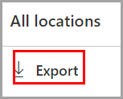
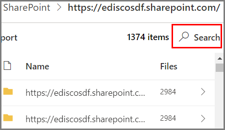

# 内容资源管理器入门Get started with content explorer

数据分类内容资源管理器可以在本机查看“概述”页上汇总的项目。The data classification content explorer allows you to natively view the items that were summarized on the overview page.

## 必备条件Prerequisites

访问和使用数据分类的每个帐户，都必须拥有从以下其中一个订阅向其分配的许可证：Every account that accesses and uses data classification must have a license assigned to it from one of these subscriptions:

- Microsoft 365 (E5)Microsoft 365 (E5)
- Office 365 (E5)Office 365 (E5)
- 高级合规性（E5）加载项Advanced Compliance (E5) add-on
- 高级威胁智能（E5）加载项Advanced Threat Intelligence (E5) add-on

### 权限Permissions

若要访问“内容资源管理器”选项卡，必须在其中任一角色或角色组中向帐户分配成员身份。In order to get access to the content explorer tab, an account must be assigned membership in any one of these roles or role groups. 

[DLP 策略](data-loss-prevention-policies.md)可帮助保护定义为**敏感信息类型**的敏感信息。A [DLP policy](data-loss-prevention-policies.md) can help protect sensitive information, which is defined as a **sensitive information type**. Microsoft 365 在多个不同区域包含[适用于众多常用敏感信息类型的定义](sensitive-information-type-entity-definitions.md)它们已准备就绪可供使用。Microsoft 365 includes [definitions for many common sensitive information types](sensitive-information-type-entity-definitions.md) across many different regions that are ready for you to use. 例如，信用卡号、银行帐号、国民身份证号码和 Windows Live ID 服务编号。For example, a credit card number, bank account numbers, national ID numbers, and Windows Live ID service numbers.

**Microsoft 365 角色组****Microsoft 365 role groups**

- 全局管理员Global administrator
- 合规性管理员Compliance administrator
- 安全管理员Security administrator
- 合规性数据管理员Compliance data administrator

> [!IMPORTANT]
> 这些角色组中的成员身份不允许你查看内容资源管理器中项目的列表，或查看内容资源管理器中项目的内容。Membership in these role groups does not allow you to view the list of items in content explorer or to view the contents of the items in content explorer.

### 在内容资源管理器中访问项目所需的权限Required permissions to access items in content explorer

对内容资源管理器的访问权限受到高度限制，因为它允许你读取已扫描文件的内容。Access to content explorer is highly restricted because it lets you read the contents of scanned files.

> [!IMPORTANT]
> 这些权限会替代本地分配给项目的权限，后者允许查看内容。These permissions supercede permissions that are locally assigned to the items, which allows viewing of the content. 

有两个角色可授予对内容资源管理器的访问权限：There are two roles that grant access to content explorer:

- **内容资源管理器列表查看员**：此角色组的成员资格允许你在列表视图中查看每个项目及其位置。**Content Explorer List viewer**: Membership in this role group allows you to see each item and its location in list view. 已为此角色组预分配 `data classification list viewer` 角色。The `data classification list viewer` role has been pre-assigned to this role group.

- **内容资源管理器内容查看器**：此角色组的成员资格允许你查看列表中每个项目的内容。**Content Explorer Content viewer**: Membership in this role group allows you to view the contents of each item in the list. 已为此角色组预分配 `data classification content viewer` 角色。The `data classification content viewer` role has been pre-assigned to this role group.

用于访问内容资源管理器的帐户必须具有其中一个或两个角色组。The account you use to access content explorer must be in one or both of the role groups. 这些角色组是独立角色组，不具有累积性。These are independent role groups and are not cumulative. 例如，如果要向帐户授予仅查看项目及其位置的权限，则授予内容资源管理器列表查看器的权限。For example, if you want to grant an account the ability to view the items and their locations only, grant Content Explorer List viewer rights. 如果你希望同一帐户也能够查看列表中项目的内容，另请授予内容资源管理器内容查看器权限。If you want that same account to also be able to view the contents of the items in the list, grant Content Explorer Content viewer rights as well.

你还可以将任一个角色或全部两个角色都分配到自定义角色组，以便对内容资源管理器的访问权限进行量身定制。You can also assign either or both of the roles to a custom role group to tailor access to content explorer.

全局管理员、合规性管理员或数据管理员可以分配必要的  内容资源管理器列表查看器  和  内容资源管理器内容查看器  角色组成员身份。A Global admin, Compliance admin, or Data admin can assign the necessary Content Explorer List Viewer, and Content Explorer Content Viewer role group membership.

## 内容资源管理器Content explorer

内容资源管理器可显示具有敏感度标签、保留标签或在你的组织中被归类为敏感信息类型的项目的当前快照。Content explorer shows a current snapshot of the items that have a sensitivity label, a retention label or have been classified as a sensitive information type in your organization.

### 敏感信息类型Sensitive information types

[DLP 策略](data-loss-prevention-policies.md)可帮助保护定义为**敏感信息类型**的敏感信息。A [DLP policy](data-loss-prevention-policies.md) can help protect sensitive information, which is defined as a **sensitive information type**. Microsoft 365 在多个不同区域包含[适用于众多常用敏感信息类型的定义](sensitive-information-type-entity-definitions.md)，它们随时可供使用。Microsoft 365 includes [definitions for many common sensitive information types](sensitive-information-type-entity-definitions.md) from across many different regions that are ready for you to use. 例如，信用卡号、银行帐号、国民身份证号码和 Windows Live ID 服务编号。For example, a credit card number, bank account numbers, national ID numbers, and Windows Live ID service numbers.

> [!NOTE]
> 内容资源管理器当前不会扫描 Exchange Online 中的敏感信息类型。Content explorer doesn't currently scan for sensitive information types in Exchange Online.

### 敏感度标签Sensitivity labels

[灵敏度标签](sensitivity-labels.md)只是一个标记，指出项目对你的组织的价值。A [sensitivity label](sensitivity-labels.md) is simply a tag that indicates the value of the item to your organization. 该标签可手动应用，也可自动应用。It can be applied manually, or automatically. 应用后，它将嵌入到文档中并始终保留在文档上。Once applied it gets embedded in the document and will follow it everywhere it goes. 可通过敏感度标签实现各种保护行为，例如强制水印或加密。A sensitivity label enables various protective behaviors, such as mandatory watermarking or encryption.

必须为 SharePoint 和 OneDrive 中的文件启用灵敏度标签，以使相应的数据出现在数据分类页面中。Sensitivity labels must be enabled for files that are in SharePoint and OneDrive in order for the corresponding data to surface in the data classification page. 有关详细信息，请参阅[启用 SharePoint 和 OneDrive 中 Office 文件的敏感度标签](sensitivity-labels-sharepoint-onedrive-files.md)。For more information, see [Enable sensitivity labels for Office files in SharePoint and OneDrive](sensitivity-labels-sharepoint-onedrive-files.md).

### 保留标签Retention labels

[保留标签](labels.md)可用于定义带标记的项目将保留多长时间以及删除项目前要采取哪些操作。A [retention label](labels.md) allows you to define how long a labeled item is kept and the steps to be taken prior to deleting it. 这些标签可手动应用，也可通过策略自动应用。They are applied manually or automatically via policies. 它们在帮助组织持续遵守法律法规要求方面发挥着作用。They can play a role in helping your organization stay in compliance with legal and regulatory requirements.

### 如何使用内容资源管理器How to use content explorer

1. 打开“**Microsoft 365 合规中心**”  > “**数据分类**” > “**内容资源管理器**”。Open **Microsoft 365 compliance center**  > **Data classification** > **Content explorer**.
2. 如果知道标签的名称或敏感信息类型，可将其键入筛选框。If you know the name of the label, or the sensitive information type, you can type that into the filter box.
3. 或者，你可以通过展开标签类型并从列表中选择标签来浏览该项目。Alternately, you can browse for the item by expanding the label type and selecting the label from the list.
4. 选择“**所有**”位置下的某个位置，然后向下钻取文件夹结构到该项目。Select a location under **All locations** and drill down the folder structure to the item.
5. 双击以在本机上打开内容资源管理器中的项目。Double-click to open the item natively in content explorer.

### 导出Export
**导出**控件将创建一个 .csv 文件，其中包含“**所有位置**”窗格中显示的所有内容的列表。The **export** control will create a .csv file that contains a listing of whatever is showing in the **All locations** pane.

### 搜索Search

向下钻取到某个位置（例如 Exchange 文件夹，或者 SharePoint 或 OneDrive 网站）时，将显示**搜索**工具。When you drill down into a location, such as an Exchange folder, or a SharePoint or OneDrive site, the **search** tool appears.

搜索工具的范围是“**所有位置**”窗格中显示的内容和可搜索的内容，具体取决于所选位置。The scope of the search tool is what is displaying in the **All locations** pane and what you can search on varies depending on the selected location. 

如果所选位置为 **Exchange**，则可搜索邮箱的完整电子邮件地址，例如 `user@domainname.com`。When **Exchange** is the selected location, you can search on the full email address of the mailbox, for example `user@domainname.com`.

如果所选位置为 **SharePoint** 或 **OneDrive**，当你向下钻取到网站名称、文件夹和文件时，将显示搜索工具。When either **SharePoint** or **OneDrive** are selected location, the search tool will appear when you drill down to site names, folders and files. 

> [!NOTE]
> **OneDrive** 我们在预览计划中听取了有关 OneDrive 集成的宝贵反馈。**OneDrive** We have listened to your valuable feedback on OneDrive integration during our preview program. 根据这些反馈，OneDrive 功能将保留在预览中，直到所有修补程序均已就位。Based on that feedback, the OneDrive functionality will remain in preview till all fixes are in place. 根据你的租户，某些客户可能无法将 OneDrive 视为位置。Depending on your tenant, some customers may not see OneDrive as a location. 非常感谢你在这方面的持续支持。We appreciate your continued support on this.

可搜索：You can search on:

|值value|示例example  |
|---------|---------|
|完整网站名称full site name    |`https://contoso.onmicrosoft.com/sites/sitename`    |
|根文件夹名称 - 获取所有子文件夹root folder name - gets all subfolders    | `/sites`        |
|文件名file name    |    `RES_Resume_1234.txt`     |
|文件名开头的文本text at the beginning of file name| `RES`|
|文件名中下划线字符 ( _ ) 后面的文本text after an underscore character ( _ ) in file name|`Resume` 或 `1234``Resume` or `1234`| 
|文件扩展名file extension|`txt`|

## 另请参阅See also

- [敏感度标签Sensitivity labels](sensitivity-labels.md)
- [保留标签Retention labels](labels.md)
- [敏感信息类型实体定义.mdSensitive information type entity definitions.md](sensitive-information-type-entity-definitions.md)
- [保留策略概述Overview of retention policies](retention-policies.md)
- [数据丢失防护概述Overview of data loss prevention](data-loss-prevention-policies.md)
