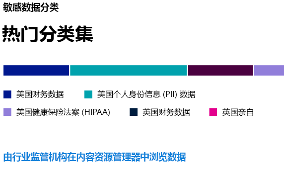
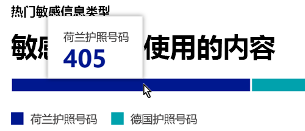
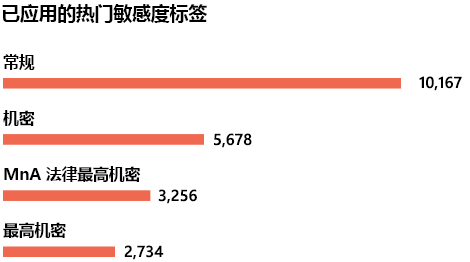
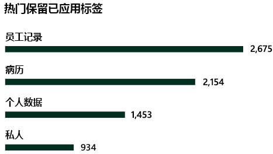

# 了解数据分类。

作为 Microsoft 365 管理员或合规性管理员，你可以评估并标记组织中的内容，以便控制其去向，随时随地提供保护，并确保根据组织的需要保留和删除该内容。 你可以通过应用[敏感度标签](sensitivity-labels.md)、[保留标签](retention.md#retention-labels)和敏感信息类型分类来实现这一目标。 可通过多种方法进行发现、评估和标记，但最终的结果是，你可能拥有大量的文档和电子邮件，它们使用其中一个或两个标签进行了标记和分类。 应用保留标签和敏感度标签后，你希望了解如何在租户中使用这些标签以及对这些项目所执行的操作。 数据分类页面提供了对内容主体的可见性，具体如下：

- 已分类为敏感信息类型的项目数量以及这些分类是什么
- Microsoft 365 和 Azure 信息保护中应用最多的敏感度标签
- 应用最多的保留标签
- 用户对敏感内容所执行的操作的摘要
- 敏感数据和已保留数据的位置

此外，还可在数据分类页面上管理以下功能：

- [可训练的分类器](classifier-learn-about.md)
- [敏感信息类型](sensitive-information-type-learn-about.md)
- [了解基于确切数据匹配的敏感信息类型](sit-learn-about-exact-data-match-based-sits.md#learn-about-exact-data-match-based-sensitive-information-types)
- [内容浏览器](data-classification-content-explorer.md)。
- [活动资源管理器](data-classification-activity-explorer.md)

你可以在 <a href="https://go.microsoft.com/fwlink/p/?linkid=2077149" target="_blank">Microsoft 365 合规中心</a>或 <a href="https://go.microsoft.com/fwlink/p/?linkid=2077139" target="_blank">Microsoft 365 Defender 门户</a> > “**分类**” > “**数据分类**”中找到数据分类。

获取介绍我们的数据分类功能的视频教程。

> [!VIDEO https://www.microsoft.com/videoplayer/embed/RE4vx8x]

创建任何策略前，数据分类将先扫描敏感内容和标记内容。 这称为 **零变更管理**。 这样，你就可以看到你环境中所有保留和灵敏度标签的影响，并使你能够开始评估你的保护和治理策略需求。

## 先决条件

### 权限

 为了访问数据分类页面，必须在以下任一角色或角色组中向帐户分配成员身份。

**Microsoft 365 角色组**

- 全局管理员
- 合规性管理员
- 安全管理员
- 合规性数据管理员

> [!NOTE]
> 最佳做法是始终使用特权最低的角色来授予对 Microsoft 365 数据分类的访问权限。

#### 预览版中的角色和角色组

预览版中有角色和角色组，你可以测试这些角色和角色组以微调访问控制。

下面是预览版中Microsoft 信息保护 （MIP） 角色的列表。 若要了解有关它们的详细信息，请参阅[安全与合规中心](../security/office-365-security/permissions-in-the-security-and-compliance-center.md#roles-in-the-security--compliance-center)中的角色

- 信息保护管理员
- 信息保护分析师
- 信息保护调查员
- 信息保护读者

下面是处于预览状态的 MIP 角色组的列表。 若要了解有关 的详细信息，请参阅[安全与合规中心](../security/office-365-security/permissions-in-the-security-and-compliance-center.md#role-groups-in-the-security--compliance-center)中的角色组

- 信息保护
- 信息保护管理员
- 信息保护分析师
- 信息保护调查员
- 信息保护读者

## 内容中的最常用敏感信息类型

Microsoft 365 附带了许多敏感信息类型的定义，例如包含社会安全号码或信用卡号的项目。 有关敏感信息类型的详细信息，请参阅[敏感信息类型实体定义](sensitive-information-type-entity-definitions.md)。

敏感信息类型卡片显示了在整个组织中找到并标记的最常用敏感信息类型。

要了解任何给定分类类别中的项目数量，请将鼠标悬停在该类别的栏上。

> [!NOTE]
> 如果卡片显示消息“找不到包含敏感信息的数据”，则表示你的组织中没有任何项目归类为敏感信息类型，也没有对任何项目进行爬网。要开始使用标签，请参阅：
>- [开始使用敏感度标签](get-started-with-sensitivity-labels.md)
>- [开始使用保留策略和保留标签](get-started-with-retention.md)
>- [敏感信息类型属性定义](sensitive-information-type-entity-definitions.md)

## 应用于内容的最常用敏感度标签

通过 Microsoft 365 或 Azure 信息保护 (AIP) 将敏感度标签应用于项目时，会出现两种情况：

- 指示项目对组织的价值的标记已嵌入到文档中，可随时随地进行跟踪。
- 可通过标记实现各种保护行为，例如强制性水印或加密。 如果启用了终结点保护，你甚至还可阻止项目脱离组织控制。

有关敏感度标签的详细信息，请参阅[了解敏感度标签](sensitivity-labels.md)。

必须为 SharePoint 和 OneDrive 中的文件启用灵敏度标签，以使相应的数据出现在数据分类页面中。 有关详细信息，请参阅[启用 SharePoint 和 OneDrive 中 Office 文件的敏感度标签](sensitivity-labels-sharepoint-onedrive-files.md)。

敏感度标签卡片按敏感度级别显示项目（电子邮件或文档）的数量。

> [!NOTE]
> 如果尚未创建或发布任何敏感度标签，或者任何内容均未应用敏感度标签，则此卡片将显示消息“未检测到任何敏感度标签”。若要开始使用敏感度标签，请参阅：
>- [开始使用敏感度标签](get-started-with-sensitivity-labels.md)或[配置 Azure 信息保护策略](/azure/information-protection/configure-policy)（对于 AIP）

## 应用于内容的最常用保留标签

保留标签用于管理组织中的内容的保留和处置方式。 应用后，它们可用于控制项目在删除之前的保留时间，是否应在删除之前对其进行评审，保留期何时到期以及是否应将其标记为记录。 有关详细信息，请参阅[了解保留策略和保留标签](retention.md)。

“应用最多的保留标签”卡片显示具有给定保留标签的项目数量。

> [!NOTE]
> 如果此卡片显示消息“未检测到任何保留标签”，则表示尚未创建或发布任何保留标签，或者任何内容均未应用保留标签。要开始使用保留标签，请参阅：
>- [开始使用保留策略和保留标签](get-started-with-retention.md)

## 检测到的热门活动

此卡片提供用户对具有敏感度标签的项目执行的最常见操作的快速摘要。 可使用[活动资源管理器](data-classification-activity-explorer.md)深入了解 Microsoft 365 对位于 Windows 10 终结点上标记的内容和内容的不同活动。

> [!NOTE]
> 如果此卡片显示消息“未检测到任何活动”，则表示未对文件执行任何操作，或者未启用用户和管理员审核功能。若要打开审核日志，请参阅：
>- [在安全与合规中心搜索审核日志](search-the-audit-log-in-security-and-compliance.md)

## 按位置列出的敏感度和保留标签数据

数据分类报告的重点是让用户了解具有标签的项目数量及其位置。 通过这些卡片，你可以了解在 Exchange、SharePoint 和 OneDrive 等应用中具有标签的项目数量。

> [!NOTE]
> 如果此卡片显示消息“未检测到任何位置”，则表示尚未创建或发布任何敏感度标签，或者任何内容均未应用保留标签。若要开始使用敏感度标签，请参阅：
>- [敏感度标签](sensitivity-labels.md)

## 公共预览版发行说明 

> [!NOTE]
> **Exchange 邮箱计数**：你会注意到，当深入了解 Exchange 邮箱时出现一个小的工具提示。 这是为了表明以下事实：敏感信息类型，敏感度标签和保留标签显示的合计计数可能与邮箱中找到的项目数不完全匹配。 这是因为深入了解文件夹时，将提取内容的实时视图（已分类），同时会计算总计数。用户即使略读也应注意到的信息

> [!NOTE]
> **加密文档的呈现**：已加密的 SharePoint、Exchange 和 OneDrive 文件不会在内容资源管理器中呈现。 这是一项敏感问题，需要在内容资源管理器中查看文件内容和将内容保持加密的需求之间取得平衡。 通过 **内容资源管理器列表查看器** 和 **内容资源管理器内容查看器** 角色组授予的权限，你将看到文件的列表视图、文件元数据和可用于通过 Web 客户端访问内容的链接。用户即使略读也应注意到的信息

> [!NOTE]
> **SharePoint 搜索中保留标签名称中受支持的字符**：SharePoint 搜索不支持包含 `-` 或 `_` 的保留标签名称。 例如，`Label-MIP` 和 `Label_MIP` 不受支持。 SharePoint 搜索支持敏感性标签名称和敏感信息类型名称中的这些字符。

> [!NOTE]
> **OneDrive 仍处于预览状态**：感谢你在我们的预览计划期间提供有关 OneDrive 集成的宝贵反馈。 随着我们处理具体的细节，你可能会遇到不一致的数据/流。 我们将继续展示 OneDrive 预览版，直到所有修补程序均准备就绪。 非常感谢你的持续支持。

## 另请参阅

- [查看标签活动](data-classification-activity-explorer.md)
- [查看带标签的内容](data-classification-content-explorer.md)
- [了解敏感度标签](sensitivity-labels.md)
- [了解保留策略和保留标签](retention.md)
- [了解敏感信息类型](sensitive-information-type-learn-about.md)
- [敏感信息类型属性定义](sensitive-information-type-entity-definitions.md)
- [了解可训练的分类器（预览版）](classifier-learn-about.md)

如需了解如何使用数据分类以遵守数据隐私法规，请参阅[使用 Microsoft 365 为数据隐私法规部署信息保护](../solutions/information-protection-deploy.md) (aka.ms/m365dataprivacy)。
