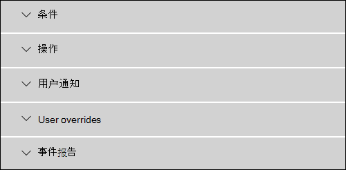
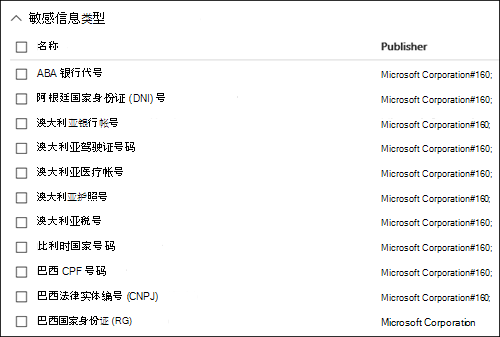
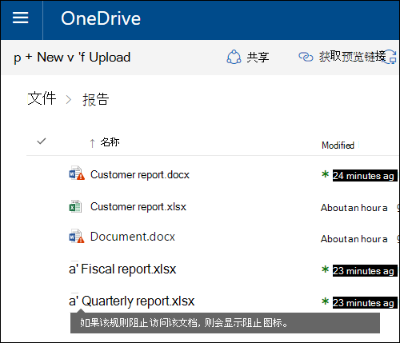
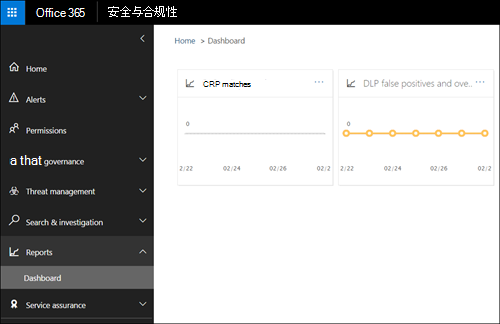

# 数据丢失防护参考

> [!IMPORTANT]
> This is reference topic is no longer the main resource for Microsoft 365 data loss prevention (DLP) information. DLP 内容集正在更新和重新构建。 本文中介绍的主题将移动到新的更新的文章。 有关 DLP 详细信息，请参阅 [了解数据丢失防护](dlp-learn-about-dlp.md)。

<!-- this topic needs to be split into smaller, more coherent ones. It is confusing as it is. -->
<!-- move this note to a more appropriate place, no topic should start with a note -->
> [!NOTE]
> 对于具有 Office 365 高级合规版许可证的用户，最近为 Microsoft Teams 聊天和频道消息添加了数据丢失防护功能。它是一种独立选项，包含在 Office 365 E5 和 Microsoft 365 E5 合规版中。 要详细了解许可要求，请参阅 [Microsoft 365 租户级服务许可指南](/office365/servicedescriptions/microsoft-365-service-descriptions/microsoft-365-tenantlevel-services-licensing-guidance)。

<!-- MOVED TO LEARN ABOUT To comply with business standards and industry regulations, organizations must protect sensitive information and prevent its inadvertent disclosure. Sensitive information can include financial data or personally identifiable information (PII) such as credit card numbers, social security numbers, or health records. With a data loss prevention (DLP) policy in the Office 365 Security &amp; Compliance Center, you can identify, monitor, and automatically protect sensitive information across Office 365.

With a DLP policy, you can:

- **Identify sensitive information across many locations, such as Exchange Online, SharePoint Online, OneDrive for Business, and Microsoft Teams.**

    For example, you can identify any document containing a credit card number that's stored in any OneDrive for Business site, or you can monitor just the OneDrive sites of specific people.

- **Prevent the accidental sharing of sensitive information**.

    For example, you can identify any document or email containing a health record that's shared with people outside your organization, and then automatically block access to that document or block the email from being sent.

- **Monitor and protect sensitive information in the desktop versions of Excel, PowerPoint, and Word.**

    Just like in Exchange Online, SharePoint Online, and OneDrive for Business, these Office desktop programs include the same capabilities to identify sensitive information and apply DLP policies. DLP provides continuous monitoring when people share content in these Office programs.

- **Help users learn how to stay compliant without interrupting their workflow.**

    You can educate your users about DLP policies and help them remain compliant without blocking their work. For example, if a user tries to share a document containing sensitive information, a DLP policy can both send them an email notification and show them a policy tip in the context of the document library that allows them to override the policy if they have a business justification. The same policy tips also appear in Outlook on the web, Outlook, Excel, PowerPoint, and Word.

- **View DLP alerts and reports showing content that matches your organization’s DLP policies.**

    To view alerts and metadata related to your DLP policies you can use the [DLP Alerts Management Dashboard](dlp-configure-view-alerts-policies.md). You can also view policy match reports to assess how your organization is complying with a DLP policy. If a DLP policy allows users to override a policy tip and report a false positive, you can also view what users have reported

-->
## 创建和管理 DLP 策略

你可在 Microsoft 365 安全合规中心的“数据丢失防护”页上创建和管理 DLP 策略。

<!-- MOVED TO LEARN ABOUT ## What a DLP policy contains

A DLP policy contains a few basic things:

- Where to protect the content: **locations** such as Exchange Online, SharePoint Online, and OneDrive for Business sites, as well as Microsoft Teams chat and channel messages.

- When and how to protect the content by enforcing **rules** comprised of:

  - **Conditions** the content must match before the rule is enforced. For example, a rule might be configured to look only for content containing Social Security numbers that's been shared with people outside your organization.

  - **Actions** that you want the rule to take automatically when content matching the conditions is found. For example, a rule might be configured to block access to a document and send both the user and compliance officer an email notification.

You can use a rule to meet a specific protection requirement, and then use a DLP policy to group together common protection requirements, such as all of the rules needed to comply with a specific regulation.

For example, you might have a DLP policy that helps you detect the presence of information subject to the Health Insurance Portability and Accountability Act (HIPAA). This DLP policy could help protect HIPAA data (the what) across all SharePoint Online sites and all OneDrive for Business sites (the where) by finding any document containing this sensitive information that's shared with people outside your organization (the conditions) and then blocking access to the document and sending a notification (the actions). These requirements are stored as individual rules and grouped together as a DLP policy to simplify management and reporting.

 -->

<!-- MOVED TO LEARN ABOUT ### Locations

DLP policies are applied to sensitive items across Microsoft 365 locations and can be further scoped as detailed in this table.

|Location | Include/exclude by|
|---------|---------|
|Exchange email| distribution groups|
|SharePoint sites |sites |
|OneDrive accounts |accounts |
|Teams chat and channel messages |accounts |
|Windows 10 devices |user or group |
|Microsoft Cloud App Security |instance |
 -->

<!-- moved to dlp-policy-reference.md
If you choose to include specific distribution groups in Exchange, the DLP policy will be scoped only to the members of that group. Similarly excluding a distribution group will exclude all the members of that distribution group from policy evaluation. You can choose to scope a policy to the members of distribution lists, dynamic distribution groups, and security groups. A DLP policy can contain no more than 50 such inclusions and exclusions.

If you choose to include or exclude specific SharePoint sites, a DLP policy can contain no more than 100 such inclusions and exclusions. Although this limit exists, you can exceed this limit by applying either an org-wide policy or a policy that applies to entire locations.

If you choose to include or exclude specific OneDrive accounts or groups, a DLP policy can contain no more than 100 user accounts or 50 groups as inclusion or exclusion.

### Rules

> [!NOTE]
> The default behavior of a DLP policy, when there is no alert configured, is not to alert or trigger. This applies only to default information types. For custom information types, the system will alert even if there is no action defined in the policy.

Rules are what enforce your business requirements on your organization's content. A policy contains one or more rules, and each rule consists of conditions and actions. For each rule, when the conditions are met, the actions are taken automatically. Rules are executed sequentially, starting with the highest-priority rule in each policy.

A rule also provides options to notify users (with policy tips and email notifications) and admins (with email incident reports) that content has matched the rule.

Here are the components of a rule, each explained below.

#### Conditions

Conditions are important because they determine what types of information you're looking for, and when to take an action. For example, you might choose to ignore content containing passport numbers unless the content contains more than 10 such numbers and is shared with people outside your organization.

Conditions focus on the **content**, such as what types of sensitive information you're looking for, and also on the **context**, such as who the document is shared with. You can use conditions to assign different actions to different risk levels. For example, sensitive content shared internally might be lower risk and require fewer actions than sensitive content shared with people outside the organization.

The conditions now available can determine if:

- Content contains a type of sensitive information.

- Content contains a label. For more information, see the below section [Using a retention label as a condition in a DLP policy](#using-a-retention-label-as-a-condition-in-a-dlp-policy).

- Content is shared with people outside or inside your organization.

  > [!NOTE]
  > Users who have non-guest accounts in a host organization's Active Directory or Azure Active Directory tenant are considered as people inside the organization.

#### Types of sensitive information

A DLP policy can help protect sensitive information, which is defined as a **sensitive information type**. Microsoft 365 includes definitions for many common sensitive information types across many different regions that are ready for you to use, such as a credit card number, bank account numbers, national ID numbers, and passport numbers.

When a DLP policy looks for a sensitive information type such as a credit card number, it doesn't simply look for a 16-digit number. Each sensitive information type is defined and detected by using a combination of:

- Keywords.

- Internal functions to validate checksums or composition.

- Evaluation of regular expressions to find pattern matches.

- Other content examination.

This helps DLP detection achieve a high degree of accuracy while reducing the number of false positives that can interrupt peoples' work.

#### Actions

When content matches a condition in a rule, you can apply actions to automatically protect the content.

With the actions now available, you can:

- **Restrict access to the content** Depending on your need, you can restrict access to content in three ways:

  1. Restrict access to content for everyone.
  2. Restrict access to content for people outside the organization.
  3. Restrict access to "Anyone with the link."

  For site content, this means that permissions for the document are restricted for everyone except the primary site collection administrator, document owner, and person who last modified the document. These people can remove the sensitive information from the document or take other remedial action. When the document is in compliance, the original permissions are automatically restored. When access to a document is blocked, the document appears with a special policy tip icon in the library on the site.

  

  For email content, this action blocks the message from being sent. Depending on how the DLP rule is configured, the sender sees an NDR or (if the rule uses a notification) a policy tip and/or email notification.

  

#### User notifications and user overrides

You can use notifications and overrides to educate your users about DLP policies and help them remain compliant without blocking their work. For example, if a user tries to share a document containing sensitive information, a DLP policy can both send them an email notification and show them a policy tip in the context of the document library that allows them to override the policy if they have a business justification.

The email can notify the person who sent, shared, or last modified the content and, for site content, the primary site collection administrator and document owner. In addition, you can add or remove whomever you choose from the email notification.

In addition to sending an email notification, a user notification displays a policy tip:

- In Outlook and Outlook on the web.

- For the document on a SharePoint Online or OneDrive for Business site.

- In Excel, PowerPoint, and Word, when the document is stored on a site included in a DLP policy.

The email notification and policy tip explain why content conflicts with a DLP policy. If you choose, the email notification and policy tip can allow users to override a rule by reporting a false positive or providing a business justification. This can help you educate users about your DLP policies and enforce them without preventing people from doing their work. Information about overrides and false positives is also logged for reporting (see below about the DLP reports) and included in the incident reports (next section), so that the compliance officer can regularly review this information.

Here's what a policy tip looks like in a OneDrive for Business account.

 To learn more about user notifications and policy tips in DLP policies, see [Use notifications and policy tips](use-notifications-and-policy-tips.md).

#### Alerts and Incident reports

When a rule is matched, you can send an alert email to your compliance officer (or any person(s) you choose) with details of the alert. This alert email will carry a link of the [DLP Alerts Management Dashboard](dlp-configure-view-alerts-policies.md) which the compliance officer can go to view the details of alert and events. The dashboard contains details of the event that triggered the alert along with details of the DLP policy matched and the sensitive content detected.

In addition, you can also send an incident report with details of the event. This report includes information about the item that was matched, the actual content that matched the rule, and the name of the person who last modified the content. For email messages, the report also includes as an attachment the original message that matches a DLP policy.

> [!div class="mx-imgBorder"]
> 

DLP scans email differently from items in SharePoint Online or OneDrive for Business. In SharePoint Online and OneDrive for Business, DLP scans existing items as well as new ones and generates an alert and incident report whenever a match is found. In Exchange Online, DLP only scans new email messages and generates a report if there is a policy match. DLP ***does not*** scan or match previously existing email items that are stored in a mailbox or archive.

## Grouping and logical operators

Often your DLP policy has a straightforward requirement, such as to identify all content that contains a U.S. Social Security Number. However, in other scenarios, your DLP policy might need to identify more loosely defined data.

For example, to identify content subject to the U.S. Health Insurance Act (HIPAA), you need to look for:

- Content that contains specific types of sensitive information, such as a U.S. Social Security Number or Drug Enforcement Agency (DEA) Number.

    AND

- Content that's more difficult to identify, such as communications about a patient's care or descriptions of medical services provided. Identifying this content requires matching keywords from very large keyword lists, such as the International Classification of Diseases (ICD-9-CM or ICD-10-CM).

You can easily identify such loosely defined data by using grouping and logical operators (AND, OR). When you create a DLP policy, you can:

- Group sensitive information types.

- Choose the logical operator between the sensitive information types within a group and between the groups themselves.

### Choosing the operator within a group

Within a group, you can choose whether any or all of the conditions in that group must be satisfied for the content to match the rule.

### Adding a group

You can quickly add a group, which can have its own conditions and operator within that group.

### Choosing the operator between groups

Between groups, you can choose whether the conditions in just one group or all of the groups must be satisfied for the content to match the rule.

For example, the built-in **U.S. HIPAA** policy has a rule that uses an **AND** operator between the groups so that it identifies content that contains:

- from the group **PII Identifiers** (at least one SSN number **OR** DEA number)

    **AND**

- from the group **Medical Terms** (at least one ICD-9-CM keyword **OR** ICD-10-CM keyword)

## The priority by which rules are processed

When you create rules in a policy, each rule is assigned a priority in the order in which it's created — meaning, the rule created first has first priority, the rule created second has second priority, and so on.

> [!div class="mx-imgBorder"]
> 

After you have set up more than one DLP policy, you can change the priority of one or more policies. To do that, select a policy, choose **Edit policy**, and use the **Priority** list to specify its priority.

> [!div class="mx-imgBorder"]
> 

When content is evaluated against rules, the rules are processed in priority order. If content matches multiple rules, the rules are processed in priority order and the most restrictive action is enforced. For example, if content matches all of the following rules, Rule 3 is enforced because it's the highest priority, most restrictive rule:

- Rule 1: only notifies users

- Rule 2: notifies users, restricts access, and allows user overrides

- Rule 3: notifies users, restricts access, and does not allow user overrides

- Rule 4: only notifies users

- Rule 5: restricts access

- Rule 6: notifies users, restricts access, and does not allow user overrides

In this example, note that matches for all of the rules are recorded in the audit logs and shown in the DLP reports, even though only the most restrictive rule is enforced.

Regarding policy tips, note that:

- Only the policy tip from the highest priority, most restrictive rule will be shown. For example, a policy tip from a rule that blocks access to content will be shown over a policy tip from a rule that simply sends a notification. This prevents people from seeing a cascade of policy tips.

- If the policy tips in the most restrictive rule allow people to override the rule, then overriding this rule also overrides any other rules that the content matched.

-->

## 调整规则，使它们更易或更难匹配

用户创建并启用 DLP 策略后，他们有时会遇到以下问题：

- 太多 **不是** 敏感信息的内容与规则匹配 — 也就是说，太多误报。

- 太少 **是** 敏感信息的内容与规则匹配。 也就是说，未对敏感信息强制执行保护操作。

若要解决这些问题，可以通过调整实例计数和匹配准确度来调整规则，使内容更难或更易匹配规则。 规则中使用的每一类敏感信息都有实例计数和匹配准确度。

### 实例计数

实例计数是指若要使内容与规则匹配，某类敏感信息必须出现的次数。 例如，如果将美国或英国护照号码标识为 1 到 9， 则内容将与如下所示的规则匹配。

> [!NOTE]
> 实例计数仅包括敏感信息类型和关键字的 **唯一** 匹配项。 例如，如果一个电子邮件中相同的信用卡号码出现了 10 次，则这 10 次计为信用卡号码的单个实例。

若要使用实例计数来调整规则，则指南非常简单：

- 若要使规则更易匹配，减少“**最小**”计数和/或增加“**最大**”计数。 也可以通过删除数值，将“**最大**”设置为“**任意**”。

- 若要使规则更难匹配，增加“**最小**”计数。

在实例计数较低（例如，1-9）的规则中，通常会使用较为宽松的操作，如发送用户通知。 在实例计数较高（例如，10–任意）的规则中，使用更严格的操作，如限制访问内容且不允许用户替代。

### 匹配准确度

如上文所述，使用不同类型的证据组合定义并检测敏感信息类型。 敏感信息类型通常由多个此类组合（称为模式）定义。 需要越少证据的模式匹配准确度（即置信水平）越低，而需要越多证据的模式匹配准确度（即置信水平）更高。 若要了解每种敏感信息类型使用的实际模式和置信水平，请参阅[敏感信息类型实体定义](sensitive-information-type-entity-definitions.md)。

例如，名为“信用卡号”的敏感信息类型由两种模式定义：

- 置信度为 65% 的模式需要：

  - 信用卡号格式的数字。

  - 传递校验和的数字。

- 置信度为 85% 的模式需要：

  - 信用卡号格式的数字。

  - 传递校验和的数字。

  - 格式正确的关键字或到期日期。

可在规则中使用这些置信水平（或匹配准确度）。 在匹配准确度较低的规则中通常使用较为宽松的操作，如发送用户通知。 在匹配准确度较高的规则中使用更严格的操作，如限制访问内容且不允许用户替代。

务必了解在内容中标识特定类型的敏感信息（如信用卡号）时，只会返回单个置信水平：

- 如果所有匹配项适用于单个模式，则返回该模式的置信水平。

- 如果存在多个模式的匹配项（即，存在具有两种不同置信水平的匹配项），则返回高于任一单个模式的置信水平。 这就是难点。 例如，对于信用卡号，如果同时匹配 65% 和 85% 模式，则该敏感信息类型返回的置信水平超过 90%，因为证据越多，置信度越高。

因此，如果要为信用卡创建两条互斥的规则，一条用于 65% 的匹配准确度，另一条用于 85% 的匹配准确度，匹配准确度的范围将如下所示。 第一条规则仅选取 65% 模式的匹配项。 第二条规则选取 **至少一个** 85% 匹配项，并且 **可能具有** 其他置信度较低的匹配项。

由于以上原因，使用不同的匹配准确性创建规则的指南为：

- 最低置信水平通常使用相同的“**最小**”和“**最大**”值（而不是范围）。

- 最高置信水平通常是一个范围，该范围为略高于置信水平下限到 100。

- 任何中间置信水平范围通常为略高于置信水平下限，略低于置信水平上限。

## 将保留标签用作 DLP 策略中的条件

将以前创建和发布的[保留标签](retention.md#retention-labels)用作 DLP 策略中的条件时，请注意以下事项：

- 必须先创建和发布保留标签，然后才能尝试将它用作 DLP 策略中的条件。
- 已发布的保留标签可能需要一到七天的时间才能同步。有关详细信息，请参阅[当保留标签可应用时](create-apply-retention-labels.md#when-retention-labels-become-available-to-apply)（对于已在保留策略中发布的保留标签），以及[保留标签多长时间生效](apply-retention-labels-automatically.md#how-long-it-takes-for-retention-labels-to-take-effect)（对于已自动发布的保留标签）。
- **只有 SharePoint 和 OneDrive 中的项才支持***在策略中使用保留标签。

  

  如果你有项目处于保留和处置状态，并且还希望为其应用其他控件，则可能需要在 DLP 策略中使用保留标签，例如：

  - 你发布了一个名为“**2018 纳税年度**”的保留标签，当它应用于存储在 SharePoint 中的 2018 年税务文档后，系统会将其保留 10 年，并在此期限后处置它们。 你也不希望在组织外部共享这些项目，你可以使用 DLP 策略来完成此操作。

  > [!IMPORTANT]
  > 如果在 DLP 策略中将保留标签指定为条件，而且你还包含 Exchange 和/或 Teams 作为位置，则你将收到以下错误：**“不支持保护电子邮件和团队消息中带标签的内容。请删除下述标签或取消将 Exchange 和 Teams 设为位置。”** 这是因为 Exchange 传输在消息提交和传递过程中不会评估标签元数据。

### 使用敏感度标签作为在DLP策略中的条件

[详细了解](./dlp-sensitivity-label-as-condition.md) 在 DLP 策略中将敏感度标签用作条件。

### 此功能与其他功能的联系

可对包含敏感信息的内容应用多个功能：

- [保留标签和保留策略](retention.md)都可以对此内容强制执行 **保留** 操作。

- DLP 策略可对此内容执行 **保护** 操作。 执行这些操作之前，DLP 策略可要求内容除包含标签之外还需满足其他条件。

请注意，相较于对敏感信息应用的标签或保留策略，DLP 策略的检测功能更强。 DLP 策略可以对包含敏感信息的内容执行保护操作；从内容中删除敏感信息之后，这些保护操作会在下一次扫描内容时撤消。 但如果对包含敏感信息的内容应用了保留策略或标签，则该操作是一次性操作，即使删除了敏感信息也不会撤消该操作。

在 DLP 策略中使用标签作为条件之后，可对包含该标签的内容执行保留和保护操作。 可将带标签的内容完全视为包含敏感信息的内容；标签和敏感信息类型都是用于对内容进行分类的属性，以便对该内容执行操作。

## 简单设置与高级设置

创建 DLP 策略时，将在简单或高级设置中进行选择：

- **简单设置**，可轻松创建最常见类型的 DLP 策略，无需使用规则编辑器创建或修改规则。

- **高级设置**，使用规则编辑器，让使用者可完全控制 DLP 策略的每个设置。

不要担心，实际上简单设置和高级设置的工作方式完全相同，都是强制执行由条件和操作组成的规则，只是使用简单设置时，看不到规则编辑器。 这是快速创建 DLP 策略的方法。

### 简单设置

到目前为止，最常见的 DLP 方案是创建策略，帮助保护含敏感信息的内容，防止与组织外人员共享该内容，并采取自动补救措施，例如限制可访问内容的人员、向最终用户或管理员发送通知、对事件进行审核以备后续调查。 人们使用 DLP 防止意外泄露敏感信息。

为轻松实现这一目标，创建 DLP 策略时，可选择 **使用简单设置**。 这些设置可提供实现最常见 DLP 策略所需的一切，无需使用规则编辑器。

### 高级设置

如需创建自定义程度更高的 DLP 策略，可选择 **使用高级设置**。

高级设置会显示规则编辑器，可通过它完全控制每个可能的选项，包括每个规则的实例计数和匹配准确度（可信度级别）。

若要快速跳转到某一部分，请单击规则编辑器顶部导航中的项，转到下面的部分。

## DLP 策略模板

创建 DLP 策略的第一步是选择要保护的内容。 从 DLP 模板开始创建，无需从头构建一组新规则，无需指出默认应包含哪些信息类型。 然后即可添加或修改这些要求，微调规则以满足组织的特定要求。

预配置的 DLP 策略模板可帮助你检测特定类型的敏感信息，如 HIPAA 数据、PCI-DSS 数据、格雷姆-里奇-比利雷法案数据，甚至是特定区域设置的个人身份信息 (P.I.)。 要使你能够轻松地查找和保护常见类型的敏感信息，包含在 Microsoft 365 中的策略模板已包含你要开始构建策略所需的最常见的敏感信息类型。

组织可能还有自己特定的要求，在这种情况下可通过选择“**自定义策略**”选项从头创建 DLP 策略。 自定义策略为空，且不包含任何预制定的规则。

<!-- ## Roll out DLP policies gradually with test mode

rehomed to Plan for DLP

When you create your DLP policies, you should consider rolling them out gradually to assess their impact and test their effectiveness before fully enforcing them. For example, you don't want a new DLP policy to unintentionally block access to thousands of documents that people require access to in order to get their work done.

If you're creating DLP policies with a large potential impact, we recommend following this sequence:

1. **Start in test mode without Policy Tips** and then use the DLP reports and any incident reports to assess the impact. You can use DLP reports to view the number, location, type, and severity of policy matches. Based on the results, you can fine tune the rules as needed. In test mode, DLP policies will not impact the productivity of people working in your organization.

2. **Move to Test mode with notifications and Policy Tips** so that you can begin to teach users about your compliance policies and prepare them for the rules that are going to be applied. At this stage, you can also ask users to report false positives so that you can further refine the rules.

3. **Start full enforcement on the policies** so that the actions in the rules are applied and the content's protected. Continue to monitor the DLP reports and any incident reports or notifications to make sure that the results are what you intend.

    

    You can turn off a DLP policy at any time, which affects all rules in the policy. However, each rule can also be turned off individually by toggling its status in the rule editor.

    

    You can also change the priority of multiple rules in a policy. To do that, open a policy for editing. In a row for a rule, choose the ellipses (**...**), and then choose an option, such as **Move down** or **Bring to last**.

    > [!div class="mx-imgBorder"]
    > -->

## DLP 报告

创建并启用 DLP 策略后，你会希望验证这些策略是否按预期工作，以及是否有助于保持合规性。 使用 DLP 报告，您可以快速查看随着时间的推移 DLP 策略和规则匹配的次数，以及误报和替代数。 对于每个报告，您都可以按位置、时间范围，甚至缩小为特定的策略、规则或操作来筛选这些匹配项。

使用 DLP 报告，您可以获取业务见解并了解以下内容：

- 重点关注特定的时间段，并了解峰值和发展趋势的原因。

- 发现违反贵组织的合规性策略的业务流程。

- 了解 DLP 策略的任何业务影响。

此外，您可以使用 DLP 报告在运行时微调您的 DLP 策略。

## DLP 策略的工作原理

DLP 使用深入内容分析（而不仅仅是简单的文本扫描）来检测敏感信息。这种深入内容分析使用关键字匹配、字典匹配、正则表达式评估、内部函数以及其他方法来检测匹配 DLP 策略的内容。您的数据中可能只有一小部分数据被视为敏感数据。DLP 策略可以只识别、监视和自动保护那些敏感数据，而不会妨碍或影响处理您的内容的其余部分的人员。

### 策略会进行同步

在安全 &amp; 合规中心创建 DLP 策略后，它将存储在中心策略存储中，然后同步到各种内容源，其中包括：

- Exchange Online，并从它同步到 Outlook 网页版和 Outlook。

- OneDrive for Business 网站。

- SharePoint Online 网站。

- Office 桌面程序（Excel、PowerPoint 和 Word）。

- Microsoft Teams 频道和聊天消息。

该策略同步到正确的位置后，它将开始评估内容并强制执行操作。
<!-- what is the time delay for first deployment of a policy and what is the sync schedule? -->

### OneDrive for Business 和 SharePoint Online 站点中的策略评估

文档在你的所有 SharePoint Online 站点和 OneDrive for Business 站点中会不断更改，用户会持续对文档执行创建、编辑、共享等操作。 这意味着文档可能随时会与 DLP 策略发生冲突，或变为合规状态。 例如，一个用户上载的文档可能不包含与团队站点相关的敏感信息，但之后，另一个客户可能会编辑同一文档，并向文档添加了敏感信息。

为此，DLP 策略经常检查后台中是否包含与策略相符的文档。您可以将这视为异步策略评估。<!-- what is the frequency? looks like it is tied to the search crawl schedule -->

#### 运作方式

在用户添加或更改其站点中的文档时，搜索引擎会扫描内容，以便你稍后对其进行搜索。 同时，还对此内容进行敏感信息扫描，以检查是否进行过共享。 找到的任何敏感信息都安全地存储在搜索索引中，以便仅供合规性团队而不是典型用户进行访问。 已启用的每个 DLP 策略在后台（异步）运行，它会经常检查搜索中是否包含与某个策略相符的内容，并应用操作以防止由于疏忽而导致泄漏。

<!-- conflict with a DLP policy is bad wording --> 最后，文档可能与 DLP 策略相冲突，但也可能符合 DLP 策略。例如，如果用户将信用卡号添加到文档，可能会导致 DLP 策略自动阻止对该文档的访问。但是，如果该用户稍后删除此敏感信息，则下一次根据此策略对此文档进行评估时，该操作（在这种情况下，阻止操作）将自动撤消。

DLP 评估可编制索引的任何内容。 有关默认的爬网文件类型的详细信息，请参阅 [SharePoint Server 中的默认爬网文件扩展名和分析文件类型](/SharePoint/technical-reference/default-crawled-file-name-extensions-and-parsed-file-types)。

> [!NOTE]
> 为了防止在 DLP 策略有机会分析文档之前共享文档，可阻止在 SharePoint 中共享新文件，直到对其内容编制索引。 有关详细信息，请参阅[默认情况下，将新文件标记为敏感](/sharepoint/sensitive-by-default)。

### Exchange Online、Outlook 和 Outlook 网页版中的策略评估

当创建一个将 Exchange Online 包含为位置的 DLP 策略时，系统会将策略从 Office 365 安全 &amp; 合规中心同步到 Exchange Online，然后从 Exchange Online 同步到 Outlook 网页版和 Outlook。

在 Outlook 中撰写消息时，会显示策略提示，因为会根据 DLP 策略对创建的内容进行评估。 邮件发送后，会根据 DLP 策略评估邮件流的正常部分，以及 Exchange 邮件流规则 (也称为传输规则) 和在<a href="https://go.microsoft.com/fwlink/p/?linkid=2059104" target="_blank">Exchange</a>管理中心中创建的 DLP 策略。 DLP 策略会扫描邮件及其所有附件。

### Office 桌面程序中的策略评估

<!-- same capability to identify sensitive information line conflates sensitive information types and such -->
Excel、PowerPoint 和 Word 包含相同的功能，可像 SharePoint Online 和 OneDrive for Business 一样识别敏感信息和应用 DLP 策略。 这些 Office 程序直接从中心策略存储同步其 DLP 策略，然后在用户处理从包含在 DLP 策略中的网站打开的文档时，不断根据 DLP 策略对内容进行评估。

Office 中的 DLP 策略评估旨在不对程序的性能或处理内容的用户的工作效率产生任何影响。 如果他们正在处理大型文档，或用户的计算机正忙，可能需要几秒钟才能显示策略提示。

### Microsoft Teams 中的策略评估
 <!--what do you mean that it's synched to user accounts?  I thought DLP policies were applied to locations not users like sensitivity labels are  -->

当创建一个将 Microsoft Teams 包含为位置的 DLP 策略时，系统会将策略从 Office 365 安全 &amp; 合规中心同步到用户帐户和 Microsoft Teams 频道和聊天消息。 根据 DLP 策略的配置方式，当某人尝试在 Microsoft Teams 聊天或频道消息中共享敏感信息时，可以阻止或撤消该消息。 并且，这些用户将无法打开包含敏感信息以及与来宾（外部用户）共享的文档。 若要了解详细信息，请参阅[数据丢失防护和 Microsoft Teams](dlp-microsoft-teams.md)。

## 权限

默认情况下，全局管理员、安全管理员和合规性管理员将有权访问创建和应用 DLP 策略。 创建 DLP 策略的合规性团队的其他成员需要安全与合规中心 &amp; 的权限。 默认情况下，租户管理员有权访问此位置，并可以授予合规部官员和其他人员对安全与合规中心的访问权限，而不授予租户管理员 &amp; 的所有权限。为此，我们建议您：

1. 在 Microsoft 365 中创建组并向其添加合规部主管。

2. 在安全 &amp; 合规中心的“**权限**”页面上创建一个角色组。

3. 创建角色组时，使用“**选择角色**”部分向角色组添加以下角色：**DLP 合规性管理**。

4. 使用“**选择成员**”部分，将先前创建的 Microsoft 365 组添加到角色组中。

此外，还可通过授予“**仅查看 DLP 合规性管理**”角色，创建对 DLP 策略和 DLP 报告具有仅查看权限的角色组。

有关详细信息，请访问[向用户授予对 Office 365 合规中心的访问权限](../security/office-365-security/grant-access-to-the-security-and-compliance-center.md)。

只有在创建和应用 DLP 策略时才需要这些权限。强制执行策略不需要访问此内容。

## 查找 DLP cmdlet

若要使用安全 &amp; 合规中心的大多数 cmdlet，你需要执行以下操作：

1. [使用远程 PowerShell 连接到 Office 365 安全与合规中心](/powershell/exchange/connect-to-scc-powershell)。

2. 使用任一 [policy-and-compliance-dlp cmdlet](/powershell/module/exchange/export-dlppolicycollection)。

但是，DLP 报告需要从 Microsoft 365（包括 Exchange Online）提取数据。 因此，**可以在 Exchange Online Powershell 中使用 DLP 报告的 cmdlet，而不能在安全 &amp; 合规中心 Powershell 中使用**。 因此，若要使用适用于 DLP 报告的 cmdlet，你需要执行以下操作：

1. [使用远程 PowerShell 连接到 Exchange Online](/powershell/exchange/connect-to-exchange-online-powershell)。

2. 对 DLP 报告使用以下任意 cmdlet：

    - [Get-DlpDetectionsReport](/powershell/module/exchange/Get-DlpDetectionsReport)

    - [Get-DlpDetailReport](/powershell/module/exchange/Get-DlpDetailReport)

## 更多信息

- [从模板创建 DLP 策略](create-a-dlp-policy-from-a-template.md)

- [发送通知，并显示 DLP 策略的策略提示](use-notifications-and-policy-tips.md)

- [创建 DLP 策略来保护具有 FCI 或其他属性的文档](protect-documents-that-have-fci-or-other-properties.md)

- [DLP 策略模板包含的内容](what-the-dlp-policy-templates-include.md)

- [敏感信息类型属性定义](sensitive-information-type-entity-definitions.md)

- [DLP 函数查找什么](what-the-dlp-functions-look-for.md)

- [创建自定义敏感信息类型](create-a-custom-sensitive-information-type.md)
