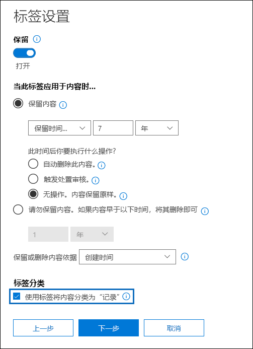

# <a name="declare-records-by-using-retention-labels"></a>使用保留标签声明记录

>*[Microsoft 365 安全性与合规性许可指南](/office365/servicedescriptions/microsoft-365-service-descriptions/microsoft-365-tenantlevel-services-licensing-guidance/microsoft-365-security-compliance-licensing-guidance)。*

如需将文档和电子邮件声明为 [记录](records-management.md#records)，请使用 [保留标签](retention.md#retention-labels) 将内容标记为 **记录** 或 **合规性记录**。

如果不确定要使用记录还是合规性记录，请参阅[允许或禁止行为的对比限制](records-management.md#compare-restrictions-for-what-actions-are-allowed-or-blocked)。 如果需要使用合规性记录，必须首先运行 PowerShell 命令，如下一节中所述。

然后，你可以将这些标签发布到保留标签策略中，以便用户和管理员可将其应用到内容，或将项目标记为记录（而不是合规性记录）的标签，将这些标签自动应用到你想要声明记录的内容。

## <a name="how-to-display-the-option-to-mark-content-as-a-regulatory-record"></a>如何显示将内容标记为合规性记录的选项

> [!NOTE]
> 以下过程是可审核的操作，在审核日志的 [保留策略和保留标签活动](search-the-audit-log-in-security-and-compliance.md#retention-policy-and-retention-label-activities)部分中，记录 **为保留标签启用的合规性记录选项**。

默认情况下，保留标签向导中不显示用于将内容标记为合规性记录的保留标签选项。 如需显示此选项，须首先运行 PowerShell 命令：

1. [连接到 Office 365 安全与合规中心 Powershell](/powershell/exchange/office-365-scc/connect-to-scc-powershell/connect-to-scc-powershell)。

2. 运行以下 cmdlet：

    ```powershell
    Set-RegulatoryComplianceUI -Enabled $true
    ````

    系统不会提示你进行确认，并且设置会立即生效。

如果你想改变保留标签向导中有关查看此选项的设置，可通过运行相同的 cmdlet 和 **false** 值来将其再次隐藏： `Set-RegulatoryComplianceUI -Enabled $false`

## <a name="configuring-retention-labels-to-declare-records"></a>配置保留标签以声明记录

从 Microsoft 365 合规中心的 **记录管理** 解决方案中创建保留标签时，可选择将项目标记为记录。 如果按照上一节运行 PowerShell 命令，可将项目标记为合规性记录。

例如：



根据需要，将保留标签应用于 SharePoint 或 OneDrive 文档和 Exchange 电子邮件。

有关完整说明：

- [创建保留标签并在应用中应用它们](create-apply-retention-labels.md)

- [将保留标签自动应用到内容](apply-retention-labels-automatically.md) （不支持合规性记录）

## <a name="tenant-setting-for-editing-record-properties"></a>用于编辑记录属性的租户设置

如果使用保留标签将项目声明为 SharePoint 和 OneDrive 中的记录（而不是监管记录），请考虑是否需要更改默认租户设置，该设置允许用户在文件大于 0 字节时编辑[锁定记录](record-versioning.md)的属性。

若要更改此默认设置，请转到“[Microsoft 365 合规中心](https://compliance.microsoft.com/)” > “**记录管理**” > “**记录管理设置**” > “**保留标签**” > “**允许编辑记录属性**”，然后关闭“**允许用户编辑记录属性**”设置。

## <a name="applying-the-configured-retention-label-to-content"></a>将已配置保留标签应用到内容

当将项目标记为记录或合规性记录的保留标签可供用户在应用程序中应用时：

- 对于 Exchange，任何拥有邮箱写入权限的用户均可应用这些标签。
- 对于 SharePoint 和 OneDrive，默认“成员”组（“参与”权限级别）中的任何用户均可应用这些标签。

使用保留标签标记为记录的文档示例：


## <a name="searching-the-audit-log-for-labeled-items-that-were-declared-records"></a>搜索审核日志以查找已声明记录的标签项

审核日志中记录标记以声明项目作为记录的操作。

对于 SharePoint 项目：
- 从 **文件和页面活动**，选择 **已更改文件的保留标签**。 此审核事件用于将项目标记为记录、法规记录或标准保留标签。

对于 Exchange 项目：
- 从 **Exchange 邮箱活动中**，选择 **已标记的消息作为记录**。 此审核事件适用于将项目标记为记录或法规记录的保留标签。

有关搜索这些事件详细信息，请参阅 [安全与合规中心中搜索审核日志](search-the-audit-log-in-security-and-compliance.md#file-and-page-activities)。

## <a name="next-steps"></a>后续步骤

了解如何使用[记录版本控制来更新存储在 SharePoint 或 OneDrive 中的记录](record-versioning.md)。