# 部署连接器以存档 Facebook 业务页面数据

本文包含部署连接器的分步过程，该连接器使用 Office 365 导入服务将数据从 Facebook 业务页面导入Microsoft 365。 有关此过程的简要概述以及部署 Facebook 连接器所需的先决条件列表，请参阅设置连接器以存档 Facebook [数据](archive-facebook-data-with-sample-connector.md)。

## 步骤 1：在 Azure Active Directory

1. 转到 <https://portal.azure.com> ，然后使用全局管理员帐户的凭据登录。

    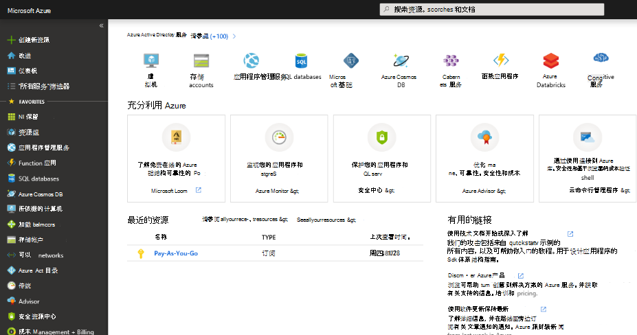

2. 在左侧导航窗格中，单击 **Azure Active Directory**。

    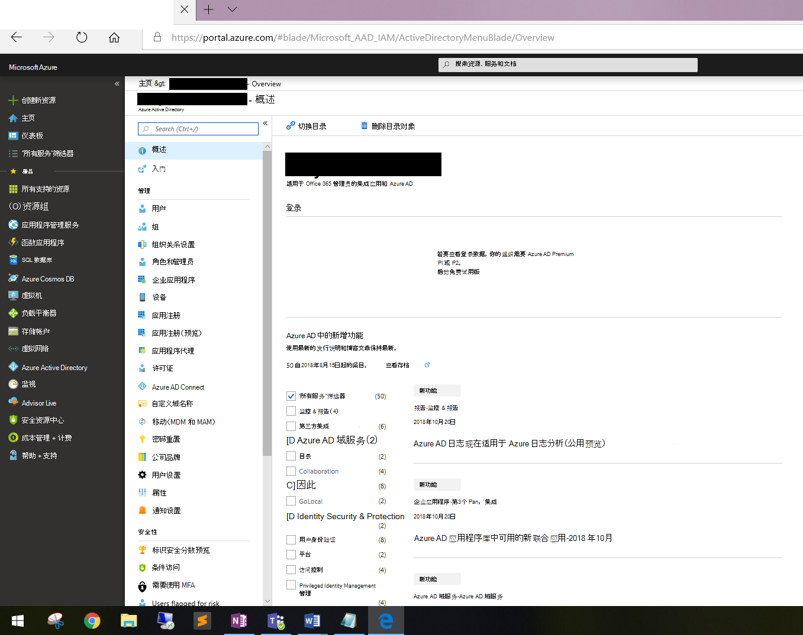

3. 在左侧导航窗格中，单击"应用注册 (**预览**) 然后单击"新建 **注册"。**

    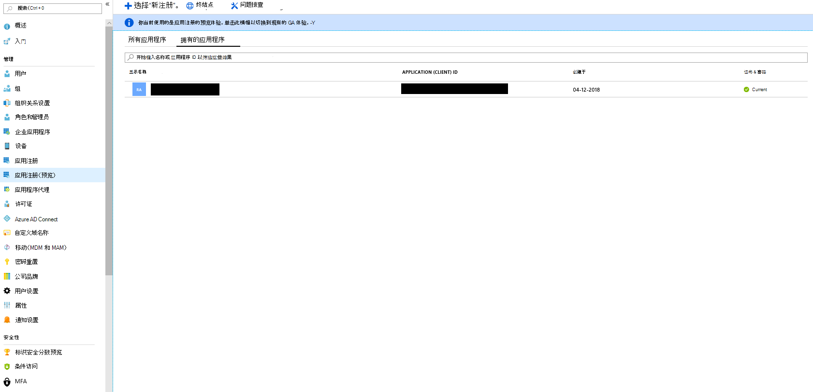

4. 注册应用程序。 在"重定向 URI"下，选择"应用程序类型"下拉列表中的"Web"，然后在框中键入 <https://portal.azure.com> URI。

   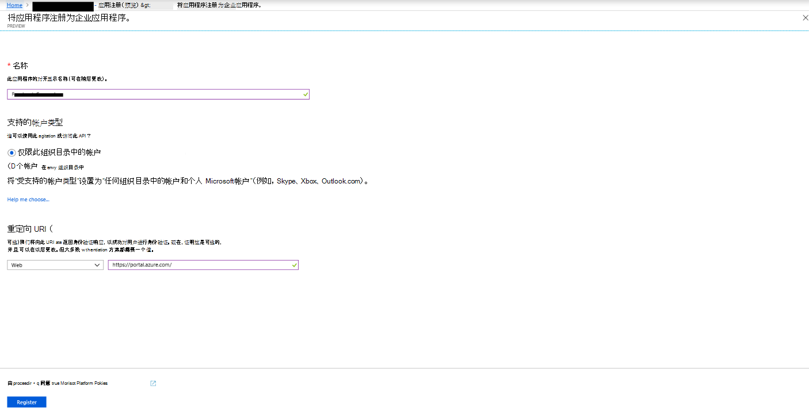

5. 复制 **应用程序 (客户端) ID (** Directory) **ID，** 并将其保存到文本文件或其他安全位置。 在稍后的步骤中使用这些 ID。

   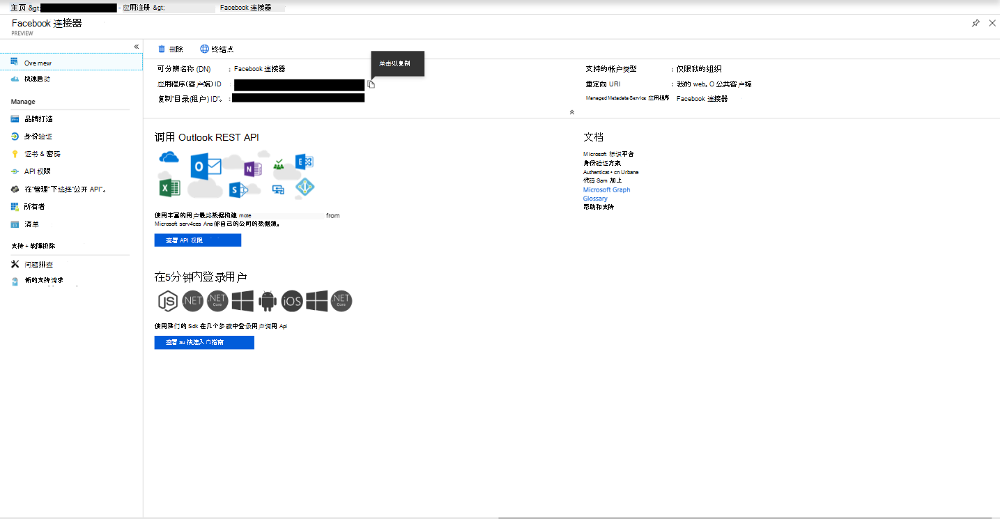

6. 转到 **"&新应用的密钥"。**

   

7. 单击 **"新建客户端密码"**

   

8. 创建新密码。 在说明框中，键入密码，然后选择过期期限。

    

9. 复制密码的值并将其保存到文本文件或其他存储位置。 这是在稍后的步骤中使用的 AAD 应用程序密码。

   

## 步骤 2：将连接器 Web 服务从 GitHub部署到 Azure 帐户

1. 转到此 [GitHub 站点，](https://github.com/microsoft/m365-sample-connector-csharp-aspnet)然后单击 **"部署到 Azure"。**

    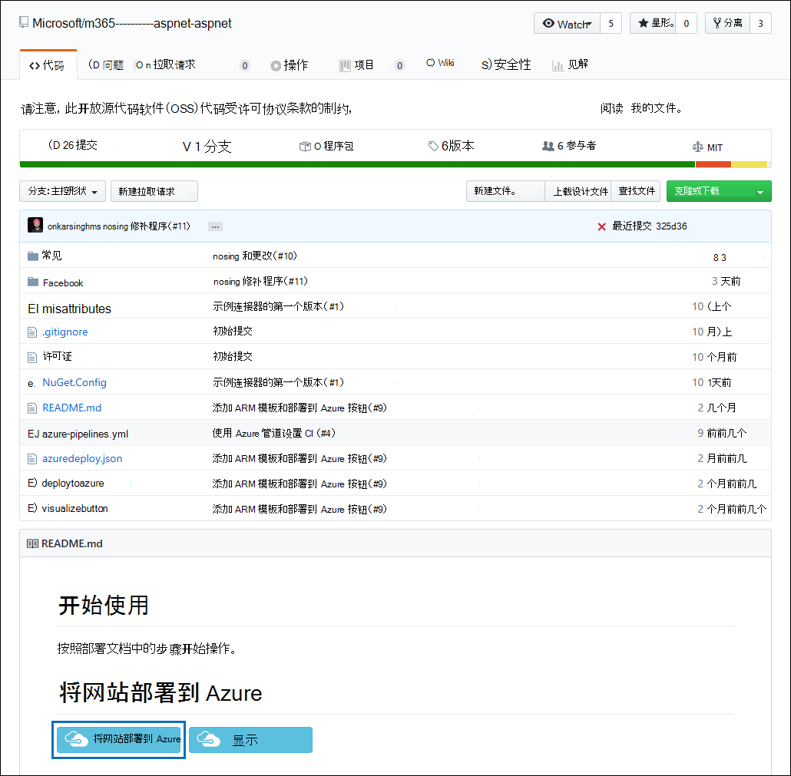

2. 单击" **部署到 Azure"** 后，你将重定向到包含自定义模板页面的 Azure 门户。 填写基本 **信息并****设置详细信息**，**然后单击购买。**

   - **订阅：** 选择要将 Facebook 业务页面连接器 Web 服务部署到的 Azure 订阅。

   - **资源组：** 选择或创建新的资源组。 资源组是存储 Azure 解决方案相关资源的容器。

   - **位置：** 选择一个位置。

   - **Web 应用名称：** 为连接器 Web 应用提供唯一的名称。 名称长度必须在 3 到 18 个字符之间。 此名称用于创建 Azure 应用服务 URL;例如，如果你提供 **fbconnector** 的 Web 应用名称，则 Azure 应用服务 URL **将** fbconnector.azurewebsites.net。

   - **tenantId：** 在步骤 1 Microsoft 365 Facebook 连接器应用程序后复制的 Azure Active Directory 租户 ID。

   - **APISecretKey：** 你可以键入任何值作为密码。 这用于访问步骤 5 中的连接器 Web 应用。

     

3. 部署成功后，页面将类似于以下屏幕截图：

   

## 步骤 3：注册 Facebook 应用

1. 转到 ，使用您组织的 Facebook 商业页面的帐户凭据登录，然后单击 <https://developers.facebook.com> "**添加新应用"。**

   

2. 创建新的应用 ID。

   

3. 在左侧导航窗格中，单击"**添加产品"，** 然后单击 **"Facebook** 登录"**磁贴中的"** 设置"。

   

4. 在"集成 Facebook 登录"页上，单击 **"Web"。**

   

5. 添加 Azure 应用服务 URL;例如 `https://fbconnector.azurewebsites.net` 。

   

6. 完成 Facebook 登录设置的"快速入门"部分。

   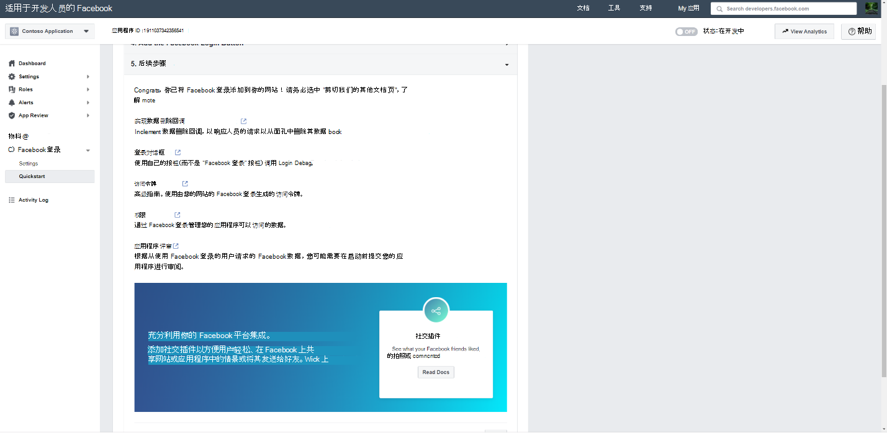

7. 在 **"Facebook** 登录"下的左侧导航窗格中 **，设置"，** 在"有效 OAuth 重定向 URI"框中添加 **OAuth 重定向 URI。** 使用 **\<connectorserviceuri> /Views/FacebookOAuth** 格式，其中 connectorserviceuri 的值为组织的 Azure 应用服务 URL;例如， `https://fbconnector.azurewebsites.net` 。

   

8. 在左侧导航窗格中，单击 **"添加产品"，** 然后单击 **"Webhooks"。** 在"**页面"** 下拉菜单中，单击"页面 **"。**

   

9. 添加 Webhook 回调 URL 并添加验证令牌。 回调 URL 的格式使用 格式，其中 connectorserviceuri 的值是组织的 Azure 应用 `<connectorserviceuri>/api/FbPageWebhook` 服务 URL;例如 `https://fbconnector.azurewebsites.net` 。

   验证令牌应类似于强密码。 将验证令牌复制到文本文件或其他存储位置。

   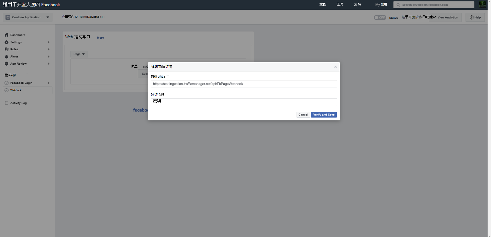

10. 测试和订阅订阅源的终结点。

    

11. 添加隐私 URL、应用图标和业务用途。 此外，将应用 ID 和应用密码复制到文本文件或其他存储位置。

    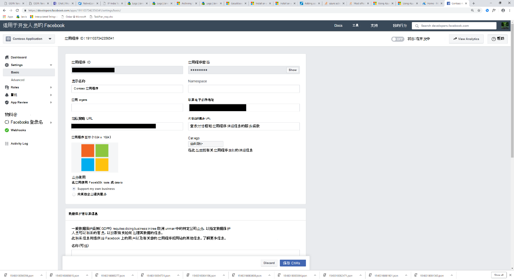

12. 将应用公开。

    

13. 将用户添加到管理员或测试人员角色。

    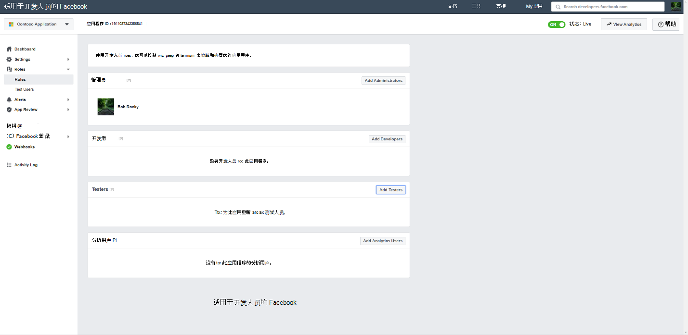

14. 添加 **"页面公共内容访问"** 权限。

    

15. 添加"管理页面"权限。

    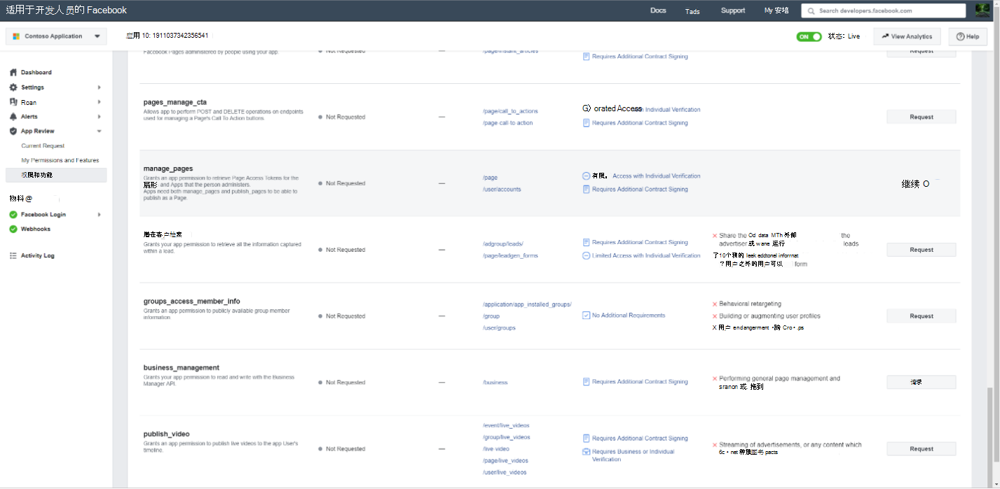

16. 获取 Facebook 审查的应用程序。

    

## 步骤 4：配置连接器 Web 应用

1. 转到 (AzureAppResourceName 是你在步骤 4) 中命名的 Azure 应用 `https://<AzureAppResourceName>.azurewebsites.net` 资源的名称。 例如，如果名称为 **fbconnector，** 请转到 `https://fbconnector.azurewebsites.net` 。 应用程序的主页将如以下屏幕截图所示：

   

2. 单击 **"** 配置"显示登录页。

   

3. 在"租户 ID"框中，键入或粘贴 (步骤 2 中获取的租户 ID) 。 在密码框中，键入或粘贴在步骤 2) 获取的 APISecretKey (，然后单击"设置配置 **设置"** 以显示配置详细信息页。

    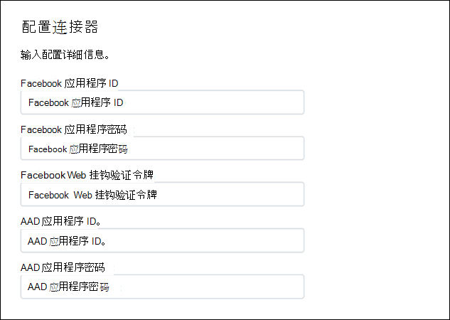

4. 输入以下配置设置

   - **Facebook 应用程序 ID：** 在步骤 3 中获取的 Facebook 应用程序的应用程序 ID。

   - **Facebook 应用程序密码：** 在步骤 3 中获得的 Facebook 应用程序的应用程序密码。

   - **Facebook Webhook 验证令牌：** 在步骤 3 中创建的验证令牌。

   - **AAD 应用程序 ID：** 步骤 1 中创建Azure Active Directory应用程序的应用程序 ID。

   - **AAD 应用程序密码：** 在步骤 1 中创建的 APISecretKey 密码的值。

5. 单击 **"保存** "以保存连接器设置。

## 步骤 5：在网站中设置 Facebook Microsoft 365 合规中心

1. 转到 ， [https://compliance.microsoft.com](https://compliance.microsoft.com) 然后单击左侧 **导航中的** "数据连接器"。

2. 在 Facebook **业务页面下的**"数据 **连接器"页上，单击**"查看 **"。**

3. 在 **Facebook 业务页面页面上**，单击"**添加连接器"。**

4. 在"**服务条款"页上**，单击"接受 **"。**

5. 在"**为连接器应用程序添加** 凭据"页上，输入以下信息，然后单击"验证 **连接"。**

   

   - 在" **名称** "框中，键入连接器的名称，如 Facebook **新闻页面**。

   - 在" **连接 URL"** 框中，键入或粘贴 Azure 应用服务 URL;例如 `https://fbconnector.azurewebsites.net` 。

   - 在 **"密码** "框中，键入或粘贴在步骤 2 中添加的 APISecretKey 的值。

   - 在 **"Azure 应用 ID"** 框中，键入或粘贴" (客户端) ID 的值，该 ID 也称为在步骤 1 中创建的 AAD 应用程序 ID。

6. 成功验证连接后，单击"下一 **步"。**

7. 在"**授权Microsoft 365数据"** 页上，再次键入或粘贴 APISecretKey，然后单击"登录 Web **应用"。**

8. 在" **配置 Facebook 连接器应用程序** "页上，单击"使用 **Facebook** 登录"，然后使用您组织的 Facebook 业务页面的帐户凭据登录。 确保您登录的 Facebook 帐户分配了您组织的 Facebook 业务页面的管理员角色。

   

9. 将显示您登录到的 Facebook 帐户管理的业务页面列表。 选择要存档的页面，然后单击"下一 **步"。**

   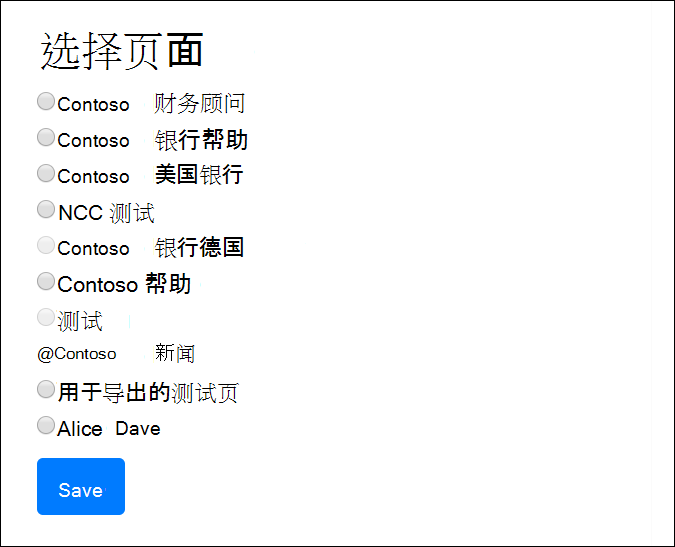

10. 单击 **"** 继续"退出连接器服务应用程序的设置。

11. 在 **"设置筛选器** "页上，可以应用筛选器以初始导入具有特定年龄的项目。 选择一个年龄，然后单击下一 **步**。

12. 在"**选择存储位置**"页上，Microsoft 365 Facebook 项目将导入到的邮箱的电子邮件地址，然后单击"下一步 **"。**

13. 单击 **"下** 一步"查看连接器设置，然后单击" **完成** "以完成连接器设置。

14. 在合规中心，转到 **"数据连接器**"页，然后单击"连接器"选项卡以查看导入过程的进度。
