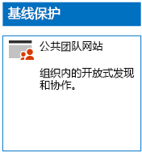
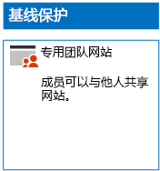
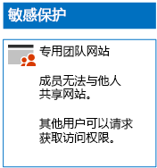
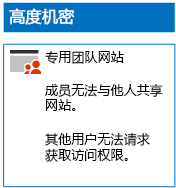

# 部署具有三层保护的 SharePoint Online 网站

使用本文中的步骤设计和部署基线、敏感和高度机密的 SharePoint Online 团队网站。 有关三层保护的详细信息，请参阅[保护 SharePoint Online 网站和文件](../security/office-365-security/secure-sharepoint-online-sites-and-files.md)。
  
## 基线 SharePoint Online 团队网站

基线保护同时包括公共和专用团队网站。 组织中的任何人均可发现并访问公共团队网站。 只有与团队网站关联的 Office 365 组的成员才可以发现并访问专用网站。 两种类型的团队网站均允许成员与他人共享网站。
  
### 公开

要创建具有公共访问和权限的基线 SharePoint Online 团队网站，请按照[这些说明](https://support.office.com/article/create-a-team-site-in-sharepoint-ef10c1e7-15f3-42a3-98aa-b5972711777d)操作。

下面是生成的配置。
  

  
### 私人

要创建具有专用访问和权限的基线 SharePoint Online 团队网站，请按照[这些说明](https://support.office.com/article/create-a-team-site-in-sharepoint-ef10c1e7-15f3-42a3-98aa-b5972711777d)操作。
  
下面是生成的配置。
  

  
## 敏感 SharePoint Online 团队网站

敏感的 SharePoint Online 团队网站首先是一个专用团队网站。
  
首先，按照[这些说明](https://support.office.com/article/create-a-team-site-in-sharepoint-ef10c1e7-15f3-42a3-98aa-b5972711777d)创建专用 SharePoint Online 团队网站。

接下来，在新的 SharePoint Online 团队网站中，按照以下步骤操作配置其他权限。

1.  在 SharePoint 团队网站的工具栏中，依次单击设置图标和“**网站权限**”。
2.  在“**网站权限**”窗格的“**共享设置**”下方，单击“**更改共享设置**”。
3.  在“共享权限”下方，选择“仅网站所有者可以共享文件、文件夹和网站”，然后单击“保存”************。

下面是这些权限设置的结果：

- 已禁用成员间的相互共享功能。
- 启用非成员请求访问的功能。

下面是生成的配置。
  

  
通过其中一个访问组的组成员身份，网站成员现可对网站资源进行安全协作。
  
## 高度机密的 SharePoint Online 团队网站

高度机密的 SharePoint Online 团队网站是一个具有额外权限设置的专用团队网站。

首先，按照[这些说明](https://support.office.com/article/create-a-team-site-in-sharepoint-ef10c1e7-15f3-42a3-98aa-b5972711777d)创建专用 SharePoint Online 团队网站。

接下来，在新的 SharePoint Online 团队网站中，按照以下步骤操作配置其他权限。

1.  在 SharePoint 团队网站的工具栏中，依次单击设置图标和“**网站权限**”。
2.  在“**网站权限**”窗格的“**共享设置**”下方，单击“**更改共享设置**”。
3.  在“**共享权限**”下方，选择“**仅网站所有者可以共享文件、文件夹和网站**”。
4. 关闭“**允许访问请求**”，然后单击“**保存**”。

下面是这些权限设置的结果：

- 已禁用成员间的相互共享功能。
- 禁用非成员请求访问的功能。

下面是生成的配置。
  

  
通过其中一个访问组的组成员身份，网站成员现可对网站资源进行安全协作。
  
## 后续步骤

[使用 Office 365 标签和 DLP 保护 SharePoint Online 文件](protect-sharepoint-online-files-with-office-365-labels-and-dlp.md)

## 另请参阅

[保护 SharePoint Online 网站和文件](../security/office-365-security/secure-sharepoint-online-sites-and-files.md)
  
[Microsoft 针对政治宣传活动、非营利组织和其他敏捷性组织的安全指南](/security/office-365-security/microsoft-security-guidance-for-political-campaigns-nonprofits-and-other-agile-o.md)
  
[云应用和混合解决方案](https://docs.microsoft.com/office365/enterprise/cloud-adoption-and-hybrid-solutions)
