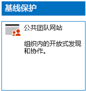
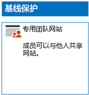
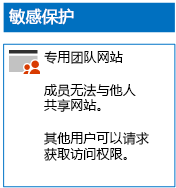

# 部署具有三层保护的 SharePoint Online 网站Deploy SharePoint Online sites for three tiers of protection

使用本文中的步骤设计和部署基线、敏感和高度机密的 SharePoint Online 团队网站。 有关三层保护的详细信息，请参阅[保护 SharePoint Online 网站和文件](../security/office-365-security/secure-sharepoint-online-sites-and-files.md)。Use the steps in this article to design and deploy baseline, sensitive, and highly confidential SharePoint Online team sites. For more information about these three tiers of protection, see [Secure SharePoint Online sites and files](../security/office-365-security/secure-sharepoint-online-sites-and-files.md).
  
## 基线 SharePoint Online 团队网站Baseline SharePoint Online team sites

基线保护同时包括公共和专用团队网站。 组织中的任何人均可发现并访问公共团队网站。 只有与团队网站关联的 Office 365 组的成员才可以发现并访问专用网站。 两种类型的团队网站均允许成员与他人共享网站。Baseline protection includes both public and private team sites. Public team sites can be discovered and accessed by anybody in the organization. Private sites can only be discovered and accessed by members of the Office 365 group associated with the team site. Both of these types of team sites allow members to share the site with others.
  
### 公开Public

要创建具有公共访问和权限的基线 SharePoint Online 团队网站，请按照[这些说明](https://support.office.com/article/create-a-team-site-in-sharepoint-ef10c1e7-15f3-42a3-98aa-b5972711777d)操作。To create a baseline SharePoint Online team site with public access and permissions, follow [these instructions](https://support.office.com/article/create-a-team-site-in-sharepoint-ef10c1e7-15f3-42a3-98aa-b5972711777d).

下面是生成的配置。Here is your resulting configuration.
  

  
### 私人Private

要创建具有专用访问和权限的基线 SharePoint Online 团队网站，请按照[这些说明](https://support.office.com/article/create-a-team-site-in-sharepoint-ef10c1e7-15f3-42a3-98aa-b5972711777d)操作。To create a baseline SharePoint Online team site with private access and permissions, follow [these instructions](https://support.office.com/article/create-a-team-site-in-sharepoint-ef10c1e7-15f3-42a3-98aa-b5972711777d).
  
下面是生成的配置。Here is your resulting configuration.
  

  
## 敏感 SharePoint Online 团队网站Sensitive SharePoint Online team sites

敏感的 SharePoint Online 团队网站首先是一个专用团队网站。A sensitive SharePoint Online team site starts as a private team site.
  
首先，按照[这些说明](https://support.office.com/article/create-a-team-site-in-sharepoint-ef10c1e7-15f3-42a3-98aa-b5972711777d)创建专用 SharePoint Online 团队网站。First, create the private SharePoint Online team site with [these instructions](https://support.office.com/article/create-a-team-site-in-sharepoint-ef10c1e7-15f3-42a3-98aa-b5972711777d).

接下来，在新的 SharePoint Online 团队网站中，按照以下步骤操作配置其他权限。Next, from the new SharePoint Online team site, configure additional permission settings with these steps.

1.  在 SharePoint 团队网站的工具栏中，依次单击设置图标和“**网站权限**”。In the tool bar of the SharePoint team site, click the settings icon, and then click **Site permissions**.
2.  在“**网站权限**”窗格的“**共享设置**”下方，单击“**更改共享设置**”。In the **Site permissions** pane, under **Sharing Settings**, click **Change sharing settings**.
3.  在“共享权限”下方，选择“仅网站所有者可以共享文件、文件夹和网站”，然后单击“保存”\*\*\*\*\*\*\*\*\*\*\*\*。Under **Sharing permissions**, choose **Only site owners can share files, folders, and the site**, and then click **Save**.

下面是这些权限设置的结果：The results of these permission settings are:

- 已禁用成员间的相互共享功能。The ability for members to share with other members is disabled.
- 启用非成员请求访问的功能。The ability for non-members to request access is enabled.

下面是生成的配置。Here is your resulting configuration.
  

  
通过其中一个访问组的组成员身份，网站成员现可对网站资源进行安全协作。The members of the site, through group membership in one of the access groups, can now securely collaborate on the resources of the site.
  
## 高度机密的 SharePoint Online 团队网站Highly confidential SharePoint Online team sites

高度机密的 SharePoint Online 团队网站是一个具有额外权限设置的专用团队网站。A highly confidential SharePoint Online team site is a private team site with additional permissions settings.

首先，按照[这些说明](https://support.office.com/article/create-a-team-site-in-sharepoint-ef10c1e7-15f3-42a3-98aa-b5972711777d)创建专用 SharePoint Online 团队网站。First, create the private SharePoint Online team site with [these instructions](https://support.office.com/article/create-a-team-site-in-sharepoint-ef10c1e7-15f3-42a3-98aa-b5972711777d).

接下来，在新的 SharePoint Online 团队网站中，按照以下步骤操作配置其他权限。Next, from the new SharePoint Online team site, configure additional permission settings with these steps.

1.  在 SharePoint 团队网站的工具栏中，依次单击设置图标和“**网站权限**”。In the tool bar of the SharePoint team site, click the settings icon, and then click **Site permissions**.
2.  在“**网站权限**”窗格的“**共享设置**”下方，单击“**更改共享设置**”。In the **Site permissions** pane, under **Sharing Settings**, click **Change sharing settings**.
3.  在“**共享权限**”下方，选择“**仅网站所有者可以共享文件、文件夹和网站**”。Under **Sharing permissions**, choose **Only site owners can share files, folders, and the site**.
4. 关闭“**允许访问请求**”，然后单击“**保存**”。Turn off **Allow access requests**, and then click **Save**.

下面是这些权限设置的结果：The results of these permission settings are:

- 已禁用成员间的相互共享功能。The ability for members to share with other members is disabled.
- 禁用非成员请求访问的功能。The ability for non-members to request access is disabled.

下面是生成的配置。Here is your resulting configuration.
  

  
通过其中一个访问组的组成员身份，网站成员现可对网站资源进行安全协作。The members of the site, through group membership in one of the access groups, can now securely collaborate on the resources of the site.
  
## 后续步骤Next step

[使用 Office 365 标签和 DLP 保护 SharePoint Online 文件Protect SharePoint Online files with Office 365 labels and DLP](protect-sharepoint-online-files-with-office-365-labels-and-dlp.md)

## 另请参阅See also

[Microsoft 针对政治宣传活动、非营利组织和其他敏捷性组织的安全指南Microsoft Security Guidance for Political Campaigns, Nonprofits, and Other Agile Organizations](../security/office-365-security/microsoft-security-guidance-for-political-campaigns-nonprofits-and-other-agile-o.md)
  
[云应用和混合解决方案Cloud adoption and hybrid solutions](https://docs.microsoft.com/office365/enterprise/cloud-adoption-and-hybrid-solutions)
