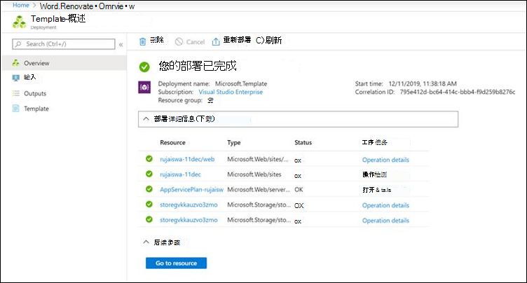
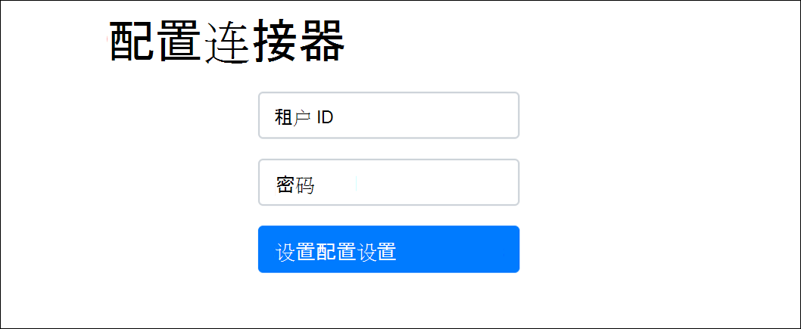
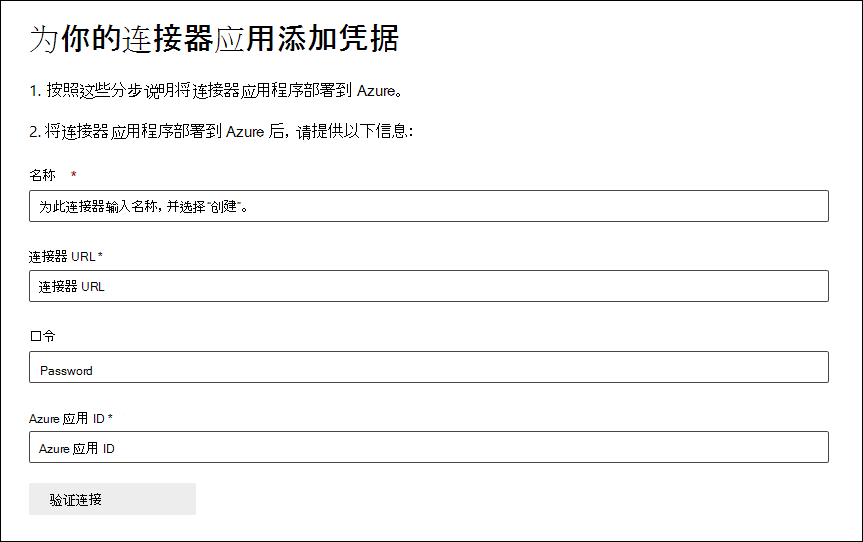

# 部署连接器以存档 Twitter 数据

本文包含部署连接器的分步过程，该连接器使用 Office 365 导入服务将数据从组织的 Twitter 帐户导入到 Microsoft 365。 有关此过程的简要概述和部署 Twitter 连接器所需的先决条件列表，请参阅设置连接器以存档 Twitter [数据 ](archive-twitter-data-with-sample-connector.md)。

## 步骤 1：在 Azure Active Directory

1. 转到 <https://portal.azure.com> ，然后使用全局管理员帐户的凭据登录。

   

2. 在左侧导航窗格中，单击 **Azure Active Directory**。

   

3. 在左侧导航窗格中，单击"应用注册 (**预览**) 然后单击"新建 **注册"。**

   

4. 注册应用程序。 Under **Redirect URI (optional)**, select **Web** in the application type dropdown list and then type `https://portal.azure.com` in the box for the URI.

   

5. 复制 **应用程序 (客户端) ID (** Directory) **ID，并将其** 保存到文本文件或其他安全位置。 在稍后的步骤中使用这些 ID。

    

6. 转到"**证书&应用密码"，在**"客户端密码"下单击"**新建客户端密码"。**

   

7. 创建新密码。 在说明框中，键入密码，然后选择过期期限。

   

8. 复制密码的值并将其保存到文本文件或其他存储位置。 这是在稍后的步骤中使用的 AAD 应用程序密码。

   

## 步骤 2：将连接器 Web 服务从 GitHub部署到 Azure 帐户

1. 转到此 [GitHub站点，](https://github.com/microsoft/m365-sample-twitter-connector-csharp-aspnet)然后单击 **"部署到 Azure"。**

    

2. 单击" **部署到 Azure"** 后，你将重定向到具有自定义模板页面的 Azure 门户。 填写基本 **信息并****设置详细信息**，**然后单击购买。**

   

    - **订阅：** 选择要将 Twitter 连接器 Web 服务部署到的 Azure 订阅。

    - **资源组：** 选择或创建新的资源组。 资源组是存储 Azure 解决方案相关资源的容器。

    - **位置：** 选择一个位置。

    - **Web 应用名称：** 为连接器 Web 应用提供唯一的名称。 名称长度必须在 3 到 18 个字符之间。 此名称用于创建 Azure 应用服务 URL;例如，如果你提供 **twitterconnector** 的 Web 应用名称，则 Azure 应用服务 URL **将** twitterconnector.azurewebsites.net。

    - **tenantId：** 在步骤 1 Microsoft 365 Azure Active Directory 中创建 Facebook 连接器应用后复制的组织租户 ID。

   - **APISecretKey：** 你可以键入任何值作为密码。 这用于访问步骤 5 中的连接器 Web 应用。

3. 部署成功后，页面将类似于以下屏幕截图：

    

## 步骤 3：创建 Twitter 应用

1. 转到 https://developer.twitter.com ，使用组织的开发人员帐户凭据登录，然后单击应用 。 

   
2. 单击 **"创建应用"。**

   

3. 在 **"应用程序详细信息**"下，添加有关应用程序的信息。

   

4. 在 Twitter 开发人员仪表板上，选择你刚刚创建的应用， **然后单击详细信息**。

   

5. 在" **密钥和令牌** "选项卡上的"使用者 **API** 密钥"下，复制 API 密钥和 API 密钥，并将其保存到文本文件或其他存储位置。 然后单击 **"创建** "以生成访问令牌和访问令牌密码，然后将这些密钥复制到文本文件或其他存储位置。

   

   然后单击 **"创建** "以生成访问令牌和访问令牌密码，然后将这些密钥复制到文本文件或其他存储位置。

6. 单击 **"权限"** 选项卡并配置权限，如以下屏幕截图所示：

   

7. 保存权限设置后，单击"应用详细信息 **"选项卡，** 然后单击"编辑>**编辑详细信息"。**

   

8. 执行以下任务：

   - 选中复选框以允许连接器应用登录到 Twitter。

   - 采用以下格式添加 OAuth 重定向 **Uri：/Views/TwitterOAuth， \<connectorserviceuri>** 其中 *connectorserviceuri* 的值为组织的 Azure 应用服务 URL;例如， https://twitterconnector.azurewebsites.net/Views/TwitterOAuth 。

    

Twitter 开发人员应用现在可供使用。

## 步骤 4：配置连接器 Web 应用

1. 转到 https:// \<AzureAppResourceName> .azurewebsites.net (，其中 **AzureAppResourceName** 是你在步骤 4) 中命名的 Azure 应用资源的名称。 例如，如果名称为 **twitterconnector**，请转到 https://twitterconnector.azurewebsites.net 。 应用程序的主页类似于以下屏幕截图：

   

2. 单击 **"** 配置"显示登录页。

   

3. 在"租户 ID"框中，键入或粘贴 (步骤 2 中获取的租户 ID) 。 在密码框中，键入或粘贴在步骤 2) 获取的 APISecretKey (，然后单击"设置配置 **设置"** 以显示配置详细信息页。

   

4. 输入以下配置设置

   - **Twitter Api 密钥：** 你在步骤 3 中创建的 Twitter 应用程序的 API 密钥。

   - **Twitter Api 密钥：** 你在步骤 3 中创建的 Twitter 应用程序的 API 密钥。

   - **Twitter 访问令牌：** 在步骤 3 中创建的访问令牌。

   - **Twitter 访问令牌密码：** 在步骤 3 中创建的访问令牌密码。

   - **AAD 应用程序 ID：** 在步骤 1 中创建Azure Active Directory应用程序的应用程序 ID

   - **AAD 应用程序密码：** 在步骤 1 中创建的 APISecretKey 密码的值。

5. 单击 **"保存** "以保存连接器设置。

## 步骤 5：在 Microsoft 365 合规中心

1. 转到 ， [https://compliance.microsoft.com](https://compliance.microsoft.com) 然后单击左侧 **导航中的** "数据连接器"。

2. 在"**数据连接器"页面上** 的 **Twitter 下**，单击"查看 **"。**

3. 在 **Twitter 页面上**，单击"添加 **连接器"。**

4. 在"**服务条款"页上**，单击"接受 **"。**

5. 在"**为连接器应用程序添加** 凭据"页上，输入以下信息，然后单击"验证 **连接"。**

   

    - 在 **"名称** &quot;框中，键入连接器的名称，例如 Twitter **帮助处理**。

    - 在&quot; **连接器 URL&quot;** 框中，键入或粘贴 Azure 应用服务 URL;例如 `https://twitterconnector.azurewebsites.net` 。

    - 在 **&quot;密码** &quot;框中，键入或粘贴在步骤 2 中创建的 APISecretKey 的值。

    - 在 **&quot;Azure 应用 ID&quot;** 框中，键入或粘贴 Azure 应用程序应用 ID (也称为&quot;客户端 *ID")* 在步骤 1 中获取的值。

6. 成功验证连接后，单击"下一 **步"。**

7. 在"**授权Microsoft 365数据"** 页上，再次键入或粘贴 APISecretKey，然后单击"登录 Web **应用"。**

8. 单击 **"使用 Twitter 登录"。**

9. 在 Twitter 登录页面上，使用组织的 Twitter 帐户的凭据登录。

   

   登录后，Twitter 页面将显示以下消息"Twitter 连接器作业已成功设置"。

10. 单击 **"** 继续"完成 Twitter 连接器的设置。

11. 在 **"设置筛选器** "页上，可以应用筛选器以初始导入具有特定年龄的项目。 选择一个年龄，然后单击下一 **步**。

12. 在"**选择存储位置**"页上，Microsoft 365 Twitter 项目将导入到的邮箱的电子邮件地址，然后单击"下一步 **"。**

13. 单击 **"下** 一步"查看连接器设置，然后单击" **完成** "以完成连接器设置。

14. 在合规中心，转到 **"数据连接器**"页，然后单击"连接器"选项卡以查看导入过程的进度。
