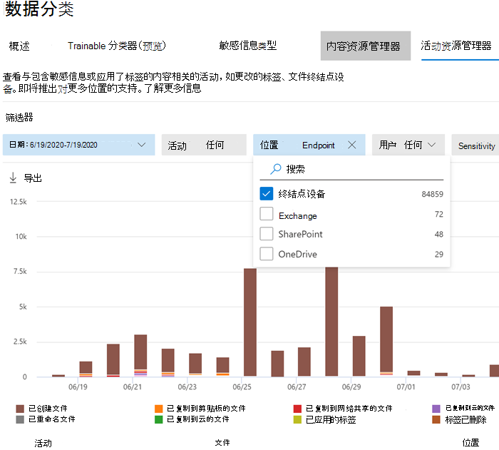

# 将Windows 10和 Windows 11 设备载入Microsoft 365概述

**适用于：**

- [Microsoft 365终结点数据丢失防护 （DLP）](./endpoint-dlp-learn-about.md)
- [内部风险管理](insider-risk-management.md#learn-about-insider-risk-management-in-microsoft-365)

Microsoft 365终结点数据丢失防护 （Endpoint DLP） 和内部风险管理要求将Windows 10 Windows 和 Windows 11 设备载入服务，以便它们可以将监视数据发送到服务。
 
Microsoft 365终结点 DLP 允许监视Windows 10或 Windows 11 设备，并检测何时使用和共享敏感项目。 这为你提供了所需的可见性和控制力，以确保正确使用和保护它们，并帮助防止可能危害它们的危险行为。 有关 Microsoft 所有 DLP 产品/服务的更多信息，请参阅[数据丢失防护概述](dlp-learn-about-dlp.md)。 若要了解有关终结点 DLP 的详细信息，请参阅 [了解终结点数据丢失防护](endpoint-dlp-learn-about.md)。

内部风险管理使用全面的服务和第三方指示器来帮助你快速识别、会审和处理有风险的用户活动。 通过使用来自Microsoft 365和Microsoft Graph的日志，内部风险管理允许你定义特定策略来识别风险指示器并采取措施来缓解这些风险。 有关详细信息，请参阅 [了解 Microsoft 365中的内部风险管理](insider-risk-management.md#learn-about-insider-risk-management-in-microsoft-365)。

设备载入在 Microsoft 365 和 Microsoft Defender for Endpoint （MDE） 之间共享。 如果已将设备载入 MDE，它们将显示在托管设备列表中，无需执行进一步步骤即可载入这些特定设备。 在合规中心载入设备也会将其载入 MDE。

## 准备工作

### SKU/订阅许可

请查看[此处](/office365/servicedescriptions/microsoft-365-service-descriptions/microsoft-365-tenantlevel-services-licensing-guidance/microsoft-365-security-compliance-licensing-guidance#information-protection-data-loss-prevention-for-exchange-online-sharepoint-online-and-onedrive-for-business)许可要求。

### 权限

若要启用设备管理，你使用的帐户必须是以下任何一个角色的成员：

- 全局管理员
- 安全管理员
- 合规性管理员

如果要使用自定义帐户查看设备管理设置，该帐户必须具有以下角色之一：

- 全局管理员
- 合规性管理员
- 合规性数据管理员
- 全局读取者

如果要使用自定义帐户访问载入/载出页面，该帐户必须具有以下角色之一：

- 全局管理员
- 合规性管理员

如果要使用自定义帐户打开/关闭设备监视，该帐户必须具有以下角色之一：

- 全局管理员
- 合规性管理员

### 准备 Windows 设备

确保需要载入的 Windows 设备满足这些要求。

1. 必须运行Windows 10 x64 内部版本 1809 或更高版本或 Windows 11。

2. 反恶意软件客户端的版本为 4.18.2110 或更高版本。 若要查看当前版本，请打开“Windows 安全中心”应用，选择“设置”图标，然后选择“关于”。 “反恶意软件客户端版本”下列出了版本号。 通过安装 Windows 更新 KB4052623，更新到最新的反恶意软件客户端版本。

   > [!NOTE]
   > 无需任何 Windows 安全组件处于活动状态，但必须启用 [实时保护和行为监视器](/windows/security/threat-protection/microsoft-defender-antivirus/configure-real-time-protection-microsoft-defender-antivirus)）。

3. 以下适用于Windows 10的 Windows 更新适用于将监视的设备。

   > [!NOTE]
   > 这些更新不是载入设备的先决条件，但包含重要问题的修补程序，因此在使用产品之前必须安装这些更新。
   >
    > - 对于 Windows 10 1809 - KB4559003、KB4577069、KB4580390
    > - 对于 Windows 10 1903 或 1909 - KB4559004、KB4577062、KB4580386
    > - 对于 Windows 10 2004 - KB4568831、KB4577063

4. 所有设备必须是以下设备之一：

   - [已建立 Azure Active Directory (Azure AD) 连接](/azure/active-directory/devices/concept-azure-ad-join)
   - [已建立混合 Azure AD 联接](/azure/active-directory/devices/concept-azure-ad-join-hybrid)。
   - [已完成 AAD 注册](/azure/active-directory/user-help/user-help-register-device-on-network)

5. 已安装受支持的 Microsoft Office 版本和最新版本。 为了获得最可靠的保护和用户体验，请确保已安装 Microsoft 365 应用版本 16.0.14701.0 或更高版本。
> [!NOTE]
   > - 如果运行的是 Office 365 - 需要 KB 4577063。
   > - 如果你使用 Microsoft 365 应用版 2004-2008 的月度企业频道，则需要更新到版本 2009 或更高版本。 参见 [Microsoft 365 应用版的更新历史记录（按日期列出）](/officeupdates/update-history-microsoft365-apps-by-date)。 要了解有关此问题的更多信息，请参阅[有关 2020 年当前频道发行的发行说明](/officeupdates/current-channel#version-2010-october-27)。

6. 如果终结点使用设备代理连接到 Internet，请按照 [配置信息保护](device-onboarding-configure-proxy.md#configure-device-proxy-and-internet-connection-settings-for-information-protection)的设备代理和 Internet 连接设置中的过程进行操作。

## 载入Windows 10或 Windows 11 设备

必须先启用设备监视功能并载入终结点，然后才能监视和保护设备上的敏感项目。 这两项操作都在 Microsoft 365 合规门户中完成。

当你想载入尚未载入的设备时，你需要下载相应的脚本并将其部署到那些设备上。按照载入设备程序进行操作。

已载入到 [Microsoft Defender for Endpoint](/windows/security/threat-protection/) 的设备将显示在“托管设备”列表中。

在此部署方案中，你将载入Windows 10或尚未载入的 Windows 11 设备。

1. 打开“[Microsoft 合规中心](https://compliance.microsoft.com)”。 选择 **设置** > **启用设备监视**。

   > [!NOTE]
   > 设备载入通常需要大约 60 秒才能启用，请先等待 30 分钟，然后再与 Microsoft 支持人员接洽。

2. 打开合规中心设置页面，然后选择“**载入设备**”。

   > [!div class="mx-imgBorder"]
   > 

3. 选择“**设备管理**”，以打开“**设备**”列表。 

> [!NOTE]
> 如果以前部署了 Microsoft Defender for Endpoint，则在该过程中载入的所有设备都将列在 **设备** 列表中。无需再次载入它们。

4. 选择“**载入**”以开始载入流程。

5. 从“**部署方法**”列表中选择要部署到这些额外设备的方式，然后 **下载程序包**。

6. 从下表中选择要遵循的适当过程：

主题 | 说明
:---|:---
[使用组策略载入 Windows 10 或 Windows 11 设备](device-onboarding-gp.md) | 使用组策略在设备上部署配置包。
[使用 Microsoft Endpoint Configuration Manager 载入 Windows 10 或 Windows 11 设备](device-onboarding-sccm.md) | 可以使用 Microsoft Endpoint Configuration Manager（当前分支）版本 1606 或 Microsoft Endpoint Configuration Manager（当前分支）版本 1602 或更早版本在设备上部署配置包。
[使用移动设备管理工具载入 Windows 10 或 11 设备](device-onboarding-mdm.md) | 使用移动设备管理工具或 Microsoft Intune 在设备上部署配置包。
[使用本地脚本载入 Windows 10 或 11 设备](device-onboarding-script.md) | 了解如何使用本地脚本在终结点上部署配置包。
[载入非永久虚拟桌面基础结构 （VDI） 设备](device-onboarding-vdi.md) | 了解如何使用配置包配置 VDI 设备。

载入设备后，它应在设备列表中可见，并开始向活动资源管理器报告审核活动日志。

### 在 DLP 警报管理仪表板中查看“终点 DLP 警报”

1. 在 <a href="https://go.microsoft.com/fwlink/p/?linkid=2077149" target="_blank">Microsoft 365 合规中心</a> 中打开"数据丢失防护"页，然后选择"警报"。

2. 请参阅 [如何配置和查看 DLP 策略的警报](dlp-configure-view-alerts-policies.md) 中的过程，以查看你的终结点 DLP 策略警报。

### 在活动资源管理器中查看终结点 DLP 数据

1. 在 Microsoft 365 合规中心中打开域的“[数据分类页面](https://compliance.microsoft.com/dataclassification?viewid=overview)”，然后选择“活动资源管理器”。

2. 请参考[活动资源管理器入门](data-classification-activity-explorer.md)中的程序，以访问和筛选终结点设备的所有数据。

   > [!div class="mx-imgBorder"]
   > 

## 另请参阅

- [了解Microsoft 365中的内部风险管理](insider-risk-management.md#learn-about-insider-risk-management-in-microsoft-365)
- [了解终结点数据丢失防护](endpoint-dlp-learn-about.md)
- [使用终结点数据丢失防护](endpoint-dlp-using.md)
- [了解数据丢失防护](dlp-learn-about-dlp.md)
- [创建、测试和优化 DLP 策略](create-test-tune-dlp-policy.md)
- [活动资源管理器入门](data-classification-activity-explorer.md)
- [Microsoft Defender for Endpoint](/windows/security/threat-protection/)
- [Windows 10 设备的装载工具和方法](/windows/security/threat-protection/microsoft-defender-atp/configure-endpoints)
- [Microsoft 365 订阅](https://www.microsoft.com/microsoft-365/compare-microsoft-365-enterprise-plans?rtc=1)
- [已建立 Azure AD 联接的设备](/azure/active-directory/devices/concept-azure-ad-join)
- [下载基于 Chromium 的新 Microsoft Edge](https://support.microsoft.com/help/4501095/download-the-new-microsoft-edge-based-on-chromium)
