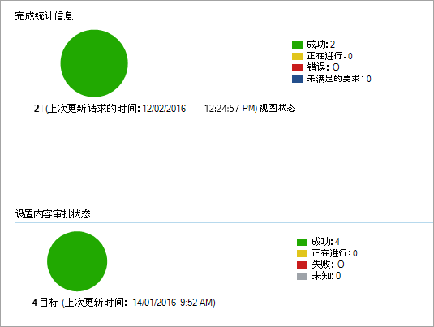

# <a name="onboard-windows-10-and-windows-11-devices-using-configuration-manager"></a>使用Configuration Manager载入Windows 10和Windows 11设备

**适用于：**

- [Microsoft 365终结点数据丢失防护 （DLP）](./endpoint-dlp-learn-about.md)
- [内部风险管理](insider-risk-management.md#learn-about-insider-risk-management-in-microsoft-365)

### <a name="onboard-devices-using-system-center-configuration-manager"></a>使用System Center Configuration Manager载入设备

1. 从 [Microsoft 合规中心](https://compliance.microsoft.com/)获取配置包.zip文件 *(DeviceComplianceOnboardingPackage.zip*) 。

2. 在导航窗格中，选择 <a href="https://go.microsoft.com/fwlink/p/?linkid=2174201" target="_blank">**“设置**</a> > **Device OnboardingOnboarding** > ”。

3. 在 **“部署方法**”字段中，选择 **Microsoft Endpoint Configuration Manager 2012/2012 R2/1511/1602**。

4. 选择 **“下载”包**，并保存.zip文件。

5. 将.zip文件的内容提取到可由将部署包的网络管理员访问的共享只读位置。 应有一个名为 *DeviceComplianceOnboardingScript.cmd* 的文件。

6. 按照 System Center [2012 R2 Configuration Manager文章中的包和程序中的](/previous-versions/system-center/system-center-2012-R2/gg699369(v=technet.10))步骤部署包。

7. 选择要将包部署到的预定义设备集合。

> [!NOTE]
> Microsoft 365信息保护不支持在[“开箱即用体验” (OOBE) ](https://answers.microsoft.com/en-us/windows/wiki/windows_10/how-to-complete-the-windows-10-out-of-box/47e3f943-f000-45e3-8c5c-9d85a1a0cf87)阶段加入。 确保用户在运行Windows安装或升级后完成 OOBE。

> [!TIP]
> 载入设备后，可以选择运行检测测试来验证设备是否已正确加入服务。 有关详细信息，请参阅[在新加入的Microsoft Defender for Endpoint设备上运行检测测试](/windows/security/threat-protection/microsoft-defender-atp/run-detection-test)。
>
> 请注意，可以在Configuration Manager应用程序上创建检测规则，以持续检查设备是否已载入。 应用程序是与包和程序不同的对象类型。
> 如果设备由于等待的 OOBE 完成或) 的任何其他原因而尚未载入 (，则Configuration Manager将重试以载入设备，直到规则检测到状态更改。
>
> 可以通过创建检测规则来完成此行为，检查类型为 REG_DWORD) = 1 的“OnboardingState”注册表值是否 (。
> 此注册表值位于“HKLM\SOFTWARE\Microsoft\Windows高级威胁防护\状态”下。
有关详细信息，请参阅 [System Center 2012 R2 Configuration Manager中的配置检测方法](/previous-versions/system-center/system-center-2012-R2/gg682159(v=technet.10)#step-4-configure-detection-methods-to-indicate-the-presence-of-the-deployment-type)。

### <a name="configure-sample-collection-settings"></a>配置示例集合设置

对于每个设备，可以设置一个配置值来说明在通过Microsoft Defender 安全中心提交文件进行深入分析时是否可以从设备收集示例。

> [!NOTE]
> 这些配置设置通常是通过Configuration Manager完成的。

可以在Configuration Manager中为配置项设置符合性规则，以更改设备上的示例共享设置。

此规则应 *是修正符合* 性规则配置项，用于设置目标设备上注册表项的值，以确保它们受到投诉。

配置是通过以下注册表项项设置的：

```text
Path: "HKLM\SOFTWARE\Policies\Microsoft\Windows Advanced Threat Protection"
Name: "AllowSampleCollection"
Value: 0 or 1
```

其中：

键类型是 D-WORD。

可能的值是：

- 0 - 不允许从此设备共享示例
- 1 - 允许共享此设备中的所有文件类型

如果注册表项不存在，则默认值为 1。

有关System Center Configuration Manager合规性的详细信息，请参阅 [System Center 2012 R2 Configuration Manager中的合规性设置简介](/previous-versions/system-center/system-center-2012-R2/gg682139(v=technet.10))。


## <a name="other-recommended-configuration-settings"></a>其他建议的配置设置

将设备载入到服务后，请务必使用以下建议的配置设置来利用包含的威胁防护功能。

### <a name="device-collection-configuration"></a>设备集合配置

如果使用的是 Endpoint Configuration Manager版本 2002 或更高版本，则可以选择扩大部署范围以包括服务器或下层客户端。

### <a name="next-generation-protection-configuration"></a>下一代保护配置

建议使用以下配置设置：

**扫描**

- 扫描可移动存储设备（如 USB 驱动器）：是

**实时保护**

- 启用行为监视：是
- 在下载时和安装前对可能不需要的应用程序启用保护：是

**云保护服务**

- 云保护服务成员身份类型：高级成员身份

**攻击面减少** 将所有可用规则配置为审核。

> [!NOTE]
> 阻止这些活动可能会中断合法的业务流程。 最佳方法是将所有内容设置为审核，确定哪些设置可以安全打开，然后在不具有误报检测的终结点上启用这些设置。

**网络保护功能**

在审核或阻止模式下启用网络保护之前，请确保已安装可从 [支持页面](https://support.microsoft.com/en-us/help/4560203/windows-defender-anti-malware-platform-binaries-are-missing)获取的反恶意软件平台更新。

**受控文件夹访问**

在审核模式下启用该功能至少 30 天。 在此时间段后，查看检测并创建允许写入受保护目录的应用程序列表。

有关详细信息，请参阅 [评估受控文件夹访问权限](/windows/security/threat-protection/microsoft-defender-atp/evaluate-controlled-folder-access)。

## <a name="offboard-devices-using-configuration-manager"></a>使用Configuration Manager载入设备

出于安全原因，用于离载设备的包将在下载日期后 30 天内过期。 发送到设备的过期离载包将被拒绝。 下载离载包时，系统会通知你包到期日期，并且包名称中也会包含该包。

> [!NOTE]
> 载入和卸载策略不得同时部署在同一设备上，否则将导致不可预知的碰撞。

### <a name="offboard-devices-using-microsoft-endpoint-configuration-manager-current-branch"></a>使用 Microsoft Endpoint Configuration Manager current Branch 载入设备

如果使用Microsoft Endpoint Configuration Manager当前分支，请参阅[创建一个离载配置文件](/configmgr/protect/deploy-use/windows-defender-advanced-threat-protection#create-an-offboarding-configuration-file)。

### <a name="offboard-devices-using-system-center-2012-r2-configuration-manager"></a>使用 System Center 2012 R2 Configuration Manager载入设备

1. 从<a href="https://go.microsoft.com/fwlink/p/?linkid=2077149" target="_blank">Microsoft 365 合规中心</a>获取卸载包：

2. 在导航窗格中，选择 <a href="https://go.microsoft.com/fwlink/p/?linkid=2174201" target="_blank">**设置**</a> >  **Device onboardingOffboarding**> 。

3. 选择Windows 10作为操作系统。

4. 在 **“部署方法**”字段中，选择 **Microsoft Endpoint Configuration Manager 2012/2012 R2/1511/1602**。

5. 选择 **“下载”包**，并保存.zip文件。

6. 将.zip文件的内容提取到可由将部署包的网络管理员访问的共享只读位置。 应有一个名为 *DeviceComplianceOffboardingScript_valid_until_YYYY-MM-DD.cmd* 的文件。

7. 按照 System Center [2012 R2 Configuration Manager文章中的包和程序中的](/previous-versions/system-center/system-center-2012-R2/gg699369(v=technet.10))步骤部署包。

8. 选择要将包部署到的预定义设备集合。

> [!IMPORTANT]
> 卸载会导致设备停止将传感器数据发送到门户，但设备中的数据（包括对已保留的任何警报的引用）将保留长达 6 个月。

## <a name="monitor-device-configuration"></a>监视设备配置

如果使用 Microsoft Endpoint Configuration Manager Current Branch，请在Configuration Manager控制台中使用内置Microsoft Defender for Endpoint仪表板。 有关详细信息，请参阅 [Microsoft Defender 高级威胁防护 - 监视器](/configmgr/protect/deploy-use/windows-defender-advanced-threat-protection#monitor)。

如果使用 System Center 2012 R2 Configuration Manager，监视由两部分组成：

1. 确认配置包已正确部署并且正在运行 (或已在网络中的设备上成功运行) 。

2. 检查设备是否符合Microsoft 365设备载入服务 (这可确保设备可以完成载入过程，并可以继续向服务) 报告数据。

### <a name="confirm-the-configuration-package-has-been-correctly-deployed"></a>确认配置包已正确部署

1. 在Configuration Manager控制台中，单击导航窗格底部的“**监视**”。

2. 选择 **“概述** ”，然后 **选择“部署**”。

3. 选择具有包名称的部署。

4. 查看 **完成统计** 信息和 **内容状态下的** 状态指示器。

    如果) 出现 **错误**、 **未满足要求** 或 **失败状态** 的设备 (部署失败，则可能需要对设备进行故障排除。 有关详细信息，请参阅 [：排查 Microsoft Defender 高级威胁防护载入问题](/windows/security/threat-protection/microsoft-defender-atp/troubleshoot-onboarding)。

    

### <a name="check-that-the-devices-are-compliant-with-the-microsoft-365-endpoint-data-loss-prevention-service"></a>检查设备是否符合 Microsoft 365 终结点数据丢失防护服务

可以在 System Center 2012 R2 Configuration Manager中为配置项设置符合性规则，以监视部署。

> [!NOTE]
> 此过程和注册表项适用于 Endpoint DLP 和 Defender for Endpoint。

此规则应该是一个 *非修正* 符合性规则配置项，用于监视目标设备上注册表项的值。

监视以下注册表项项：

```text
Path: "HKLM\SOFTWARE\Microsoft\Windows Advanced Threat Protection\Status"
Name: "OnboardingState"
Value: "1"
```

有关详细信息，请参阅 [System Center 2012 R2 Configuration Manager中的合规性设置简介](/previous-versions/system-center/system-center-2012-R2/gg682139(v=technet.10))。

## <a name="related-topics"></a>相关主题

- [使用组策略载入Windows 10和Windows 11设备](device-onboarding-gp.md)
- [使用移动设备管理工具载入 Windows 10 和 Windows 11 设备](device-onboarding-mdm.md)
- [使用本地脚本载入 Windows 10 和 Windows 11 设备](device-onboarding-script.md)
- [载入非永久虚拟桌面基础结构 （VDI） 设备](device-onboarding-vdi.md)
- [在新加入的Microsoft Defender for Endpoint设备上运行检测测试](/windows/security/threat-protection/microsoft-defender-atp/run-detection-test)
- [排查 Microsoft Defender 高级威胁防护载入问题](/windows/security/threat-protection/microsoft-defender-atp/troubleshoot-onboarding)
