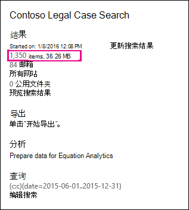

# 估计和实际电子数据展示搜索结果之间的差异

本主题适用于可以使用以下 Microsoft 365 电子数据展示工具之一运行的搜索： 

- 内容搜索
- 核心电子数据展示 
   
运行电子数据展示搜索时，你使用的工具将返回符合搜索条件的项目 (及其总大小) 估计值。 例如，在 Microsoft 365 合规中心中运行搜索时，估计的搜索结果将显示在所选搜索的飞出页面上。
  

  
这是当您将结果导出到本地计算机和随搜索结果一起下载的"导出摘要"报告中时，电子数据展示导出工具中显示的总大小和项目数的相同估计值。
  
**电子数据展示导出工具中的估计结果**

  
**导出摘要报告中的估计结果**

  
但是，如导出摘要报告的上一张屏幕截图所示，下载的实际搜索结果的大小和数量不同于估计搜索结果的大小和数量。
  

  
以下是导致这些差异的一些原因：
  
- **估计结果的方式**。 搜索结果的估计值就是估计值， (满足搜索查询条件) 而不是实际计数。 要编译 Exchange 项目的估计值，使用电子数据展示工具从 Exchange 数据库请求满足搜索条件的邮件 ID 列表。 但在导出搜索结果时，将重新运行搜索，并且从 Exchange 数据库中检索实际邮件。 因此，这些差异可能是由项目的估计数量和实际项数的确定方式决定的。

- **在估计和导出搜索结果之间发生的更改**。 导出搜索结果时，将重新启动搜索以收集搜索索引中满足搜索条件的最新项目。 在收集估计的搜索结果和导出搜索结果之间的时间之间，可能会创建、发送或接收符合搜索条件的其他项目。 估计搜索结果时，搜索索引中的项目可能不再存在，因为它们在导出搜索结果之前从内容位置清除。 缓解此问题的一种方式是指定电子数据展示搜索的日期范围。 另一种方式是保留内容位置，以便保留项目且无法清除。 

   虽然很少见，即使在应用保留的情况下，内置日历项目的维护 (用户无法编辑，但包含在许多搜索结果中) 可能会不定期删除。 定期删除日历项目将导致导出的项目更少。

- **未索引的项目**。 未为搜索设置索引的项目可能会导致估计搜索结果和实际搜索结果之间的差异。 导出搜索结果时，可以包含未索引的项目。 如果在导出搜索结果时包括未索引的项目，则可能会导出更多项目。 这将在估计和导出的搜索结果之间产生差异。

    使用内容搜索工具时，您可以选择在搜索估计中包括未索引的项目。 搜索返回的未索引项目数与其他估计搜索结果一起列在飞出页面上。 任何未索引的项目也将包含在估计的搜索结果的总大小中。 导出搜索结果时，可以选择是否包含未索引的项目。 如何配置这些选项可能会导致估计和下载的实际搜索结果之间的差异。

- **导出包含所有内容位置的内容搜索的结果**。 如果要导出结果的搜索是组织中所有内容位置的搜索，则仅导出包含与搜索条件匹配的项的内容位置中的未索引项目。 In other words, if no search results are found in a mailbox or site, then any unindexed items in that mailbox or site won't be exported. 但是，来自所有内容位置的未索引 (即使那些不包含与搜索查询查询匹配的项) 也会包含在估计的搜索结果中。

    或者，如果要从包含的特定内容位置导出结果的搜索，则搜索条件) 未排除的未索引项目 (将导出搜索中指定的所有内容位置。 在这种情况下，估计的未索引项数和导出的未索引项数应相同。

    不从组织每个位置导出未索引项目的原因是，它可能会增加导出错误的可能性，并增加导出和下载搜索结果所花的时间。

- **原始文件格式与导出的文件格式**。 对于 Exchange 项目，使用原始 Exchange 邮件大小计算搜索结果的估计大小。 但是，电子邮件在 PST 文件中导出，或作为单个邮件导出 (格式设置为 EML 文件) 。 这两个导出选项使用的文件格式与原始 Exchange 邮件不同，这导致导出的总文件大小与估计文件大小不同。

- **文档版本**。 对于 SharePoint 文档，估计的搜索结果中不包含文档的多个版本。 但是，您可以在导出搜索结果时选择包括所有文档版本，这将增加导出文档的实际 (和总) 大小。 

- **重复数据消除**。 对于 Exchange 项目，重复数据删除可以减少导出的项目数。 您可以在导出搜索结果时选择取消复制搜索结果。 对于 Exchange 邮件，这意味着只导出邮件的单个实例，即使该邮件可能在多个邮箱中找到。 估计的搜索结果包括邮件的每一个实例。 因此，如果在导出搜索结果时选择"重复数据删除"选项，则导出的实际项目数可能大大少于估计的项目数。

    如果选择"重复数据删除"选项，请记住，所有 Exchange 项目都导出在一个 PST 文件中，并且不会保留源邮箱中的文件夹结构。 导出的 PST 文件仅包含电子邮件项目。 但是，搜索结果报告包含每个导出邮件的条目，用于标识邮件所在的源邮箱。 这有助于标识包含重复邮件的所有邮箱。 如果不启用重复数据删除，则会针对搜索中包括的每个邮箱导出一个单独的 PST 文件。 
 
> [!NOTE]
> 如果在导出搜索结果或仅下载报告时未选择"包含已加密的项目"或具有无法识别的格式选项，将下载索引错误报告，但它们没有任何条目。 这并不意味着没有任何索引错误。 这只是意味着未索引的项目未包含在导出中。 
