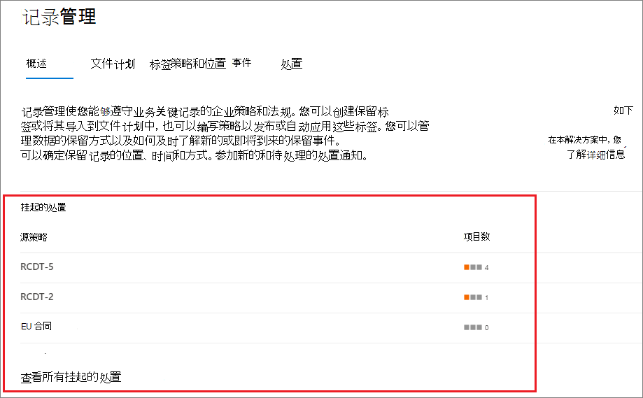
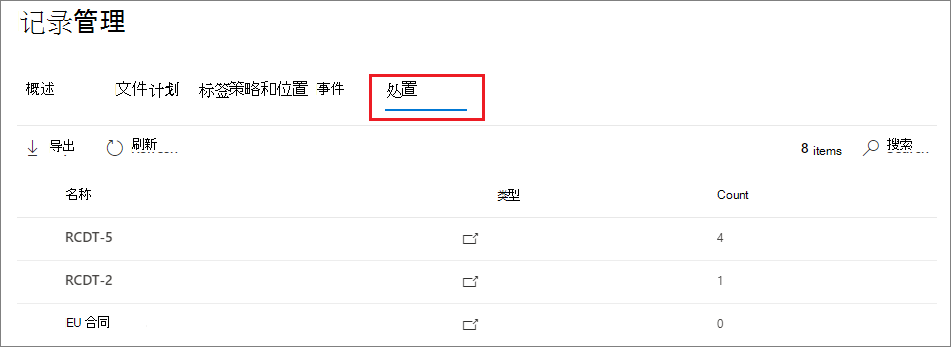
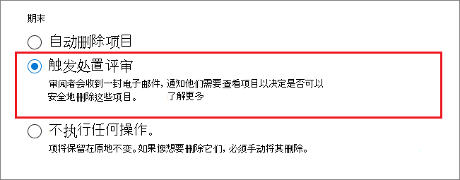
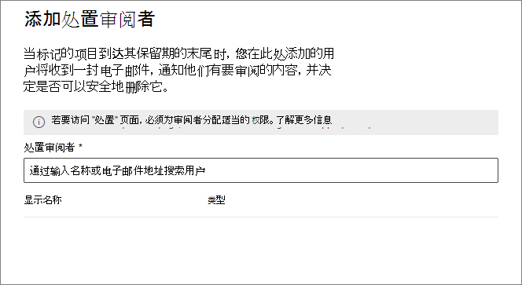
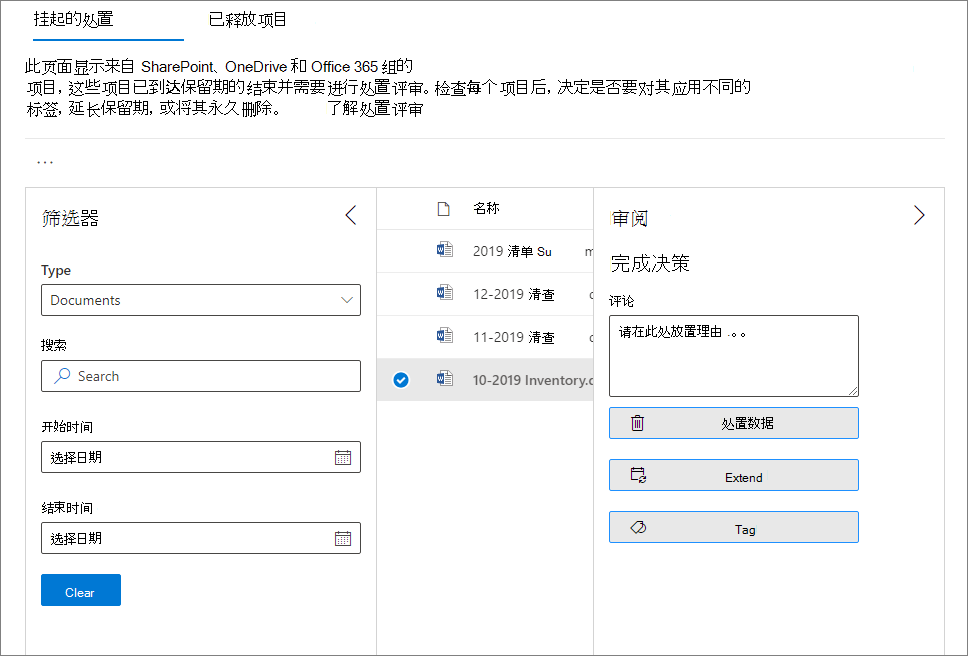
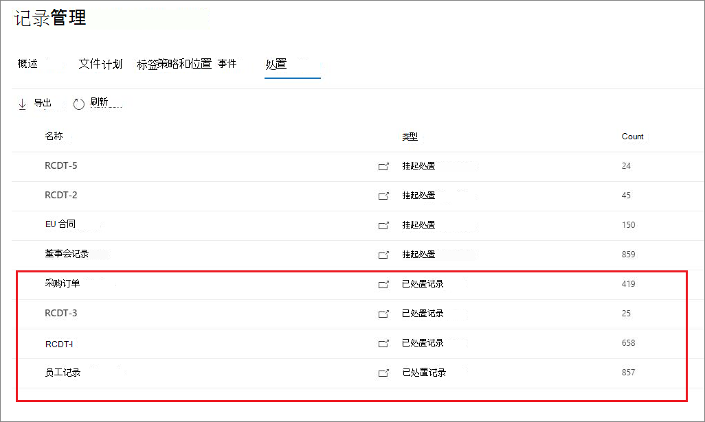

# <a name="disposition-of-content"></a>内容的处置

>*[Microsoft 365 安全性与合规性的许可指南](/office365/servicedescriptions/microsoft-365-service-descriptions/microsoft-365-tenantlevel-services-licensing-guidance/microsoft-365-security-compliance-licensing-guidance)。*

使用 Microsoft 365 合规中心“**记录管理**”中的“**处置**”页面来管理处置评审，并查看在保持期结束时自动删除的 [记录](records-management.md#records)的元数据。

## <a name="prerequisites-for-viewing-content-dispositions"></a>查看内容处置的前提条件

若要管理处置评审并确认已删除记录，必须具有足够的权限，并且必须启用审核。另外请注意处置的任何[限制](retention-limits.md#maximum-number-of-items-for-disposition)。

### <a name="permissions-for-disposition"></a>处置权限

若要成功访问 Microsoft 365 合规中心中的“**处置**”选项卡，用户必须拥有“**处置管理**”角色。 从 2020 年 12 月起，此角色现已纳入“**记录管理**”默认角色组中。

> [!NOTE]
> 默认情况下，不向全局管理员授予“**处置管理**”角色。 

若要仅为用户授予处置评审所需的权限，而不授予他们查看和配置保留和记录管理其他功能的权限，请创建一个自定义角色组（例如，命名为“处置审阅者”），并授予此组“**处置管理**”角色。

有关将用户添加到默认角色或创建自己的角色组的说明，请参阅 [Microsoft 365 合规中心中的权限](microsoft-365-compliance-center-permissions.md)。

另外：

- 若要在处置过程中查看项目的内容，请将用户添加到 **内容资源管理器内容查看者** 角色组。如果用户没有此角色组的权限，他们仍可选择一个处置评审操作来完成处置评审，但是执行此操作时无法在合规中心的迷你预览窗格中查看项目的内容。

- 默认情况下，访问 **处置** 页面的每个人只能看到分配给他们评审的项目。为使记录管理管理员能够查看分配给所有用户的所有项目以及配置用于处置评审的所有保留标签：导航到“**记录管理设置**” > “**常规**” > “**记录管理员安全组**”，选择并启用包含管理员帐户的已启用邮件的安全组。
    
    未启用邮件的 Microsoft 365 组和安全组不支持此功能，也不会显示在列表中供选择。 如果需要创建新的启用邮件的安全组，请使用指向 <a href="https://go.microsoft.com/fwlink/p/?linkid=2024339" target="_blank">Microsoft 365 管理中心</a> 的链接创建新组。 
    
    > [!IMPORTANT]
    > 启用组后，你无法在合规中心更改组。 请参阅下一部分，了解如何使用 PowerShell 启用其他组。

- “**记录管理设置**”选项仅对记录管理管理员可见。 

#### <a name="enabling-another-security-group-for-disposition"></a>启用另一个安全组用于处置

在 Microsoft 365 合规中心的“**记录管理设置**”中为处置启用了安全组后，你将无法对该组禁用此权限，也不能在合规中心中替换选定的组。但是，你可以使用 [Enable-ComplianceTagStorage](/powershell/module/exchange/enable-compliancetagstorage) cmdlet来启用其他启用邮件的安全组。

例如： 

```PowerShell
Enable-ComplianceTagStorage -RecordsManagementSecurityGroupEmail dispositionreviewers@contosoi.com
````

### <a name="enable-auditing"></a>启用审核

确保至少在第一次处置操作之前一天已启用审核。 有关详细信息，请参阅[在合规中心内搜索审核日志](search-the-audit-log-in-security-and-compliance.md)。 

## <a name="disposition-reviews"></a>处置评审

当内容的保持期结束时，这里有几个可能使人想审查其内容并确认它是否可以永久删除 (“处置”) 的原因。例如，若不删除其内容，可能需要:
  
- 暂停删除诉讼或审核相关的内容。

- 为内容指定不同的保留期，可能是因为原始保留设置是临时或暂时的解决方案。

- 将内容从现有位置移动到存档位置，例如当内容具有研究或历史价值时。

在保留期结束时触发处置评审时，你选择的审阅者将收到一封电子邮件通知，告知他们需要审阅的内容。这些审阅者可以是个人用户或启用邮件的安全组。

你可以自定义审阅者收到的通知电子邮件，包括不同语言的说明。 若要获得多语言支持，你必须自己指定翻译，此自定义文本将显示给所有审阅者，无论其区域设置如何都是如此。

在项目的保持期结束时，用户将收到每个标签的初始电子邮件通知，对于分配给他们的所有处置评审的每个标签，每周将收到一条提醒。 他们可以单击通知和提醒电子邮件中的链接，转到 Microsoft 365 合规中心中的“**处置**”页面以查看该内容并执行操作。 或者，审阅者可以直接转到合规中心中的“**处置**”页面。 则：

- 审阅者只能看到分配给他们的处置评审，而添加到所选“记录管理员安全组”的管理员将看到所有处置评审。

- 审阅者可以将新用户添加到同一处置评审中。 请注意，此操作不会自动向这些添加的用户授予 [所需的权限](#permissions-for-disposition)。

- 对于处置评审过程，每个项目的迷你审阅窗格会显示内容预览（如果他们有权查看该内容）。 如果他们没有权限，则可以选择内容链接并请求权限。 此迷你审阅窗格还包括有关内容的其他信息的选项卡：
   - **详细信息**，显示索引属性、其所在位置、创建者、创建时间和上次修改者以及上次修改时间。
   - **历史记录**，显示迄今为止任何处置评审操作的历史记录，以及审阅者备注（如果可用）。

处置评审可以包括 Exchange 邮箱、SharePoint 网站和 OneDrive 帐户中的内容。 只有在处置的最终阶段，审阅者选择永久删除内容后，这些位置中等待处置评审的内容才会被永久删除。

> [!NOTE]
> 邮箱必须至少有 10 MB 数据才能支持处置评审。

管理员可以在“**概览**”选项卡中查看所有挂起的处置的概述。审阅者只会看到其项目正在等待处置。例如：



选择 **查看所有挂起处置** 后，将转到 **处置** 页面。例如：




### <a name="workflow-for-a-disposition-review"></a>处置评审的工作流

下图显示了发布保留标签后再由用户手动应用时处置评审的基本工作流（单一阶段）。 此外，为处置评审配置的保留标签可自动应用于内容。
  


### <a name="how-to-configure-a-retention-label-for-disposition-review"></a>如何配置处置评审的保留标签

保持期结束时触发处置评审是一个配置选项，仅保留标签才能使用。 处置评审不适用于保留策略。 有关这两种保留解决方案的详细信息，请参阅[了解保留策略和保留标签](retention.md)。

来自 **定义保留标签的保留设置** 页面：


 
选择此“**触发处置评审**”选项后，在配置的下一页上，指定所需的处置连续阶段数以及每个阶段的处置评审：

 

选择“**添加阶段**”，并对阶段进行命名以方便识别。 然后指定该阶段的审阅者。

对于审阅者，请指定用户或启用邮件的安全组。 此选项不支持 Microsoft 365 组（[原 Office 365 组](https://techcommunity.microsoft.com/t5/microsoft-365-blog/office-365-groups-will-become-microsoft-365-groups/ba-p/1303601)）。

如果你需要多人在保持期结束后审阅某个项目，请再次选择“**添加阶段**”，并针对所需的阶段数重复配置过程，最多五个阶段。 

在处置的每个阶段，你为该阶段指定的任何用户都有权在保持期结束后对该项目执行下一个操作。这些用户还可以将其他用户添加到其处置审核阶段。

> [!NOTE]
> 如果在多阶段处置评审可用之前配置了保留标签，可以升级标签以支持此功能：在标签向导中，选择“**添加阶段**”，或编辑现有审阅者或添加新审阅者。

在配置阶段，对于指定的每个阶段，可以通过选择阶段操作选项 (**...**) 来对其重命名、重新排序或将其删除： 


但是，在创建保留标签后，你无法重新排序或删除阶段。

指定审阅者后，请记得授予他们“**处置管理**”角色权限。 有关详细信息，请参阅本页上的“[处置权限](#permissions-for-disposition)”部分。

### <a name="how-to-customize-email-messages-for-disposition-review"></a>如何自定义处置评审的电子邮件

发送给审阅者的默认电子邮件通知示例：


你还可以自定义发送给处置审阅者的电子邮件，以用于初始通知和提醒。

从合规中心的任意处置页面中，选择“**记录管理设置**”：  


然后选择“**处置通知**”选项卡，并指定是仅使用默认电子邮件模板，还是将你自己的文本添加到默认模板。 你的自定义文本将添加到保留标签相关信息之后和后续步骤说明之前的电子邮件说明中。

可添加所有语言的文本，但不支持格式和图像。 URL 和电子邮件地址可以文本格式输入，根据电子邮件客户端在自定义电子邮件中显示为超链接或不设置格式的文本。

要附加的示例文本：

```console
If you need additional information, visit the helpdesk website (https://support.contoso.com) or send them an email (helpdesk@contoso.com).
```

选择“**保存**”以保存任何更改。

### <a name="viewing-and-disposing-of-content"></a>查看和处置内容

通过电子邮件通知审阅者已准备好需评审的内容，他们将单击邮件中的链接，转到 Microsoft 365 合规中心内“**记录管理**”中的“**处置**”页面。 在这个页面中，审阅者可以查看每个保留标签有多少个项目正在等待处置，“**类型**”显示为“**挂起的处置**”。 然后，他们选择一个保留标签并 **在新窗口中打开** 以查看带有该标签的所有内容：


在 **挂起的处置** 页面上，他们会看到该标签的所有挂起处置。选择一个或多个项目后，他们可以使用迷你预览窗格以及“**来源**”、“**详细信息**”和“**历史记录**”选项卡来检查内容，然后再对其执行操作：



如果你使用水平滚动条，或关闭迷你审阅窗格，则会看到更多列，其包括到期日期和处置评审阶段的名称。

从所示的示例中可以看出，支持的操作包括： 
  
- **批准处置**：
    - 当为处置评审的过渡阶段选择此操作（你已配置多个阶段）时：项目将移至下一处置阶段。
    - 如果对处置评审的最后阶段选择此操作，或者只有一个处置阶段：项目被标记为有资格永久删除。 该删除的确切时间取决于工作量。 有关详细信息，请参阅[保留设置如何就地处理内容](retention.md#how-retention-settings-work-with-content-in-place)。
- **重新标记**：
    - 选择此操作时，项目将退出原始标签的处置评审过程。 然后，该项目受新选择的保留标签的保留设置所影响。
- **延期**：
    - 选择此操作后，处置评审将有效暂停，直到延长期结束，然后从第一阶段开始再次触发处置评审。
- **添加审阅者**：
    - 选择此操作后，系统将提示用户指定和添加其他用户以进行审阅。
    
    > [!NOTE]
    > 此操作不会自动向添加的用户授予[所需权限](#permissions-for-disposition)。 如果他们没有这些权限，则将无法参与处置评审。

采取的每项操作在[处置评审活动](search-the-audit-log-in-security-and-compliance.md#disposition-review-activities)审计活动组中都有对应的审计事件。

在处置评审期间，内容从不会从原始位置移动，并且在审阅者为最终或唯一处置阶段选择此操作之前，该内容不会被标记为永久删除。

## <a name="disposition-of-records"></a>处置记录

使用“**记录管理**”页面的“**处置**”选项卡识别：

- 处置审阅后删除的项目。
- 标记为保留期限结束后自动删除的记录或法规记录的项目。

这些项目会在 **类型** 列中显示 **已处置记录**。例如：



> [!NOTE]
> 此功能使用 [统一审核日志](search-the-audit-log-in-security-and-compliance.md) 中的信息，因此需要允许审核以使其 [启动且可搜索](turn-audit-log-search-on-or-off.md)，以便捕获相应的事件。

若要审核标记为记录或法规记录的已删除项目，请在“**文件和页面活动**”类别中搜索“**已删除的标记为记录的文件**”。此审核事件对文档和电子邮件适用。

## <a name="filter-and-export-the-views"></a>筛选和导出视图

从 **处置** 页面选择保留标签时，**待处置** 选项卡（如果适用）和 **已处置项目** 选项卡可用于筛选视图，帮助更轻松地查找项目。

对于待处置的，时间范围以终止日期为准。 对于已处置的项目，时间范围以删除日期为准。
  
可将任意视图中项目的相关信息导出为 .csv 文件，然后可使用 Excel 对其进行排序和管理。
