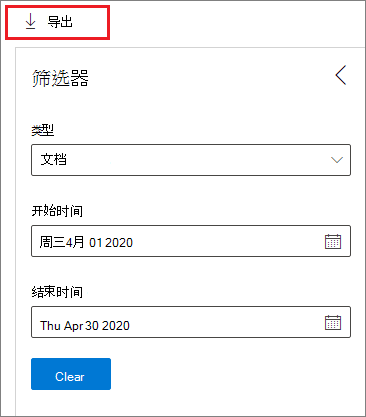

# 内容的处置

>*[Microsoft 365 安全性与合规性的许可指南](https://aka.ms/ComplianceSD)。*

使用 Microsoft 365 合规中心中 **记录管理** 中的 **处置** 选项卡来管理处置评审，并查看在保留期结束时自动删除 [记录](records-management.md#records)。 

## 查看内容处置的前提条件

若要管理处置评审并确认已删除记录，必须具有足够的权限，并且必须启用审核。

### 处置权限

若要成功访问 Microsoft 365 合规中心中的 **处置** 选项卡，用户必须拥有 **处置管理** 管理员角色。 从2020年12月起，该角色现已纳入 **记录管理** 默认管理员角色组中。

> [!NOTE]
> 默认情况下，不将全局管理员授予为 **处置管理** 角色。 

若要仅为用户授予处置审阅所需的权限，而不授予他们查看和配置保留和记录管理其他功能的权限，请创建一个自定义角色组（例如，命名为 “处置审阅员”），并授予该组处置管理角色。

此外，若要在处置过程中查看项目的内容，可将用户添加到以下两个角色组： **"内容资源管理器内容查看器"** 和 **"内容资源管理器列表查看器"**。 如果用户没有这些角色组的权限，他们仍可选择处置审阅操作来完成处置评审，但执行此操作无法在合规中心查看项目的内容。

有关配置这些权限的说明，请参阅[允许用户访问Office 365安全与合规中心](../security/office-365-security/grant-access-to-the-security-and-compliance-center.md)。

### 启用审核

确保至少在第一次处置操作之前一天已启用审核。 有关详细信息，请参阅[在 Office 365 安全&amp;合规中心](search-the-audit-log-in-security-and-compliance.md)内搜索审核日志。 

## 处置评审

内容到达其保持期结束时，有几个原因可能会让你审查该内容来确定是否可以安全地删除（"已处置"）。 例如，你可能需要：
  
- 在诉讼或审计的事件中，暂停对相关内容的删除。
    
- 如果内容有研究或历史价值，则从处置列表中删除该内容存储至档案中。
    
- 为内容指定不同的保留期，可能是因为原始保留设置是临时或暂时的解决方案。
    
- 将内容返回至客户端，或将其转移到其他组织。

在保持期结束时触发处置评审时：
  
- 你选择的人员将收到一封电子邮件通知，告知他们有内容需要审查。 这些审阅者可以是单个用户或启用了邮件的安全组。 注意，通知是每周发送一次。
    
- 审阅者转到 Microsoft 365 合规中心的 **处置** 选项卡审查内容，并决定是否要将其永久删除、延长其保留期或应用不同的保留标签。

处置评审可以包括Exchange邮箱、SharePoint网站、OneDrive账户和Microsoft 365组中的内容。 仅在审阅者选择永久删除内容后，才会删除在这些位置等候处置审核的内容。

> [!NOTE]
> 一个邮箱必须有至少10MB的数据来支持处置评审。

可在 **概述** 选项卡中查看所有待处置的概述。例如：

选择 **查看所有待处置** 后，则转到 **处置** 页面。 例如：

### 处置评审的工作流

下图显示了发布保留标签后再由用户手动应用时处置评审的基本工作流。 此外，为处置评审配置的保留标签可自动运用于内容。
  

  
保持期结束时触发处置评审是一个配置选项，仅保留标签才能使用。 此选项在保留策略中不可用。 有关这两种保留解决方案的详细信息，请参阅[了解保留策略和保留标签](retention.md)。

来自 **定义保留标签的保留设置** 页面：

 
选择此 **触发处置审核** 选项后，可在向导的下一页上指定处置审阅者：

对审阅者指定一个用户或邮件启用安全组。 此选项不支持 Microsoft 365 组（[原 Office 365 组](https://techcommunity.microsoft.com/t5/microsoft-365-blog/office-365-groups-will-become-microsoft-365-groups/ba-p/1303601)）。

### 查看和处置内容

通过电子邮件通知审阅者已准备好所需评论的内容时，他们将转到 Microsoft 365 合规中心中 **记录管理** 中的 **处置** 选项卡。 审阅者可以查看每个保留标签中有多少项正在等待处置，然后选择一个保留标签即可查看带有该标签的所有内容。

选择保留标签后，可在 **待处置** 选项卡中查看带有该标签的所有待处置。选择一个或多个项目，然后可以在其中选择一个操作并输入评论理由：

从图中可以看出，支持的操作如下： 
  
- 永久删除项目
- 延长保留期
- 应用不同的保留标签

提供对位置和内容的权限，可使用 **位置** 列中的链接查看原始位置中的文档。 在处置评审过程中，内容永远不会从其原始位置移动，并且在审阅者选择执行此操作之前，永远不会删除该内容。

每周都会自动向审核者发送电子邮件通知。 此计划流程表示当内容到达其保留期末尾时，审阅者可能需要长达7天的时间才能收到内容正在等待处置的电子邮件通知。
  
可对所有处置操作进行审核，审阅者输入的理由文本将保存并显示在 **已处置项目** 页面上的 **评论** 列中。
  
### 永久删除处置的内容需要多长时间

仅在审阅者选择永久删除内容后，才会删除等候处置审核的内容。 审阅者选择此选项时，SharePoint 网站或 OneDrive 帐户中的内容将符合[保留设置如何与内容配合到位](retention.md#how-retention-settings-work-with-content-in-place)中所描述的标准清理流程的条件。

## 处置记录

使用 **记录管理** 页面中的 **处置** 选项卡来识别当前需删除的记录是自动删除，或是经过处置评审后删除。 这些项目在 **类型** 列中的 **已处置记录** 里显示。 例如：

在记录标签的 **已处置项目** 选项卡中显示的项目，在该项目被处置后最多保留7年，在此期间，每条记录的上限为一百万项。 如果看到 **计数** 数字接近一百万这一限制，并且需要对记录进行处置证明，请联系 [Microsoft 支持](https://docs.microsoft.com/office365/admin/contact-support-for-business-products)。

> [!NOTE]
> 此功能基于 [统一审核日志](search-the-audit-log-in-security-and-compliance.md) 中的信息，因此需要[启动并可搜索](turn-audit-log-search-on-or-off.md)审核，以便捕获相应的事件。

对于审核，搜索 **标记为记录的已删除文件**，该文件位于 "**文件和页面活动"** 类别 。 此审核事件适用于文档和电子邮件。

## 筛选和导出视图

从 **处置** 页面选择保留标签时，**待处置** 选项卡（如果适用）和 **已处置项目** 选项卡可用于筛选视图，帮助更轻松地查找项目。 

对于待处置的，时间范围以终止日期为准。 对于已处置的项目，时间范围以删除日期为准。
  
可将任意视图中的项目的信息导出为 .csv 文件，然后即可使用 Excel 对其进行排序和管理：

