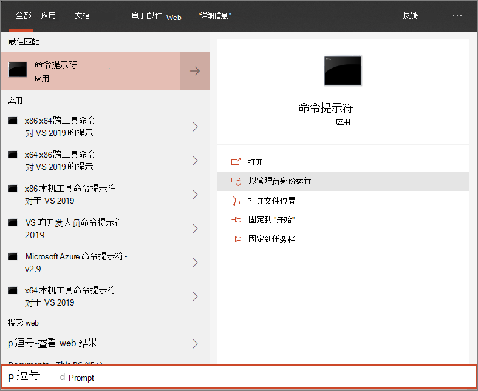

# 使用本地脚本载入 Windows 10 设备

**适用于：**

- [Microsoft 365DLP (终结点数据丢失) ](./endpoint-dlp-learn-about.md)

还可以手动载入各个设备，Microsoft 365终结点数据丢失防护。 在承诺载入网络内的所有设备之前，你可能希望先在测试服务时这样做。

> [!IMPORTANT]
> 此脚本已优化为在最多 10 台设备上使用。
>
> 若要大规模部署，请使用 [其他部署选项](dlp-configure-endpoints.md)。 例如，可以使用在使用组策略载入 Windows 10 设备中提供的脚本，将载入脚本部署到生产中的 10[多个设备](dlp-configure-endpoints-gp.md)。

## 载入设备
 
1.  打开 GP 配置包.zip文件 *(DeviceComplianceOnboardingPackage.zip)* 从服务载入向导下载的内容。 您还可以从 Microsoft 合规性中心 [获取程序包](https://compliance.microsoft.com)

2. 在导航窗格中，选择 **"设置**  >  **载入"。**

3. 在"**部署方法"** 字段中，选择"**本地脚本"。**

4. 单击 **下载程序包** 并保存.zip文件。
  
5. 将配置包的内容解压缩到你想要载入 (的位置，例如桌面) 。 你应该有一个名为 *DeviceOnboardingScript.cmd 的文件*。

6.  在设备上打开提升的命令行提示符并运行脚本：

7.  转到“**开始**”并键入“**cmd**”。

8.  右键单击“**命令提示符**”，然后选择“**以管理员身份运行**”。

    

9.  键入脚本文件的位置。 如果将文件复制到桌面，请键入 *：%userprofile%\Desktop\WindowsDefenderATPOnboardingScript.cmd*

10.  按 **Enter 键** 或单击"确定 **"。**

若要了解如何手动验证设备是否合规并正确报告传感器数据，请参阅载入Microsoft Defender 高级威胁防护[疑难解答](/windows/security/threat-protection/microsoft-defender-atp/troubleshoot-onboarding)。

## 使用本地脚本的载出设备
出于安全考虑，用于"载出"设备的程序包将在下载日期 30 天后过期。 发送到设备的过期载出包将被拒绝。 下载载出包时，你将收到程序包到期日期的通知，该日期也将包含在程序包名称中。

> [!NOTE]
> 载入和载出策略不得同时部署在同一设备上，否则将导致不可预知的冲突。

1. 从 Microsoft 合规性中心获取 [载出包](https://compliance.microsoft.com)

2. 在导航窗格中，选择 **"设置**  >  **设备载出"。**

3. 在"**部署方法"** 字段中，选择"**本地脚本"。**

4. 单击 **下载程序包** 并保存.zip文件。

5. 将文件.zip到设备可以访问的共享只读位置。 你应该有一个名为 *DeviceComplianceOffboardingScript_valid_until_YYYY-MM-DD.cmd 的文件*。

6.  在设备上打开提升的命令行提示符并运行脚本：

7.  转到“**开始**”并键入“**cmd**”。

8.  右键单击“**命令提示符**”，然后选择“**以管理员身份运行**”。

    

9.  键入脚本文件的位置。 如果将文件复制到桌面，请键入 *：%userprofile%\Desktop\WindowsDefenderATPOffboardingScript_valid_until_YYYY-MM-DD.cmd*

10.  按 **Enter 键** 或单击"确定 **"。**

> [!IMPORTANT]
> 载出导致设备停止向门户发送传感器数据。

## 监视设备配置
可以按照 [载入问题疑难解答] ( (中的不同验证步骤来验证脚本是否成功完成以及 https://docs.microsoft.com/windows/security/threat-protection/microsoft-defender-atp/troubleshoot-onboarding) 代理是否正在运行。

也可以直接在门户上或使用不同的部署工具进行监视。

### 使用门户监视设备
1. 转到Microsoft 365[合规中心。](https://compliance.microsoft.com)

2. 选择 **设置**  >  **设备**  >  **载入设备"。**

3. 验证设备是否显示。

## 相关主题
- [使用Windows 10载入设备](dlp-configure-endpoints-gp.md)
- [使用Windows 10载入Microsoft Endpoint Configuration Manager](dlp-configure-endpoints-sccm.md)
- [使用移动设备管理工具载入 Windows 10 设备](dlp-configure-endpoints-mdm.md)
- [载入非永久虚拟桌面基础结构 （VDI） 设备](dlp-configure-endpoints-vdi.md)
- [在新载入的 Microsoft Defender 终结点设备上运行检测测试](/windows/security/threat-protection/microsoft-defender-atp/run-detection-test)
- [载入Microsoft Defender 高级威胁防护疑难解答](/windows/security/threat-protection/microsoft-defender-atp/troubleshoot-onboarding)