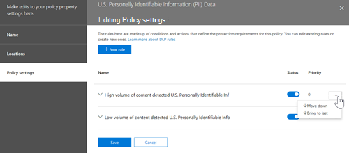

# 规划 DLP (数据丢失) 

每个组织都将以不同的方式 (DLP) 数据丢失防护，因为每个组织的业务需求、目标、资源和情况对于他们来说都是独一无二的。 但是，所有成功的 DLP 实现都有一些共同的元素。 本文介绍组织在 DLP 规划中使用的最佳实践。

## 多个起点

许多组织选择实施 DLP 以遵守各种政府或行业法规。 例如，欧盟的一般数据保护条例 (GDPR) 、《健康保险便利和责任法》 (HIPAA) 或加州消费者隐私法案 (CCPA) 。 它们还实施数据丢失防护来保护其知识产权。 但是 DLP 旅程中的起始位置和最终目的地有所不同。 

组织可以开始其 DLP 旅程：

- 来自平台焦点，例如想要保护聊天Teams频道消息或Windows 10的信息
- 了解他们希望优先保护哪些敏感信息（如医疗保健记录）并直接定义保护策略
- 在不知道敏感信息是什么、敏感信息位于何处以及谁对敏感信息执行哪些操作的情况下，他们从发现和分类开始，采取更系统的方法
- 他们不知道敏感信息是什么、什么位置或谁在使用它做什么，但他们直接进入定义策略，将那些结果用作起点，然后从这些位置优化其策略
- 知道他们需要实现信息保护Microsoft 365，因此打算采用更长期、有条理的方法

这些只是客户如何处理 DLP 的一些示例，从何处开始并不重要，Microsoft 365 DLP 足够灵活，足以适应从开始到完全实现的数据丢失防护策略的各种类型的信息保护之旅。 

## 规划过程概述

[了解数据丢失防护介绍了](dlp-learn-about-dlp.md#learn-about-data-loss-prevention)DLP 规划过程的三[个不同方面](dlp-learn-about-dlp.md#plan-for-dlp)。 我们将在此处详细介绍所有 DLP 计划的常见元素。

### 确定利益干系人

实施后，DLP 策略可应用于组织的很大一部分。 IT 无法自行制定广泛的计划，且无负面影响。 需要确定能够：

- 介绍组织要遵守的法规、法律和行业标准
- 要保护的敏感项目类别
- 它们所使用的业务流程
- 应受限的风险行为
- 根据所涉及项目的敏感度和风险确定应首先保护哪些数据的优先级
- 概述 DLP 策略匹配事件检查和修正过程 
 
一般情况下，这些需要具有 85% 的法规和合规性保护，以及 15% 的知识产权保护。 下面是有关要包括在规划过程中的角色的一些建议：

- 法规和合规部官员
- 首席风险官
- 法律官
- 安全与合规部官员
- 数据项的业务所有者
- 业务用户
- IT

### 描述要保护的敏感信息类别

然后，利益干系人描述要保护的敏感信息的类别业务流程使用的敏感信息类别。 例如，Microsoft 365 DLP 定义以下类别：

- 金融 
- 医疗健康信息
- 隐私
- 自定义警报

利益干系人可能会将敏感信息标识为"We are a data processor， so we have to implement privacy protections on data subject information and financial information"。

 
  <!-- The business process is important as it informs the ‘data at rest’, ‘data in transit’, ‘data in use’ aspect of DLP planning and who should be sharing the items and who should not.-->

### 设置目标和策略

确定利益干系人并知道需要保护哪些敏感信息以及在何处使用敏感信息后，利益干系人可以设置其保护目标，IT 部门可以制定实施计划。 

 <!--
### Discovery
 for the locations (DLP workloads) of these types of items.  (mapping DLP locations and data at rest, data in transit, data in use)

### IT can start coding test policies
start small and always in test mode. Note that DLP policies can feed into insider risk.

### Business process owners help with tuning
 false positive/false negative results and fitting DLP into their business processes.

-->

### 设置实施计划

你的实施计划应包括：

- 映射你的开始状态和所需的结束状态以及从一个开始状态到另一个状态的步骤
- 如何处理敏感项目的发现
- 策略规划及其实现顺序
- 您将如何处理任何先决条件
- 规划在移动到强制执行之前如何首先测试策略
- 如何培训最终用户
- 如何测试和调整策略
- 如何根据不断变化的法规、法律、行业标准或知识产权和业务需求审阅和更新数据丢失防护策略

#### 从开始到所需结束状态映射路径

记录组织从开始状态到所需结束状态的方式对于与利益干系人沟通和设置项目范围至关重要。 下面是一组通常用于部署 DLP 的步骤。 你更需要此详细信息，但可以使用它来设置 DLP 采用路径。

#### 敏感项目发现

有多种方法可发现各个敏感项及其所在的位置。 您可能已部署敏感度标签，或者您可能决定将广泛的 DLP 策略部署到仅发现和审核项目的所有位置。 若要了解更多信息，请参阅 [了解数据](information-protection.md#know-your-data)。

#### 策略规划

开始采用 DLP 时，可以使用这些问题重点关注策略设计和实施工作。

##### 您的组织必须遵守哪些法律、法规和行业标准？

因为许多组织都以合规性为目标来使用 DLP，所以回答此问题是规划 DLP 实施的自然起点。 但是，作为 IT 实施者，你可能没有找到答案。 它需由法律团队和业务主管回答。 
 
**示例** 你的组织受英国 财务法规。

##### 你的组织具有哪些必须防止泄露的敏感项目？

在贵组织了解其就法规合规性需求而言的情况后，您将了解需要保护哪些敏感项目免受泄露，以及您希望如何确定策略实施优先级以保护它们。 这将帮助你选择最合适的 DLP 策略模板。 Microsoft 365预配置的 DLP 模板用于财务、医疗与健康、隐私，并且您可以使用自定义模板构建您自己的模板。 设计和创建实际 DLP 策略时，了解此问题的回答还将帮助你选择正确的 [敏感信息类型](sensitive-information-type-learn-about.md#learn-about-sensitive-information-types)。

**示例** 若要快速入门，请选取 `U.K. Financial Data` 策略模板，其中包括 、 和 `Credit Card Number` `EU Debit Card Number` `SWIFT Code` 敏感信息类型。 

##### 敏感项目及其涉及的业务流程在哪里？

在业务过程中，每天都会使用包含组织敏感信息的项目。 您需要了解该敏感信息的实例可能会发生在何处以及这些实例在哪些业务流程中使用。 这将帮助你选择要应用 DLP 策略的合适位置。 Microsoft 365DLP 策略适用于位置：

- Exchange 电子邮件
- SharePoint 网站
- OneDrive 账户
- Teams 聊天和通道消息
- Windows 10设备
- Microsoft Cloud App Security
- 本地存储库

**示例** 组织的内部审核员正在跟踪一组信用卡号。 它们将其电子表格放在安全的安全SharePoint中。 一些员工会进行复制，并将其保存到工作OneDrive for Business网站，该站点会同步到Windows 10设备。 其中一个将其中 14 个人的列表粘贴到电子邮件中，并尝试将其发送给外部审核员进行审阅。 您希望将策略应用于安全安全SharePoint、所有内部审核员OneDrive for Business帐户、Windows 10设备和Exchange电子邮件。

##### 组织对泄露的容忍度如何？

贵组织中不同的组可能对敏感项目泄露的可接受级别和不可接受程度有不同的观点。 实现零泄露的实现可能会给业务造成太高的成本。

**示例** 组织的安全组以及法律团队都觉得不得与组织外部的任何人共享信用卡号，并坚持零泄露。 但是，作为定期审核信用卡号活动的一部分，内部审核员必须与第三方审核员共享一些信用卡号。 如果您的 DLP 策略禁止在组织外共享所有信用卡号，业务流程重大中断并增加了成本，以减少中断，以便内部审核员完成跟踪。 管理层领导无法接受此额外成本。 若要解决此问题，需要进行内部对话，以决定可接受的泄露级别。 一旦决定，该策略可以为特定人员提供共享信息的例外，或者可在仅审核模式下应用它。

#### 规划先决条件

在监视某些 DLP 位置之前，必须先满足一些先决条件。 请参阅 **开始之前部分** ：

- [开始进行本地扫描仪的数据丢失防护（预览）](dlp-on-premises-scanner-get-started.md#before-you-begin)
- [终结点数据丢失防护入门](endpoint-dlp-getting-started.md#before-you-begin)
- [Microsoft 合规性扩展和预览版 (入门) ](dlp-chrome-get-started.md#before-you-begin)
- [对非 Microsoft 云应用使用数据丢失防护策略 (预览) ](dlp-use-policies-non-microsoft-cloud-apps.md#before-you-begin)

#### 策略部署

创建 DLP 策略时，您应考虑逐步部署策略，在完全强制执行策略之前评估其影响，并测试其有效性。 例如，您不希望新的 DLP 策略无意中阻止对数千个文档的访问或破坏现有业务流程。
  
如果你创建的 DLP 策略具有较大的潜在影响，建议你按以下顺序执行操作：
  
1. **在不使用策略提示的情况下启动测试模式**，然后使用 DLP 报告和任何事件报告评估影响。 您可以使用 DLP 报告查看匹配策略的次数、位置、类型和严重性。 根据结果，您可以根据需要微调策略。 在测试模式下，DLP 策略不会影响您组织内的工作人员的工作效率。 此外，使用此阶段测试您的工作流，进行 DLP 事件审阅并发出修正。
    
2. **使用通知和** 策略策略使用技巧移动到测试模式，以便你可以开始向用户学习合规性策略，并为将要应用的策略做好准备。 通过指向组织策略页的链接，该链接在策略提示中提供有关策略的更多详细信息，这非常有用。 在此阶段，您还可以要求用户报告误报，以便可以进一步优化策略。 一旦确定策略应用程序的结果与利益干系人记住的结果一致，就进入此阶段。 
    
3. **开始完全强制执行策略**，以便应用规则中的操作，并保护内容。 继续监视 DLP 报告及任何事件报告或通知，确保结果是你所期望的。 

    

    你可以随时关闭 DLP 策略，这将影响此策略中的所有规则。 但是，也可以通过在规则编辑器中切换其状态来单独关闭每个规则。

    

    你还可以更改策略中的多个规则的优先级。 若要执行此操作，请打开要编辑的策略。 在规则行中，选择省略号 (**...**)，然后选择一个选项，例如“**下移**”或“**移到最后**”。

    

#### 最终用户培训

触发 DLP 策略后，可以将策略配置为发送电子邮件通知，并将 [DLP](use-notifications-and-policy-tips.md#send-email-notifications-and-show-policy-tips-for-dlp-policies) 策略的策略提示显示给管理员和最终用户。 虽然策略仍处于测试模式且未设置为强制执行阻止操作，但策略提示是一种有用的方法，用于提升对敏感项目风险行为的感知，并培训用户在将来避免这些行为。  

#### 查看 DLP 要求和更新策略

组织所遵守的法规、法律和行业标准将随着时间的推移而改变，DLP 的业务目标也将发生变化。 请务必包括所有这些领域的定期评审，以便贵组织保持合规性，并且您的 DLP 实施继续满足您的业务需求。

## 部署方法

|客户业务需求说明  | 方法  |
|---------|---------|
|**Contoso Bank** 是一个高度管控的行业，在许多不同位置具有许多不同类型的敏感项目。   - 了解敏感信息类型是最高优先级。   - 随着策略的推出，必须最大限度地减少业务中断。   - 具有 IT 资源，可以雇用专家来帮助规划、设计部署   - 与 Microsoft 签订顶级支持合同| - 花时间了解他们必须遵守哪些法规以及如何遵守。   -花时间了解信息保护堆栈的Microsoft 365价值   - 为优先项目制定敏感度标签方案并应用   - 涉及业务流程所有者  - 设计/代码策略，在测试模式下部署，培训用户  - 重复|
|**TailSpin Toys** 不知道它们是什么或在哪里，并且很少甚至没有资源深度。 它们广泛使用Teams、OneDrive for Business和Exchange应用。     |- 从优先位置的简单策略开始。  - 监视识别哪些项  - 相应地应用敏感度标签  - 优化策略，培训用户       |
|**Fabrikam** 是一家小型初创公司，希望保护其知识产权，并且必须快速移动。 他们愿意投入一些资源，但无法承受聘用外部专家。  - 敏感项目全部Microsoft 365 OneDrive for Business/SharePoint  - 应用OneDrive for Business和SharePoint速度较慢，员工/影子 IT 使用 DropBox 和 Google 驱动器来共享/存储项目  - 员工在数据保护规范方面的价值工作速度  - 客户清除并购买所有 18 名员工Windows 10设备     |- 利用默认 DLP 策略Teams  - 对项目使用默认设置SharePoint受限  - 部署阻止外部共享的策略  - 将策略部署到优先位置  - 将策略部署到Windows 10设备  - 阻止上载到非OneDrive for Business云存储      |

<!--

## Planning for workloads

### Exchange

### SharePoint

### OneDrive for Business

### Teams

### Windows 10 Devices

### Microsoft Cloud App Security (MCAS)

### On-premises Scanner
-->

## 另请参阅
- [了解数据丢失防护](dlp-learn-about-dlp.md#learn-about-data-loss-prevention)
