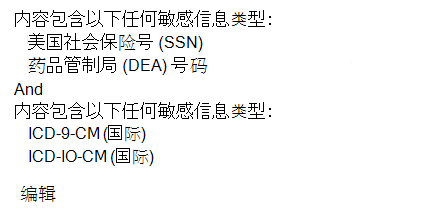
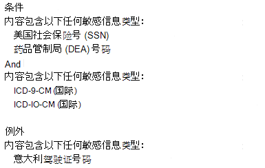
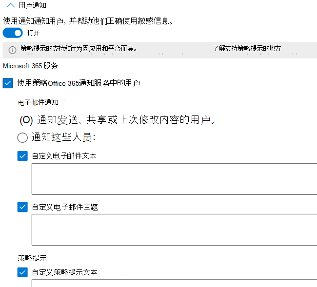
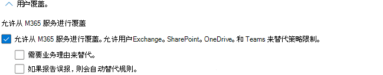
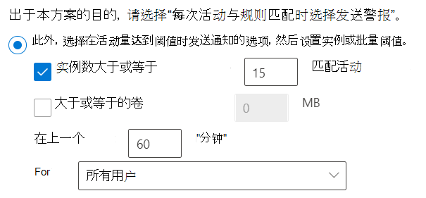

# 数据丢失防护策略参考

DLP 策略 (数据丢失) 有很多要配置的组件。 若要创建有效的策略，您需要了解每个组件的用途及其配置如何改变策略的行为。 本文提供了 DLP 策略的详细分析。

## 策略模板 

DLP 策略模板分为四类：

- 可以检测和保护财务信息 **类型的** 那些信息。
- 可检测和保护医疗 **健康信息类型的** 信息。
- 可以检测和保护隐私信息 **类型的** 信息。
- 一 **个** 自定义模板，如果其他模板之一不满足组织需求，则可用于构建自己的策略。

此表列出了所有策略模板及其 (SIT) 敏感信息类型。 

updated： 06/23/2021

|类别| 模板 | SIT |
|---------|---------|---------|
|金融| 澳大利亚财务数据| - [SWIFT 代码](sensitive-information-type-entity-definitions.md#swift-code)   - [澳大利亚税务文件编号](sensitive-information-type-entity-definitions.md#australia-tax-file-number)   - [澳大利亚银行帐号](sensitive-information-type-entity-definitions.md#australia-bank-account-number)   - [信用卡号](sensitive-information-type-entity-definitions.md#credit-card-number)|
|金融| 加拿大财务数据 |- [信用卡号](sensitive-information-type-entity-definitions.md#credit-card-number)   - [加拿大银行帐号](sensitive-information-type-entity-definitions.md#canada-bank-account-number)|
|金融| 法国财务数据 |- [信用卡号](sensitive-information-type-entity-definitions.md#credit-card-number)   - [欧盟借记卡号](sensitive-information-type-entity-definitions.md#eu-debit-card-number)|
|金融| 德国财务数据 |- [信用卡号](sensitive-information-type-entity-definitions.md#credit-card-number)   - [欧盟借记卡号](sensitive-information-type-entity-definitions.md#eu-debit-card-number)|
|金融| 以色列财务数据 |- [以色列银行帐号](sensitive-information-type-entity-definitions.md#israel-bank-account-number)   - [SWIFT 代码](sensitive-information-type-entity-definitions.md#swift-code)   - [信用卡号](sensitive-information-type-entity-definitions.md#credit-card-number)|
|金融| 日本财务数据 |- [日本银行帐号](sensitive-information-type-entity-definitions.md#japan-bank-account-number)   - [信用卡号](sensitive-information-type-entity-definitions.md#credit-card-number)|
|金融| PCI 数据安全标准 (PCI DSS)|- [信用卡号](sensitive-information-type-entity-definitions.md#credit-card-number)|
|金融| 沙特阿拉伯反网络犯罪法|- [SWIFT 代码](sensitive-information-type-entity-definitions.md#swift-code)   - [IBAN (国际银行) ](sensitive-information-type-entity-definitions.md#international-banking-account-number-iban) |
|金融| 沙特阿拉伯财务数据 |- [信用卡号](sensitive-information-type-entity-definitions.md#credit-card-number)   - [SWIFT 代码](sensitive-information-type-entity-definitions.md#swift-code)   - [IBAN (国际银行) ](sensitive-information-type-entity-definitions.md#international-banking-account-number-iban)|
|金融| 英国财务数据|- [信用卡号](sensitive-information-type-entity-definitions.md#credit-card-number)   - [欧盟借记卡号](sensitive-information-type-entity-definitions.md#eu-debit-card-number)   - [SWIFT 代码](sensitive-information-type-entity-definitions.md#swift-code)|
|金融| 美国财务数据|- [信用卡号](sensitive-information-type-entity-definitions.md#credit-card-number)   - [美国银行帐号](sensitive-information-type-entity-definitions.md#us-bank-account-number)  - [ABA 路由号码](sensitive-information-type-entity-definitions.md#aba-routing-number)|
|金融| 美国联邦贸易委员会 (FTC) 消费者规则|- [信用卡号](sensitive-information-type-entity-definitions.md#credit-card-number)   - [美国银行帐号](sensitive-information-type-entity-definitions.md#us-bank-account-number)  - [ABA 路由号码](sensitive-information-type-entity-definitions.md#aba-routing-number)|
|金融| 美国格雷姆-格雷姆-拉雷法案 (GLBA) 增强版|- [信用卡号](sensitive-information-type-entity-definitions.md#credit-card-number)   - [美国银行帐号](sensitive-information-type-entity-definitions.md#us-bank-account-number)  - [ITIN 用户的个人纳税 (标识号) ](sensitive-information-type-entity-definitions.md#us-individual-taxpayer-identification-number-itin)    - [SSN (美国社会保险号码) ](sensitive-information-type-entity-definitions.md#us-social-security-number-ssn)  - [美国/英国护照号码](sensitive-information-type-entity-definitions.md#us--uk-passport-number)   -[美国驾驶证号码](sensitive-information-type-entity-definitions.md#us-drivers-license-number)|
|金融| 格雷姆-里奇-比利雷法案 (GLBA)|- [信用卡号](sensitive-information-type-entity-definitions.md#credit-card-number)   - [美国银行帐号](sensitive-information-type-entity-definitions.md#us-bank-account-number)  - [ITIN 用户的个人纳税 (标识号) ](sensitive-information-type-entity-definitions.md#us-individual-taxpayer-identification-number-itin)    - [SSN (美国社会保险号码) ](sensitive-information-type-entity-definitions.md#us-social-security-number-ssn)|
|医疗和健康| 澳大利亚健康记录法案 (HRIP 法案) 增强 |- [澳大利亚税务文件编号](sensitive-information-type-entity-definitions.md#australia-tax-file-number)   - [澳大利亚医疗帐号](sensitive-information-type-entity-definitions.md#australia-medical-account-number)|
|医疗和健康| 澳大利亚健康记录法案（HRIP 法案）|- [澳大利亚税务文件编号](sensitive-information-type-entity-definitions.md#australia-tax-file-number)   - [澳大利亚医疗帐号](sensitive-information-type-entity-definitions.md#australia-medical-account-number)|
|医疗和健康| 加拿大健康信息法案 (HIA) |- [加拿大护照号码](sensitive-information-type-entity-definitions.md#canada-passport-number)  - [加拿大社会保险号码](sensitive-information-type-entity-definitions.md#canada-social-insurance-number)   - [加拿大卫生服务号码](sensitive-information-type-entity-definitions.md#canada-health-service-number)   - [加拿大个人健康标识号](sensitive-information-type-entity-definitions.md#canada-personal-health-identification-number-phin)|
|医疗和健康| 加拿大《加拿大个人健康信息法》 (巴) PHIA|- [加拿大社会保险号码](sensitive-information-type-entity-definitions.md#canada-social-insurance-number)   - [加拿大卫生服务号码](sensitive-information-type-entity-definitions.md#canada-health-service-number)   - [加拿大个人健康标识号](sensitive-information-type-entity-definitions.md#canada-personal-health-identification-number-phin)|
|医疗和健康| 加拿大《加拿大个人健康法》 (PHIPA) On一 |- [加拿大护照号码](sensitive-information-type-entity-definitions.md#canada-passport-number)  - [加拿大社会保险号码](sensitive-information-type-entity-definitions.md#canada-social-insurance-number)   - [加拿大卫生服务号码](sensitive-information-type-entity-definitions.md#canada-health-service-number)   - [加拿大个人健康标识号](sensitive-information-type-entity-definitions.md#canada-personal-health-identification-number-phin)|
|医疗和健康| 英国获取医疗报告法案|- [英国国家卫生服务号码](sensitive-information-type-entity-definitions.md#uk-national-health-service-number)   - [英国国家保险号码 (NINO) ](sensitive-information-type-entity-definitions.md#uk-national-insurance-number-nino)|
|医疗和健康| 美国健康保险法案 (HIPAA) 增强|  - [ICD-9-CM (国际) ](sensitive-information-type-entity-definitions.md#international-classification-of-diseases-icd-9-cm)   - [ICD-10-CM (国际) ](sensitive-information-type-entity-definitions.md#international-classification-of-diseases-icd-10-cm) |
|医疗和健康| 美国健康保险法案 (HIPAA)| - [ICD-9-CM (国际) ](sensitive-information-type-entity-definitions.md#international-classification-of-diseases-icd-9-cm)   - [ICD-10-CM (国际) ](sensitive-information-type-entity-definitions.md#international-classification-of-diseases-icd-10-cm)|
|隐私| 澳大利亚隐私法案增强|- [澳大利亚驾驶证号码](sensitive-information-type-entity-definitions.md#australia-drivers-license-number)   - [澳大利亚护照号码](sensitive-information-type-entity-definitions.md#australia-passport-number)|
|隐私| 澳大利亚隐私法案|- [澳大利亚驾驶证号码](sensitive-information-type-entity-definitions.md#australia-drivers-license-number)   - [澳大利亚护照号码](sensitive-information-type-entity-definitions.md#australia-passport-number)|
|隐私| 澳大利亚个人身份信息 (PII) 数据|- [澳大利亚税务文件编号](sensitive-information-type-entity-definitions.md#australia-tax-file-number)   - [澳大利亚驾驶证号码](sensitive-information-type-entity-definitions.md#australia-drivers-license-number)|
|隐私| 加拿大个人身份信息 (PII) 数据|- [加拿大驾驶证号码](sensitive-information-type-entity-definitions.md#canada-drivers-license-number)  - [加拿大银行帐号](sensitive-information-type-entity-definitions.md#canada-bank-account-number)   - [加拿大护照号码](sensitive-information-type-entity-definitions.md#canada-passport-number)  - [加拿大社会保险号码](sensitive-information-type-entity-definitions.md#canada-social-insurance-number)   - [加拿大卫生服务号码](sensitive-information-type-entity-definitions.md#canada-health-service-number)   - [加拿大个人健康标识号](sensitive-information-type-entity-definitions.md#canada-personal-health-identification-number-phin)|
|隐私| 加拿大个人信息保护法案 (PIPA)|- [加拿大护照号码](sensitive-information-type-entity-definitions.md#canada-passport-number)  - [加拿大社会保险号码](sensitive-information-type-entity-definitions.md#canada-social-insurance-number)   - [加拿大卫生服务号码](sensitive-information-type-entity-definitions.md#canada-health-service-number)   - [加拿大个人健康标识号](sensitive-information-type-entity-definitions.md#canada-personal-health-identification-number-phin)|
|隐私| 加拿大个人信息保护法案 (PIPEDA)|- [澳大利亚护照号码](sensitive-information-type-entity-definitions.md#australia-passport-number)   [加拿大驾驶证号码](sensitive-information-type-entity-definitions.md#canada-drivers-license-number)   - [加拿大银行帐号](sensitive-information-type-entity-definitions.md#canada-bank-account-number)   - [加拿大护照号码](sensitive-information-type-entity-definitions.md#canada-passport-number)  - [加拿大社会保险号码](sensitive-information-type-entity-definitions.md#canada-social-insurance-number)   - [加拿大卫生服务号码](sensitive-information-type-entity-definitions.md#canada-health-service-number)   - [加拿大个人健康标识号](sensitive-information-type-entity-definitions.md#canada-personal-health-identification-number-phin)|
|隐私| 法国数据保护法案|- [法国国家/ (CNI) ](sensitive-information-type-entity-definitions.md#france-national-id-card-cni)   - [法国社会保险号码 (INSEE) ](sensitive-information-type-entity-definitions.md#france-social-security-number-insee)|
|隐私| 法国个人身份信息 (PII) 数据|- [法国社会保险号码 (INSEE) ](sensitive-information-type-entity-definitions.md#france-social-security-number-insee)   - [法国驾驶证号码](sensitive-information-type-entity-definitions.md#france-drivers-license-number)   - [法国护照号码](sensitive-information-type-entity-definitions.md#france-passport-number)   - [法国国家/ (CNI) ](sensitive-information-type-entity-definitions.md#france-national-id-card-cni)|
|隐私| 一般数据保护条例 (GDPR) 增强|- [欧盟借记卡号](sensitive-information-type-entity-definitions.md#eu-debit-card-number)   - [欧盟驾驶证号码](sensitive-information-type-entity-definitions.md#eu-drivers-license-number)   - [欧盟国家标识号](sensitive-information-type-entity-definitions.md#eu-national-identification-number)   - [欧盟护照号码](sensitive-information-type-entity-definitions.md#eu-passport-number)   - [欧盟社会保险号或等效标识](sensitive-information-type-entity-definitions.md#eu-social-security-number-or-equivalent-identification)   - [欧盟税务标识号](sensitive-information-type-entity-definitions.md#eu-tax-identification-number)| 
|隐私| 一般数据保护条例 (GDPR)|- [欧盟借记卡号](sensitive-information-type-entity-definitions.md#eu-debit-card-number)   - [欧盟驾驶证号码](sensitive-information-type-entity-definitions.md#eu-drivers-license-number)   - [欧盟国家标识号](sensitive-information-type-entity-definitions.md#eu-national-identification-number)  - [欧盟护照号码](sensitive-information-type-entity-definitions.md#eu-passport-number)   - [欧盟社会保险号或等效标识](sensitive-information-type-entity-definitions.md#eu-social-security-number-or-equivalent-identification)  - [欧盟税务标识号](sensitive-information-type-entity-definitions.md#eu-tax-identification-number)|
|隐私| 德国个人身份信息 (PII) 数据|- [德国驾驶证号码](sensitive-information-type-entity-definitions.md#germany-drivers-license-number)   - [德国护照号码](sensitive-information-type-entity-definitions.md#germany-passport-number)| 
|隐私| 以色列个人身份信息 (PII) 数据|- [以色列国家标识号](sensitive-information-type-entity-definitions.md#israel-national-identification-number)| 
|隐私| 以色列隐私保护|- [以色列国家标识号](sensitive-information-type-entity-definitions.md#israel-national-identification-number)  - [以色列银行帐号](sensitive-information-type-entity-definitions.md#israel-bank-account-number)|
|隐私| 日本增强的个人身份 (PII) 数据|- [日本社会保险号码 (SIN) ](sensitive-information-type-entity-definitions.md#japan-social-insurance-number-sin)  - [日本我的号码 - 个人](sensitive-information-type-entity-definitions.md#japan-my-number---personal)  - [日本护照号码](sensitive-information-type-entity-definitions.md#japan-passport-number)  - [日本驾驶证号码](sensitive-information-type-entity-definitions.md#japan-drivers-license-number)|
|隐私| 日本个人身份信息 (PII) 数据|- [日本居民注册号码](sensitive-information-type-entity-definitions.md#japan-resident-registration-number)   - [日本社会保险号码 (SIN) ](sensitive-information-type-entity-definitions.md#japan-social-insurance-number-sin)|
|隐私| 日本增强的个人信息保护|- [日本社会保险号码 (SIN) ](sensitive-information-type-entity-definitions.md#japan-social-insurance-number-sin)   - [日本我的号码 - 个人](sensitive-information-type-entity-definitions.md#japan-my-number---personal)  - [日本护照号码](sensitive-information-type-entity-definitions.md#japan-passport-number)   - [日本驾驶证号码](sensitive-information-type-entity-definitions.md#japan-drivers-license-number)| 
|隐私| 日本个人信息保护|- [日本居民注册号码](sensitive-information-type-entity-definitions.md#japan-resident-registration-number)  - [日本社会保险号码 (SIN) ](sensitive-information-type-entity-definitions.md#japan-social-insurance-number-sin)|
|隐私| 沙特阿拉伯个人身份信息 (PII) 数据|- [沙特阿拉伯国家/地区 ID](sensitive-information-type-entity-definitions.md#saudi-arabia-national-id)|
|隐私| 英国数据保护法案|- [英国国家保险号码 (NINO) ](sensitive-information-type-entity-definitions.md#uk-national-insurance-number-nino)   - [美国/英国护照号码](sensitive-information-type-entity-definitions.md#us--uk-passport-number)   - [SWIFT 代码](sensitive-information-type-entity-definitions.md#swift-code)|
|隐私| 英国隐私和电子通信规则|- [SWIFT 代码](sensitive-information-type-entity-definitions.md#swift-code)|
|隐私| 英国个人身份信息 (PII) 数据|- [英国国家保险号码 (NINO) ](sensitive-information-type-entity-definitions.md#uk-national-insurance-number-nino)   - [美国/英国护照号码](sensitive-information-type-entity-definitions.md#us--uk-passport-number)|
|隐私| 英国个人信息在线行为守则 (PIOCP)|- [英国国家保险号码 (NINO) ](sensitive-information-type-entity-definitions.md#uk-national-insurance-number-nino)   - [英国国家卫生服务号码](sensitive-information-type-entity-definitions.md#uk-national-health-service-number)   - [SWIFT 代码](sensitive-information-type-entity-definitions.md#swift-code)|
|隐私| 增强美国爱国者法案|- [信用卡号](sensitive-information-type-entity-definitions.md#credit-card-number)   - [美国银行帐号](sensitive-information-type-entity-definitions.md#us-bank-account-number)  - [ITIN 用户的个人纳税 (标识号) ](sensitive-information-type-entity-definitions.md#us-individual-taxpayer-identification-number-itin)    - [SSN (美国社会保险号码) ](sensitive-information-type-entity-definitions.md#us-social-security-number-ssn)|
|隐私| 美国爱国者法案|- [信用卡号](sensitive-information-type-entity-definitions.md#credit-card-number)   - [美国银行帐号](sensitive-information-type-entity-definitions.md#us-bank-account-number)  - [ITIN 用户的个人纳税 (标识号) ](sensitive-information-type-entity-definitions.md#us-individual-taxpayer-identification-number-itin)    - [SSN (美国社会保险号码) ](sensitive-information-type-entity-definitions.md#us-social-security-number-ssn)|
|隐私| 美国个人身份信息 (个人身份) 增强的数据|- [ITIN 用户的个人纳税 (标识号) ](sensitive-information-type-entity-definitions.md#us-individual-taxpayer-identification-number-itin)    - [SSN (美国社会保险号码) ](sensitive-information-type-entity-definitions.md#us-social-security-number-ssn)  - [美国/英国护照号码](sensitive-information-type-entity-definitions.md#us--uk-passport-number)|
|隐私| 美国个人身份信息 (PII) 数据|- [ITIN 用户的个人纳税 (标识号) ](sensitive-information-type-entity-definitions.md#us-individual-taxpayer-identification-number-itin)    - [SSN (美国社会保险号码) ](sensitive-information-type-entity-definitions.md#us-social-security-number-ssn)  - [美国/英国护照号码](sensitive-information-type-entity-definitions.md#us--uk-passport-number)|
|隐私| 增强的州泄露通知法律|- [信用卡号](sensitive-information-type-entity-definitions.md#credit-card-number)   - [美国银行帐号](sensitive-information-type-entity-definitions.md#us-bank-account-number)  -[美国驾驶证号码](sensitive-information-type-entity-definitions.md#us-drivers-license-number)   - [SSN (美国社会保险号码) ](sensitive-information-type-entity-definitions.md#us-social-security-number-ssn)   - [美国/英国护照号码](sensitive-information-type-entity-definitions.md#us--uk-passport-number)|
|隐私| 美国国家违约通知法|- [信用卡号](sensitive-information-type-entity-definitions.md#credit-card-number)   - [美国银行帐号](sensitive-information-type-entity-definitions.md#us-bank-account-number)  -[美国驾驶证号码](sensitive-information-type-entity-definitions.md#us-drivers-license-number)   - [SSN (美国社会保险号码) ](sensitive-information-type-entity-definitions.md#us-social-security-number-ssn)|
|隐私| 美国国家社会保险号保密法|- [SSN (美国社会保险号码) ](sensitive-information-type-entity-definitions.md#us-social-security-number-ssn)| 

## 位置

DLP 策略可以跨多个位置查找和保护包含敏感信息的项目。

|位置  |包含/排除范围  |数据状态  |其他先决条件 |
|---------|---------|---------|---------|
|Exchange电子邮件联机 |distribution group － 通讯组 | 数据运动| 否 |
|SharePoint联机网站   |sites       | data-at-rest   数据使用 | 否|
|OneDrive for Business 帐户| 帐户或通讯组 |data-at-rest   数据使用|否|
|Teams 聊天和通道消息     | 帐户或通讯组 |数据运动   数据使用 |  否       |
|Microsoft Defender for Cloud Apps   | 云应用实例       |data-at-rest         | - [对非 Microsoft 云应用使用数据丢失防护策略](dlp-use-policies-non-microsoft-cloud-apps.md#use-data-loss-prevention-policies-for-non-microsoft-cloud-apps)        |
|设备  |用户或组         |data-at-rest    数据使用    数据运动         |- [了解Microsoft 365终结点数据丢失防护](endpoint-dlp-learn-about.md#learn-about-microsoft-365-endpoint-data-loss-prevention)  - [终结点数据丢失防护入门](endpoint-dlp-getting-started.md#get-started-with-endpoint-data-loss-prevention)  - [配置信息保护的设备代理和 Internet 连接设置](device-onboarding-configure-proxy.md#configure-device-proxy-and-internet-connection-settings-for-information-protection) |
|本地存储库 (文件共享和SharePoint)     |存储库         | data-at-rest         | - [了解Microsoft 365数据丢失防护本地扫描程序](dlp-on-premises-scanner-learn.md#learn-about-the-microsoft-365-data-loss-prevention-on-premises-scanner)   - [数据丢失防护本地扫描程序入门](dlp-on-premises-scanner-get-started.md#get-started-with-the-data-loss-prevention-on-premises-scanner)         |

如果选择将特定通讯组包含在 Exchange 中，则 DLP 策略的影响范围将仅限于该组的成员。 同样，排除通讯组将把该通讯组的所有成员从策略评估中排除。 可选择将策略的影响范围限定为通讯组列表、动态通讯组和安全组的成员。 一条 DLP 策略可包含不超过 50 个这种包含和排除。

如果你选择包含或排除特定的 SharePoint 网站或 OneDrive 帐户，则 DLP 策略可包含不超过 100 个此类包含和排除项。 尽管存在此限制，你可应用组织范围策略或位置整体策略来超出此限制。

如果你选择包括或排除特定 OneDrive 帐户或组，则 DLP 策略可包含不超过 100 个用户帐户或 50 个组作为包含项或排除项。

### 如何定义内容的位置支持

DLP 策略通过匹配敏感信息类型或 SIT (、) 或保留标签来检测敏感项目。 每个位置都支持定义敏感内容的不同方法。 在策略中组合位置时，定义内容方式可能会从单个位置定义内容时发生变化。 

> [!IMPORTANT]
> 为策略选择多个位置时，内容定义类别的"否"值优先于"yes"值。 例如，当你仅选择SharePoint，该策略将支持通过一个或多个 SIT、敏感度标签或保留标签检测敏感项目。 但是，当你选择 ***SharePoint站点Teams*** 聊天和频道消息位置时，该策略将仅支持通过 SIT 检测敏感项目。

|位置| 内容可通过 SIT 定义| 可以定义内容敏感度标签| 内容可通过保留标签定义|
|---------|---------|---------|---------|
|Exchange电子邮件联机|是| 是| 否|
|SharePoint联机网站| 是| 是| 是|
|OneDrive for Business 帐户| 是| 是| 是|
|Teams聊天和频道消息 | 是| 否| 否|
|设备 |是 | 是|  否|
|Microsoft Defender for Cloud Apps | 是| 是| 是|
|本地存储库| 是| 是| 否|

> [!NOTE]
> DLP 支持检测电子邮件和附加邮件的敏感度标签，请参阅在 DLP 策略中将敏感度标签 [用作条件](dlp-sensitivity-label-as-condition.md#use-sensitivity-labels-as-conditions-in-dlp-policies)。

## Rules

<!--This section introduces the classifications of content that, when detected, can be protected. Link out to [Learn about sensitive information types]() and [Sensitive information type entity definitions](sensitive-information-type-entity-definitions.md#sensitive-information-type-entity-definitions) as well as labels (cross referenced by supporting workload). It will touch on the purpose of multiple conditions, confidence levels (link out to [more on confidence levels](sensitive-information-type-learn-about.md#more-on-confidence-levels)) and confidence levels video. How to use the confidence level to change the behavior of a policy in conjunction with the instance count.  eg. if you want your policy to trigger when it encounters situation DEF, set your conditions like HIJ.-->
<!--
- What is a rule in the context of a Policy?
- when and why should I have more than one rule?
- The purpose of rule groups
- How do I tune the behavior of a Policy through the tuning of rules
- what's in a rule-->

规则是 DLP 策略的业务逻辑。 它们由以下项组成：

- [**匹配**](#conditions) 时触发策略的条件
- [**条件**](#exceptions) 例外
- [**触发**](#actions) 策略时要采取的操作
- [**用户通知**](#user-notifications-and-policy-tips) ，以在用户执行触发策略的操作时通知用户，并帮助他们了解组织希望如何处理敏感信息
- [**当管理员**](#user-overrides) 配置用户替代时，允许用户有选择地覆盖阻止操作
- [**发生规则**](#incident-reports) 匹配时通知管理员和其他关键利益干系人的事件报告
- [**定义规则**](#additional-options) 评估优先级并可以停止进一步的规则和策略处理的其他选项。

 策略包含一个或多个规则。 规则按顺序执行，从每个策略中优先级最高的规则开始。

### 处理规则的优先级

每个规则都按其创建顺序分配一个优先级。 这意味着，首先创建的规则具有第一个优先级，第二个创建的规则具有第二个优先级，依此类比。 
  

对照规则评估内容时，按优先级顺序处理规则。 如果内容与多个规则匹配，将强制执行第一个执行限制性最严格的操作的评估规则。 例如，如果内容符合以下所有规则，将实施规则 3，因为它具有最高优先级且最严格：
  
- 规则 1：仅通知用户
- 规则 2：通知用户、限制访问并允许用户替代
- 规则 3：通知用户、限制访问且不允许用户替代
- 规则 4：限制访问

将评估规则 1、2 和 4，但不应用这些规则。 本示例中，所有规则的匹配都记录在审核日志中，显示在 DLP 报告中，即使只应用了最严格的规则。

可使用规则来满足特定保护要求，然后使用 DLP 策略将常见保护要求组合在一起，例如符合特定规则所需的所有规则。
  
例如，DLP 策略可能会帮助您检测是否存在受健康保险可携性与责任法案 (HIPAA) 约束的信息。 此 DLP 策略可以通过查找与你的组织外部人员共享的包含此敏感信息（条件）的任何文档，来帮助保护所有 SharePoint Online 站点和所有 OneDrive for Business 站点（位置）的 HIPAA 数据（对象），然后阻止对该文档的访问并发送通知（操作）。 这些要求存储为单个规则，并作为一项 DLP 策略组合在一起以简化管理和报告。
  

### 条件

条件包含其中，定义规则要查找的条件以及使用这些项目的上下文。 它们告知规则&#8212;当你找到如下所示且正在被使用的项目时&#8212;该项目是一个匹配项，并且应该对它执行策略中的其余操作。 你可以使用条件向不同的风险级别分配不同操作。 例如，相较与组织外部人员共享的敏感信息，可在内部共享的敏感内容的风险更低、需要执行的操作更少。

> [!NOTE]
> 在主体组织的 Active Directory 或 Azure Active Directory 租户中具有非来宾帐户的用户是否被视为该组织内部人员。 

#### 内容包含

 所有位置均支持 **"内容包含"** 条件。 您可以选择每个内容类型的多个实例，然后使用以下任一逻辑或 (或所有这些) 逻辑 AND (运算符进一步) 条件： 

- [敏感信息类型](sensitive-information-type-learn-about.md#learn-about-sensitive-information-types)
- [敏感度标签](sensitivity-labels.md)
- [保留标签](retention.md#using-a-retention-label-as-a-condition-in-a-dlp-policy)

具体取决于 [你 () ](#location-support-for-how-content-can-be-defined) 策略的位置。 

SIT 具有预定义的 [**可信度，**](https://www.microsoft.com/videoplayer/embed/RE4Hx60) 你可根据需要更改该级别。 有关详细信息，请参阅有关 [可信度的更多信息](sensitive-information-type-learn-about.md#more-on-confidence-levels)。 SIT 还有一个预定义的 SIT 发生范围，必须找到该范围以匹配规则，例如，如果将实例计数范围设置为从 1 到 9，则 SIT 必须至少发生一次且最多发生 9 次，规则要匹配。

该规则将仅查找是否存在你选取的任何 **敏感度** 标签 **和保留** 标签。 

#### 条件上下文

可用上下文选项根据你选择的位置而更改。 如果选择多个位置，则只有这些位置具有的条件才可用。

##### 支持Exchange条件：

- 内容包含
- 内容从网站Microsoft 365
- 内容接收自
- 发件人 IP 地址为
- 使发件人覆盖策略提示
- 发件人为
- 发件人域为
- 发件人地址包含词语
- 发件人地址包含模式
- 发件人 AD 属性包含字词或短语
- 发件人 AD 属性与模式匹配
- 发件人是
- 无法扫描任何电子邮件附件的内容
- 任何电子邮件附件的内容均未完成扫描
- 附件受密码保护
- 文件扩展名为
- 收件人是
- 收件人域为
- 收件人为
- 收件人地址包含字词
- 收件人地址与模式匹配
- 收件人 AD 属性包含字词或短语
- 收件人 AD 属性与模式匹配
- 文档名称包含单词或短语
- 文档名称与模式匹配
- 文档属性为
- 文档大小等于或大于
- 文档内容包含字词或短语
- 文档内容与模式匹配
- 主题包含字词或短语
- 主题与模式匹配
- 主题或正文包含字词或短语
- 主题或正文与模式匹配
- 内容字符集包含单词
- 标头包含单词或短语
- 标题与模式匹配
- 邮件大小等于或大于
- 邮件类型为
- 邮件重要性为

##### 支持SharePoint条件
 
- 内容包含
- 内容从网站Microsoft 365
- 文件扩展名为
- 文档属性为

##### 帐户OneDrive条件

- 内容包含
- 内容从网站Microsoft 365
- 文件扩展名为
- 文档属性为

##### 聊天Teams消息支持的条件

- 内容包含
- 内容从网站Microsoft 365
- 发件人 (预览) 
- 发件人域 (预览) 
- 收件人域 (预览) 
- 收件人 (预览) 

##### 设备支持的条件

- 内容包含
- 请参阅 [可以监视并采取措施的终结点活动](endpoint-dlp-learn-about.md#endpoint-activities-you-can-monitor-and-take-action-on)

##### Microsoft Defender 云应用支持的条件

- 内容包含
- 内容从网站Microsoft 365

##### 本地存储库

- 内容包含
- 文件扩展名为
- 文档属性为

#### 条件组

有时，你需要一个规则来仅标识一个内容，如包含美国社会保险号（由单个 SIT 定义）的所有内容。 但在许多方案中，您尝试标识的项目类型更为复杂，因此难以定义，因此需要更灵活地定义条件。

例如，若要标识应遵循美国健康保险法案 (HIPAA) 的内容，需要查找：
  
- 包含特定类型敏感信息的内容，例如美国。社会安全号码或毒品管制局 (DEA) 号码。
    
    AND
    
- 更难以标识的内容，例如有关患者护理的通信，或者提供的医疗服务说明。 识别此内容需要匹配极为庞大的关键字列表中的关键字，如国际疾病分类（ICD-9-CM 或 ICD-10-CM）。
    
可以通过对条件进行分组，以及使用逻辑运算符在组 (AND 或 OR) 标识此类数据。
    
对于 **美国健康保险法案 (HIPPA) ，** 条件按如下所示进行分组：

第一个组包含标识和个人的 SIT，第二个组包含识别医疗诊断的 SIT。

### 例外

在规则中，例外定义用于从策略中排除项目的条件。 逻辑上，在包含条件和上下文之后评估的独占条件。 它们告知规则&#8212;当你找到一个如下所示且正在被用作匹配项的项目时，它们告知规则规则，并且应该对它执行策略中的其余操作，除非 ***...***&#8212; 

例如，为了遵守 HIPPA 策略，我们可以修改规则以排除包含比利时驾驶证号码的任何项目，如下所示：

location 支持的例外条件与所有包含条件都相同，唯一的区别是在每个受支持的条件前预置"Except if"。 如果规则仅包含例外，它将应用于不满足排除条件的所有电子邮件或文件。

正如所有位置都支持非独占条件一样：

- 内容包含

例外情况是：

- **除非内容** 包含 

### 操作 

通过包含 ***条件** _ 和独占例外筛选器 _**_ 的任何项都将具有在应用于 _**_ 它的规则中定义的任何操作。 您必须配置支持该操作所需的选项。 例如，如果您选择"Exchange限制访问"或加密"Microsoft 365 *位置** 操作，则需要从以下选项中进行选择：

- 阻止用户访问共享内容SharePoint、OneDrive和Teams内容
    - 阻止所有人。 只有内容所有者、最后一个修饰符和网站管理员将继续具有访问权限
    - 仅阻止组织外部人员。 组织内部的用户将继续具有访问权限。
- 加密电子邮件（仅适用于 Exchange 中的内容）

规则中可用的操作取决于已选择的位置。 如果您仅选择一个位置来应用策略，则下面列出了可用操作。

> [!IMPORTANT]
> For SharePoint Online and OneDrive for Business locations documents will be proactively blocked right after detection of sensitive information， whether whether the document is shared or not， for all external users， while internal users will continue to have access to the document.

#### Exchange位置操作：

- 限制对内容的访问或加密Microsoft 365位置
- 设置标头
- 删除标头
- 将邮件重定向到特定用户
- 将邮件转发给发件人的经理进行审批
- 将邮件转发给特定审批者进行审批
- 将收件人添加到"收件人"框
- 将收件人添加到"抄送"框
- 将收件人添加到"Bcc"框
- 将发件人的经理添加为收件人
- 删除了 O365 邮件加密和权限保护
- Prepend Email Subject
- 添加 HTML 免责声明

#### SharePoint网站位置操作：

- 限制对内容的访问或加密Microsoft 365位置

#### OneDrive帐户位置：

- 限制对内容的访问或加密Microsoft 365位置

#### Teams聊天和频道消息

- 限制对内容的访问或加密Microsoft 365位置

#### 设备：

- 审核或限制设备上Windows活动

> [!NOTE]
> 设备提供 **审核活动、****阻止** 活动或阻止 **替代活动** 的选项。

设备位置提供了许多子 (条件和) 条件。 若要了解更多信息，请参阅 [终结点活动，你可以监视和采取操作](endpoint-dlp-learn-about.md#endpoint-activities-you-can-monitor-and-take-action-on)。 

#### 适用于云应用的 Microsoft Defender：

- 限制对内容的访问或加密Microsoft 365位置
- 限制第三方应用

#### 本地存储库：

- 限制访问或删除本地文件

#### 组合位置时可用的操作

如果选择"Exchange和要应用策略的其他任何单个位置，则

- 限制对内容的访问或加密Microsoft 365位置

和

- 非活动位置Exchange操作

操作将可用。

如果选择两个或多个非Exchange位置，则

- 限制对内容的访问或加密Microsoft 365位置

AND

- 非活动位置Exchange操作 

操作将可用。

例如，如果选择"Exchange设备"作为位置，则这些操作将可用：

- 限制对内容的访问或加密Microsoft 365位置
- 审核或限制设备上Windows活动

如果你选择"设备和适用于云应用的 Microsoft Defender"，则这些操作将可用：

- 限制对内容的访问或加密Microsoft 365位置
- 审核或限制设备上Windows活动
- 限制第三方应用

操作是否生效取决于配置策略模式的方式。 你可以选择在测试模式下运行策略，也可以不显示策略提示，选择"先 **测试它"选项** 。 选择创建策略后 1 小时即可运行该策略，选择"马上启用"选项，也可以选择仅保存它，稍后通过选择"将其关闭"选项返回到该策略。  

<!-- This section needs to explain that the actions available depend on the locations selected AND that the observed behavior of a policy is produced through an interaction of the configured actions AND the configured status (off, test, apply) of a policy. It will detail the purpose of each of the available actions and the location/desired outcome interaction and provide examples eg. how to use the Restrict Third Party apps in the context of a policy that is applied to endpoints so that users can't use a upload content to a third party site or the interaction of on-premises scanner with restrict access or remove on-premises files.  Also what happens when I select multiple locations? provide abundant examples for most common scenarios-->

### 用户通知和策略提示

<!--This section introduces the business need for user notifications, what they are, their benefit, how to use them, how to customize them, and links out to 

- https://docs.microsoft.com/en-us/microsoft-365/compliance/use-notifications-and-policy-tips?view=o365-worldwide
- https://docs.microsoft.com/en-us/microsoft-365/compliance/dlp-policy-tips-reference?view=o365-worldwide

for where they are used/expected behavior-->

<!--You can use notifications and overrides to educate your users about DLP policies and help them remain compliant without blocking their work. For example, if a user tries to share a document containing sensitive information, a DLP policy can both send them an email notification and show them a policy tip in the context of the document library that allows them to override the policy if they have a business justification.-->

当用户在符合规则的条件和例外的上下文中尝试对敏感项目执行某个操作时，可以通过用户通知电子邮件和上下文策略提示弹出窗口让他们了解相关操作。 这些通知非常有用，因为它们可以提高认知度并帮助用户了解组织的 DLP 策略。

例如，Excel网站中的OneDrive for Business工作簿等内容包含个人身份信息 (PII) 与来宾共享。

> [!NOTE]
> 通知电子邮件不受保护的发送。

您还可以为用户提供覆盖策略的选项，以便他们在有有效的业务需求或策略检测到误报时不会被阻止。

用户通知和策略提示配置选项因所选监视位置而异。 如果选择：

- Exchange
- SharePoint
- OneDrive
- Teams聊天和频道
- Defender for Cloud Apps

你可以为各种 Microsoft 应用启用/禁用用户通知，请参阅数据丢失 [防护策略提示参考](dlp-policy-tips-reference.md#data-loss-prevention-policy-tips-reference)

- 可以使用策略提示启用/禁用Office 365 **通知** 服务中的用户。
    - 向发送、共享或上次修改内容的用户发送电子邮件通知或
    - 通知特定人员

并自定义电子邮件文本、主题和策略提示文本。

如果你仅选择了设备，你将获得可用于 Exchange、SharePoint、OneDrive、Teams 聊天和频道以及适用于云应用的 Defender 的所有相同选项，以及自定义 Windows 10 设备上显示的通知标题和内容的选项。

  

可以使用这些参数自定义文本的标题和正文。 正文文本支持以下功能：

|公用名  |参数  |示例
|---------|---------|---------|
|文件名     |%%FileName%% | Contoso doc 1 |
|进程名称     |%%ProcessName%% | Word |
|策略名称     |%%PolicyName%%| Contoso 高度机密 |
|action | %%AppliedActions%% | 将文档内容从剪贴板粘贴到另一个应用 |

**%%AppliedActions%%** 将这些值替换为邮件正文：

|操作公用名 |替换为 %%AppliedActions%% 参数的值 |
|---------|---------|
|复制到可删除存储    |*写入可移动存储*         |
|复制到网络共享     |*写入网络共享*         |
|print     |*打印*         |
|从剪贴板粘贴  |*从剪贴板粘贴*         |
|通过蓝牙复制   |*通过 蓝牙*         |
|使用不允许的应用打开     |*通过此应用打开*         |
|复制到远程桌面 (RDP)      |*传输到远程桌面*         |
|上载到不允许的网站     |*上载到此网站*         |
|通过不允许的浏览器访问项目     |*通过此浏览器打开*         |

使用此自定义文本

*%%AppliedActions%% 文件名称 %%FileName%% 通过 %%ProcessName%% 不允许您的组织。如果要绕过策略 %%PolicyName%% ，请单击"允许"* 

在自定义通知中生成此文本：

*从剪贴板文件名粘贴：WINWORD.EXE不允许通过 Contoso doc 1 进行粘贴。如果要绕过 Contoso 高度机密策略，请单击"允许"按钮*
 

> [!NOTE]
> 用户通知和策略提示不适用于本地位置

> [!NOTE]
> 仅显示来自最高优先级、最具限制性的规则的策略提示。 例如，阻止访问内容的规则所提供的策略提示比起只是发送通知的规则所提供的策略提示，前者的显示优先级高于后者。 这会让用户看不到策略提示的级联方式。

若要了解有关用户通知和策略提示配置和使用（包括如何自定义通知和提示文本）的更多信息，请参阅 
- [发送电子邮件通知并显示 DLP 策略的策略提示](use-notifications-and-policy-tips.md#send-email-notifications-and-show-policy-tips-for-dlp-policies)
  
<!--The email can notify the person who sent, shared, or last modified the content and, for site content, the primary site collection administrator and document owner. In addition, you can add or remove whomever you choose from the email notification.
  
In addition to sending an email notification, a user notification displays a policy tip:
  
- In Outlook and Outlook on the web.
    
- For the document on a SharePoint Online or OneDrive for Business site.
    
- In Excel, PowerPoint, and Word, when the document is stored on a site included in a DLP policy.
    
The email notification and policy tip explain why content conflicts with a DLP policy. If you choose, the email notification and policy tip can allow users to override a rule by reporting a false positive or providing a business justification. This can help you educate users about your DLP policies and enforce them without preventing people from doing their work. Information about overrides and false positives is also logged for reporting (see below about the DLP reports) and included in the incident reports (next section), so that the compliance officer can regularly review this information.
  
Here's what a policy tip looks like in a OneDrive for Business account.
  

 To learn more about user notifications and policy tips in DLP policies, see [Use notifications and policy tips](use-notifications-and-policy-tips.md).

> [!NOTE]
> The default behavior of a DLP policy, when there is no alert configured, is not to alert or trigger. This applies only to default information types. For custom information types, the system will alert even if there is no action defined in the policy.
-->

### 用户替代

用户替代的目的是为用户提供一种以理由绕过对 Exchange、SharePoint、OneDrive 或 Teams 中敏感项目的 DLP 策略阻止操作的方法，以便他们可以继续工作。 只有在启用了策略提示Office 365通知服务中的用户时，用户替代才启用，因此用户覆盖与通知和策略提示一起提供。 

> [!NOTE]
> 用户替代对本地存储库位置不可用。

通常，当你的组织首次推出策略时，用户替代非常有用。 从任何替代理由和识别误报获得的反馈有助于调整策略。 

<!-- This section covers what they are and how to best use them in conjunction with Test/Turn it on right away and link out to where to find the business justification for the override (DLP reports?  https://docs.microsoft.com/en-us/microsoft-365/compliance/view-the-dlp-reports?view=o365-worldwide)  https://docs.microsoft.com/en-us/microsoft-365/compliance/view-the-dlp-reports?view=o365-worldwide#view-the-justification-submitted-by-a-user-for-an-override-->

- 如果限制最严格的规则中的策略提示允许用户替换规则，那么替换此规则还会替换与此内容相匹配的所有其他规则。
 
<!---->
 
若要详细了解用户替代，请参阅：

- [查看用户提交的替代理由](view-the-dlp-reports.md#view-the-justification-submitted-by-a-user-for-an-override)

### 事件报告

<!--DLP interacts with other M365 information protection services, like IR. Link this to a process outline for triaging/managing/resolving DLP incidents

https://docs.microsoft.com/en-us/microsoft-365/compliance/view-the-dlp-reports?view=o365-worldwide
https://docs.microsoft.com/en-us/microsoft-365/compliance/dlp-configure-view-alerts-policies?view=o365-worldwide-->

当项目与规则相匹配时，可向合规负责人（或所选的任何人员）发送包含事件详情的事件报告。 该报告包含有关匹配的项目、匹配规则的实际内容以及上次修改内容的人的姓名的信息。 对于电子邮件，报告还将与 DLP 策略匹配的原始邮件包含为附件。

DLP 将事件信息Microsoft 365其他信息保护服务，如 Microsoft 365 中的[内部风险管理](insider-risk-management.md#learn-about-insider-risk-management-in-microsoft-365)。 为了向内部风险管理获取事件信息，必须将事件报告严重性级别设置为"高 **"。**

<!---->

每次活动与规则匹配时，都可以发送警报，这很干扰，或者根据一段设定时段内匹配项数或项目量，可以将警报聚合到较少的警报中。

DLP 扫描电子邮件的方式与联机或SharePoint扫描OneDrive for Business不同。 在 SharePoint Online 和 OneDrive for business 中，DLP 可扫描现有项目以及新项目，并在找到匹配项时生成事件报告。 在 Exchange Online 中，DLP 仅扫描新电子邮件，并在存在策略匹配项时生成报告。 DLP ***不会*** 扫描或匹配邮箱或存档中存储的先前存在的电子邮件项目。

### 其他选项

如果策略中有多个规则，可以使用"其他"选项控制进一步的规则处理（如果与正在编辑的规则匹配）以及设置规则评估的优先级。

## 另请参阅

- [了解数据丢失防护](dlp-learn-about-dlp.md#learn-about-data-loss-prevention)
- [规划 DLP (数据丢失) ](dlp-overview-plan-for-dlp.md#plan-for-data-loss-prevention-dlp)
- [从模板创建 DLP 策略](create-a-dlp-policy-from-a-template.md#create-a-dlp-policy-from-a-template)
- [创建、测试和优化 DLP 策略](create-test-tune-dlp-policy.md#create-test-and-tune-a-dlp-policy)
