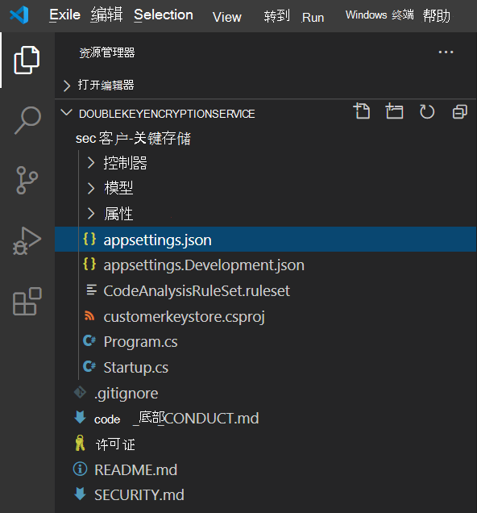
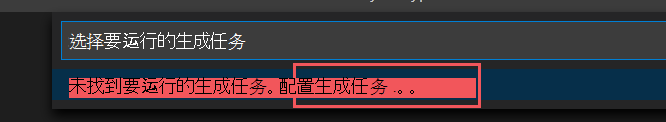
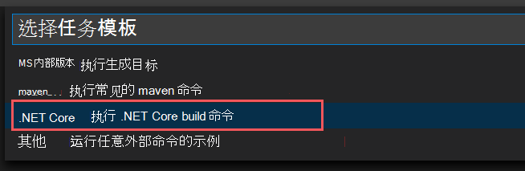
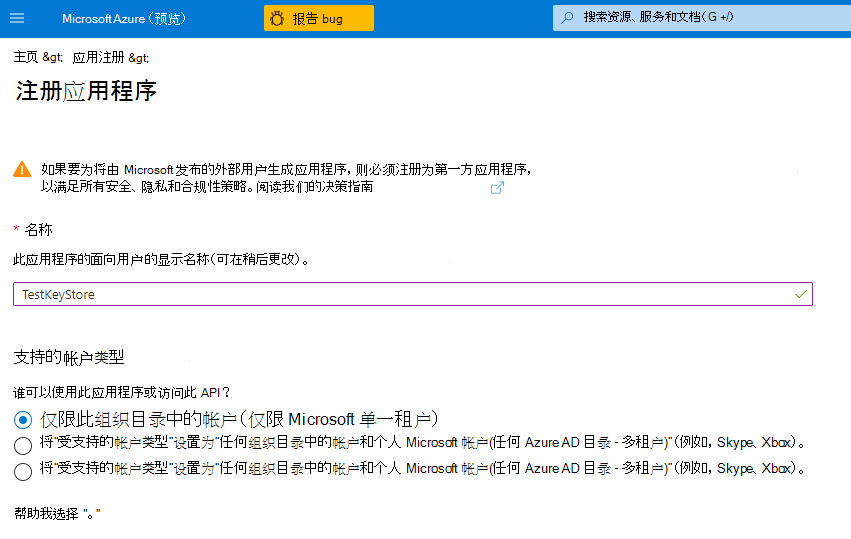

# <a name="double-key-encryption-for-microsoft-365"></a>双密钥加密Microsoft 365

> *适用于：双密钥加密（Microsoft 365、Microsoft 365 [合规性](https://www.microsoft.com/microsoft-365/business/compliance-management)、[Azure 信息保护](https://azure.microsoft.com/pricing/details/information-protection)）*
>
> *说明：[Azure 信息保护统一标签客户端Windows](/azure/information-protection/faqs#whats-the-difference-between-the-azure-information-protection-classic-and-unified-labeling-clients)*


> *服务说明：Microsoft 365 [合规性](/office365/servicedescriptions/microsoft-365-service-descriptions/microsoft-365-tenantlevel-services-licensing-guidance/microsoft-365-security-compliance-licensing-guidance)*

双密钥加密 (DKE) 使用两个密钥来访问受保护的内容。 Microsoft 将一个密钥存储在Microsoft Azure中，并且你持有另一个密钥。 使用双密钥加密服务维护对其中一个密钥的完全控制。 使用 Azure 信息保护统一标记客户端对高度敏感的内容应用保护。

双密钥加密支持云和本地部署。 这些部署有助于确保加密数据在存储受保护数据的位置都保持不透明。

有关默认的基于云的租户根密钥详细信息，请参阅规划和 [实现 Azure 信息保护租户密钥](/azure/information-protection/plan-implement-tenant-key)。

## <a name="when-your-organization-should-adopt-dke"></a>组织何时应采用 DKE

双密钥加密适用于符合最严格的保护要求的最敏感数据。 DKE 并非适用于所有数据。 通常，你将使用双密钥加密来保护整个数据的一小部分。 在部署之前，应谨慎确定要在此解决方案中涵盖的合适数据。 在某些情况下，你可能需要缩小范围，并针对大部分数据使用其他解决方案，例如Microsoft 信息保护 Microsoft 托管密钥或 BYOK。 这些解决方案足以用于不受增强的保护和法规要求的文档。 此外，这些解决方案还使您能够使用最强大的 Office 365 服务;不能与 DKE 加密内容一同使用的服务。 例如：

- 需要查看附件的传输规则，包括反恶意软件和垃圾邮件
- Microsoft Delve
- 电子数据展示
- 内容搜索和索引
- Office Web 应用，包括共同授权功能

任何未通过 MIP SDK Microsoft 信息保护 (DKE) 外部应用程序或服务将无法对加密数据执行操作。

SDK Microsoft 信息保护 1.7+ 支持双密钥加密。 与 SDK 集成的应用程序可以借助足够的权限和集成来了解此数据。

使用 Microsoft 信息保护 (分类和标记) 保护大多数敏感数据，并且仅对任务关键型数据使用 DKE。 双密钥加密与高度管控行业（如金融服务和医疗保健）中的敏感数据相关。

如果你的组织有以下任一要求，可以使用 DKE 来帮助保护内容的安全：

- 您希望确保在任何情况下 *仅可以* 解密受保护的内容。
- 你不希望 Microsoft 自行访问受保护的数据。
- 您具有在地理边界内保留密钥的法规要求。 您保留用于数据加密和解密的所有密钥都在你的数据中心进行维护。

## <a name="system-and-licensing-requirements-for-dke"></a>DKE 的系统和许可要求

**双密钥加密Microsoft 365** 密码Microsoft 365 E5。 如果你没有许可证，Microsoft 365 E5许可证，可以[注册试用版。](https://aka.ms/M365E5ComplianceTrial) 有关这些许可证详细信息，请参阅Microsoft 365[安全与合规&指南](/office365/servicedescriptions/microsoft-365-service-descriptions/microsoft-365-tenantlevel-services-licensing-guidance/microsoft-365-security-compliance-licensing-guidance)。

**Azure 信息保护**。 DKE 使用敏感度标签，并且需要 Azure 信息保护。

DKE 敏感度标签通过桌面应用中 AIP 统一标签客户端的敏感度按钮Office最终用户。 在要保护和使用受保护文档的每台客户端计算机上安装这些必备组件。

**Microsoft Office** 2009 企业应用版或更高版本 (桌面版的 Word、PowerPoint 和 Excel) Windows。

**Azure 信息保护统一标签客户端** 版本 2.7.93.0 或更高版本。 从 Microsoft 下载中心下载并安装统一 [标签客户端](https://www.microsoft.com/download/details.aspx?id=53018)。

## <a name="supported-environments-for-storing-and-viewing-dke-protected-content"></a>用于存储和查看受 DKE 保护的内容的支持的环境

**支持的应用程序**。 [Microsoft 365 企业应用版](https://www.microsoft.com/microsoft-365/business/microsoft-365-apps-for-enterprise-product)客户端Windows，包括 Word、Excel 和 PowerPoint。

**联机内容支持**。 可以在 Microsoft SharePoint 和 microsoft OneDrive for Business 中联机存储受双密钥加密保护的文档和OneDrive for Business。 在上载到这些位置之前，必须通过受支持的应用程序使用 DKE 标记和保护文档和文件。 可以通过电子邮件共享加密内容，但无法联机查看加密文档和文件。 相反，必须使用本地计算机上受支持的桌面应用程序和客户端查看受保护的内容。

## <a name="overview-of-deploying-dke"></a>部署 DKE 的概述

你将按照这些常规步骤设置 DKE。 完成这些步骤后，最终用户可以使用双密钥加密来保护高度敏感的数据。

1. 部署 DKE 服务，如本文所述。

2. 使用双密钥加密创建标签。 In the Microsoft 365 合规中心， navigate to **Information protection** and create a new label with Double Key Encryption. 请参阅 [使用敏感度标签应用加密来限制对内容的访问](./encryption-sensitivity-labels.md)。

3. 使用双密钥加密标签。 通过从"敏感度"功能区中选择"双密钥加密"标签来保护Microsoft Office。

有几种方法可以完成部署双密钥加密的一些步骤。 本文提供了详细说明，以便经验不足的管理员能够成功部署服务。 如果习惯这样做，可以选择使用自己的方法。

## <a name="deploy-dke"></a>部署 DKE

本文和部署视频使用 Azure 作为 DKE 服务的部署目标。 如果要部署到其他位置，则需要提供自己的值。

观看 [双密钥加密部署](https://youtu.be/vDWfHN_kygg) 视频，查看本文中概念的分步概述。 视频需要大约 18 分钟才能完成。

你将按照这些常规步骤为组织设置双密钥加密。

1. [安装 DKE 服务的必备软件](#install-software-prerequisites-for-the-dke-service)
1. [克隆双密钥加密GitHub存储库](#clone-the-dke-github-repository)
1. [修改应用程序设置](#modify-application-settings)
1. [生成测试密钥](#generate-test-keys)
1. [生成项目](#build-the-project)
1. [部署 DKE 服务并发布密钥存储](#deploy-the-dke-service-and-publish-the-key-store)
1. [验证部署](#validate-your-deployment)
1. [注册密钥存储](#register-your-key-store)
1. [使用 DKE 创建敏感度标签](#create-sensitivity-labels-using-dke)
1. [在客户端中启用 DKE](#enable-dke-in-your-client)
1. [将受保护的文件从 HYOK 标签迁移到 DKE 标签](#migrate-protected-files-from-hyok-labels-to-dke-labels)

完成后，可以使用 DKE 加密文档和文件。 有关信息，请参阅[将敏感度标签应用于](https://support.microsoft.com/office/2f96e7cd-d5a4-403b-8bd7-4cc636bae0f9)你的文件和电子邮件Office。

### <a name="install-software-prerequisites-for-the-dke-service"></a>安装 DKE 服务的必备软件

在要安装 DKE 服务的计算机上安装这些必备组件。

**.NET Core 3.1 SDK**。 从下载 [.NET Core 3.1 下载并安装](https://dotnet.microsoft.com/download/dotnet-core/3.1) SDK。

**Visual Studio Code**。 从 Visual Studio Code 下载文件[https://code.visualstudio.com/](https://code.visualstudio.com)。 安装完成后，运行Visual Studio Code并选择 **"查看扩展** \> **"**。 安装这些扩展。

- C#Visual Studio Code

- NuGet 程序包管理器

**Git 资源**。 下载并安装以下项之一。

- [Git](https://git-scm.com/downloads)

- [GitHub桌面](https://desktop.github.com/)

- [GitHub Enterprise](https://github.com/enterprise)

**OpenSSL** 部署 DKE [后，必须安装 OpenSSL](https://slproweb.com/products/Win32OpenSSL.html) 以生成测试密钥。[](#generate-test-keys) 请确保从环境变量路径正确调用它。 例如，有关详细信息，请参阅 中的"将安装目录添加到 [https://www.osradar.com/install-openssl-windows/](https://www.osradar.com/install-openssl-windows/) PATH"。

### <a name="clone-the-dke-github-repository"></a>克隆 DKE GitHub存储库

Microsoft 在一个 DKE 存储库中提供 dKE GitHub文件。 克隆存储库以在本地生成项目供组织使用。 DKE GitHub存储库位于 [https://github.com/Azure-Samples/DoubleKeyEncryptionService](https://github.com/Azure-Samples/DoubleKeyEncryptionService)。

以下说明适用于没有经验的 git 或 Visual Studio Code用户：

1. 在浏览器中，转到： [https://github.com/Azure-Samples/DoubleKeyEncryptionService](https://github.com/Azure-Samples/DoubleKeyEncryptionService)。

2. 在屏幕右侧，选择"代码 **"**。 你的 UI 版本可能会显示克隆 **或下载** 按钮。 然后，在出现的下拉列表中，选择复制图标以将 URL 复制到剪贴板。

    例如：

   > [!div class="mx-imgBorder"]
   > 

3. In Visual Studio Code， select **View** \> **Command Palette** and select **Git： Clone**. 若要跳转到列表中的选项， `git: clone` 请开始键入以筛选条目，然后从下拉列表中选择它。 例如：

   > [!div class="mx-imgBorder"]
   > 

4. 在文本框中，粘贴从 Git 复制的 URL，然后选择"从 GitHub **"**。

5. 在出现的 **"选择** 文件夹"对话框中，浏览到并选择要存储存储库的位置。 在提示符下，选择"打开 **"**。

    存储库在 Visual Studio Code中打开，在左下角显示当前 Git 分支。 例如，分支应为 **main**。 例如：

   

6. 如果你不在主分支上，则需要选择它。 In Visual Studio Code， select the branch and choose main from the **list** of branch that displays.

   > [!IMPORTANT]
   > 选择主分支可确保你拥有用于生成项目的正确文件。 如果不选择正确的分支，部署将失败。

现在，你已在本地设置 DKE 源存储库。 接下来 [，修改组织](#modify-application-settings) 的应用程序设置。

### <a name="modify-application-settings"></a>修改应用程序设置

若要部署 DKE 服务，必须修改以下类型的应用程序设置：

- [密钥访问设置](#key-access-settings)
- [租户和密钥设置](#tenant-and-key-settings)

修改 appsettings.json 文件中的应用程序设置。 此文件位于在 DoubleKeyEncryptionService\src\customer-key-store 下本地克隆的 DoubleKeyEncryptionService 存储库。 例如，在Visual Studio Code中，您可以浏览到该文件，如下图所示。



#### <a name="key-access-settings"></a>密钥访问设置

选择是使用电子邮件还是角色授权。 DKE 一次仅支持其中一种身份验证方法。

- **电子邮件授权**。 允许组织仅根据电子邮件地址授予对密钥的访问权限。

- **角色授权**。 允许组织根据 Active Directory 组授予对密钥的访问权限，并需要 Web 服务可以查询 LDAP。

##### <a name="to-set-key-access-settings-for-dke-using-email-authorization"></a>使用电子邮件授权设置 DKE 的关键访问设置

1. 打开 **appsettings.json** 文件并找到 `AuthorizedEmailAddress` 设置。

2. 添加要授权的电子邮件地址。 使用双引号和逗号分隔多个电子邮件地址。 例如：

   ```json
   "AuthorizedEmailAddress": ["email1@company.com", "email2@company.com ", "email3@company.com"]
   ```

3. `LDAPPath`找到设置并删除双引号`If you use role authorization (AuthorizedRoles) then this is the LDAP path.`之间的文本。 将双引号留在位。 完成后，设置应如下所示。

   ```json
   "LDAPPath": ""
   ```

4. 找到设置 `AuthorizedRoles` 并删除整行。

此图像显示了为电子邮件授权正确设置格式的 **appsettings.json** 文件。

   

##### <a name="to-set-key-access-settings-for-dke-using-role-authorization"></a>使用角色授权设置 DKE 的关键访问设置

1. 打开 **appsettings.json** 文件并找到 `AuthorizedRoles` 设置。

2. 添加要授权 Active Directory 组的名称。 用双引号和逗号分隔多个组名称。 例如：

   ```json
   "AuthorizedRoles": ["group1", "group2", "group3"]
   ```

3. 找到设置 `LDAPPath` 并添加 Active Directory 域。 例如：

   ```json
   "LDAPPath": "contoso.com"
   ```

4. 找到设置 `AuthorizedEmailAddress` 并删除整行。

此图显示了针对角色授权正确设置格式的 **appsettings.json** 文件。

   

#### <a name="tenant-and-key-settings"></a>租户和密钥设置

DKE 租户和密钥设置位于 **appsettings.json** 文件中。

##### <a name="to-configure-tenant-and-key-settings-for-dke"></a>为 DKE 配置租户和密钥设置

1. 打开 **appsettings.json** 文件。

2. 找到设置 `ValidIssuers` ，并替换为 `<tenantid>` 租户 ID。 可以通过访问 Azure 门户并查看租户属性找到 [租户 ID](https://aad.portal.azure.com/#blade/Microsoft_AAD_IAM/ActiveDirectoryMenuBlade/Properties)。 例如：

   ```json
   "ValidIssuers": [
     "https://sts.windows.net/9c99431e-b513-44be-a7d9-e7b500002d4b/"
   ]
   ```

> [!NOTE]
> 如果要启用对密钥存储的外部 B2B 访问，还需要包含这些外部租户作为有效颁发者列表的一部分。

`JwtAudience`找到 。 将 `<yourhostname>` 替换为将运行 DKE 服务的主机名。 例如：

  > [!IMPORTANT]
  > 的值 `JwtAudience` 必须与主机的名称完全 *匹配*。 调试时可以使用 **localhost：5001** 。 但是，完成调试后，请确保将此值更新为服务器的主机名。

- `TestKeys:Name`. 输入密钥的名称。 例如：`TestKey1`
- `TestKeys:Id`. 创建一个 GUID，并输入它作为 `TestKeys:ID` 值。 例如，`DCE1CC21-FF9B-4424-8FF4-9914BD19A1BE`。 可以使用联机 [GUID 生成器](https://guidgenerator.com/) 等站点随机生成 GUID。

此图像显示 **appsettings.json** 中租户和密钥设置的正确格式。 `LDAPPath` 配置为进行角色授权。


### <a name="generate-test-keys"></a>生成测试密钥

定义应用程序设置后，即可生成公钥和专用测试密钥。

生成密钥：

1. 从Windows "开始"菜单，运行 OpenSSL 命令提示符。

1. 更改为要保存测试密钥的文件夹。 通过完成此任务中的步骤创建的文件存储在同一文件夹中。

1. 生成新的测试密钥。

   ```console
   openssl req -x509 -newkey rsa:2048 -keyout key.pem -out cert.pem -days 365
   ```

1. 生成私钥。

   如果安装了 OpenSSL 版本 3 或更高版本，请运行以下命令：
  
  ```console
  openssl rsa -in key.pem -out privkeynopass.pem -outform PEM -traditional
  ```
  
>  否则，运行以下命令：
>  ```console
>  openssl rsa -in key.pem -out privkeynopass.pem -outform PEM
>  ```

1. 生成公钥。

   ```console
   openssl rsa -in key.pem -pubout > pubkeyonly.pem
   ```

1. 在文本编辑器中，打开 **pubkeyonly.pem**。 将 **pubkeyonly.pem** 文件（第一 `PublicPem` 行和最后一行除外）中的内容复制到 **appsettings.json** 文件的 部分。

1. 在文本编辑器中，打开 **"管理""nopass.pem"**。 将 **管理密钥nopass.pem** 文件（第一 `PrivatePem` 行和最后一行除外）中的内容复制到 **appsettings.json** 文件的 部分。

1. 删除 和 部分的所有空格和`PublicPem``PrivatePem`新行。

    > [!IMPORTANT]
    > 复制此内容时，请勿删除任何 PEM 数据。

1. 在Visual Studio Code中，浏览到 **Startup.cs** 文件。 此文件位于在 DoubleKeyEncryptionService\src\customer-key-store\ 下本地克隆的 DoubleKeyEncryptionService 存储库。

1. 找到以下行：

    ```csharp
        #if USE_TEST_KEYS
        #error !!!!!!!!!!!!!!!!!!!!!! Use of test keys is only supported for testing,
        DO NOT USE FOR PRODUCTION !!!!!!!!!!!!!!!!!!!!!!!!!!!!!
        services.AddSingleton<ippw.IKeyStore, ippw.TestKeyStore>();
        #endif
    ```

1. 将以下行替换为以下文本：

    ```csharp
    services.AddSingleton<ippw.IKeyStore, ippw.TestKeyStore>();
    ```

    最终结果应如下所示。

    

现在，你已准备好 [生成 DKE 项目](#build-the-project)。

### <a name="build-the-project"></a>生成项目

使用以下说明在本地生成 DKE 项目：

1. In Visual Studio Code， in the DKE service repository， select **View** \> **Command Palette** and then type **build** at the prompt.

2. 从列表中选择"任务 **： 运行生成任务"**。

   如果未找到生成任务，请选择" **配置生成** 任务"，然后为 .NET core 创建一个，如下所示。

   

   1. 从 **模板中选择"创建 tasks.json"**。

      

   2. 从模板类型列表中选择" **.NET Core"**。

      

   3. 在生成部分中，找到 **customerkeystore.csproj 文件** 的路径。 如果不存在，请添加以下行：

      ```json
      "${workspaceFolder}/src/customer-key-store/customerkeystore.csproj",
      ```

   4. 再次运行生成。

3. 确认输出窗口中没有红色错误。

   如果存在红色错误，请检查控制台输出。 确保您正确完成了上述所有步骤，并且存在正确的内部版本。

4. 选择 **"运行** \> **开始调试** "以调试过程。 如果系统提示你选择环境，请选择 **".NET core"**。

   .NET 核心调试程序通常启动到 `https://localhost:5001`。 若要查看测试密钥，请转到 `https://localhost:5001` 并追加一个正斜杠 (/) 和密钥的名称。 例如：

   ```https
   https://localhost:5001/TestKey1
   ```

   密钥应以 JSON 格式显示。

您的设置现已完成。 在发布 keystore之前，在 appsettings.json 中，对于 JwtAudience 设置，请确保 hostname 的值与 App Service 主机名完全匹配。 您可能已更改为 localhost，以对生成进行疑难解答。

### <a name="deploy-the-dke-service-and-publish-the-key-store"></a>部署 DKE 服务并发布密钥存储

对于生产部署，请部署第三方云中的服务或发布到 [本地系统](/aspnet/core/tutorials/publish-to-iis?preserve-view=true&tabs=netcore-cli&view=aspnetcore-3.1)。

你可能需要其他方法来部署密钥。 选择最适合贵组织的方法。

对于试点部署，可以在 Azure 中部署并立即开始。

#### <a name="to-create-an-azure-web-app-instance-to-host-your-dke-deployment"></a>创建 Azure Web App 实例以托管 DKE 部署

若要发布密钥存储，需要创建 Azure 应用服务实例来托管 DKE 部署。 接下来，将生成的密钥发布到 Azure。

1. 在浏览器中，登录到 Microsoft Azure [门户](https://ms.portal.azure.com)，然后转到 **"应用** > 服务 **""广告"**。

2. 选择订阅和资源组并定义实例详细信息。

   - 输入要安装 DKE 服务的计算机的主机名。 请确保其名称与 [**appsettings.json**](#tenant-and-key-settings) 文件中为 JwtAudience 设置定义的名称相同。 您为名称提供的值也是 WebAppInstanceName。

   - 对于 **"发布**"， **选择代码**，对于 **运行时堆栈**，选择 **".NET Core 3.1"**。

   例如：

   > [!div class="mx-imgBorder"]
   > 

3. 在页面底部，选择" **审阅 + 创建**"，然后选择"添加 **"**。

4. 执行下列操作之一以发布生成的密钥：

   - [通过 ZipDeployUI 发布](#publish-via-zipdeployui)
   - [通过 FTP 发布](#publish-via-ftp)
   - [通过 Visual Studio 2019 或更高版本发布](/aspnet/core/tutorials/)

#### <a name="publish-via-zipdeployui"></a>通过 ZipDeployUI 发布

1. 转到 `https://<WebAppInstanceName>.scm.azurewebsites.net/ZipDeployUI`。

   例如：`https://dkeservice.scm.azurewebsites.net/ZipDeployUI`

2. 在密钥存储的代码库中，转到 **customer-key-store\src\customer-key-store** 文件夹，并验证此文件夹是否包含 **customerkeystore.csproj** 文件。

3. 运行： **dotnet 发布**

   输出窗口显示部署发布的位置的目录。

   例如：`customer-key-store\src\customer-key-store\bin\Debug\netcoreapp3.1\publish\`

4. 将发布目录中的所有文件都发送到.zip文件。 创建.zip文件时，请确保目录中的所有文件都位于文件.zip级别。

5. 将创建的.zip文件拖放到上面打开的 ZipDeployUI 网站。 例如：`https://dkeservice.scm.azurewebsites.net/ZipDeployUI`

DKE 已部署，你可以浏览到已创建的测试密钥。 继续验证 [以下](#validate-your-deployment) 部署。

#### <a name="publish-via-ftp"></a>通过 FTP 发布

1. 连接上述创建的应用[服务](#deploy-the-dke-service-and-publish-the-key-store)。

   在浏览器中，转到：**Azure portalApp** >  **ServiceDeployment** >  **CenterManual** >  **DeploymentFTPDashboard** >  > 。

2. 将显示的连接字符串复制到本地文件。 你将使用这些字符串连接到 Web 应用服务，然后通过 FTP 上载文件。

   例如：

   

3. 在密钥存储的代码库中，转到 **customer-key-store\src\customer-key-store 目录**。

4. 验证此目录是否包含 **customerkeystore.csproj** 文件。

5. 运行： **dotnet 发布**

   输出包含部署发布时所位于的目录。

   例如：`customer-key-store\src\customer-key-store\bin\Debug\netcoreapp3.1\publish\`

6. 将发布目录中的所有文件都发送到 zip 文件。 创建.zip文件时，请确保目录中的所有文件都位于文件.zip级别。

7. 从 FTP 客户端，使用复制的连接信息连接到应用服务。 Upload.zip步骤中创建的 web 应用的根目录。

DKE 已部署，你可以浏览到已创建的测试密钥。 接下来， [验证部署](#validate-your-deployment)。

### <a name="validate-your-deployment"></a>验证部署

使用上述方法之一部署 DKE 后，验证部署和密钥存储设置。

运行：

```powershell
src\customer-key-store\scripts\key_store_tester.ps1 dkeserviceurl/mykey
```

例如：

```powershell
key_store_tester.ps1 https://mydkeservice.com/mykey
```

确保输出中未出现任何错误。 准备就绪后，注册 [密钥存储](#register-your-key-store)。

键名称区分大小写。 在 appsettings.json 文件中显示时输入密钥名称。

## <a name="register-your-key-store"></a>注册密钥存储

通过以下步骤注册 DKE 服务。 注册 DKE 服务是部署 DKE 的最后一步，然后才能开始创建标签。

注册 DKE 服务：

1. 在浏览器中，打开Microsoft Azure [门户](https://ms.portal.azure.com/)，然后转到"所有 **服务** \> **标识** \> **应用注册"**。

2. 选择 **"新建注册**"，然后输入有意义的名称。

3. 从显示的选项中选择帐户类型。

   如果对非自定义Microsoft Azure（如 **onmicrosoft.com**）使用帐户，请选择"仅 microsoft (- 单租户) "**。**

   例如：

   > [!div class="mx-imgBorder"]
   > 

4. 在页面底部， **选择注册以** 创建新的应用注册。

5. 在新的应用注册中，在左窗格中的"管理 **"** 下，选择"身份验证 **"**。

6. 选择 **添加平台**。

7. 在" **配置平台"** 弹出窗口中，选择" **Web"**。

8. 在 **"重定向 URI**"下，输入双密钥加密服务的 URI。 输入应用服务 URL，包括主机名和域。

   例如：`https://mydkeservicetest.com`

   - 输入的 URL 必须与部署 DKE 服务的主机名匹配。
   - 域必须是已 [注册的域](/azure/active-directory/develop/reference-breaking-changes#appid-uri-in-single-tenant-applications-will-require-use-of-default-scheme-or-verified-domains)。
   - 如果要在本地使用 Visual Studio 测试，请使用 `https://localhost:5001`。
   - 在所有情况下，方案必须为 **https**。

   确保主机名与应用服务主机名完全匹配。 你可能已更改它以对 `localhost` 生成进行疑难解答。 在 **appsettings.json** 中，此值为 设置的主机名 `JwtAudience`。

9. 在 **"隐式授予**"下 **，选中"ID 令牌"** 复选框。

10. 选择 **保存** 以保存所做的更改。

11. 在左窗格中，选择"公开 **API**"，在"应用程序 ID URI"旁边，输入应用服务 URL，包括主机名和域，然后选择"设置 **"**。

12. 仍在" **公开 API"页上** 的"此 **API** 定义的范围"区域中，选择" **添加范围"**。 在新作用域中：

    1. 将范围名称定义为 **user_impersonation**。

    2. 选择可同意的管理员和用户。

    3. 定义所需的任何剩余值。

    4. 选择“**添加作用域**”。

    5. 选择 **顶部的** "保存"保存更改。

13. 仍在" **公开 API"页上** 的"授权客户端应用程序 **"区域中，** 选择" **添加客户端应用程序"**。

    在新的客户端应用程序中：

    1. 将客户端 ID 定义为 `d3590ed6-52b3-4102-aeff-aad2292ab01c`。 此值是Microsoft Office ID，Office获取密钥存储的访问令牌。

    2. 在 **"授权范围"** 下 **，选择user_impersonation** 范围。

    3. 选择“添加应用程序”。

    4. 选择 **顶部的** "保存"保存更改。

    5. 重复这些步骤，但这次将客户端 ID 定义为 `c00e9d32-3c8d-4a7d-832b-029040e7db99`。 此值为 Azure 信息保护统一标记客户端 ID。

现在已注册 DKE 服务。 继续使用 [DKE 创建标签](#create-sensitivity-labels-using-dke)。

## <a name="create-sensitivity-labels-using-dke"></a>使用 DKE 创建敏感度标签

在Microsoft 365 合规中心中，创建一个新的敏感度标签，并像否则一样应用加密。 选择 **"使用双密钥加密** "，然后输入密钥的终结点 URL。 你需要在 URL 中包括 appsettings.json 文件的"TestKeys"部分中提供的密钥名称。

例如：`https://testingdke1.azurewebsites.net/KEYNAME`

> [!div class="mx-imgBorder"]
> 

你添加的任何 DKE 标签都将开始在最新版本的 Microsoft 365 企业应用版 中显示。

> [!NOTE]
> 客户端可能需要 24 小时才能刷新新标签。

### <a name="enable-dke-in-your-client"></a>在客户端中启用 DKE

如果你是预览体验成员Office，将启用 DKE。 否则，请通过添加以下注册表项为客户端启用 DKE：

```console
   [HKEY_LOCAL_MACHINE\SOFTWARE\WOW6432Node\Microsoft\MSIPC\flighting]
   "DoubleKeyProtection"=dword:00000001

   [HKEY_LOCAL_MACHINE\SOFTWARE\Microsoft\MSIPC\flighting]
   "DoubleKeyProtection"=dword:00000001
```

## <a name="migrate-protected-files-from-hyok-labels-to-dke-labels"></a>将受保护的文件从 HYOK 标签迁移到 DKE 标签

如果需要，完成 DKE 设置后，可以将使用 HYOK 标签保护的内容迁移到 DKE 标签。 若要迁移，请使用 AIP 扫描程序。 若要开始使用扫描程序，请参阅 [什么是 Azure 信息保护统一标签扫描程序？](/azure/information-protection/deploy-aip-scanner)。

如果不迁移内容，则 HYOK 保护的内容将不受影响。

## <a name="other-deployment-options"></a>其他部署选项

我们意识到，对于高度管控行业中的一些客户，这种使用基于软件密钥的标准参考实现可能不足以满足其增强的合规性义务和需求。 我们已与 HSM (供应商与 HSM) 第三方硬件安全模块合作，以支持 DKE 服务中的增强型密钥管理选项，包括：

 - [Entrust](https://www.entrust.com/digital-security/hsm/services/packaged-services/double-key-encryption-integration#:~:text=Entrust%20Double%20Key%20Encryption%20for%20Microsoft%20AIP%2C%20offered,trust%20for%20the%20protection%20of%20sensitive%20cryptographic%20keys.)

- [塔姆雷群岛](https://cpl.thalesgroup.com/cloud-security/encryption/double-key-encryption)

请直接与这些供应商联系，了解有关其市场内 DKE HSM 解决方案的更多信息和指导。
