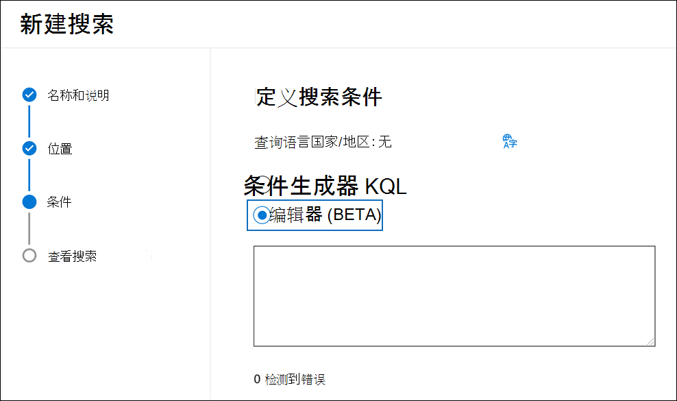
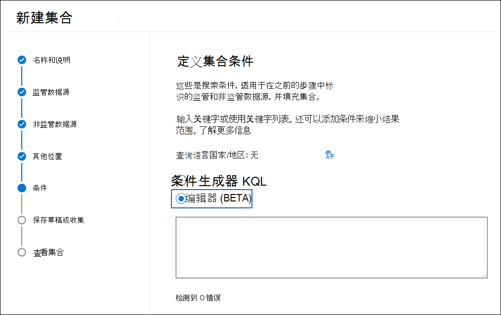
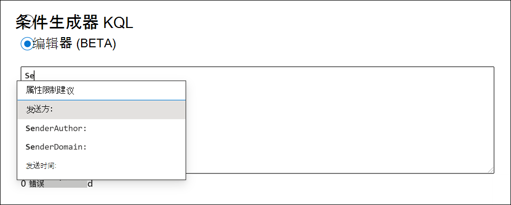
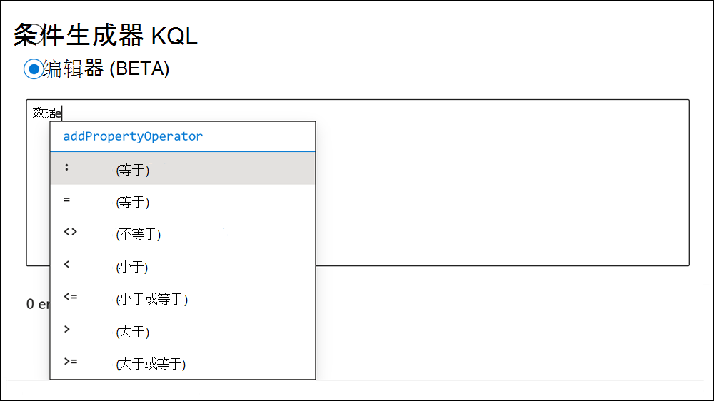
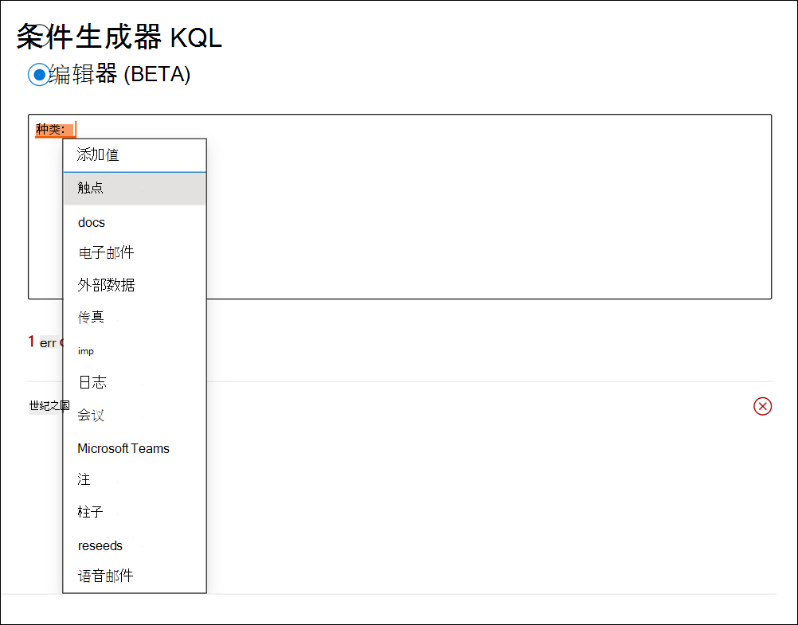
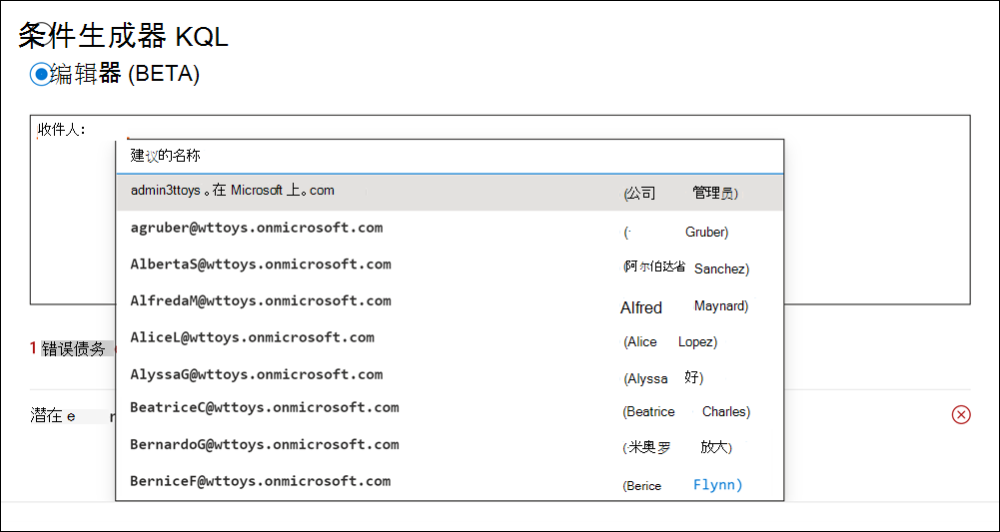
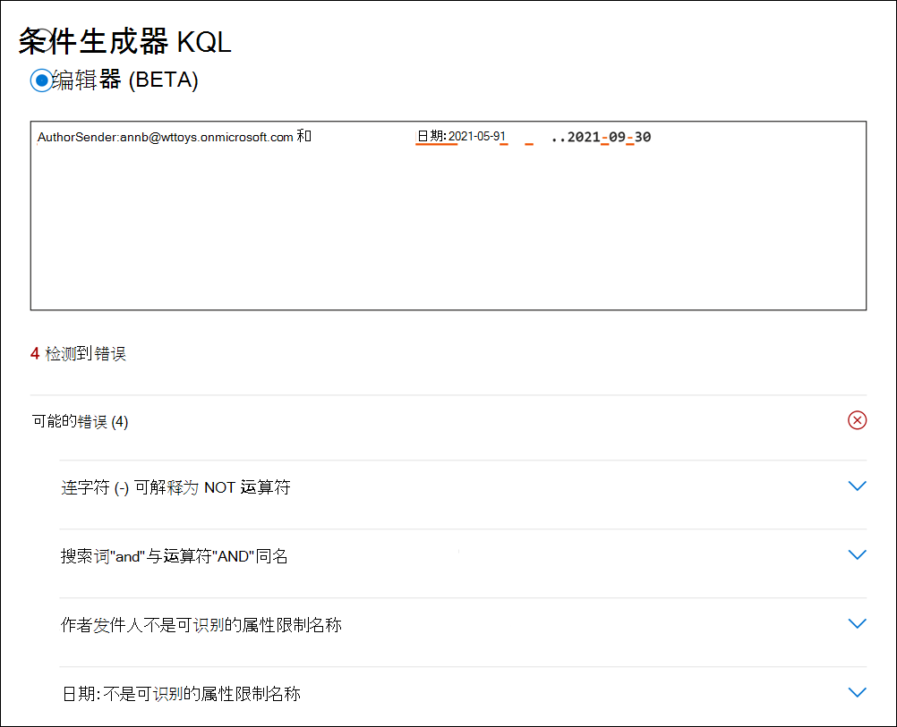

# 使用 KQL 编辑器生成搜索查询（预览）

在内容搜索、核心电子数据展示Microsoft 365搜索中生成搜索查询时，Microsoft 365电子数据展示工具搜索中的新 KQL 查询体验可提供Advanced eDiscovery。 在编辑器中键入查询时，它将为受支持的可搜索属性和条件提供自动完成，并提供标准属性和条件的支持值列表。 例如，如果在查询中指定 email 属性，编辑器将显示一个 `kind` 可以选择的支持值列表。 KQL 编辑器还会实时显示潜在的查询错误，您可以在运行搜索之前修复这些错误。 最好将复杂查询直接粘贴到编辑器中，而无需使用标准条件生成器中的关键字和条件卡手动生成查询。
  
以下是使用 KQL 编辑器的主要好处：

- 提供指导并帮助您从头开始构建搜索查询。

- 允许您将长而复杂的查询直接粘贴到编辑器中。 例如，如果您收到来自对方律师的复杂查询，您可以将该查询粘贴到 KQL 编辑器中，而不必使用条件生成器。

- 快速识别潜在错误并显示如何解决问题的提示。

当您在核心电子数据展示和数据库中创建基于查询的保留项时，KQL 编辑器Advanced eDiscovery。

## 显示 KQL 编辑器

创建或编辑电子数据展示搜索时，显示和使用 KQL 编辑器的选项位于搜索或集合向导的"条件"页上。

### 内容搜索和核心电子数据展示中的 KQL 编辑器

### KQL 编辑器Advanced eDiscovery

## 使用 KQL 编辑器

以下各节显示了 KQL 编辑器如何提供建议和检测潜在错误的示例。

### 自动完成搜索属性和运算符

当您开始在 KQL 编辑器中键入搜索查询时，编辑器会显示支持的搜索属性的建议自动完成 (也称为属性限制) 您可以选择的属性限制。  您必须键入至少两个字符，以显示以这两个字符开头的受支持属性的列表。 例如，以下屏幕截图显示了以 开头的建议搜索属性 `Se` 。

此外，编辑器还建议提供支持的运算符列表， (键入完整属性名称时，) 、和 。 `:` `=` `<>` 例如，以下屏幕截图显示了属性的建议 `Date` 运算符。

有关支持的搜索属性和运算符的信息，请参阅关键字 [查询和电子数据展示的搜索条件](keyword-queries-and-search-conditions.md)。

### 属性值建议

KQL 编辑器提供某些属性的可能值的建议。 例如，以下屏幕截图显示了属性的建议 `Kind` 值。

编辑器还建议在键入电子邮件收件人属性 (UPN 格式) 用户列表，如 、 和 `From` `To` `Recipients` `Participants` 。

### 检测潜在错误

KQL 编辑器可检测搜索查询中的潜在错误，并提供导致错误的原因的提示，以帮助您解决错误。 当属性没有相应的操作或值时，编辑器还会指示潜在的错误。 查询中的潜在错误以红色文本突出显示，错误的说明和可能的修补程序显示在" **潜在** 错误"下拉部分。 例如，如果您将以下查询粘贴到 KQL 编辑器中，将检测到四个潜在错误。

在这种情况下，可以使用潜在的错误提示对查询进行疑难解答和修复。

## 更多信息

- 您可以在条件生成器和 KQL 编辑器之间进行切换。 例如，如果使用条件生成器配置使用"关键字"框和多个条件卡的查询，可以在 KQL 编辑器中显示生成的查询。 但是，如果您在 KQL 编辑器 (关键字和条件) 复杂的查询查询，则只有在条件生成器中查看查询时，生成的查询才显示在"关键字"框中。

- 如果将复杂查询粘贴到 KQL 编辑器中，编辑器将检测潜在错误，并建议可能的解决方案来解决错误。
