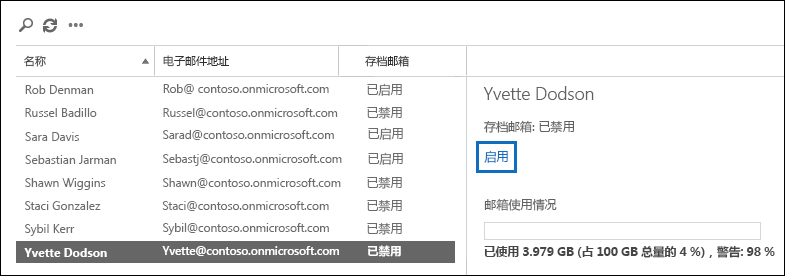
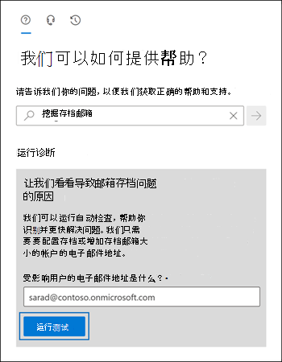

# <a name="enable-archive-mailboxes-in-the-compliance-center"></a>在合规性中心中启用存档邮箱

Microsoft 365 中的存档（又称为 *就地存档*）为用户提供额外的邮箱存储空间。 打开存档邮箱后, 用户可使用 Microsoft Outlook 和 Outlook 网页版 (以前称为 Outlook Web App) 在其存档邮箱中访问并存储邮件。 用户可以在其主邮箱和存档邮箱之间移动或复制邮件。 他们还可以使用“恢复已删除邮件”工具恢复存档邮箱中“可恢复的项目”文件夹下的已删除邮件。

> [!NOTE]
> Microsoft 365 中的自动扩展存档功能在存档邮箱中提供额外的存储空间。 当启用自动扩展存档，并达到用户存档邮箱中的初始存储配额时，Microsoft 365 将自动增加额外的存储空间。 这意味着用户不会耗尽邮箱存储空间, 并且在最初启用存档邮箱为贵公司打开自动扩展存档后, 你将不必管理任何内容。 有关详细信息，请参阅 [自动扩展存档概述](autoexpanding-archiving.md)。

## <a name="get-the-necessary-permissions"></a>获取必要的权限

必须在 Exchange Online 中分配 "邮件收件人" 角色, 才能启用或禁用存档邮箱。 默认情况下, 此角色分配给 Exchange 管理中心的 **权限** 页上的 "收件人管理" 和 "组织管理" 角色组。 如果在 Microsoft 365 合规中心中看不到 **存档** 页，则请管理员为你分配必要的权限。

## <a name="enable-an-archive-mailbox"></a>启用存档邮箱

1. 转到<a href="https://go.microsoft.com/fwlink/p/?linkid=2077149" target="_blank">Microsoft 365 合规中心</a>并登录。

2. 在 Microsoft 365 合规中心的左侧窗格中，单击“**信息治理**”，然后单击“**存档**”选项卡。

   将显示“存档”页。“存档邮箱”列表示每个用户的存档邮箱已启用还是禁用。

   > [!NOTE]
   > **存档** 页面最多显示500个用户。

3. 在邮箱的列表中，选择要启用存档邮箱的用户。

   

4. 在所选用户的详细信息窗格中, 单击 **启用**。

   将显示警告，指示如果启用存档邮箱，用户邮箱中早于分配给邮箱的存档策略的项目将移动到新的存档邮箱。默认存档策略是分配给 ExchangeOnline 邮箱的保留策略的一部分，在项目传递到邮箱或用户创建两年后，它会将项目移动到存档邮箱。有关详细信息，请参阅本文的 **详细信息** 部分。

5. 单击“是”启用存档邮箱。

   可能需要一些时间才会创建存档邮箱。创建后，“**存档邮箱: 已启用**”将显示在所选用户的详细信息窗格中。可能需要单击“**刷新**”“ 才能更新详细信息窗格中的信息。

> [!TIP]
> 您也可以通过选择多个禁用存档邮箱的用户（使用 Shift 或 Ctrl 键）批量启用存档邮箱。选择多个邮箱后，在详细信息窗格中，单击“启用”。

## <a name="disable-an-archive-mailbox"></a>禁用存档邮箱

还可以使用 Microsoft 365 合规中心中的“**存档**”页面禁用用户的存档邮箱。禁用存档邮箱后，可以在禁用后的 30 天内重新将其连接到用户的主邮箱。在这种情况下，存档邮箱的原始内容都会进行还原。30 天后，原始存档邮箱的内容就会永久删除且无法恢复。因此，如果在禁用存档邮箱 30 天后重新启用此邮箱，则会新建一个存档邮箱。

分配给用户邮箱的默认存档策略会在邮件传递到邮箱两年后将其移动到存档邮箱。如果你禁用用户的存档邮箱，将不会对邮箱项目执行任何操作，它们将保留在用户的主邮箱中。

若要禁用存档邮箱：

1. 转到<a href="https://go.microsoft.com/fwlink/p/?linkid=2077149" target="_blank">Microsoft 365 合规中心</a>并登录。

2. 在 Microsoft 365 合规中心的左侧窗格中，单击“**信息治理**”，然后单击“**存档**”选项卡。

   将显示“存档”页。“存档邮箱”列表示每个用户的存档邮箱已启用还是禁用。

   > [!NOTE]
   > **存档** 页面最多显示500个用户。

3. 在邮箱的列表中，选择要禁用存档邮箱的用户。

4. 在详细信息窗格中，单击“禁用”。

   将显示一条警告消息，指出你有 30 天的时间重新启用存档邮箱，30 天后，存档中的所有信息将被永久删除。 

5. 单击“是”以禁用存档邮箱。

   可能需要一些时间才会禁用存档邮箱。禁用后，“**存档邮箱: 已禁用**”将显示在所选用户的详细信息窗格中。可能需要单击“**刷新**”“ 才能更新详细信息窗格中的信息。

> [!TIP]
> 您也可以通过选择多个启用存档邮箱的用户（使用 Shift 或 Ctrl 键）批量禁用存档邮箱。选择多个邮箱后，在详细信息窗格中，单击“禁用”。

## <a name="use-exchange-online-powershell-to-enable-or-disable-archive-mailboxes"></a>使用 Exchange Online PowerShell 启用或禁用存档邮箱。

可以使用 Exchange Online PowerShell 启用存档邮箱。使用 PowerShell 的主要原因是，可以为你组织中的所有用户快速启用存档邮箱。

第一步是连接到 Exchange Online PowerShell。 有关说明，请参阅[连接 PowerShell Exchange Online](/powershell/exchange/connect-to-exchange-online-powershell)。

连接到 Exchange Online 后, 可运行以下部分中的命令来启用或禁用存档邮箱。

### <a name="enable-archive-mailboxes"></a>启用存档邮箱

运行以下命令, 为单个用户启用存档邮箱。

```powershell
Enable-Mailbox -Identity <username> -Archive
```

运行以下命令, 为贵公司所有用户启用存档邮箱 (当前未启用存档邮箱)。

```powershell
Get-Mailbox -Filter {ArchiveGuid -Eq "00000000-0000-0000-0000-000000000000" -AND RecipientTypeDetails -Eq "UserMailbox"} | Enable-Mailbox -Archive
```

### <a name="disable-archive-mailboxes"></a>禁用存档邮箱

运行以下命令, 为单个用户禁用存档邮箱。

```powershell
Disable-Mailbox -Identity <username> -Archive
```

运行以下命令, 为贵公司所有用户禁用存档邮箱 (当前启用存档邮箱)。

```powershell
Get-Mailbox -Filter {ArchiveGuid -Ne "00000000-0000-0000-0000-000000000000" -AND RecipientTypeDetails -Eq "UserMailbox"} | Disable-Mailbox -Archive
```

## <a name="run-diagnostics-on-archive-mailboxes"></a>在存档邮箱上运行诊断

你可以对用户的存档邮箱运行自动诊断检查，以识别任何问题和建议的解决方法。

要运行诊断检查，请转到“[运行测试：存档邮箱](https://aka.ms/PillarArchiveMailbox)”。



将在 Microsoft 365 管理中心中打开浮出控件页面。 输入要检查的邮箱的电子邮件地址，然后单击“**运行测试**”。

## <a name="more-information"></a>更多信息

- 启用存档邮箱后，用户可以将邮件存储在其存档邮箱中。用户可以使用 Microsoft Outlook 和 Outlook 网页版访问存档邮箱。通过使用其中任意一个客户端应用程序，用户可以查看存档邮箱中的邮件，并在其主邮箱和存档邮箱之间移动或复制邮件。用户还可以使用"恢复已删除邮件"工具恢复存档邮箱中的"可恢复的项目"文件夹中的已删除邮件。

  有关支持就地存档的 Outlook 许可证列表, 请参阅 [Exchange 功能的 Outlook 许可证要求](https://support.microsoft.com/office/46b6b7c5-c3ca-43e5-8424-1e2807917c99)。

- 存档邮箱可帮助你和你的用户满足贵公司保留率、eDiscovery 和保存的要求。 例如，可以使用贵公司的 Exchange 保留策略将邮箱内容移动到用户的存档邮箱。 在使用 Microsoft 365 合规中心中的内容搜索工具搜索用户邮箱中的特定内容时，还将搜索用户的存档邮箱。 并且，将诉讼保留或保留策略应用于用户邮箱时，也会保留存档邮箱中的邮件。

- 启用存档邮箱后，你的组织可利用自动分配到每个邮箱的默认 Exchange 保留策略（也称为邮件传递记录管理或 MRM 策略）。启用存档邮箱后，默认的 Exchange 保留策略自动执行以下操作：

  - 将两年或以上的邮件从用户主邮箱移动到存档邮箱。

  - 将 14 天或以上的邮件从用户主邮箱的“可恢复的项目”文件夹移动到存档邮箱中的“可恢复的项目”文件夹。

- 有关存档邮箱和 Exchange 保留策略的详细信息, 请参阅:

  - [ Exchange Online中的保留标记和保留策略 ](/exchange/security-and-compliance/messaging-records-management/retention-tags-and-policies)

  - [Exchange Online 中的默认保留策略](/exchange/security-and-compliance/messaging-records-management/default-retention-policy)

  - [为组织中的邮箱设置存档和删除策略](set-up-an-archive-and-deletion-policy-for-mailboxes.md)
