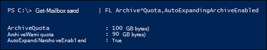

# <a name="enable-auto-expanding-archiving---admin-help"></a>启用自动扩展存档 - 管理员帮助

可以使用自动扩展Exchange Online功能为存档邮箱启用额外存储空间。 启用自动扩展存档后，会自动向用户的存档邮箱添加额外的存储空间，直到达到 1.5 TB 的存储限制。 您可以为组织中的每个人或只为特定用户启用自动扩展存档。 有关自动扩展存档的信息，请参阅 [自动扩展存档概述](autoexpanding-archiving.md)。

## <a name="before-you-enable-auto-expanding-archiving"></a>启用自动扩展存档之前

- 您必须是组织的全局管理员或 Exchange Online 组织中组织管理角色组的成员，才能为整个组织或特定用户启用自动扩展存档。 或者，您必须是分配有"邮件收件人"角色的角色组的成员，才能为特定用户启用自动扩展存档。

- 必须启用用户的存档邮箱，然后才能启用自动扩展存档。 必须为用户分配Exchange Online计划 2 许可证才能启用存档邮箱。 如果为用户分配了Exchange Online 1 许可证，您必须为其分配单独的 Exchange Online Archiving 许可证才能启用存档邮箱。 请参阅 [启用存档邮箱](enable-archive-mailboxes.md)。

- 您还可以使用 PowerShell 启用存档邮箱。 有关 [可用于为](#more-information) 组织中所有用户启用存档邮箱的 PowerShell 命令的示例，请参阅详细信息部分。

- 自动扩展存档还支持共享邮箱。 若要为共享邮箱启用存档，需要Exchange Online计划 2 许可证Exchange Online计划 1 Exchange Online Archiving许可证。

- 自动扩展存档可防止恢复或还原非 [活动邮箱](inactive-mailboxes-in-office-365.md#what-are-inactive-mailboxes)。 这意味着，如果为邮箱启用自动扩展存档，并且邮箱在以后变为非活动状态，将无法通过将非活动邮箱 [ (](recover-an-inactive-mailbox.md) 转换为活动邮箱) 或通过将内容合并到现有邮箱) 将其 [还原到](restore-an-inactive-mailbox.md) (。 如果在非活动邮箱上启用了自动扩展存档，则恢复数据的唯一方法就是使用 Microsoft 365 合规中心 中的内容搜索工具将数据从邮箱导出并导入另一个邮箱。 有关详细信息，请参阅 Overview of inactive mailboxes 中的"非活动邮箱和自动扩展 [存档"部分](inactive-mailboxes-in-office-365.md#inactive-mailboxes-and-auto-expanding-archives)。

- You can't use the Exchange admin center or the Microsoft 365 合规中心 to enable auto-expanding archiving. 您必须使用 Exchange Online PowerShell。 若要使用远程 PowerShell Exchange Online组织，请参阅连接 Exchange Online [PowerShell。](/powershell/exchange/connect-to-exchange-online-powershell)

## <a name="enable-auto-expanding-archiving-for-your-entire-organization"></a>为整个组织启用自动扩展存档

您可以为整个组织启用自动扩展存档。 启用后，将为现有用户邮箱和已创建的新用户邮箱启用自动扩展存档。 创建用户邮箱时，请确保启用用户的主存档邮箱，以便自动扩展存档功能适用于新的用户邮箱。
  
1. [连接到 Exchange Online PowerShell](/powershell/exchange/connect-to-exchange-online-powershell)

2. 在 PowerShell 中Exchange Online以下命令，为整个组织启用自动扩展存档。

    ```powershell
    Set-OrganizationConfig -AutoExpandingArchive
    ```

## <a name="enable-auto-expanding-archiving-for-specific-users"></a>为特定用户启用自动扩展存档

您可以仅为特定用户启用存档，而不是为组织每个用户启用自动扩展存档。 您可以这样做，因为只有部分用户可能需要较大的存档存储容量。
  
当您为特定用户启用自动扩展存档，并将该用户的邮箱置于保留状态或分配到保留策略时，将进行以下两种配置更改：
  
- 用户的主存档邮箱的存储配额增加了 10 GB， (从 100 GB 增加到 110 GB) 。 存档警告配额也增加了 10 GB， (从 90 GB 增加到 100 GB) 。

- 用户主邮箱中"可恢复的项目"文件夹的存储配额增加了 10 GB (从 100 GB 增加到 110 GB) 。 "可恢复的项目"警告配额也增加了 10 GB， (从 90 GB 增加到 100 GB) 。 这些更改仅在邮箱置于保留状态或分配到保留策略时适用。

添加此额外空间，以防止在设置自动扩展存档之前可能会发生的任何存储问题。 为整个  *组织启用*  自动扩展存档时，不会增加额外存储空间，如上一节中所述。
  
1. [连接到 Exchange Online PowerShell](/powershell/exchange/connect-to-exchange-online-powershell)

2. 在 PowerShell Exchange Online运行以下命令，为特定用户启用自动扩展存档。 如前所述，必须先启用用户的存档邮箱 (主存档) ，然后才能为该用户启用自动扩展存档。

    ```powershell
    Enable-Mailbox <user mailbox> -AutoExpandingArchive
    ```

> [!IMPORTANT]
> 在 Exchange 混合部署中，不能使用 **Enable-Mailbox -AutoExpandingArchive** 命令为主邮箱位于本地且存档邮箱基于云的特定用户启用自动扩展存档。 若要在 Exchange 混合部署中为基于云的存档邮箱启用自动扩展存档，您必须在 Exchange Online PowerShell 中运行 **Set-OrganizationConfig -AutoExpandingArchive** 命令，以启用整个组织的自动扩展存档。 如果用户的主邮箱和存档邮箱都基于云的，您可以使用 **Enable-Mailbox -AutoExpandingArchive** 命令为特定用户启用自动扩展存档。
  
## <a name="verify-that-auto-expanding-archiving-is-enabled"></a>验证是否已启用自动扩展存档

若要验证是否为组织启用了自动扩展存档，请运行 PowerShell 中的以下Exchange Online命令。

```powershell
Get-OrganizationConfig | FL AutoExpandingArchiveEnabled
```

值  `True` 表示为组织启用了自动扩展存档。 
  
若要验证是否为特定用户启用了自动扩展存档，请运行 PowerShell Exchange Online命令。
  
```powershell
Get-Mailbox <user mailbox> | FL AutoExpandingArchiveEnabled
```

值  `True` 表示为用户启用了自动扩展存档。
  
若要确定是否为非活动邮箱启用自动扩展存档，请运行 PowerShell 中的以下Exchange Online命令。
  
```powershell
Get-Mailbox -InactiveMailboxOnly | FL UserPrincipalName,AutoExpandingArchiveEnabled
```

值 表示为非活动邮箱  `True` 启用了自动扩展存档。 值 `False` 表示未启用自动扩展存档。

启用自动扩展存档后，请记住以下事项：
  
- 如果运行 **Set-OrganizationConfig -AutoExpandingArchive** 命令为组织启用自动扩展存档，则不必对单个邮箱运行 **Enable-Mailbox -AutoExpandingArchive。** 运行 **Set-OrganizationConfig** cmdlet 为组织启用自动扩展存档不会将用户邮箱上的  *AutoExpandingArchiveEnabled*  属性更改为 `True` 。

- 同样，启用自动扩展存档时  *，ArchiveQuota*  和  *ArchiveWarningQuota*  邮箱属性的值不会更改。 事实上，当您为用户邮箱启用自动扩展存档且  *AutoExpandingArchiveEnabled*  属性设置为 时  `True`  *，ArchiveQuota*  和  *ArchiveWarningQuota*  属性将被忽略。 下面是为用户邮箱启用自动扩展存档后这些邮箱属性的示例。 

    

## <a name="more-information"></a>更多信息

- 您还可以使用 PowerShell 启用存档邮箱。 例如，可以在 PowerShell Exchange Online运行以下命令，为尚未启用存档邮箱的所有用户启用存档邮箱。

    ```powershell
    Get-Mailbox -Filter {ArchiveStatus -Eq "None" -AND RecipientTypeDetails -eq "UserMailbox"} | Enable-Mailbox -Archive
    ```

- 为组织或特定用户启用自动扩展存档后，当存档邮箱（包括"可恢复的项目"文件夹）达到 90 GB 时)  (存档邮箱将转换为自动扩展存档。 预配额外存储空间可能需要 30 天。

- 启用自动扩展存档后，无法将其关闭。 此外，管理员无法调整用于自动扩展存档的存储配额。

- 对于具有本地主邮箱的用户，Exchange混合部署中的基于云的存档邮箱支持自动扩展存档。 但是，为基于云的存档邮箱启用自动扩展存档后，无法将存档邮箱从内部部署存档邮箱Exchange组织。 在任何版本的邮箱中，内部部署邮箱都不支持自动扩展Exchange Server。

- 有关用户可用于访问存档邮箱中附加存储区域中的项目的 Outlook 客户端的列表，请参阅自动扩展存档概述中的"访问自动扩展存档中的项目的 Outlook 要求"部分。 [](autoexpanding-archiving.md#outlook-requirements-for-accessing-items-in-an-auto-expanded-archive)

- 如前所述，当您运行 **Enable-Mailbox -AutoExpandingArchive** 命令时，如果邮箱位于保留状态) 则 10 GB 将添加到用户主存档邮箱 (的存储配额和"可恢复的项目"文件夹。 这将提供额外的存储空间，直到自动扩展的存储空间预配 (可能需要 30 天) 。 运行 **Set-OrganizationConfig -AutoExpandingArchive** 以启用组织中所有邮箱的自动扩展存档时，不会添加此额外存储空间。 如果为整个组织启用自动扩展存档，但需要为特定用户添加额外的 10 GB 存储空间，可以针对该邮箱运行 **Enable-Mailbox -AutoExpandingArchive** 命令。 您将收到一条错误消息，指出已启用自动扩展存档，但会向邮箱添加额外的存储空间。

> [!IMPORTANT]
> 只有单个用户使用的邮箱或每天增长不超过 1 GB 的共享邮箱才支持自动扩展存档。 不允许使用日记、传输规则或自动转发规则将邮件复制到存档邮箱进行存档。 用户的存档邮箱只供该用户使用。 Microsoft 保留拒绝在用户的存档邮箱用于存储其他用户的存档数据或其他不当使用情况下的其他存档的权利。
