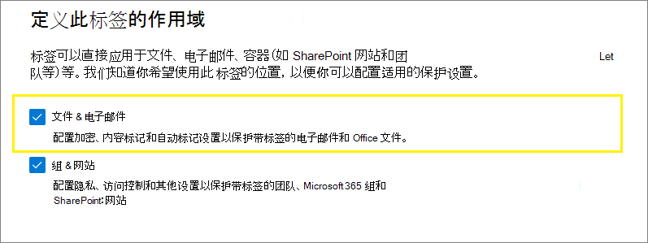
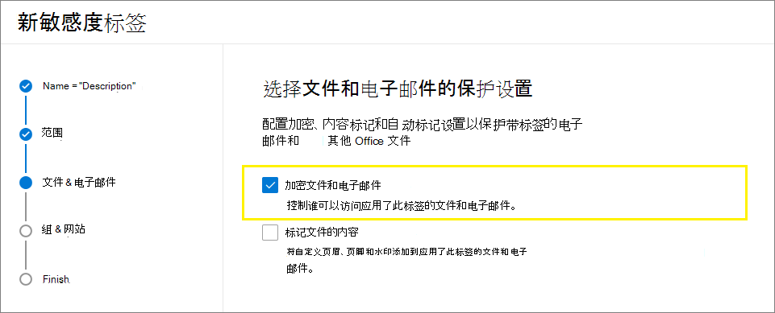
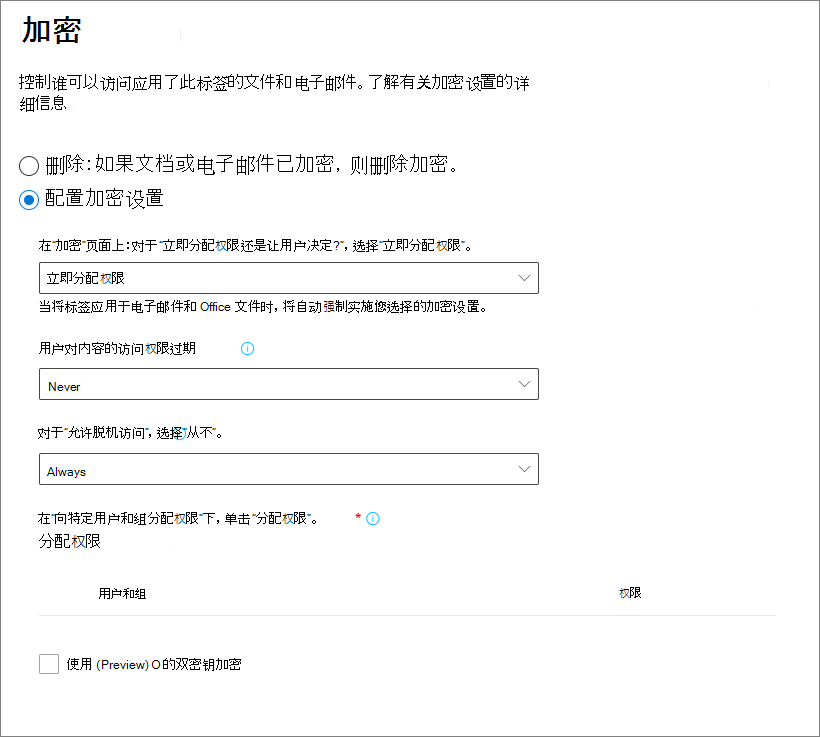
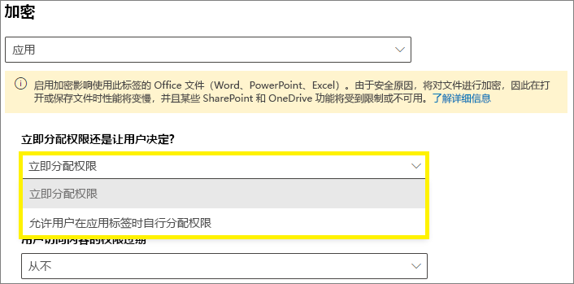
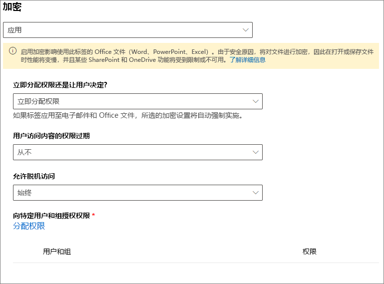
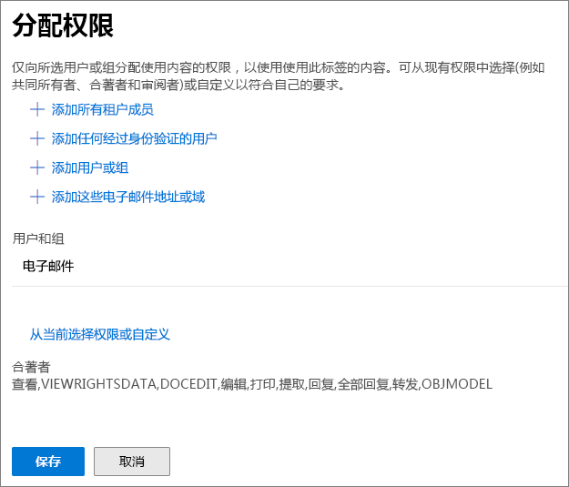
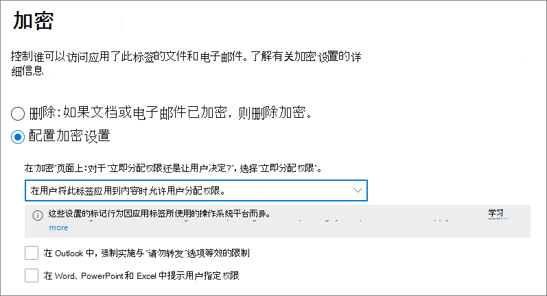
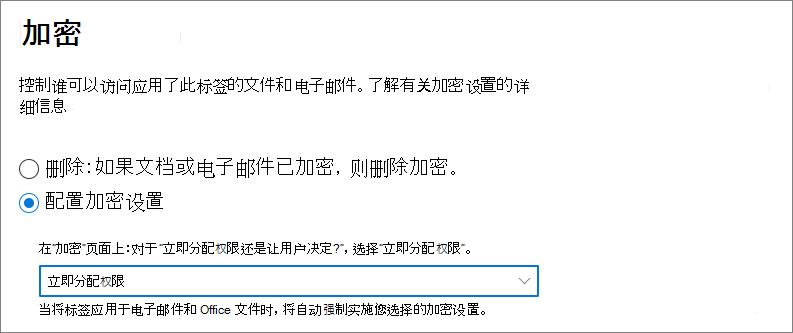

# 通过敏感度标签应用加密，从而限制对内容的访问

>*[Microsoft 365 安全性与合规性许可指南](/office365/servicedescriptions/microsoft-365-service-descriptions/microsoft-365-tenantlevel-services-licensing-guidance/microsoft-365-security-compliance-licensing-guidance)。*

创建敏感度标签时，可以限制对将要应用标签的内容的访问。例如，通过敏感度标签的加密设置，可以保护内容，以便：

- 只有组织中的用户才能打开机密文档或电子邮件。
- 只有市场部的用户才能编辑和打印促销声明文档或电子邮件，而组织中的所有其他用户只能阅读它。
- 用户无法转发电子邮件或从中复制包含有关内部组织的新闻的信息。
- 发送到业务合作伙伴的当前价目表在指定日期后无法打开。

当文档或电子邮件被加密时，对内容的访问将受到限制，以便它：

- 只能由标签的加密设置授权的用户解密。
- 无论其所在位置（组织内部或外部）如何，仍保持加密状态，即使该文件被重命名也是如此。
- 静态加密（例如，在 OneDrive 帐户中）和传输加密（例如，正在通过 Internet 传输的电子邮件）。

最后，作为管理员，你在配置敏感度标签来应用加密时可选择执行下述任一操作：

- **立即分配权限**，以便准确确定哪些用户获得了带有该标签的内容的哪些权限。
- 在用户将此标签应用到内容时 **允许用户分配权限**。 这样，即可让组织内部人员在协作处理和完成任务时具有可能需要的一定程度的灵活性。

在 Microsoft 365 合规中心中[创建敏感度标签](create-sensitivity-labels.md)时，加密设置可用。 还可以使用旧门户安全与合规中心。

## 了解加密的工作方式

加密使用了 Azure 信息保护中的 Azure 权限管理服务 (Azure RMS)。 该保护解决方案使用了加密、标识和身份验证策略。 要了解详细信息，请参阅 Azure 信息保护文档中的[什么是 Azure 权限管理？](/azure/information-protection/what-is-azure-rms)。 

使用此加密解决方案时，**超级用户** 功能确保了获得授权的用户和服务始终可读取和检测已针对你的组织进行加密的数据。 必要时，可删除或更改加密。 有关详细信息，请参阅[为 Azure 信息保护和发现服务或数据恢复配置超级用户](/azure/information-protection/configure-super-users)。

## 重要先决条件

可能需要执行一些配置任务，然后才可使用加密。 配置加密设置时，不检查是否满足这些先决条件。

- 激活 Azure 信息保护中的保护
    
    要使敏感度标签应用加密，必须为租户激活 Azure 信息保护中的保护服务（即 Azure 权限管理）。 在较新的租户中，这是默认设置，但你可能需要手动激活该服务。 有关详细信息，请参阅[激活 Azure 信息保护中的保护服务](/azure/information-protection/activate-service)。

- 查看网络要求
    
    可能需要对防火墙等网络设备做出一些更改。 如需获取详细信息，请参阅 Azure 信息保护文档中的[防火墙和网络设施](/azure/information-protection/requirements#firewalls-and-network-infrastructure)。

- 配置用于 Azure 信息保护的 Exchange
    
    在用户能够在 Outlook 中应用标签以加密其电子邮件前，无需对 Exchange 进行配置以用于 Azure 信息保护。但是，如果没有针对 Azure 信息保护对 Exchange 进行配置，你将无法在 Exchange 中获取使用 Microsoft Azure AD Rights Management 的完整功能。
    
    例如，用户无法查看移动电话或 Outlook 网页版上机密的电子邮件，无法索引加密的电子邮件用于搜索，并且无法针对 Rights Management 保护配置 Exchange Online DLP。 
    
    为确保 Exchange 可以支持这些其他应用场景，请参阅以下内容：
    
    - 对于 Exchange Online，请参阅 [Exchange Online：IRM 配置](/azure/information-protection/configure-office365#exchangeonline-irm-configuration)的说明。
    - 对于本地 Exchange，必须部署 [RMS 连接器并配置你的 Exchange 服务器](/azure/information-protection/deploy-rms-connector)。 

## 如何配置加密标签

1. 请遵循一般说明 [创建或编辑敏感度标签](create-sensitivity-labels.md#create-and-configure-sensitivity-labels)，并确保为标签的作用域选择 **“文件和电子邮件”**： 
    
    

2. 然后，在“**选择文件和电子邮件的保护设置**”页面上，确保选择“**加密文件和电子邮件**”
    
    

4.  在“**加密**”页上，选择下列选项之一：
    
    - **如果文件已加密，请删除加密**：仅 Azure 信息保护统一标签客户端支持此选项。 选择此选项并使用内置标签时，标签可能不会显示在应用程序中，或者会显示但未进行任何加密更改。
        
        有关此方案的详细信息，请参阅[应用标签时，对现有加密的影响](#what-happens-to-existing-encryption-when-a-labels-applied)部分。 请务必注意，此设置可能会导致敏感度标签，用户没有足够的权限时，他们可能无法应用标签。
    
    - **配置加密设置**：启用加密，并使加密设置可见：
        
        
        
        有关这些设置的说明，请参阅以下[配置加密设置](#configure-encryption-settings) 部分。

### 应用标签后，现有加密会发生什么情况

如果向未加密的内容应用敏感度标签，则你可选择的加密选项的结果一目了然。 例如，如果未选择 **“加密文件和电子邮件”**，则内容仍然不加密。

但是，内容可能已经加密。 例如，其他用户可能已应用以下内容：

- 其自己的权限，包括在标签提示时提供的用户定义的权限、Azure 信息保护客户端提供的自定义权限，以及 Office 应用中的 **受限访问** 文档保护。
- 在不使用标签的情况下加密内容的 Azure 权限管理保护模板。 此类别包括通过权限保护应用加密的邮件流规则。
- 使用管理员分配的权限应用加密的标签。

下表说明了在向该内容应用敏感度标签后现有加密发生的情况：

| | 加密：未选择 | 加密：已配置 | 加密：删除\* |
|:-----|:-----|:-----|:-----|
|**用户指定的权限**|保留原有加密|应用新的标签加密|删除原有加密|
|**保护模板**|保留原有加密|应用新的标签加密|删除原有加密|
|**具有管理员定义的权限的标签**|删除原有加密|应用新的标签加密|删除原有加密|

**脚注：**

\*仅受 Azure 信息保护统一标签客户端支持

如果应用了新的标签加密或删除了原有加密，则仅在应用标签的用户具有支持此操作的使用权限或角色时才会发生此情况：

- “导出”或“完全控制”[使用权限](/azure/information-protection/configure-usage-rights#usage-rights-and-descriptions)。
- [权限管理颁发者/权限管理所有者](/azure/information-protection/configure-usage-rights#rights-management-issuer-and-rights-management-owner)或[超级用户](/azure/information-protection/configure-super-users)角色。

如果用户没有上述权限或角色之一，则无法应用标签，因此原有加密将保留。 用户会看到以下消息：**你无权对敏感度标签进行此更改。请联系内容所有者。**

例如，向电子邮件应用“请勿转发”标签的用户可重新标记会话，以替换或删除加密，因为他们是该电子邮件的权限管理所有者。 但除了超级用户外，此电子邮件的收件人无法对其重新标记，因为他们没有必需的使用权限。

#### 加密电子邮件的电子邮件附件

通过任何方式加密电子邮件时，附加到该电子邮件的所有未加密的 Office 文档都将自动继承相同的加密设置。

已加密且随后添加为附件的文档始终保留其原有加密。

## 配置加密设置

在 **加密页面** 选择“**配置加密设置**”来创建或编辑敏感度标签时，选择以下选项之一：

- **立即分配权限**，以便可准确确定哪些用户对已应用标签的内容具有哪些权限。 有关详细信息，请参阅下一部分：[立即分配权限](#assign-permissions-now)。
- 在用户向内容应用标签时 **允许用户分配权限**。 通过此选项，可使组织内部人员在协作处理和完成任务时具有一定程度可能需要的灵活性。 有关详细信息，请参阅下述部分：[允许用户分配权限](#let-users-assign-permissions)。

例如，如果你有一个名为“**高度机密**”的敏感度标签，它将应用于你的大部分敏感内容，则你可能需要决定谁对该内容获得哪种类型的权限。

或者，如果你有一个名为“**商业合同**”的敏感度标签，而你所在组织的工作流要员工临时与不同人员协作处理此内容，则你可能需要允许用户在分配此标签时决定由谁获得权限。 这种灵活性都能帮助你的用户保持高效，同时减少管理员要更新或新建敏感度标签来应对特定场景的请求。

选择是要立即分配权限还是允许用户分配权限：

## 立即分配权限

使用下述选项来控制哪些人员可访问应用了此标签的电子邮件或文档。可以：

- **允许对标记的内容的访问权限过期**（在某个特定日期或在应用标签后的特定天数后）。在此时间后，用户将无法打开标记的项。如果指定某个日期，则它将于该日期午夜（在你的当前时区）生效。请注意，某些电子邮件客户端由于其缓存机制，可能不强制过期，仍显示过期的电子邮件。

- **允许脱机访问**（从不、始终或在应用标签后的特定天后）。如果将脱机访问限制为从不或一定天数，则当达到该阈值时，必须对用户重新进行身份验证并记录其访问。有关详细信息，请参阅下一部分有关 Rights Management 使用许可证的内容。

加密内容的访问控制设置：

### 针对脱机访问的 Rights Management 使用许可证

当用户打开受 Microsoft Azure AD Rights Management 服务加密保护的文档或电子邮件时，该内容的 Microsoft Azure AD Rights Management 使用许可证将授予该用户。此使用许可证是一种证书，其中包含用户对文档或电子邮件的使用权限，以及用于加密内容的加密密钥。此使用许可证还包含过期日期（若已设置）及其有效时长。

如果尚未设置任何到期日期，则针对租户的默认使用许可证有效期为 30 天。在使用许可证有效期内，无需就内容对用户重新进行身份验证或授权。这使用户无需具有 Internet 连接即可继续打开受保护的文档或电子邮件。当用户许可有效期到期后，在用户下次访问受保护的文档或电子邮件时，必须对用户重新进行身份验证和授权。

除重新进行身份验证以外，还将重新评估加密设置和用户组成员身份。这意味着，如果自他们最后一次访问内容时在加密设置或组成员身份中存在更改，则对于同一文档或电子邮件，他们可能会收到不同的访问结果。

若要了解如何更改默认的 30 天设置，请参阅 [Rights Management 使用许可证](/azure/information-protection/configure-usage-rights#rights-management-use-license)。

### 向特定用户或组分配权限

可向特定人员授予权限，只允许这些人员与标记的内容进行交互：

1. 首先，添加将向其分配对标记的内容具有访问权限的用户或组。

2. 然后，选择这些用户应对标记的内容具有的权限。

分配权限：

#### 添加用户或组

分配权限时，可以选择：

- 组织中的任何人（所有租户成员）。此设置不包括来宾帐户。

- 任何经过身份验证的用户。选择前，请确保你了解此设置的相关 [要求和限制](#requirements-and-limitations-for-add-any-authenticated-users)。

- Azure AD 中的任何特定用户或启用了电子邮件的安全组、通讯组、或 Microsoft 365 组（[旧称为“Office 365 组”](https://techcommunity.microsoft.com/t5/microsoft-365-blog/office-365-groups-will-become-microsoft-365-groups/ba-p/1303601)）。 Microsoft 365 组可以有静态或[动态成员资格](/azure/active-directory/users-groups-roles/groups-create-rule)。 请注意，不能使用[来自 Exchange 的动态通讯组](/Exchange/recipients/dynamic-distribution-groups/dynamic-distribution-groups)，因为此组类型不会同步到 Azure AD，并且不能使用未启用电子邮件的安全组。

- 任何电子邮件地址或域。 借助此选项，通过输入 Azure AD 使用的另一组织中的任何域名，指定该组织中的所有用户。 你可使用此选项处理社交提供商，方式是输入其域名，例如 **gmail.com**、**hotmail.com** 或 **outlook.com**。

    > [!NOTE]
    > 如果从使用 Azure AD 的组织中指定一个域，则无法将访问权限局限于该特定域。 转而对于拥有你指定的域名的租户来说，会自动包含 Azure AD 中已经过验证的所有域。

选择组织中的所有用户和组或浏览目录时，这些用户或组必须具有电子邮件地址。

最佳做法是使用组，而不是使用用户。此策略可使你的配置更为简单。

##### 有关“添加任何经过身份验证的用户”的要求和限制

此设置不会限制谁可访问标签加密的内容，但仍会加密内容并向你提供用来限制内容使用方式（权限）和访问方式（过期和脱机访问）的选项。 但是，打开加密内容的应用程序必须能够支持正在使用的身份验证。 由此，联合社交提供商（如 Google）和一次性密码身份验证仅适用于电子邮件，且仅在你使用 Exchange Online 时才适用。 Microsoft 帐户可与 Office 365 应用和 [Azure 信息保护查看器](https://portal.azurerms.com/#/download)一起使用。

> [!NOTE]
> 当为 [SharePoint 和 OneDrive 中的 Office 文件启用](sensitivity-labels-sharepoint-onedrive-files.md)敏感度标签时，请考虑将此设置与 [SharePoint 和 OneDrive 与 Azure AD B2B 集成](/sharepoint/sharepoint-azureb2b-integration-preview)。

“所有经过身份验证的用户”设置的一些典型场景：

- 你不在乎谁会查看内容，但你想要限制内容使用方式。 例如，你不希望内容遭到编辑、复制或打印。
- 你不需要限制谁有权访问内容，但你想要能够确定谁可打开内容。
- 你要求内容必须在静态和传输中经过加密，但不要求访问权限控制。

#### 选择权限

选择允许为这些用户或组使用哪些权限时，可以选择：

- 具有预设权限组的[预定义权限级别](/azure/information-protection/configure-usage-rights#rights-included-in-permissions-levels)，例如共同创作或审阅者。
- 自定义权限，可在其中选择一个或多个使用权限。

有关帮助你选择适当权限的详细信息，请参阅[使用权限和说明](/azure/information-protection/configure-usage-rights#usage-rights-and-descriptions)。  

请注意，同一标签可向不同用户授予不同的权限。例如，一个标签可将某些用户分配为审阅者，并可将其他用户分配为共同创作，如下所示。

为此，添加用户或组、向其分配权限并保存这些设置。然后重复这些步骤，添加用户并向其分配权限、每次保存设置。可以根据需要经常重复此配置，以便为不同用户定义不同权限。

#### Rights Management 颁发者（应用敏感度标签的用户）始终具有完全控制

敏感度标签加密使用了 Azure 信息保护中的 Microsoft Azure AD Rights Management 服务。当用户通过加密应用敏感度标签来保护文档或电子邮件时，该用户就成为了该内容的权限管理颁发者。

权限管理颁发者始终具有对文档或电子邮件的完全控制权限；此外：

- 如果加密设置包含过期日期，权限管理颁发者在该日期后仍可打开和编辑文档或电子邮件。
- Rights Management 颁发者可以始终在脱机状态下访问文档或电子邮件。
- 在文档被撤销后，Rights Management 颁发者仍然可以打开该文档。

有关详细信息，请参阅 [Rights Management 颁发者和 Rights Management 所有者](/azure/information-protection/configure-usage-rights#rights-management-issuer-and-rights-management-owner)。

### 双密钥加密

> [!NOTE]
> 当前仅 Azure 信息保护统一标签客户端支持此功能。

只有配置了双密钥加密服务，并且需要为应用了此标签的文件使用此双密钥加密后，才可选择此选项。

了解更多信息、先决条件、以及配置说明，请参阅[双密钥加密 (DKE)](double-key-encryption.md)。

## 允许用户分配权限

> [!IMPORTANT]
> 并非所有的标签客户端都支持让用户自己分配权限所有的选项。请使用本节了解更多信息。

可使用下述选项来允许用户在向内容手动应用敏感度标签时分配权限：

- 在 Outlook 中，用户可以为他们选择的收件人选择相当于 [“不转发”](/azure/information-protection/configure-usage-rights#do-not-forward-option-for-emails) 或 [“只加密”](/azure/information-protection/configure-usage-rights#encrypt-only-option-for-emails) 的限制。
    
    所有支持敏感标签的电子邮件客户端都支持 “不转发” 选项。 不过，应用灵敏度标签的 **Encrypt-Only** 选项是最近发布的版本，只支持内置标签，而不支持 Azure 信息保护统一标签客户端。 对于不支持此功能的邮件客户端，标签将不可见。
    
    若要检查使用内置标签的 Outlook 应用的最低版本支持应用带有敏感标签的“只加密”选项，请使用 [“Outlook 能力表”](sensitivity-labels-office-apps.md#sensitivity-label-capabilities-in-outlook) 和 **“让用户分配权限: - 只加密”** 行。

- 在 Word、PowerPoint 和 Excel 中，系统会提示用户为特定用户、组或组织选择他们自己的权限。

    Azure 信息保护统一标签客户端和一些使用内置标签的应用程序都支持该选项。 对于不支持该功能的应用，标签对于用户来说要么是不可见，要么是为了保持一致性，即使标签是可见的也无法应用于向用户解释信息。
    
    要检查哪些使用内置标签的应用支持此选项，请使用 [Word、Excel 和 PowerPoint 功能表](sensitivity-labels-office-apps.md#sensitivity-label-capabilities-in-word-excel-and-powerpoint) 和 **“让用户分配权限: - 提示用户”** 行。

在这些选择受到支持时，请使用以下标签确定用户何时回看到敏感度标签：

|设置 |标签在 Outlook 中可见|标签在 Word、Excel 和 PowerPoint 中可见|
|:-----|:-----|:-----|:-----|
|**在 Outlook 中，使用“不转发”或“仅加密”选项实施限制**|是 |否 |
|**在 Word、PowerPoint 和 Excel 中提示用户指定权限**|否 |是|

同时选中这两个选项时，标签在 Outlook 和 Word、Exce、PowerPoint 中都可见。

让用户分配权限的敏感性标签必须由用户手动应用于内容，不能自动应用或作为推荐标签使用。

配置用户分配的权限：

### Outlook 限制

在 Outlook 中，当用户应用一个让他们为邮件分配权限的敏感标签时，可以选择 **“不转发”选项** 或 **“只加密”**。 用户将在邮件顶部看到标签名称和说明，这表示正在保护该内容。 与 Word、PowerPoint 和 Excel 不同（详见[下一部分](#word-powerpoint-and-excel-permissions)），系统不会提示用户选择特定权限。

当这些选项中的任何一个应用于电子邮件时，都会加密电子邮件且收件人必须经过身份验证。然后，收件人自动拥有受限制的使用权限:

- **请勿转发**：收件人无法转发电子邮件、打印电子邮件或丛中复制。例如，在 Outlook 客户端中，“转发”按钮将不可用，“另存为”和“打印”菜单选项也将不可用，并且你不可在“收件人”、“抄送”和“密件抄送”框中添加或更改收件人。
    
    有关此选项工作方式的更多信息，请参阅 [电子邮件的 “不转发” 选项](/azure/information-protection/configure-usage-rights#do-not-forward-option-for-emails)。

- **只加密密**: 收件人拥有除 “另存为”、“导出” 和 “完全控制” 以外的所有使用权。 这种使用权的组合意味着收件人除了无法取消保护外，没有任何限制。 例如，收件人可以从邮件中复制、打印和转发。
    
    有关此选项工作方式的更多信息，请参见 [电子邮件的 “只加密” 选项](/azure/information-protection/configure-usage-rights#encrypt-only-option-for-emails)。

自动附加到电子邮件但未加密的 Office 文档会自动继承相同的限制。 对于“请勿转发”，适用于这些文件的使用权限是“编辑内容”，“编辑”; “保存”; “查看”、“打开”、“读取”; 以及“允许宏”。 如果用户希望对附件有不同的使用权限，或者附件并非支持该继承保护的 Office 文档，用户则需要在将文件附加到电子邮件之前对文件进行加密。

### Word、PowerPoint 和 Excel 权限

在 Word、PowerPoint 和 Excel 中，当用户向文档应用允许其分配权限的敏感度标签时，系统会提示他们在应用加密时指定其对用户和权限的选择。

例如，使用 Azure 信息保护统一标记客户端，除非 [启用了共同创作](sensitivity-labels-coauthoring.md)，否则用户可以：

- 选择权限级别，例如查看者（可分配“仅查看”权限）或合著者（可分配“查看”、“编辑”、“复制”和“打印”权限）。
- 选择用户、组或组织。 这可包括你所在组织内部或外部的人员。
- 设置到期日期，所选用户在该日期后不可访问内容。 有关详细信息，请参阅上一部分：[针对脱机访问的 Rights Management 使用许可证](#rights-management-use-license-for-offline-access)。

对于内置标签以及 [启用共同创作](sensitivity-labels-coauthoring.md) 时的 Azure 信息保护统一标记客户端，用户会看到相同的对话框，就像他们选择了以下内容一样：

- Windows：“**文件**”选项卡 >“**信息**” > “**保护文档**” > “**限制访问**” > “**受限访问**”

- macOS：“**审阅**”选项卡 >“**保护**” > “**权限**” > “**受限访问**”

> [!TIP]
> 如果用户熟悉在 [启用共同创作](sensitivity-labels-coauthoring.md) 之前使用使用 Azure 信息保护统一标记客户端来配置自定义权限，你可能发现查看权限级别与单个使用权限的映射很有帮助：[权限级别中包含的权限](/azure/information-protection/configure-usage-rights#rights-included-in-permissions-levels)。

## 加密设置的配置示例

对于后面的每个示例，请在选择“**配置加密设置**”时通过 **加密页面** 进行配置：

### 示例 1：应用“请勿转发”以将加密的电子邮件发送至 Gmail 帐户的标签

此标签仅显示 Outlook 和 Outlook 网页版，且你必须使用 Exchange Online。 在用户需要向使用 Gmail 帐户（或你组织外部的任何其他电子邮件帐户）的人员发送加密电子邮件时，指示这些用户选择此标签。

用户需在“**收件人**”框中键入 Gmail 电子邮件地址。  然后选中该标签，“请勿转发”选项会自动添加到电子邮件中。 这样的话，收件人就无法转发、打印或复制该电子邮件，也不能使用“**另存为**”选项在其邮箱之外保存该电子邮件。

1. 在“**加密**”页面上：对于“**立即分配权限还是让用户决定?**”，选择“**允许用户在应用标签时自行分配权限**”。

2. 选择复选框：**在 Outlook 中，强制实施与“请勿转发”选项等效的限制**。

3. 如果选中，请清除复选框：**在 Word、PowerPoint 和 Excel 中提示用户指定权限**。

4. 选择“**下一步**”并完成配置。

### 示例 2：将只读权限局限于另一组织中的所有用户的标签

此标签适用于以只读形式共享非常敏感的文档，文档始终需要 Internet 连接才能查看。

此标签不适用于电子邮件。

1. 在“**加密**”页面上：对于“**立即分配权限还是让用户决定?**”，选择“**立即分配权限**”。

2. 对于“**允许脱机访问**”，选择“**从不**”。

3. 选择“**分配权限**”。

4. 在“**分配权限**”窗格上，选择“**添加特定电子邮件地址或域**”。

5. 在文本框中，输入另一组织中的域名，例如 **fabrikam.com**。然后选择“**添加**”。

6. 选择“**选择权限**”。

7. 在“**选择权限**”窗格中，选择下拉框，选择“**查看者**”，然后选择“**保存**”。

8. 返回到“**分配权限**”窗格中，选择“**保存**”。

9. 在 **加密** 页上，选择“**下一步**”并完成配置。

### 示例 3：将外部用户添加到加密内容的现有标签

添加的新用户将能够打开已使用此标签保护的文档和电子邮件。 授予这些用户的权限可能与现有用户拥有的权限不同。

1. 在“**加密**”页面上：对于“**立即分配权限还是让用户决定?**”，确保选中“**立即分配权限**”。

2. 选择“**分配权限**”。

3. 在“**分配权限**”窗格上，选择“**添加特定电子邮件地址或域**”。

4. 在文本框中，输入要添加的第一名用户（或组）的电子邮件地址，然后选择“**添加**”。

5. 选择“**选择权限**”。

6. 在“**选择权限**”窗格中，选择此用户（或组）的权限，然后选择“**保存**”。

7. 返回到“**分配权限**”窗格，对要添加到此标签的每位用户（或组）重复步骤 3 到步骤 6。然后单击“**保存**”。

8. 在 **加密** 页上，选择“**下一步**”并完成配置。

### 示例 4：对内容进行加密但不限制可访问的人员的标签

此配置的优势在于，你无需指定用户、组或域即可加密电子邮件或文档。 内容仍将被加密，但你仍可指定使用权限、过期日期和脱机访问权限。

仅在无需限制可打开受保护的文档或电子邮件的人员时才使用此配置。[有关此设置的详细信息](#requirements-and-limitations-for-add-any-authenticated-users)

1. 在“**加密**”页面上：对于“**立即分配权限还是让用户决定?**”，确保选中“**立即分配权限**”。

2. 根据需要配置“**用户访问内容的权限过期**”和“**允许脱机访问**”。

3. 选择“**分配权限**”。

4. 在“**分配权限**”窗格中，选择“**添加任何经过身份验证的用户**”。

    对于“**用户和组**”，你将看到 **认证用户** 已自动添加。 无法更改此值，只能将其删除，但这会取消选择“**添加任何经过身份验证的用户**”。

5. 选择“**选择权限**”。

6. 在“**选择权限**”窗格中，选择下拉框，选择所需的权限，然后选择“**保存**”。

7. 返回到“**分配权限**”窗格中，选择“**保存**”。

8. 在 **加密** 页上，选择“**下一步**”并完成配置。

## 有关加密内容的注意事项

加密最敏感的文档和电子邮件有助于确保只有授权人员可访问此数据。 但是，需要考虑以下注意事项：

- 如果你的组织未[启用 SharePoint 和 OneDrive 中 Office 文件的灵敏度标签](sensitivity-labels-sharepoint-onedrive-files.md)：

  - “搜索”、“电子数据展示”和 Delve 将无法用于加密文件。
  - DLP 策略适用于这些加密文件的元数据（包括保留标签信息），但不适用于这些文件的内容（如文件内的信用卡号）。
  - 用户无法使用 Office 网页版打开加密文件。如果在 SharePoint 和 OneDrive 中为 Office 文件启用了敏感度标签，则用户可使用 Office 网页版打开加密文件，但存在一些[限制](sensitivity-labels-sharepoint-onedrive-files.md#limitations)，包括通过本地密钥应用的加密（称为“保留自己的密钥”(HYOK)）、[双密钥加密](#double-key-encryption)以及在不使用敏感度标签的情况下应用的加密。

- 如果与组织外部人员共享加密文档，可能需要创建来宾帐户并修改条件访问策略。有关详细信息，请参阅 [与外部用户共享加密文档](sensitivity-labels-office-apps.md#support-for-external-users-and-labeled-content)。

- 当授权用户在其 Office 应用中打开加密文档时，将在其应用顶部的黄色消息栏中看到标签名称和说明。 当加密权限扩展到组织外部的人员时，请仔细查看打开文档时将在此消息栏中显示的标签名称和说明。

- 对于多个用户同时编辑一个加密文件，这些用户必须都在使用 Office 网页版。  或者，对于 Windows 和 Mac，你已 [为使用敏感度标签加密的文件启用共同创作](sensitivity-labels-coauthoring.md)，并且用户具有 [所需最低版本](sensitivity-labels-office-apps.md#sensitivity-label-capabilities-in-word-excel-and-powerpoint) 的 Word、Excel 和 PowerPoint。 如果不是这种情况且文件已打开：

  - 在 Office 应用（Windows、Mac、Android 和 iOS）中，用户会看到一条“**文件正在使用中**”消息，其中包含签出该文件的用户的姓名。 然后，他们可查看只读副本或保存和编辑文件副本，并可在文件可用时收到通知。
  - 在 Office 网页版中，用户会看到一则错误消息，其中指出他们不能与其他人一起编辑文档。然后，他们可以选择“**在阅读视图中打开**”。

- 已为加密文件禁用适用于 iOS 和 Android 的 Office 应用中的[自动保存](https://support.office.com/article/what-is-autosave-6d6bd723-ebfd-4e40-b5f6-ae6e8088f7a5)功能。 如果你尚未为[使用敏感度标签加密的文件启用共同创作](sensitivity-labels-coauthoring.md)，则对 Windows 和 Mac 上的加密文件也会禁用此功能。 用户会看到一条消息，其中指出文件具有受限权限且必须删除此权限才能启用“自动保存”。

- 在 Office 应用（Windows、Mac、Android 和 iOS）中打开加密文件可能需要更长时间。

- 如果[在 SharePoint 中签出](https://support.microsoft.com/office/check-out-check-in-or-discard-changes-to-files-in-a-library-7e2c12a9-a874-4393-9511-1378a700f6de)文档时使用 Office 应用添加应用了加密的标签，并且用户随后放弃签出，则文档将保持含标签和加密状态。

- 除非你 [启用了使用敏感度标签](sensitivity-labels-coauthoring.md)加密的文件的共同创作，否则 Office 应用（Windows、Mac、Android 和 iOS）不支持以下加密文件操作，用户会看到错误消息。 但是，可将 SharePoint 功能用作替代项：

  - 查看、还原和保存以前版本的副本。或者，在你 [为列表或库启用和配置版本控制](https://support.office.com/article/enable-and-configure-versioning-for-a-list-or-library-1555d642-23ee-446a-990a-bcab618c7a37) 后，用户可使用 Office 网页版执行这些操作。
  - 更改文件的名称或位置。或者，用户可在 SharePoint 中 [对文档库中的文件、文件夹或链接重命名](https://support.microsoft.com/office/rename-a-file-folder-or-link-in-a-document-library-bc493c1a-921f-4bc1-a7f6-985ce11bb185)。

为了在已用敏感度标签加密的文件上获得更佳的协作体验，建议使用 [SharePoint 和 OneDrive中 Office 文件的敏感度标签](sensitivity-labels-sharepoint-onedrive-files.md)并使用 Web 版 Office。

## 后续步骤

需要与组织外的人员共享你的标记和加密文档吗？  请参阅[与外部用户共享加密文档](sensitivity-labels-office-apps.md#sharing-encrypted-documents-with-external-users)。