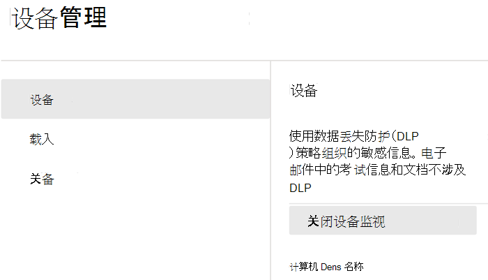

# 终结点数据丢失防护入门

Microsoft 终结点数据丢失防护（终结点 DLP）是 Microsoft 365 数据丢失防护 (DLP) 功能套件的一部分，可用于发现和保护 Microsoft 365 服务中的敏感项目。 有关 Microsoft 所有 DLP 产品/服务的更多信息，请参阅[数据丢失防护概述](dlp-learn-about-dlp.md)。 若要了解有关终结点 DLP 的详细信息，请参阅[了解终结点数据丢失防护](endpoint-dlp-learn-about.md)

借助 Microsoft Endpoint DLP，可以监视运行 Catalina 10.15 及更高版本的 Windows 10、Windows 11 和 macOS 设备 *(预览版)*。 设备载入后，DLP 将检测何时使用和共享敏感项目。 这为你提供了所需的可见性和控制力，以确保正确使用和保护它们，并帮助防止可能危害它们的危险行为。

## 准备工作

### SKU/订阅许可

在开始使用终结点 DLP 之前，应该先确认 [Microsoft 365 订阅](https://www.microsoft.com/microsoft-365/compare-microsoft-365-enterprise-plans?rtc=1)以及任何加载项。 若要访问和使用终结点 DLP 功能，必须具有这些订阅或加载项中的一个。

- Microsoft 365 E5
- Microsoft 365 A5 (EDU)
- Microsoft 365 E5 合规
- Microsoft 365 A5 合规
- Microsoft 365 E5 信息保护和治理
- Microsoft 365 A5 信息保护和治理

### 权限

若要启用设备管理，你使用的帐户必须是以下任何一个角色的成员：

- 全局管理员
- 安全管理员
- 合规性管理员

如果要使用自定义帐户查看设备管理设置，该帐户必须具有以下角色之一：

- 全局管理员
- 合规性管理员
- 合规性数据管理员
- 全局读取者

如果要使用自定义帐户访问载入/载出页面，该帐户必须具有以下角色之一：

- 全局管理员
- 合规性管理员

如果要使用自定义帐户打开/关闭设备监视，该帐户必须具有以下角色之一：

- 全局管理员
- 合规性管理员

可在[活动资源管理器](data-classification-activity-explorer.md)中查看终结点 DLP 中的数据。 有四个角色可向活动资源管理器授予权限，用于访问数据的帐户必须是其中任何一个的成员。

- 全局管理员
- 合规性管理员
- 安全管理员
- 合规性数据管理员

### 准备 Windows 10/11 终结点

确保计划部署终结点 DLP 的 Windows 设备满足这些要求。

1. 必须运行 Windows 10 x64 内部版本 1809、Windows 11 或更高版本。

1. 反恶意软件客户端的版本为 4.18.2009.7 或更高版本。 若要查看当前版本，请打开“Windows 安全中心”应用，选择“设置”图标，然后选择“关于”。 “反恶意软件客户端版本”下列出了版本号。 通过安装 Windows 更新 KB4052623，更新到最新的反恶意软件客户端版本。

   > [!NOTE]
   > 无需激活 Windows 安全组件，可运行独立于 Windows 安全中心状态的终结点 DLP，但必须启用[实时保护和行为监视器](/windows/security/threat-protection/microsoft-defender-antivirus/configure-real-time-protection-microsoft-defender-antivirus)）。

1. 以下是安装在 Windows 10 设备上的更新

   > [!NOTE]
   > 这些更新不是将设备加入终结点 DLP 的先决条件，但它们包含对重要问题的修复，因此必须在使用该产品之前完成安装。

   - 对于 Windows 10 1809 - KB4559003、KB4577069、KB4580390
   - 对于 Windows 10 1903 或 1909 - KB4559004、KB4577062、KB4580386
   - 对于 Windows 10 2004 - KB4568831、KB4577063
   - 对于运行 Office 2016（而未运行任何其他 Office 版本）的设备 - KB4577063

1. 所有设备必须是以下设备之一：

   - [已建立 Azure Active Directory (Azure AD) 连接](/azure/active-directory/devices/concept-azure-ad-join)
   - [已建立混合 Azure AD 联接](/azure/active-directory/devices/concept-azure-ad-join-hybrid)。
   - [已完成 AAD 注册](/azure/active-directory/user-help/user-help-register-device-on-network)

1. 在终结点设备上安装 Microsoft Chromium Edge 浏览器，以对上传到云活动执行策略操作。 请参见[下载基于 Chromium 的新 Microsoft Edge](https://support.microsoft.com/help/4501095/download-the-new-microsoft-edge-based-on-chromium)。 如果设备使用 Chrome 浏览器，你可以安装 [Microsoft 合规性扩展](dlp-chrome-learn-about.md#learn-about-the-microsoft-compliance-extension)来强制执行上传到云活动的策略操作。

1. 如果使用的是 Microsoft 365 应用版的月度企业版 2004-2008，则终结点 DLP 的已知问题会分类 Office 内容，需要更新到版本 2009 或更高版本。 参见 [Microsoft 365 应用版的更新历史记录（按日期列出）](/officeupdates/update-history-microsoft365-apps-by-date)。 要了解有关此问题的更多信息，请参阅[有关 2020 年当前频道发行的发行说明](/officeupdates/current-channel#version-2010-october-27)。

1. 如果你有使用设备代理连接到 internet 的端点，请按照 [配置设备代理和端点 DLP 的 internet 连接设置](endpoint-dlp-configure-proxy.md)中的过程进行操作。

## 准备 macOS 设备（预览）

请参阅[将 macOS 设备载入 Microsoft 365 概述（预览版）](device-onboarding-macos-overview.md#onboard-macos-devices-into-microsoft-365-overview-preview)

## 将 Windows 10 设备载入设备管理

必须先启用设备监视功能并载入终结点，然后才能监视和保护设备上的敏感项目。 这两项操作都在 Microsoft 365 合规门户中完成。

当你想载入尚未载入的设备时，你需要下载适当的脚本并将其部署到那些设备上。按照[载入设备程序](endpoint-dlp-getting-started.md#onboarding-devices)进行操作。

已载入到 [Microsoft Defender for Endpoint](/windows/security/threat-protection/) 的设备将显示在“托管设备”列表中。 请按照“[与设备载入到 Microsoft Defender for Endpoint 的过程](?source=docs&view=o365-worldwide#with-devices-onboarded-into-microsoft-defender-for-endpoint)”进行操作。

### 载入设备

在此部署方案中，将载入尚未载入的设备并且仅想监视和保护敏感项目，防止 Windows 10 或 Windows 11 设备上发生意外共享。

1. 打开 <a href="https://go.microsoft.com/fwlink/p/?linkid=2077149" target="_blank">Microsoft 365 合规中心</a>。

2. 选择 **设置** > **设备登录**。

   > [!NOTE]
   > 设备载入通常需要大约 60 秒才能启用，请先等待 30 分钟，然后再与 Microsoft 支持人员接洽。

3. 选择 **设备** 以打开 **设备** 列表。 在载入设备之前，此列表将为空。

4. 选择“**载入**”以开始载入流程。

5. 从“**部署方法**”列表中选择要部署到这些额外设备的方式，然后 **下载程序包**。

   > [!div class="mx-imgBorder"]
   > 

6. 按照 [适用于 Windows 计算机的载入工具和方法](/windows/security/threat-protection/microsoft-defender-atp/configure-endpoints) 中的相应程序进行操作。 此链接会将你定位到登录页面，你可以在其中访问与在步骤 5 中选择的部署程序包相匹配的 Microsoft Defender for Endpoint 过程：

    - 使用组策略载入 Windows 计算机
    - 使用 Microsoft Endpoint Configuration Manager 载入 Windows 10 计算机
    - 使用移动设备管理工具载入 Windows 计算机
    - 使用本地脚本载入 Windows 计算机
    - 在单一会话场景中载入非持久性虚拟桌面基础结构 (VDI) 计算机。

完成操作并启用终结点后，它应该在设备列表中可见，并且还应开始向活动资源管理器报告审核活动日志。

> [!NOTE]
> 此体验根据许可证强制实施。 如果没有所需的许可证，数据将不可见或不可访问。

### 与设备载入到 Microsoft Defender for Endpoint

在此方案中，已经部署了 Microsoft Defender for Endpoint，并且在其中报告了终结点。 所有这些终结点都将显示在托管设备列表中。 可通过使用[载入设备程序](endpoint-dlp-getting-started.md#onboarding-devices)将新设备继续载入到终结点 DLP 中，以扩展覆盖范围。

1. 打开 <a href="https://go.microsoft.com/fwlink/p/?linkid=2077149" target="_blank">Microsoft 365 合规中心</a>。

2. 打开合规中心设置页面，然后选择“**启用设备监视**”。

3. 选择“**设备管理**”，以打开“**设备**”列表。 你应该会看到已经向 Microsoft Defender for Endpoint 报告的设备列表。

   > [!div class="mx-imgBorder"]
   > 

4. 如果需要载入附加设备，请选择“**载入**”。

5. 从“**部署方法**”列表中选择要部署到这些额外设备的方式，然后 **下载程序包**。

6. 按照 [适用于 Windows 计算机的载入工具和方法](/windows/security/threat-protection/microsoft-defender-atp/configure-endpoints) 中的相应程序进行操作。 此链接会将你定位到登录页面，你可以在其中访问与在步骤 5 中选择的部署程序包相匹配的 Microsoft Defender for Endpoint 过程：
    - 使用组策略载入 Windows 计算机
    - 使用 Microsoft Endpoint Configuration Manager 载入 Windows 10 计算机
    - 使用移动设备管理工具载入 Windows 计算机
    - 使用本地脚本载入 Windows 计算机
    - 载入非持久性虚拟桌面基础结构 (VDI) 计算机。

完成操作并载入终结点后，它应该在“**设备**”表下可见，并且还应开始向 **活动资源管理器** 报告审核日志。

> [!NOTE]
>此体验根据许可证强制实施。 如果没有所需的许可证，数据将不可见或不可访问。

### 在 DLP 警报管理仪表板中查看“终点 DLP 警报”

1. 在 <a href="https://go.microsoft.com/fwlink/p/?linkid=2077149" target="_blank">Microsoft 365 合规中心</a> 中打开"数据丢失防护"页，然后选择"警报"。

2. 请参阅 [如何配置和查看 DLP 策略的警报](dlp-configure-view-alerts-policies.md) 中的过程，以查看你的终结点 DLP 策略警报。

### 在活动资源管理器中查看终结点 DLP 数据

1. 在 Microsoft 365 合规中心中打开域的“[数据分类页面](https://compliance.microsoft.com/dataclassification?viewid=overview)”，然后选择“活动资源管理器”。

2. 请参考[活动资源管理器入门](data-classification-activity-explorer.md)中的程序，以访问和筛选终结点设备的所有数据。

   > [!div class="mx-imgBorder"]
   > 

## 后续步骤

现在，你已载入设备，并且可以在“活动资源管理器”中查看活动数据，那么就可以继续下一步，在其中创建保护敏感项目的 DLP 策略。

- [使用端点数据丢失防护](endpoint-dlp-using.md)

## 另请参阅

- [了解终结点数据丢失防护](endpoint-dlp-learn-about.md)
- [使用终结点数据丢失防护](endpoint-dlp-using.md)
- [了解数据丢失防护](dlp-learn-about-dlp.md)
- [创建、测试和优化 DLP 策略](create-test-tune-dlp-policy.md)
- [活动资源管理器入门](data-classification-activity-explorer.md)
- [Microsoft Defender for Endpoint](/windows/security/threat-protection/)
- [Windows 设备的装载工具和方法](/windows/security/threat-protection/microsoft-defender-atp/configure-endpoints)
- [Microsoft 365 订阅](https://www.microsoft.com/microsoft-365/compare-microsoft-365-enterprise-plans?rtc=1)
- [已建立 Azure AD 联接的设备](/azure/active-directory/devices/concept-azure-ad-join)
- [下载基于 Chromium 的新 Microsoft Edge](https://support.microsoft.com/help/4501095/download-the-new-microsoft-edge-based-on-chromium)
