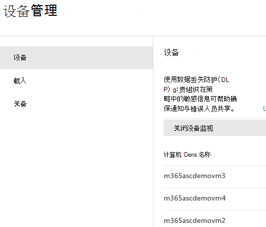
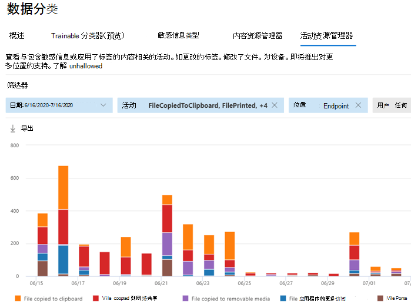
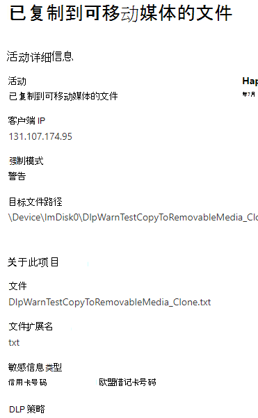

# 了解 Microsoft 365 终结点数据丢失防护

可使用 Microsoft 365 数据丢失防护 (DLP) 监视对已确定为敏感的项目执行的操作，并帮助防止无意间共享这些项目。有关 DLP 的详细信息，请参阅[了解数据丢失防护](dlp-learn-about-dlp.md)。

**终结点数据丢失防护**（终结点 DLP）可将 DLP 的活动监视和保护功能扩展到物理存储在 Windows 10 和 macOS（Catalina 10.15 及更高版本）设备上的敏感项目。 将设备加入 Microsoft 365 合规性解决方案中后，即可在[活动资源管理器](data-classification-activity-explorer.md)中看到有关用户对敏感项目执行的操作的信息，你可以通过 [DLP 策略](create-test-tune-dlp-policy.md)对这些项目执行保护性操作。

> [!TIP]
> 如果正在查找可移动存储的设备控制，请查看 [Microsoft Defender for Endpoint 设备控制可移动存储访问控制](../security/defender-endpoint/device-control-removable-storage-access-control.md#microsoft-defender-for-endpoint-device-control-removable-storage-access-control)。

## 可监视并对其执行操作的终结点活动

通过 Microsoft 终结点 DLP，可以审核和管理用户针对物理存储在 Windows 10 设备或 macOS 设备上的敏感项目进行的以下类型的活动。

|活动 |说明  | 可审核/可限制|
|---------|---------|---------|
|上传到云端服务，或通过不允许的浏览器访问    | 当用户试图将项目上传到受限服务域或通过浏览器访问项目时进行检测。  若他们使用的浏览器在DLP中列为不允许的浏览器，则将阻止上传活动，并将重新定向用户到使用Edge Chromium。 Microsoft Edge Chromium将根据DLP策略配置，允许或阻止上传或访问。         |可审核且可限制|
|复制至其他应用    |当用户试图从受保护项目中复制信息，然后将其粘贴到另一个应用程序、进程或项目中时进行检测。 该活动无法检测到在同一应用程序、进程或项目中复制和粘贴信息。         | 可审核且可限制|
|复制到 USB 可移动媒体 |检测用户何时尝试将项目或信息复制到可移动媒体或 USB 设备。         | 可审核且可限制|
|拷贝到网络共享    |当用户试图将项目复制到网络共享或映射的网络驱动器时，检测该项目         |可审核且可限制|
|打印文档    |当用户试图将受保护的项目打印到本地或网络打印机上时，检测该项目。| 可审核且可限制         |
|复制到远程会话|检测用户是否尝试将项目复制到远程桌面会话 |  可审核且可限制|
|复制到蓝牙设备|检测用户尝试将项目复制到未启用的蓝牙应用（如在终结点 DLP 设置中不允许的蓝牙 aps 列表中所定义）。| 可审核且可限制|
|创建项|当用户创建项目时，检测该项目| 可审核|
|重命名项|当用户重命名一个项目时，检测该项目| 可审核|

## 受监视的文件

终结点 DLP 支持监视这些文件类型。 DLP 审核这些文件类型的活动，即使没有策略匹配。 

- Word 文件
- PowerPoint 文件
- Excel 文件
- PDF 文件
- .csv 文件
- .tsv 文件
- .txt 文件
- .rtf 文件
- .c 文件
- .class 文件
- .cpp 文件
- .cs 文件
- .h 文件
- .java 文件
 
如果只想从策略匹配项中监视数据，你可以关闭终结点 DLP 全局设置中的 **始终为设备审核文件活动**。

> [!NOTE]
> 如果 **始终审核设备的审核文件活动** 设置处于打开状态，则即使设备不是任何策略的目标，也始终审核任何 Word、PowerPoint、Excel、PDF 和 .csv 文件上的活动。

> [!TIP]
> 若要确保审核所有受支持的文件类型的活动，请创建[自定义 DLP 策略](create-test-tune-dlp-policy.md)。

终结点 DLP 会监视基于活动的 MIME 类型，因此即使文件扩展名已更改也会捕获活动。

## 终结点 DLP 中的区别

在深入研究终结点 DLP 之前，你需要了解一些其他概念。

### 启用设备管理

设备管理是一项功能，可从设备收集遥测并将其纳入 Microsoft 365 合规解决方案，如终结点 DLP 和[内部风险管理](insider-risk-management.md)。 你需要载入所有要用作 DLP 策略中位置的设备。

> [!div class="mx-imgBorder"]
> 

载入和载出通过你从设备管理中心下载的脚本来处理。 中心为每种部署方法提供了自定义脚本：

- 本地脚本（最多 10 台机器）
- 组策略
- System Center Configuration Manager（版本 1610 或更高版本）
- 移动设备管理/Microsoft Intune
- 非持久性计算机的 VDI 载入脚本

> [!div class="mx-imgBorder"]
> 

 使用 [Microsoft 365 终结点 DLP入门](endpoint-dlp-getting-started.md)中的程序载入设备。

如果你已通过 [Microsoft Defender for Endpoint](/windows/security/threat-protection/) 加入设备，则这些设备将自动显示在设备列表中。

> [!div class="mx-imgBorder"]
> 。

### 查看终结点 DLP 数据

可通过进入 [DLP 警报管理仪表板](dlp-configure-view-alerts-policies.md)查看与在端点设备上强制实施的 DLP 策略有关的警报。

> [!div class="mx-imgBorder"]
> 。

你还可以在同一仪表板中查看关联事件的详细信息以及丰富元数据

> [!div class="mx-imgBorder"]
> 。

设备一旦载入，有关已审核活动的信息就会流入活动资源管理器，即使在配置和部署将设备作为位置的任何 DLP 策略之前也不例外。

> [!div class="mx-imgBorder"]
> 。

终结点 DLP 会收集有关已审核活动的大量信息。

例如，如果将文件复制到可移动 USB 媒体，你将在活动详细信息中看到以下属性：

- 活动类型
- 客户端 IP
- 目标文件路径
- 发生时间戳
- 文件名
- 用户
- 文件扩展名
- 文件大小
- 敏感信息类型定义（如适用）
- sha1 值
- sha256 值
- 以前的文件名
- 位置
- 父级
- filepath
- 源位置类型
- 平台
- 设备名称
- 目标位置类型
- 执行了副本的应用程序
- Microsoft Defender for Endpoint 设备 ID （如适用）
- 可移动媒体设备制造商
- 可移动媒体设备模型
- 可移动媒体设备序列号

> [!div class="mx-imgBorder"]
> 。

## 后续步骤

现在，你已了解有关终结点 DLP 的内容，接下来要学习：

1. [Microsoft 终结点数据丢失防护入门](endpoint-dlp-getting-started.md)
2. [使用 Microsoft 终结点数据丢失防护](endpoint-dlp-using.md)

## 另请参阅

- [Microsoft 终结点数据丢失防护入门](endpoint-dlp-getting-started.md)
- [使用 Microsoft 终结点数据丢失防护](endpoint-dlp-using.md)
- [了解数据丢失防护](dlp-learn-about-dlp.md)
- [创建、测试和优化 DLP 策略](create-test-tune-dlp-policy.md)
- [活动资源管理器入门](data-classification-activity-explorer.md)
- [Microsoft Defender for Endpoint](/windows/security/threat-protection/)
- [内部风险管理](insider-risk-management.md)
