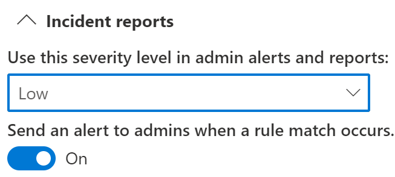

# 使用端点数据丢失防护

本文将向你介绍创建和修改将设备用作位置的 DLP 策略的三种情况。

## DLP 设置

在开始使用之前，应设置 DLP 设置。 设置将应用于设备的所有 DLP 策略。 如果要创建实施以下操作的策略，则必须配置这些策略：

- 云出口限制
- 不允许的应用限制

或

- 如果要从监视中排除杂乱的文件路径

  > [!div class="mx-imgBorder"]
  > 

### 终结点 DLP Windows 10/11 和 macOS 设置

|Setting |Windows 10，1809 及更高版本，Windows 11  |macOS Catalina 10.15 或更高版本（预览）  |Notes  |
|---------|---------|---------|---------|
|文件路径排除     |支持         |支持         |macOS 包括默认启用的推荐排除项列表          |
|不允许的应用程序     |支持         |支持         |         |
|不允许的蓝牙应用    |支持         |不支持         |         |
|敏感项目的浏览器和域限制      |支持         |支持         |         |
|终结点 DLP 的其他设置     |支持         |支持         |macOS 设备仅支持默认业务理由         |
|始终审核已载入设备的文件活动     |支持         |支持         |         |
|来自不允许的应用的自动隔离文件 | 支持 | 不支持| |
|高级分类 | 支持 | 不支持| |
|策略提示中的业务理由 | 支持 | 支持| |

### 高级分类扫描和保护

高级分类扫描和保护允许更高级的 Microsoft 365 基于云的数据分类服务，可扫描项目、对其进行分类，以及将结果返回到本地计算机。 这意味着你可以利用[准确数据匹配](create-custom-sensitive-information-types-with-exact-data-match-based-classification.md)分类、[命名实体（预览）](named-entities-learn.md#learn-about-named-entities-preview)和分类技术。

在高级分类中，内容从本地设备发送到云服务进行扫描和分类。 如果带宽利用率是关注的问题，则可以在此全局设置中设置一个限制，该限制适用于在滚动 24 小时周期内可以使用多少设备。 如果设置了带宽利用率限制且超出该限制，DLP 将停止将用户内容发送到云，并且将会继续在设备上本地进行数据分类。 当累积带宽利用率降至低于滚动的 24 小时限制时，将恢复与云服务的通信。

如果带宽利用率不是关注的问题，则不能设置限制并允许无限制使用。

这些 Windows 版本支持高级分类扫描和保护：

- Windows 10 版本 20H1/20H2/21H1 (KB 5006738) 
- Windows 10 版本 19H1/19H2 (KB 5007189) 
- Windows 10 RS5 (KB 5006744) 

> [!NOTE]
> Office（Word、Excel、PowerPoint）和 PDF 文件类型支持高级分类。

> [!NOTE]
> DLP 策略评估始终发生在云中，即使未发送用户内容。

### 文件路径排除

打开“[合规中心](https://compliance.microsoft.com)” > “**数据丢失保护**” > “**终节点 DLP 设置**” > “**文件路径排除**”。

你可能希望从设备上的 DLP 监视、DLP 警报和 DLP 策略执行中排除某些路径，因为它们太杂乱或未包含你感兴趣的文件。 系统将不会审核这些位置中的文件，并且在这些位置创建或修改的任何文件都将不受 DLP 策略执行的约束。 可在 DLP 设置中配置路径排除项。

#### Windows 10 设备

可以使用此逻辑来构造适用于Windows 10 设备的排除路径：

- 以 `\` 结尾的有效文件路径，仅表示直接位于文件夹下的文件。  例如：`C:\Temp\`

- 以 `\*` 结尾的有效文件路径，仅表示位于子文件夹下的文件，以及直接位于文件夹下方的文件。  例如：`C:\Temp\*`

- 以 `\` 或 `\*` 结尾的有效文件路径，表示直接位于文件夹和所有子文件夹下的所有文件。  例如：`C:\Temp`

- 两端的 `\` 之间带有通配符的路径。  例如：`C:\Users\*\Desktop\`

- 两端 `\` 之间带有通配符，并通过 `(number)` 给出确切的子文件夹数量的路径。  例如：`C:\Users\*(1)\Downloads\`

- 带有 SYSTEM 环境变量的路径。  例如：`%SystemDrive%\Test\*`

- 综合了上述所有情况。  例如：`%SystemDrive%\Users\*\Documents\*(2)\Sub\`

#### macOS 设备（预览）

与 Windows 10 相似，你可以为 macOS 设备添加自己的排除项。

- 文件路径定义不区分大小写，因此 `User` 与 `user` 相同。

- 支持通配符值。 因此，路径定义可以在路径中间或路径末尾包含 `*`。 例如：`/Users/*/Library/Application Support/Microsoft/Teams/*`

#####  建议的文件路径排除（预览）

出于性能原因，端点 DLP 包括适用于 macOS 设备的推荐文件路径排除列表。 默认情况下，这些排除已启用。 如果需要，可以通过切换“**包括适用于 Mac 的推荐文件路径排除**”开关禁用它们。 该列表包括：

- /Applications/*
- /System/*
- /usr/*
- /Library/*
- /private/*
- /opt/*
- /Users/*/Library/Application Support/Microsoft/Teams/*

### 不允许的应用

不允许的应用是你创建的不允许访问 DLP 保护文件的应用程序列表。 它适用于 Windows 10 和 macOS 设备（预览）。

启用策略的“**通过不允许的应用访问**”设置，并且不允许列表中的应用尝试访问受保护的文件时，活动将被允许、阻止或者阻止，但用户可以覆盖该限制。 所有活动均经过审核，可在活动资源管理器中查看。

> [!IMPORTANT]
> 不包括可执行文件的路径，而仅包括可执行文件的名称（如 browser.exe）。

#### macOS 设备（预览）

就像在 Windows 设备上一样，现在能够通过“**不允许的应用程序**”列表中定义它们来阻止 macO 应用程序访问敏感数据。 

> [!NOTE]
> 请注意，必须通过与在其上面运行的操作系统对应的唯一路径进入跨平台应用程序。

若要查找 Mac 应用程序的完整路径：

1. 在 macOS 设备上，打开“**活动监视器**”。 查找并双击要限制的进程

2. 选择“**打开文件和端口**”选项卡。
  
3. 应用名称位于完整路径的末尾。

#### 保护敏感数据免受云同步应用的保护

若要防止云同步应用（如 *onedrive.exe*）将敏感项目同步到云，请将云同步应用添加到 **不允许的应用** 列表。 当不允许的云同步应用尝试访问受阻止的 DLP 策略保护的项时，DLP 可能会生成重复的通知。 可以通过在 **不允许的应用** 下启用 **自动隔离** 选项来避免这些重复通知。  

##### 自动隔离（预览版）

> [!NOTE]
> 自动隔离仅在 Windows 10 上受支持

启用后，当不允许的应用尝试访问受 DLP 保护的敏感项目时，自动隔离将启动。 自动隔离会将敏感项目移动到管理员配置的文件夹，并且可以将占位符 **.txt** 文件保留在原始文件的位置。 可以将占位符文件中的文本配置为告知用户项目移动到的位置以及其他相关信息。  

可以使用自动隔离来防止用户和管理员出现无休止的 DLP 通知链—请参阅 [方案 4: 使用自动隔离 (预览版) 避免从云同步应用的 DLP 通知循环](#scenario-4-avoid-looping-dlp-notifications-from-cloud-synchronization-apps-with-auto-quarantine-preview)。

### 不允许的蓝牙应用

阻止用户通过特定蓝牙应用传输受你的策略保护的文件。

### 敏感数据的浏览器和域限制

限制与策略匹配的敏感文件与不受限制的云服务域共享。

#### 不允许的浏览器

对于 Windows 设备，如果添加由可执行名称标识的浏览器，浏览器将受到阻止，无法访问与强制实施的 DLP 策略（其中上传到云服务限制设为“阻止”或“阻止替代”）条件匹配的文件。 当阻止这些浏览器访问文件时，最终用户将看到一则 toast 通知，要求他们通过 Microsoft Edge 打开文件。

对于 macOS 设备，必须添加完整的文件路径。 若要查找 Mac 应用程序的完整路径：

1. 在 macOS 设备上，打开“**活动监视器**”。 查找并双击要限制的进程

2. 选择“**打开文件和端口**”选项卡。
  
3. 应用名称位于完整路径的末尾。

#### 服务域

> [!NOTE]
> **服务域** 设置仅适用于使用安装了 [ Microsoft 合规性扩展](dlp-chrome-learn-about.md#learn-about-the-microsoft-compliance-extension) 的 Microsoft Edge 或 Google Chrome 上传的文件。

你可以控制受你的策略保护的敏感文件是否可以从 Microsoft Edge 上传到特定服务域。

如果列表模式设置为“**阻止**”，用户将无法向这些域上传敏感项目。 如果由于某项目符合 DLP 策略而阻止了上载操作，则 DLP 会生成警告或阻止敏感项目的上载。

如果列表模式设置为“**允许**”，则用户将 **_只能_** 将敏感项目上传到那些域，并且不允许对所有其他域的上传访问。

> [!IMPORTANT]
> 服务限制模式设置为“允许”时，在强制执行限制之前，必须至少配置一个服务域。

使用服务域的 FQDN 格式，而不带结尾的 `.` 

例如：

 `www.contoso.com` 

不支持通配符。

### 终结点 DLP 的其他设置

#### 策略提示中的业务理由

可在 DLP 策略提示通知中控制用户与业务理由选项的交互方式。 当用户执行受 DLP 策略中 **以超越阻止** 设置所保护的活动时，将出现此选项。 这是全局设置。 可从下列选项中进行选择：

- **显示默认选项和自定义文本框**：默认情况下，用户可以选择内置理由，也可以输入自己的文本。
- **仅显示默认选项**：用户只能选择内置理由。
- **仅显示自定义文本框**：用户只能输入自己的理由。 最终用户策略提示通知中只显示文本框。 

##### 自定义下拉菜单中的选项

通过选择"**自定义选项下拉菜单**"，可以创建多达五个将在用户与策略通知提示交互时显示的自定义选项。 

|选项 |默认文本  |
|---------|---------|
|选项 1    | **这是已建立的业务工作流的一部分**，或者可以输入自定义文本        |
|选项 2  |**我的经理已批准此操作**，或者可以输入自定义文本         |
|选项 3   |**需要紧急访问;我将单独通知我的经理**，或者可以输入自定义文本          |
|显示误报选项     |**这些文件中的信息不敏感**，或者可以输入自定义文本          |
|选项 5    |**其他**，或者可以输入自定义文本         |

<!--See [Scenario 5: Configure a policy to use the customized business justification](#scenario-5-configure-a-policy-to-use-the-customized-business-justification)-->

### 始终审核已载入设备的文件活动

默认情况下，当设备载入后，将自动审核 Office、PDF 和 CSV 文件的活动，并可在活动资源管理器中审阅。 如果希望仅在活动策略中包含载入设备时审核此活动，请关闭此功能。

将始终对已载入设备的文件活动进行审核，无论这些设备是否包括在活动策略中。

## 将 DLP 设置捆绑在一起

通过终结点 DLP 和 Microsoft Edge Chromium Web 浏览器，可以将意外共享敏感项目限制为不允许的云应用和服务。 Microsoft Edge Chromium可以了解终结点 DLP 策略何时限制项目，并实施访问限制。

在将终结点 DLP 用作正确配置的 DLP 策略和 Microsoft Edge 浏览器中的位置时，你在这些设置中定义的不允许的浏览器将无法访问与 DLP 策略控制匹配的敏感项。 相反，用户将被重定向以使用 Microsoft Edge，该浏览器了解 DLP 施加的限制，因此可以在满足 DLP 策略中的条件时阻止或限制活动。

若要使用此限制，需要配置三个重要部分：

1. 指定要防止敏感项目共享到的位置（服务、域、IP 地址）。

2. 添加出现 DLP 策略匹配时不允许访问某些敏感项目的浏览器。

3. 通过启用“**上载到云服务**”和“**从不允许的浏览器访问**”，配置 DLP 策略以定义应限制在这些位置的敏感项目的种类。

你可以继续添加新的服务、应用和策略，以扩展和扩大你的限制，从而满足业务需求并保护敏感数据。 

此配置将帮助确保你的数据安全，同时避免不必要的限制，防止或限制用户访问和共享不敏感的项目。

## 终结点 DLP 策略方案

为了帮助你熟悉终结点 DLP 功能及其在 DLP 策略中的呈现方式，我们整理了一些方案供你遵循。

> [!IMPORTANT]
> 这些终结点 DLP 方案不是创建和优化 DLP 策略的正式过程。 当你需要在常规情况下使用 DLP 策略，请参阅以下主题：
>
>- [了解数据丢失防护](dlp-learn-about-dlp.md)
>- [开始使用默认 DLP 策略](get-started-with-the-default-dlp-policy.md)
>- [从模板创建 DLP 策略](create-a-dlp-policy-from-a-template.md)
>- [创建、测试和优化 DLP 策略](create-test-tune-dlp-policy.md)

### 方案 1：从模板创建策略，仅审核

这些方案要求你已载入设备并向活动资源管理器浏览器报告。 如果尚未载入设备，请参阅[终结点数据丢失防护入门](endpoint-dlp-getting-started.md)。

1. 打开[数据丢失防护页](https://compliance.microsoft.com/datalossprevention?viewid=policies)。

2. 选择 **创建策略**。

3. 在此方案中，依次选择“**隐私**”和“**美国个人身份信息 (PII) 数据**”，然后选择“**下一步**”。

4. 将“**设备**”以外所有位置的“**状态**”字段切换为“关”。 选择“**下一步**”。

5. 接受默认的“**从模板中查看和自定义设置**”选择，然后选择“**下一步**”。

6. 接受默认的“**保护操作**”值，然后选择“**下一步**”。

7. 选择“**审核或限制 Windows 设备上的活动**”，然后将“操作”设置为“**仅审核**”。 选择“**下一步**”。

8. 接受默认的“**我想要先测试**”值，然后选择“**在测试模式下显示策略提示**”。 选择“**下一步**”。

9. 查看设置，然后选择“**提交**”。

10. 新的 DLP 策略将显示在策略列表中。

11. 检查活动资源管理器中是否有来自受监视终结点的数据。 设置设备的位置筛选器并添加策略，然后按策略名称筛选以查看此策略的影响; 如果需要，请参阅 [活动资源管理器入门](data-classification-activity-explorer.md)。

12. 尝试与组织外的人员共享包含将触发美国个人身份信息 (PII) 数据条件的内容的测试。 这应该会触发策略。

13. 检查活动资源管理器中的事件。

### 方案 2：修改现有策略，设置警报

1. 打开[数据丢失防护页](https://compliance.microsoft.com/datalossprevention?viewid=policies)。

2. 选择在方案 1 中创建的“**美国个人身份信息 (PII) 数据**”策略。

3. 选择 **编辑策略**。

4. 转到“**高级 DLP 规则**”页面，然后编辑“**检测到少量内容的美国个人身份信息**”。

5. 向下滚动到“**事件报告**”部分，然后将“**在规则匹配出现时向管理员发送警报**”设置为“**开**”。 系统会将电子邮件警报自动发送给管理员，以及你添加到收件人列表的任何其他人员。 

   > [!div class="mx-imgBorder"]
   > 
   
6. 出于本方案的目的，请选择“**每次活动与规则匹配时选择发送警报**”。

7. 选择“**保存**”。

8. 通过选择“**下一步**”，然后“**提交**”策略更改来保留所有先前的设置。

9. 尝试与组织外的人员共享包含将触发美国个人身份信息 (PII) 数据条件的内容的测试。 这应该会触发策略。

10. 检查活动资源管理器中的事件。

### 方案 3：修改现有策略，阻止操作但允许覆盖

1. 打开[数据丢失防护页](https://compliance.microsoft.com/datalossprevention?viewid=policies)。

2. 选择在方案 1 中创建的“**美国个人身份信息 (PII) 数据**”策略。

3. 选择 **编辑策略**。

4. 转到“**高级 DLP 规则**”页面，然后编辑“**检测到少量内容的美国个人身份信息**”。

5. 向下滚动到“**审核或限制 Windows 设备上的活动**”部分，并对每个活动将相应的操作设置为“**阻止但允许覆盖**”。

   > [!div class="mx-imgBorder"]
   > 
   
6. 选择“**保存**”。

7. 对 **检测到大量内容的美国个人身份信息** 重复步骤 4-7。

8. 通过选择“**下一步**”，然后“**提交**”策略更改来保留所有先前的设置。

9. 尝试与组织外的人员共享包含将触发美国个人身份信息 (PII) 数据条件的内容的测试。 这应该会触发策略。

   客户端设备上将显示如下所示的弹出窗口：

   > [!div class="mx-imgBorder"]
   > 

10. 检查活动资源管理器中的事件。

### 方案 4：避免使用自动隔离（预览版）从云同步应用循环 DLP 通知。

#### 开始之前

在此方案中，阻止将文件与 **高度机密** 敏感度标签同步到 OneDrive。 这是具有多个组件和过程的复杂方案。 你将需要：

- 要面向的 AAD 用户帐户和一台已将本地 OneDrive 文件夹与 OneDrive 云存储同步的已载入 Windows 10 计算机。
- 目标 Windows 10 计算机上安装的 Microsoft Word
- 敏感度标签配置和发布—请参阅 [敏感度标签入门](get-started-with-sensitivity-labels.md#get-started-with-sensitivity-labels) 和 [创建和配置敏感度标签及其策略](create-sensitivity-labels.md#create-and-configure-sensitivity-labels-and-their-policies)。

共有三个步骤。

1. 配置终结点 DLP 自动隔离设置。
2. 创建一个策略，用于阻止具有 **高度机密** 敏感度标签的敏感项目。
3. 在 Windows 10 设备上创建一个针对该策略的 Word 文档，应用标签，并将其复制到正在同步的本地 OneDrive 文件夹的用户帐户。  

#### 配置终结点 DLP 不允许的应用和自动隔离设置

1. 打开 [终结点 DLP 设置](https://compliance.microsoft.com/datalossprevention?viewid=globalsettings)

2. 展开 **不允许的应用**。

3. 选择“**添加或编辑不允许的应用**”，并添加“*OneDrive*”（作为显示名称）和可执行文件名称“*onedrive.exe*”，以禁止 onedrive.exe 访问带有“**高度机密**”标签的项目。

4. 选择 **自动隔离**，然后 **保存**。

5. 在 **自动隔离设置** 下选择 **编辑自动隔离设置**。

6. 为不允许的应用启用 **自动隔离**。

7. 输入要将原始敏感文件移动到本地计算机上文件夹的路径。例如：
   
    **'%homedrive%%homepath%\Microsoft DLP\Quarantine'** 的用户名 *Isaiah langer* 会将移动的项目放在名为以下的文件夹中:  

    *C:\Users\IsaiahLanger\Microsoft DLP\Quarantine\OneDrive*

    并在原始文件名上附加一个日期和时间戳。
    
    > [!NOTE]
    > DLP 自动隔离将为每个不允许的应用创建文件的子文件夹。 因此，如果在不允许的应用列表中同时有 *Notepad* 和 *OneDrive* ，将为 **\OneDrive** 创建一个子文件夹，并为 **\Notepad** 创建另一个子文件夹。

8. 选择 **将文件替换为包含以下文本 的 .txt 文件**，并在占位符文件中输入所需的文本。例如，名为 *auto quar 1.docx* 的文件：
    
    > %%FileName%% 包含你的组织正在使用数据丢失防护 (DLP) 策略 %%PolicyName%% 保护的敏感信息，并已移动到隔离文件夹: %%QuarantinePath%%。
    
    将保留包含此消息的文本文件:
    
    > auto quar 1.docx 包含组织正在使用数据丢失防护 （DLP） 策略保护的敏感信息，并已移动到隔离文件夹：C：\Users\IsaiahLanger\Microsoft DLP\Quarantine\OneDrive\auto quar 1_20210728_151541.docx。

9. 选择 **保存**

#### 配置策略以阻止 OneDrive 使用敏感度标签"高度机密"同步文件

1. 打开[数据丢失防护页](https://compliance.microsoft.com/datalossprevention?viewid=policies)。

2. 选择 **创建策略**。

3. 对于此方案，请选择 **自定义**，然后 **自定义策略**，并选择 **下一步**。

4. 填写 **名称** 和 **说明** 字段，选择 **下一步**。

5. 将“**设备**”以外所有位置的“**状态**”字段切换为“关”。 如果你有一个要从中测试此项的特定终端用户帐户，请务必在范围内选择它。 选择 **下一步**。

6. 默认情况下，接受 **创建或自定义高级 DLP 规则**，然后选择 **下一步**。

7. 使用以下值创建规则：
    1. **名称** > *方案 4 自动隔离*。
    1. **条件** > **内容包含** > **敏感度标签** > **高度机密**。
    1.  **操作** > **审核或限制 Windows 设备上的活动，** > **不允许的应用访问** > **阻止**。 对于此方案，请清除所有其他活动。
    1. **打开****用户通知** > 。
    1. **终结点设备** >选择 **在活动** （如果尚未启用）时向用户显示策略提示通知。
    
8. 选择 **保存**，然后 **下一步**。

9. 选择 **立即将其打开**。选择 **下一个**。

10. 查看设置，然后选择“**提交**”。

    > [!NOTE]
    > 至少需要一小时才能将新策略复制并应用到目标 Windows 10 计算机。

11. 新的 DLP 策略将显示在策略列表中。

#### 在 Windows 10 设备上测试自动隔离

1. 使用你在[中指定的用户帐户登录到Windows 10 计算机。配置策略以阻止使用敏感度标签"高度机密"文件的 OneDrive 同步](#configure-a-policy-to-block-onedrive-synchronization-of-files-with-the-sensitivity-label-highly-confidential)步骤 5。

2. 创建内容不会同步到 OneDrive 的文件夹。例如：

    *C：\auto-quarantine 源文件夹*

3. 打开 Microsoft Word 并在自动隔离源文件夹中创建文件。 应用 **高机密** 敏感度标签; 请参阅 [Office 中文件和电子邮件的敏感度标签](https://support.microsoft.com/topic/apply-sensitivity-labels-to-your-files-and-email-in-office-2f96e7cd-d5a4-403b-8bd7-4cc636bae0f9)。

4. 将刚创建的文件复制到 OneDrive 同步文件夹。 应显示用户通知词，告知你不允许执行该操作，并且该文件将被隔离。 例如，对于用户名 *Isaiah Langer*，以及标题为 *自动隔离文档 1.docx*，你将看到以下消息：

    
    
    消息将读取：
    
    > 不允许使用此应用打开自动隔离文档 1.docx。 文件将被隔离到‘C：\Users\IsaiahLanger\Microsoft DLP\OneDrive’

5. 选择 **关闭**。

6. 打开占位符文本文件。 将其命名为 **自动隔离文档1.docx_ *date_time*.txt**。 

7. 打开隔离文件夹并确认原始文件存在。
 
8. 检查活动资源管理器中是否有来自受监视终结点的数据。 设置设备的位置筛选器并添加策略，然后按策略名称筛选以查看此策略的影响; 如果需要，请参阅 [活动资源管理器入门](data-classification-activity-explorer.md)。

9. 检查活动资源管理器中的事件。

## 另请参阅

- [了解终结点数据丢失防护](endpoint-dlp-learn-about.md)
- [终结点数据丢失防护入门](endpoint-dlp-getting-started.md)
- [了解数据丢失防护](dlp-learn-about-dlp.md)
- [创建、测试和优化 DLP 策略](create-test-tune-dlp-policy.md)
- [活动资源管理器入门](data-classification-activity-explorer.md)
- [Microsoft Defender for Endpoint](/windows/security/threat-protection/)
- [Windows 10 设备的装载工具和方法](/microsoft-365/compliance/dlp-configure-endpoints)
- [Microsoft 365 订阅](https://www.microsoft.com/microsoft-365/compare-microsoft-365-enterprise-plans?rtc=1)
- [已加入 Azure Active Directory (AAD)](/azure/active-directory/devices/concept-azure-ad-join)
- [下载基于 Chromium 的新 Microsoft Edge](https://support.microsoft.com/help/4501095/download-the-new-microsoft-edge-based-on-chromium)
- [开始使用默认 DLP 策略](get-started-with-the-default-dlp-policy.md)
- [从模板创建 DLP 策略](create-a-dlp-policy-from-a-template.md)
