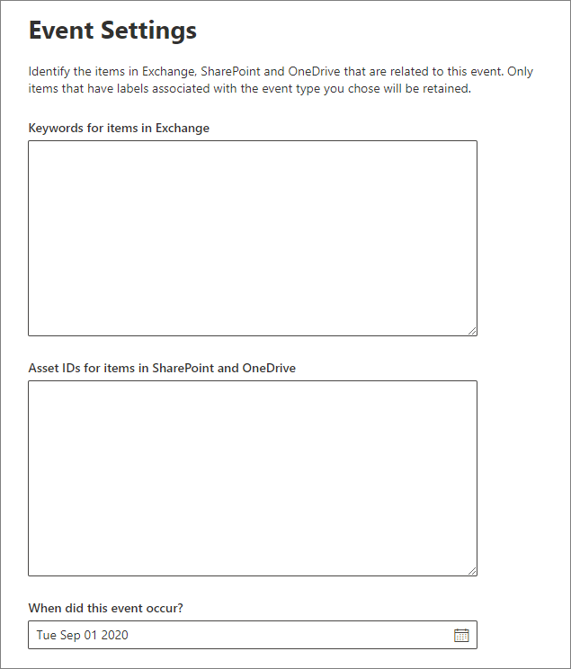

# 事件驱动保留概述

>*[Microsoft 365 安全性与合规性许可指南](https://aka.ms/ComplianceSD)。*

When you retain content, the retention period is often based on the age of the content. For example, you might retain documents for seven years after they're created and then delete them. But when you configure [retention labels](labels.md), you can also base a retention period on when a specific type of event occurs. The event triggers the start of the retention period, and all content with a retention label applied for that type of event get the label's retention actions enforced on them.
  
使用事件驱动保留的示例：
  
- **员工离开组织**假设自员工离开组织之日起，必须将其记录保留 10 年。 10 年过后，与该员工的雇用、绩效和离职相关的所有文档都需要进行处置。 员工离开组织便是触发 10 年保留期的事件。 
    
- **合同到期** 假设与合同相关的所有记录都需要在合同到期后保留 5 年。 触发 5 年保留期的事件是合同到期。 
    
- **Product lifetime** Your organization might have retention requirements related to the last manufacturing date of products for content such as technical specifications. In this case, the last manufacturing date is the event that triggers the retention period. 
    
Event-driven retention is typically used as part of a records-management process. This means that:
  
- 基于事件的标签通常还可将内容分类为记录。 有关详细信息，请参阅[了解记录](records.md)。
    
- 如果文档已归类为记录，但其触发事件尚未发生，那么文档会无限期保留（因为无法永久删除记录），直到触发文档保留期的事件发生。
    
- 基于事件的保留标签通常在保留期末尾触发处置评审，因此记录管理人员可以手动评审并处置内容。 有关详细信息，请参阅[内容的处置](disposition.md)。
    
基于事件的保留标签与 Microsoft 365 中的任何保留标签具有相同的功能。 有关详细信息，请参阅[了解保留标签](labels.md)。

## 了解事件类型、标签、事件和资产 ID 之间的关系

为了成功使用事件驱动保留，请务必了解事件类型、保留标签、事件和资产 ID 之间的关系，如下图以及随后的说明所示： 
  

  

  
1. 为不同类型的内容创建保留标签，然后将其与事件类型相关联。 例如，不同类型的产品文件和记录的保留标签与“产品生存期”事件类型相关联，因为必须将这些记录自产品生存期结束起保留 10 年。
    
2. 用户（通常是记录管理人员）将这些保留标签应用于内容，并（对于 SharePoint 和 OneDrive 文档）为每一项输入资产 ID。 在此示例中，资产 ID 是组织使用的产品名称或代码。 因此，每个产品的记录都分配有一个保留标签，且每个记录都有包含资产 ID 的属性。 上图表示组织中所有产品记录的**全部内容**，且每一项都有记录所属产品的资产 ID。 
    
3. Product Lifetime is the event type; a specific product reaching end of life is an event. When an event of that event type occurs - in this case, when a product reaches its end of life - you create an event that specifies:
    
  - 资产 ID（对于 SharePoint 和 OneDrive 文档）
    
  - Keywords (for Exchange items). In this example, the organization uses a product code in messages containing product records, so the keyword for Exchange items is the same as the asset ID for SharePoint and OneDrive documents.
    
  - The date when the event occurred. This date is used as the start of the retention period. This date can be the current, a past, or a future date.
    
4. 在你创建事件后，相应事件日期就会同步到符合以下条件的所有内容：具有相应事件类型的保留标签，且包含指定的资产 ID 或关键字。 与任何保留标签一样，这种同步最长可能需要 7 天才能完成。 在上图中，所有用红色圈起来的项的保留期都是由此事件触发的。 换言之，当此产品的生存期结束时，相应事件就会触发此产品的记录的保留期。
    
请务必注意，如果没有为事件指定资产 ID 或关键字，则具有该事件类型标签的**所有内容**均由该事件触发保留期。 也就是说，在上图中，所有内容将开始被保留。 这可能并非如你所愿。 
  
最后，请注意，每个保留标签都有自己的保留设置。 在此示例中，它们全都指定保留 10 年，但事件也可触发保留期不同的各个保留标签。
  
## 如何设置事件驱动保留

事件驱动保留的工作流概览：
  

  
> [!TIP]
> 有关使用 SharePont 中的托管属性来自动应用保留标签并实施事件驱动保留的详细方案，请参阅[使用保留标签管理 SharePoint 文档的生命周期](auto-apply-retention-labels-scenario.md)。

### 第 1 步：创建保留期以事件为依据的标签

要创建和配置保留标签，请按照[创建和配置保留标签](create-retention-labels.md#create-and-configure-retention-labels)中的说明进行操作，并在打开保留功能时，根据事件选择保留或删除内容的选项。 此设置意味着，保留设置暂不会生效，直到在步骤 5 中在“**事件**”页面上创建事件之后。 
  
事件驱动的保留通常用于归类为记录的内容，因此这是检查是否还需要选择将内容标记为记录的选项的好时机。
  
事件驱动保留要求保留设置：
  
- 保留内容。
    
- 在保留期到期时自动删除内容或触发处置评审。
    

### 第 2 步：选择与此标签关联的事件类型

在标签设置中，选择将标签基于**事件**的选项后，将看到“**选择事件类型**”选项。 事件类型就是对要将标签与之相关联的事件的一般说明。
  
例如，如果创建“产品生存期”事件类型，将创建基于事件的保留标签，标签名称描述了要将标签应用于什么类型的内容（如“产品开发文件”或“产品业务决策记录”）。

选择一种内置事件类型，或自行创建一种类型并选中。

选择事件类型并保存保留标签后，便无法再更改事件类型。
  

  
### 第 3 步：发布或自动应用基于事件的保留标签

与任何保留标签类似，需要[发布或自动应用](create-retention-labels.md)基于事件的标签，以便将其应用于文档或电子邮件。

> [!NOTE]
> 如果从“**记录管理**” > “**文件计划**”选项卡或“**数据管理**” > “**标签**”选项卡中选择基于事件的保留标签，“**自动应用标签**”按钮将不可用。
> 
> 请使用以下位置之一的标签或策略列表上方的“**自动应用标签**”选项来代替此按钮：
> - “**记录管理**” > “**标签策略**”选项卡
> - “**数据管理**” > “**标签**”选项卡或“**标签策略**”选项卡

### 第 4 步：输入资产 ID

将基于事件的标签应用于内容后，可为每一项输入资产 ID。 例如，组织可能使用：
  
- 产品代码：可用于仅保留特定产品的内容。
    
- 项目代码：可用于仅保留特定项目的内容。
    
- 员工 ID：可用于仅保留特定人员的内容。
    
资产 ID 只是 SharePoint 和 OneDrive 中提供的另一种文档属性。 你的组织可能已经使用其他文档属性和 ID 来分类内容。 如果是这样，还可以在创建事件时使用这些属性和值（请参见后面的第 6 步）。 请务必注意，必须在文档属性中使用某种*属性:值*组合，将相应项与事件类型相关联。
  

  
### 第 5 步：创建事件

当相应事件类型的特定实例（例如，产品的生存期结束）发生时，请转到 Microsoft 365 合规中心内的“**记录管理**” > “**事件**”页，并创建事件。 可通过创建事件来手动触发事件。
  
### 第 6 步：选择第 2 步中标签使用的相同事件类型

创建事件时，请选择第 2 步中的保留标签所使用的相同事件类型，如“产品生存期”。 只有具有相应事件类型的保留标签的内容，才会触发保留期。
  

  
### 第 7 步：输入关键字或资产 ID

现在通过指定 SharePoint 和 OneDrive 内容的资产 ID 或指定 Exchange 内容的关键字，缩小内容的范围。 对于资产 ID，仅具有指定*属性:值*对的内容才会执行保留。 如果未输入资产 ID，具有该事件类型标签的所有内容都将应用相同的保留日期。

例如：如果使用的是资产 ID 属性，请在下方所示的资产 ID 框中输入 `ComplianceAssetID:<value>`。
  
组织可能已经对与此事件类型相关的文档应用了其他属性和 ID。 例如，如果需要检测特定产品记录，ID 可能为自定义属性 ProductID 和值“XYZ”的组合。 在此情况下，需在下图所示的资产 ID 框中输入 `ProductID:XYZ`。
  
对于 Exchange 项目，请使用关键字。 你可以通过使用 AND、OR 和 NOT 等搜索运算符来使用查询。 有关详细信息，请参阅[适用于内容搜索的关键字查询和搜索条件](keyword-queries-and-search-conditions.md)。
  
最后，选择事件发生日期；此日期用作保留期的开始日期。 创建事件后，相应事件日期就会同步到所有具有相应事件类型的保留标签、资产 ID 和关键字的内容。 与任何保留标签一样，这种同步最长可能需要七天才能完成。
  

创建事件后，保留设置将对已标记和索引的内容生效。 如果创建事件后将保留标签添加到新内容，则必须创建具有相同详细信息的新事件。

删除事件不会取消现在对内容生效的保留设置。 若要执行此操作，请创建具有相同详细信息的新事件，但将日期保留为空。 

## 使用内容搜索来查找所有包含特定标签或资产 ID 的内容

在保留标签分配到内容后，可通过内容搜索，查找所有已使用特定保留标签进行分类或包含特定资产 ID 的内容：
  
- 若要查找所有包含特定保留标签的内容，请选择“**合规性标签**”条件，再输入完整或部分标签名称并使用通配符。 
    
- 要查找所有包含特定资产 ID 的内容，请使用格式 `ComplianceAssetID:<value>`，输入 **ComplianceAssetID** 属性和值。 
    
有关详细信息，请参阅[适用于内容搜索的关键字查询和搜索条件](keyword-queries-and-search-conditions.md)。
  
## 权限

To get access to the **Events** page, reviewers must be members of a role group with the **Disposition Management** role and the **View-Only Audit Logs** role. We recommend creating a new role group called Disposition Reviewers, adding these two roles to that role group, and then adding members to the role group. 
  
有关详细信息，请参阅[向用户授予对 Office 365 安全与合规中心的访问权限](../security/office-365-security/grant-access-to-the-security-and-compliance-center.md)。
  
## 使用 PowerShell 自动触发事件

Microsoft 365 合规性中心可用于手动创建事件，并且不支持在事件发生时自动触发事件。 但是，可以使用 Rest API 自动触发事件。 有关详细信息，请参阅[自动执行基于事件的保留](automate-event-driven-retention.md)。

此外，还可使用 PowerShell 脚本从业务应用程序中自动执行基于事件的保留。 适用于基于事件的保留的 PowerShell cmdlet：
  
- [Get-ComplianceRetentionEventType](https://go.microsoft.com/fwlink/?linkid=873002)
    
- [New-ComplianceRetentionEventType](https://go.microsoft.com/fwlink/?linkid=873004)
    
- [Remove-ComplianceRetentionEventType](https://go.microsoft.com/fwlink/?linkid=873005)
    
- [Set-ComplianceRetentionEventType](https://go.microsoft.com/fwlink/?linkid=873006)
    
- [Get-ComplianceRetentionEvent](https://go.microsoft.com/fwlink/?linkid=873001)
    
- [New-ComplianceRetentionEvent](https://go.microsoft.com/fwlink/?linkid=873003)
    

