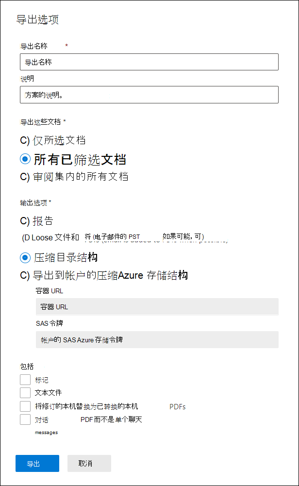

# 从审阅集导出文档Advanced eDiscovery

导出允许用户在从 Advanced eDiscovery 审阅集导出文档时自定义下载包中Advanced eDiscovery。

要从审阅集中导出文档，请执行以下操作：

1. In the Microsoft 365 合规中心， open the Advanced eDiscovery case， select the **Review sets** tab， and then select the review set that you want to export.

2. 在审阅集内，单击"**操作导出**  >  **"。**

   导出工具显示浮出控件页，其中包含用于配置导出的设置。 默认情况下会选择某些选项，但可以更改这些选项。 有关可以配置的导出选项的说明，请参阅以下部分。

   

3. 配置导出后，单击" **导出** "开始导出过程。 根据在"输出选项"部分选择的选项，可以通过直接下载或组织的 Azure 存储 帐户访问导出文件。

> [!NOTE]
> 导出作业在案例的生存期内保留。 但是，必须在导出作业完成后的 30 天内从导出作业下载内容。

## 导出选项

使用以下选项配置导出。 并非所有选项都允许用于某些输出选项，最重要的是，导出到 PST 格式时不允许导出文本文件和修订的 PDF。

- **导出名称**：导出作业的名称。 这将用于命名将下载的 ZIP 文件。

- **说明**：要添加说明的自定义文本字段。

- **导出这些文档**

  - 仅选定文档：此选项仅导出当前选定的文档。 此选项仅在审阅集内选择项目时可用。
  
  - 所有已筛选文档：此选项导出活动筛选器中的文档。 此选项仅在筛选器应用于审阅集时可用。
  
  - 审阅集内的所有文档：此选项导出审阅集内的所有文档。

- **输出选项**：导出的内容可以直接通过 Web 浏览器下载，也可以发送到 Azure 存储 帐户。 前两个选项支持直接下载。
  
  - 仅报告：仅创建摘要和加载文件。
  
  - 如果可能 (，将松散文件和 PTS 添加到 PST) ：文件以类似于用户本机应用程序中看到的原始目录结构的格式导出。  有关详细信息，请参阅 Loose [files and PST export structure部分](#loose-files-and-pst-export-structure) 。
  
  - 压缩目录结构：导出文件并包含在下载中。
  
  - 导出到您的 Azure 存储 帐户的压缩目录结构：文件将导出到组织的 Azure 存储 帐户。 对于此选项，你必须提供要将文件导出到的 Azure 存储 帐户中的容器的 URL。 此外，还必须为帐户的 SAS () 共享Azure 存储签名。 有关详细信息，请参阅将审阅集[内的文档导出到Azure 存储帐户。](download-export-jobs.md)

- **Include**
  
  - 标记：选中后，标记信息将包含在加载文件中。
  
  - 文本文件：此选项包括导出中的本机文件的提取文本版本。
  
  - 将修订的本机替换为转换后的 PDF：如果在审阅过程中生成了修订的 PDF 文件，则这些文件可供导出。 可以选择不选择此选项 (导出已修订的本机文件) 也可以选择此选项以导出包含实际修订的 PDF 文件。

  - 对话 PDF 而不是单个聊天消息：选中此复选框以导出 PDF 文件中聊天对话。 同一对话的所有聊天消息都在同一 PDF 文件中导出。 如果保留此复选框为未选中状态，则聊天对话中每个唯一的消息都导出为独立项目。 以与邮箱中相同的格式导出文件。 对于特定对话，您将收到多个 .msg 文件。

以下各节介绍松散文件和压缩目录结构选项的文件夹结构。 导出将分区到 ZIP 文件中，未压缩内容的最大大小为 75 GB。 如果导出大小小于 75 GB，则导出将包含摘要文件和单个 ZIP 文件。 对于超过 75 GB 的未压缩数据的导出，将创建多个 ZIP 文件。 下载后，可以将 ZIP 文件解压缩到单个位置以重新创建完整导出。

### 松散文件和 PST 导出结构

如果选择此导出选项，则导出的内容按以下结构进行组织：

- Summary.csv：包含从审阅集导出的内容摘要

- 根文件夹：此文件夹的名称为 [Export Name] x，z.zip每个 ZIP 文件分区重复此文件夹。
  
  - Export_load_file_xz.csv：元数据文件。
  
  - 警告和错误 x z.csv：此文件包含有关尝试从审阅集导出时遇到的错误的信息。
  
  - Exchange：此文件夹包含 PST Exchange中存储的所有内容。 此选项不能包含修订的 PDF 文件。 如果在审阅集内选择了附件，将导出附加附件的父电子邮件。
  
  - SharePoint：此文件夹包含本地SharePoint格式的所有本机内容。 此选项不能包含修订的 PDF 文件。

### 压缩目录结构

- Summary.csv：包含从审阅集导出的内容摘要

- 根文件夹：此文件夹的名称为 [Export Name] x，z.zip每个 ZIP 文件分区重复此文件夹。
  
  - Export_load_file_xz.csv：元数据文件，还包括 ZIP 文件中存储的每个文件的位置。
  
  - 警告和错误 x z.csv：此文件包含有关尝试从审阅集导出时遇到的错误的信息。

  - NativeFiles：此文件夹包含已导出的所有本机文件。 如果选择了"将已修订的本机替换为转换后的 PDF"选项，本机文件将 *替换为修订的 PDF。*
  
  - Error_files：此文件夹包含具有提取错误或其他处理错误的文件。 这些文件将放置在单独的文件夹中，包括 ExtractionError 或 ProcessingError。 这些文件在加载文件中列出。

  - Extracted_text_files：此文件夹包含处理过程中生成的所有提取的文本文件。

### 导出到帐户的压缩Azure 存储结构

此选项使用与 *压缩* 目录结构相同的常规结构，但是不会压缩内容，并且数据将保存到Azure 存储帐户。 此选项通常在使用第三方电子数据展示提供程序时使用。 有关如何使用此选项的详细信息，请参阅将审阅集内的文档[导出到Azure 存储帐户。](download-export-jobs.md)
