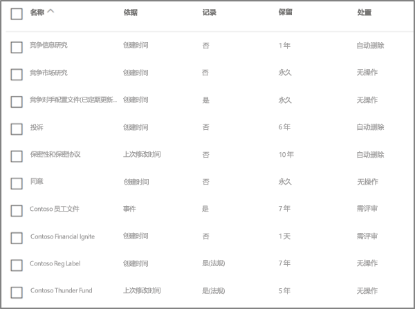
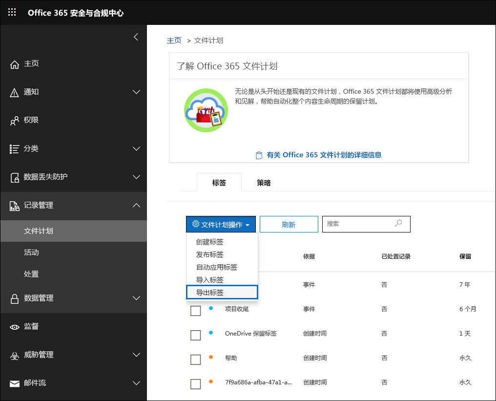

# 文件计划管理器概述

文件计划管理器提供了对保留标签和保留标签策略的高级管理功能，并提供了便于遍历整个内容生存期（从创建、协作、记录声明、保留到最终处置）中的标签活动和标签到内容活动的集成方式。 

若要访问安全与合规中心中的文件计划管理器，请转到“**记录管理**” > “**文件计划**”。

## 访问文件计划管理器

若要访问文件计划管理器，需要满足以下两项要求：

- 拥有 Office 365 企业版 E5 订阅。

- 在安全与合规中心，已为用户分配了以下角色之一：
    
    - 保留管理者
    
    - 仅拥有查看权限的保留管理者

## 默认保留标签和标签策略

如果“安全与合规中心”没有保留标签，则第一次在左侧导航栏中选择**文件计划**时，将创建名为**默认数据治理发布策略**的标签策略。 

此标签策略包含三个保留标签：

- **操作过程**
- **业务常规**
- **合同协议**

这些保留标签仅为保留内容，而非为删除内容而配置。 此标签策略将发布到整个公司，可以禁用或删除。 

可以通过查看保留策略的**创建的保留策略**和**创建的保留配置**活动的审核日志来判断谁打开了文件计划管理器并启动了首次运行体验。

> [!NOTE]
> 因客户反馈，我们已删除创建上述默认保留标签和保留标签策略的功能。 如果你在 2019 年 4 月 11 日之前打开文件计划管理器，则将只能看到这些保留标签和保留标签策略。

## 浏览文件计划

使用文件计划管理器，可以更轻松地在一个视图中查看所有保留标签和保留策略的设置。

请注意，文件计划中包含在文件计划内外创建的保留标签。

文件计划“**标签**”选项卡提供了以下附加信息和功能：

### “标签设置”列

- “依据”**** 列指明将启动保留期的触发器类型。有效值为：
    - 事件
    - 创建时间
    - 上次修改时间
    - 标记时间
- “记录”**** 列指明项是否在标签应用时成为已声明记录。有效值为：
    - 否
    - 是
    - 是(法规)
- “保留”**** 列指明保留类型。有效值为：
    - 保留
    - 保留和删除
    - 删除
- “处置”**** 列指明在保留期到期时如何处置内容。有效值为：
    - Null
    - 无操作
    - 自动删除
    - 需要评审(亦称为“处置评审”)

### 保留标签文件计划描述符列

现在可以在保留标签的配置中添加更多信息。 将文件计划描述符插入保留标签，可提升文件计划的可管理性和条理性。

为了便于用户上手，文件计划管理器提供了一些现成值：“功能/部门”、“类别”、“权限类型”和“预配/引文”。 可以在创建或编辑保留标签时，添加新的文件计划描述符值。 你也可以在将保留标签导入文件计划时指定文件计划描述符。 

下图展示了创建或编辑保留标签时有关文件计划描述符的步骤。

下图展示了文件计划管理器的“**标签**”选项卡上的文件计划描述符列。

## 导出所有现有保留标签以分析和/或执行离线评审

在文件计划管理器中，可以将所有保留标签的详细信息都导出到 .csv 文件中，这样做有助于推动定期与组织中数据管理利益干系人一起执行合规性评审。

若要导出所有保留标签，请在“**文件计划**”页面上，依次选择“**文件计划操作**”\>“**导出标签**”。

此时，包含所有现有保留标签的 *.csv 文件打开。

## 向文件计划导入保留标签

在文件计划管理器中，可以批量导入新保留标签，并能修改现有保留标签。

若要导入新的保留标签和修改现有保留标签，请执行以下操作： 

1. 在“**文件计划**”页面上，转到“**文件计划操作**” > “**导入标签**”。

   

   

2. 下载空白模板以导入新的保留标签。 或者，你也可以从导出组织中的现有保留标签时导出的 .csv 文件开始。

   

3. 填写模板。 下文介绍了文件计划模板中每个属性的属性和有效值。 

   |**Property**|**类型**|**有效值**|
   |:-----|:-----|:-----|
   |LabelName|字符串|此属性指定保留标签的名称。|
   |评论|字符串|使用此属性可以添加有关管理员的保留标签的说明。 此说明仅对在安全与合规中心管理标签的管理员显示。|
   |备注|字符串|使用此属性可以添加有关用户的保留标签的说明。 当用户将鼠标悬停在 Outlook、SharePoint 和 OneDrive 等应用的标签上时，将显示此说明。 如果将此属性保留为空白，则会显示默认说明，用于说明标签的保留设置。 |
   |IsRecordLabel|字符串|此属性指定标签是否为记录标签。 带有记录标签的项目声明为记录。 有效值为： **TRUE**：标签是记录标签。 请注意，无法删除声明为记录的项目。  **FALSE**：标签不是记录标签。 此值为默认值。|
   |RetentionAction|字符串|此属性指定在 RetentionDuration 属性指定的值到期后要采取的操作。 有效值为： **Delete**：早于 RetentionDuration 属性指定的值的项目将被删除。 **Keep**：在 RetentionDuration 属性指定的保留期内保留项目，然后在保留期到期时不执行任何操作。  **KeepAndDelete**：在 RetentionDuration 属性指定的保留期内保留项目，然后在保留期到期时删除这些项目。   |
   |RetentionDuration|String|此属性指定内容保留的天数。 有效值为： **Unlimited**：项目将无限期保留。  ***n***：正整数，例如 **365**。 
   |RetentionType|字符串|此属性指定保留期限是从内容创建日期、事件日期、标记的日期还是从上次修改日期开始计算。 有效值为： **CreationAgeInDays** **EventAgeInDays** **TaggedAgeInDays** **ModificationAgeInDays** |
   |ReviewerEmail|SmtpAddress|填充此属性后，在保留期到期时将触发处置评审。 此属性指定 **Delete** 和 **KeepAndDelete** 保留操作的审阅者的电子邮件地址。 可包含单个用户、分发或安全组或 Office 365 组的电子邮件地址。 可以指定多个电子邮件地址，中间用逗号分隔。|
   |ReferenceId|字符串|该属性指定在 **参考 ID** 文件计划描述符中显示的值。| 
   |Departmentname|字符串|该属性指定在**功能/部门**文件计划描述符中显示的值。|
   |类别|字符串|该属性指定在**类别**文件计划描述符中显示的值。|
   |SubCategory|字符串|该属性指定在**子类别**文件计划描述符中显示的值。|
   |AuthorityType|字符串|该属性指定在**权限类型**文件计划描述符中显示的值。|
   |CitationName|字符串|该属性指定在**预配/引文**文件计划描述符中显示的引文名称；例如“2002 年萨班斯-奥克斯利法案”。 |
   |CitationUrl|字符串|该属性指定在**预配/引文**文件计划描述符中显示的 URL。|
   |CitationJurisdiction|字符串|该属性指定在**预配/引文**文件计划描述符中显示的管辖权地或机构；例如“美国证券交易委员会 (SEC)”。|
   |Regulatory|字符串|保留为空白。 此属性目前不可用。|
   |EventType|String|此属性指定与标签关联的保留规则。 可以使用唯一标识该规则的任何值。 例如： **名称** **可分辨名称 (DN)** **GUID**  可使用 [Get-RetentionComplianceRule](https://docs.microsoft.com/powershell/module/exchange/policy-and-compliance-retention/get-retentioncompliancerule?view=exchange-ps) cmdlet 来查看可用的保留规则。 请注意，如果从某个 Office 365 组织导出标签，则将该标签导入其他 Office 365 组织时，不能使用该组织中的 EventType 属性值。 这是因为 EventType 值对于组织是唯一的。 |
   |||

   下面是包含有关保留标签的信息的模板示例。

   

4. 在“导入文件计划向导”页面的“步骤 3”下，单击“**浏览文件**”以上传已填写的模板。 

   文件计划管理器会验证条目，并显示导入统计信息。

   

   如果出现验证错误，文件计划导入将继续验证导入文件中的每个条目，并显示导入文件中引用行/行编号的所有错误，复制显示的错误结果，以便能够轻松返回导入文件并更正错误。

5. 导入完成后，返回到文件计划管理器，以将新保留标签与新的或现有的保留标签策略相关联。

   
