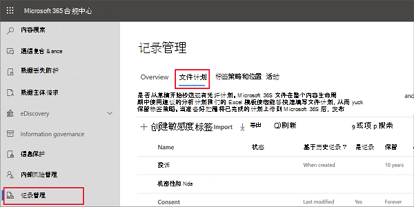
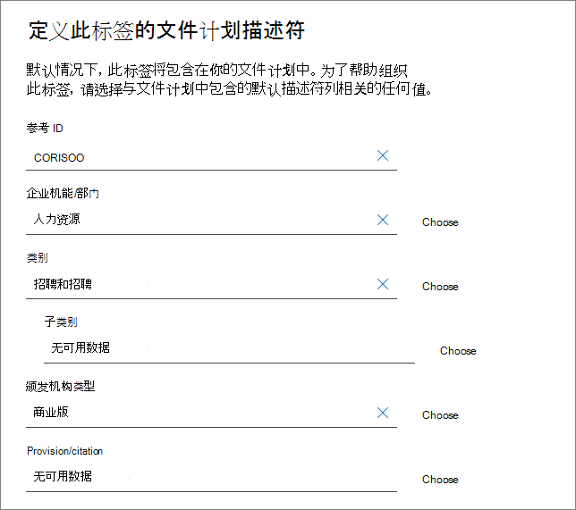
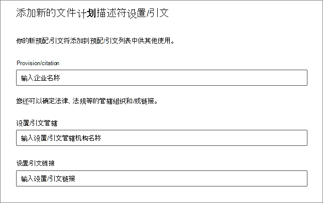
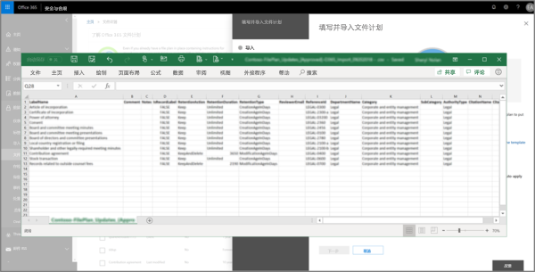
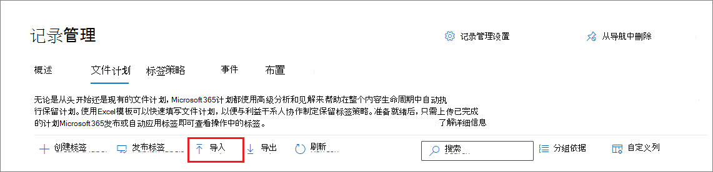
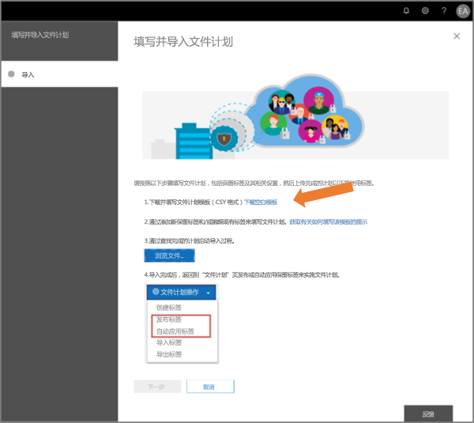

# 使用文件计划管理保留标签

>*[Microsoft 365 安全性与合规性许可指南](/office365/servicedescriptions/microsoft-365-service-descriptions/microsoft-365-tenantlevel-services-licensing-guidance/microsoft-365-security-compliance-licensing-guidance)。*

尽管可以从 Microsoft 365 合规性中心的“**信息管理**”创建和管理保留标签，但是“**记录管理**”中的文件计划具有其他管理功能：

- 可以通过从电子表格中导入相关信息来批量创建保留标签。

- 可以从现有保留标签中导出信息，从而进行分析和脱机协作。

- 显示有关保留标签的更多信息，以使可以更轻松地从一个视图查看和查看所有保留标签的设置。

- 文件计划描述符支持每个标签的附加和可选信息。

文件计划可用于所有保留标签，即使未将内容标记为记录也是如此。

若要了解什么是保留标签以及如何使用它们，请参阅[了解保留策略和保留标签](retention.md)。

## 访问文件计划

要访问文件计划，您必须具有以下管理员角色之一：
    
- 保留管理者

- 仅拥有查看权限的保留管理者

在 Microsoft 365 合规性中心中，转到“**解决方案**” > “**记录管理**” > “**文件计划**”。

. 

如果“**记录管理**”未显示在导航窗格中，请首先向下滚动并选择“**全部显示**”。

## 浏览文件计划

如果已经从 Microsoft 365 合规性中心中的“**信息治理**”创建了保留标签，则这些标签会自动显示在文件计划中。 

同样，如果现在在文件计划中创建保留标签，则如果未将标签配置为将内容标记为记录，则也可以从 **信息治理** 中使用。

在“**文件计划**”页面上，将看到所有标签及其状态和设置、可选的文件计划描述符、用于分析或启用标签脱机审阅的导出选项，以及用于创建保留标签的导入选项。 

### “标签设置”列

通过选择“**自定义列**”选项，可以显示或隐藏除标签“**名称**”之外的所有列。 但是默认情况下，前几列显示有关标签状态及其设置的信息： 

- **状态** 标识标签是包含在标签策略中还是自动应用策略中（**活动**）或不（**非活动**）。

- **基于** 标识保留期的方式或时间。有效值：
    - 事件
    - 创建时间
    - 上次修改时间
    - 标记时间

- **是记录** 标识在应用标签时是否将该项目标记为记录。有效值：
    - 否
    - 是
    - 是(法规)

- **保留期限** 标识保留期限。有效值：
    - 天
    - 月
    - 年限
    - 永久
    - 无

- “**处置类型**”列指明在保留期到期时如何处置内容。有效值：
    - 无操作
    - 自动删除
    - 需评审

### 文件计划描述符列

文件计划可将详细信息包含在保留标签中。 这些文件计划描述符提供了更多选项，可用于改进要标记的内容的易管理性和组织性。

默认情况下，从 **引用 ID** 开始，接下来的几列会显示这些可选的文件计划描述符，它们可以在创建保留标签或编辑现有标签时进行指定。 

为了帮助你开始使用，以下文件计划描述符有一些现成的值： 
- 企业机能/部门
- 类别
- 颁发机构类型
- 预配/引文 

创建或编辑保留标签时的文件计划描述符示例：

当“**选择**”这些可选描述符中的每个描述符时，可以选择其中一个现成值，也可以创建自己的值，然后选择它。例如： 

## 导出所有保留标签以分析或启用脱机评审

在文件计划中，可以将所有保留标签的详细信息都导出到 .csv 文件中，有助于推动定期与组织中数据管理利益干系人一起执行合规性评审。

要导出所有保留标签：在“**文件计划**”页上，单击“**导出**”：

将打开包含所有现有保留标签的 *.csv 文件，例如：

## 向文件计划导入保留标签

在文件计划中，可以使用具有特定格式的 .csv 文件批量导入新的保留标签： 

1. 在“**文件计划**”页面上，单击“**导入**”：

2. 在“**填写并导入文件计划**”窗格中，选择“**下载空白模板**”：

   

3. 下载模板后，为每个标签添加一行，然后保存文件。 有关描述每个性能的属性和有效值的信息，请参阅[下一节](#information-about-the-label-properties-for-import)。 

4. 选择“**上传文件**”，以上传填写的模板。
    
   文件计划会上传文件并验证条目。

5. 具体取决于验证结果:
    
    - 如果验证失败: 备注行号和列名以在导入文件中进行更正。 在文件中更正错误并保存，然后重复步骤 4。
    
    - 如果验证通过：可以看到 **已成功导入文件计划**，并且条目已成功转换为保留标签。 选择“**完成**，关闭窗格并自动刷新 **文件计划** 页以显示新标签。

现在可以发布新的保留标签，或自动应用标签。 可以从“**标签策略**”选项卡执行这两项操作，然后选择“**发布标签**”或“**自动应用标签**”。

### 有关导入的标签属性的信息

使用以下信息可有助于填写下载的模板，以导入新的保留标签。 对于导入，某些值具有最大长度：

- **LabelName**：最大长度为 64 个字符
- **Comment** 和 **Notes**：最大程度为 1024 个字符
- 所有其他值：长度不受限制
 

|属性|类型|必需|有效值|
|:-----|:-----|:-----|:-----|
|LabelName|字符串|是|此属性指定保留标签的名称，且必须为租户中的唯一属性。 支持导入的字符：a-z、A-Z、0-9、连字符 (-) 和空格字符。|
|评论|字符串|否|使用此属性可以添加有关管理员的保留标签的说明。 此说明仅对在合规中心管理保留标签的管理员显示。|
|注释|字符串|否|使用此属性可以添加有关用户的保留标签的说明。 当用户将鼠标悬停在 Outlook、SharePoint 和 OneDrive 等应用的标签上时，将显示此说明。 如果将此属性保留为空白，则会显示默认说明，用于说明标签的保留设置。 |
|IsRecordLabel|字符串|否，除非 **法规** 为 **TRUE**|此属性指定标签是否将内容标记为记录。有效值包含: **TRUE**: 标签将该项目标记为记录和结果，因此此项目无法删除。  **FALSE**: 标签不将内容标记为记录。这是默认值。    组依赖项: 在指定此属性时，还必须指定 RetentionAction、RetentionDuration 以及 RetentionType。|
|RetentionAction|字符串|否，除非指定了 **RetentionDuration**、**RetentionType** 或 **ReviewerEmail**|此属性指定在 RetentionDuration 属性指定的值(如果指定)过期后要执行的操作。有效值包含: **Delete**：早于 RetentionDuration 属性指定的值的项目将被删除。 **Keep**：在 RetentionDuration 属性指定的保留期内保留项目，然后在保留期到期时不执行任何操作。  **KeepAndDelete**：在 RetentionDuration 属性指定的保留期内保留项目，然后在保留期到期时删除这些项目。     组依赖项: 指定此属性时，还必须指定 RetentionDuration 和 RetentionType。 |
|RetentionDuration|String|否，除非指定了 **RetentionAction** 或 **RetentionType**|此属性指定保留内容的天数。有效值包含: **无限制**: 项目将无限期保留。  **_n_*: 正整数(以天为单位)；例如，**365**。 支持的最大数为 24,855，即 68 年。 如果需要的时间超过此最大值，请改用“无限制”。    组依赖项: 指定此属性时，还必须指定 RetentionAction 和 RetentionType。
|RetentionType|字符串|否，除非指定了 **RetentionAction** 或 **RetentionDuration**|此属性指定是从内容创建日期、事件日期、标记日期还是从上次修改日期计算保留持续时间(如果指定)。有效值包含: **CreationAgeInDays** **EventAgeInDays** **TaggedAgeInDays** **ModificationAgeInDays**     组依赖项: 指定此属性时，还必须指定 RetentionAction 和 RetentionDuraction。|
|ReviewerEmail|SmtpAddress|否|指定此属性后，保留持续时间到期时将触发处置评审。 此属性指定租户中用于 **KeepAndDelete** 保留操作审阅者的电子邮件地址。     可以在租户中包含单个用户、分发组或安全组的电子邮件地址。 指定多个电子邮件地址，用分号分隔。     组依赖项: 指定此属性时，还必须指定 **RetentionAction** (必须为 **KeepAndDelete**)、 **RetentionDuration** 以及 **RetentionType**。|
|ReferenceId|字符串|否|该属性指定在 **参考 ID** 文件计划描述符中显示的值，可将其用作组织的唯一值。| 
|Departmentname|字符串|否|该属性指定在 **功能/部门** 文件计划描述符中显示的值。|
|类别|字符串|否|该属性指定在 **类别** 文件计划描述符中显示的值。|
|SubCategory|字符串|否|该属性指定在 **子类别** 文件计划描述符中显示的值。|
|AuthorityType|字符串|否|该属性指定在 **权限类型** 文件计划描述符中显示的值。|
|CitationName|字符串|否|该属性指定在 **预配/引文** 文件计划描述符中显示的引文名称；例如“2002 年萨班斯-奥克斯利法案”。 |
|CitationUrl|字符串|否|该属性指定在 **预配/引文** 文件计划描述符中显示的 URL。|
|CitationJurisdiction|字符串|否|此属性指定在 **规定/引文** 文件计划描述符中显示的管辖权地或机构；例如“美国证券交易委员会 (SEC)”。|
|Regulatory|字符串|否|此属性指定标签是否将内容标记为法规记录，该记录比记录 [更具限制性](records-management.md#compare-restrictions-for-what-actions-are-allowed-or-blocked)。 要使用此标签配置，必须将租户配置为 [显示将内容标记为法规记录的选项](declare-records.md#how-to-display-the-option-to-mark-content-as-a-regulatory-record)，否则导入验证将失败。 有效值包含:  **TRUE**: 标签将项目标记为法规记录。 还必须将 **IsRecordLabel** 属性设置为 TRUE。 **FALSE**: 标签不将内容标记为法规记录。这是默认值。|
|EventType|String|否，除非 **RetentionType** 为 **EventAgeInDays**|此属性指定用于 [基于事件的保留](event-driven-retention.md) 的事件类型。 指定 **记录管理** > **事件** > **管理事件类型** 中显示的现有事件类型。 或使用 [Get-ComplianceRetentionEventType](/powershell/module/exchange/get-complianceretentioneventtype) cmdlet 查看可用的事件类型。 虽然存在一些内置事件类型，例如 **员工活动** 和 **产品寿命**，但你仍然可以创建自己的事件类型。     如果你指定自己的事件类型，则事件类型必须出现在导入之前，因为作为导入流程的一部分名称需进行验证。|
|||

## 后续步骤

有关创建、编辑和应用保留标签的信息，请参阅以下两种方案：
- [创建保留标签并在应用中应用它们](create-apply-retention-labels.md)
- [自动向内容应用保留标签](apply-retention-labels-automatically.md)