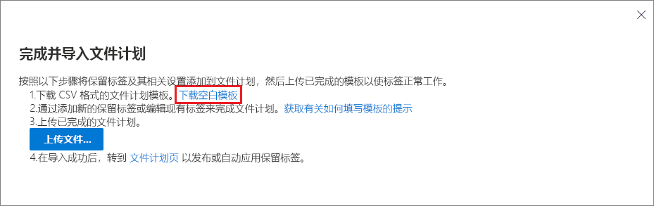

# 使用文件计划管理保留标签Use file plan to manage retention labels

>*[Microsoft 365 安全性与合规性许可指南](/office365/servicedescriptions/microsoft-365-service-descriptions/microsoft-365-tenantlevel-services-licensing-guidance/microsoft-365-security-compliance-licensing-guidance)。**[Microsoft 365 licensing guidance for security & compliance](/office365/servicedescriptions/microsoft-365-service-descriptions/microsoft-365-tenantlevel-services-licensing-guidance/microsoft-365-security-compliance-licensing-guidance).*

尽管可以从 Microsoft 365 合规性中心的“**信息管理**”创建和管理保留标签，但是“**记录管理**”中的文件计划具有其他管理功能：Although you can create and manage retention labels from **Information governance** in the Microsoft 365 compliance center, file plan from **Records management** has additional management capabilities:

- 可以通过从电子表格中导入相关信息来批量创建保留标签。You can bulk-create retention labels by importing the relevant information from a spreadsheet.

- 可以从现有保留标签中导出信息，从而进行分析和脱机协作。You can export the information from existing retention labels for analysis and offline collaboration.

- 显示有关保留标签的更多信息，以使可以更轻松地从一个视图查看和查看所有保留标签的设置。More information about the retention labels is displayed to make it easier to see into and across the settings of all your retention labels from one view.

- 文件计划描述符支持每个标签的附加和可选信息。File plan descriptors support additional and optional information for each label.

文件计划可用于所有保留标签，即使未将内容标记为记录也是如此。File plan can be used for all retention labels, even if they don't mark content as a record.

若要了解什么是保留标签以及如何使用它们，请参阅[了解保留策略和保留标签](retention.md)。For information about what retention labels are and how to use them, see [Learn about retention policies and retention labels](retention.md).

## 访问文件计划Accessing file plan

要访问文件计划，您必须具有以下管理员角色之一：To access file plan, you must have one of the following admin roles:
    
- 保留管理者Retention Manager

- 仅拥有查看权限的保留管理者View-only Retention Manager

在 Microsoft 365 合规性中心中，转到“**解决方案**” > “**记录管理**” > “**文件计划**”。In the Microsoft 365 compliance center, go to **Solutions** > **Records management** > **File plan**. 

如果“**记录管理**”未显示在导航窗格中，请首先向下滚动并选择“**全部显示**”。If **Records management** doesn't display in the navigation pane, first scroll down, and select **Show all**.

## 浏览文件计划Navigating your file plan

如果已经从 Microsoft 365 合规性中心中的“**信息治理**”创建了保留标签，则这些标签会自动显示在文件计划中。If you've already created retention labels from **Information governance** in the Microsoft 365 compliance center, these labels automatically display in your file plan. 

同样，如果现在在文件计划中创建保留标签，则如果未将标签配置为将内容标记为记录，则也可以从 **信息治理** 中使用。Similarly, if you now create retention labels in file plan, they are also available from **Information governance** if the labels aren't configured to mark content as a record.

在“**文件计划**”页面上，将看到所有标签及其状态和设置、可选的文件计划描述符、用于分析或启用标签脱机审阅的导出选项，以及用于创建保留标签的导入选项。On the **File plan** page, you see all your labels with their status and settings, optional file plan descriptors, an export option to analyze or enable offline reviews of your labels, and an import option to create retention labels. 

### “标签设置”列Label settings columns

通过选择“**自定义列**”选项，可以显示或隐藏除标签“**名称**”之外的所有列。All columns except the label **Name** can be displayed or hidden by selecting the **Customize columns** option. 但是默认情况下，前几列显示有关标签状态及其设置的信息：But by default, the first few columns display information about the label status and its settings: 

- **状态** 标识标签是包含在标签策略中还是自动应用策略中（**活动**）或不（**非活动**）。**Status** identifies whether the label is included in a label policy or auto-apply policy (**Active**) or not (**Inactive**).

- **基于** 标识保留期的方式或时间。**Based on** identifies how or when the retention period begins. 有效值：Valid values:
    - 事件Event
    - 创建时间When created
    - 上次修改时间Last modified
    - 标记时间When labeled

- **是记录** 标识在应用标签时是否将该项目标记为记录。**Is record** identifies if the item is marked as a record when the label is applied. 有效值：Valid values:
    - 否No
    - 是Yes
    - 是(法规)Yes(Regulatory)

- **保留期限** 标识保留期限。**Retention duration** identifies the retention period. 有效值：Valid values:
    - 天Days
    - 月Months
    - 年限Years
    - 永久Forever
    - 无None

- “**处置类型**”列指明在保留期到期时如何处置内容。**Disposition type** identifies what happens to the content at the end of the retention period. 有效值：Valid values:
    - 无操作No action
    - 自动删除Auto-delete
    - 需评审Review required

### 文件计划描述符列File plan descriptors columns

文件计划可将详细信息包含在保留标签中。File plan lets you include more information as part of your retention labels. 这些文件计划描述符提供了更多选项，可用于改进要标记的内容的易管理性和组织性。These file plan descriptors provide more options to improve the manageability and organization of the content you need to label.

默认情况下，从 **引用 ID** 开始，接下来的几列会显示这些可选的文件计划描述符，它们可以在创建保留标签或编辑现有标签时进行指定。By default, starting with **Reference ID**, the next few columns display these optional file plan descriptors that you can specify when you create a retention label, or edit an existing label. 

为了帮助你开始使用，以下文件计划描述符有一些现成的值：To get you started, there are some out-of-box values for the following file plan descriptors: 
- 企业机能/部门Business function/department
- 类别Category
- 颁发机构类型Authority type
- 预配/引文Provision/citation 

创建或编辑保留标签时的文件计划描述符示例：Example of file plan descriptors when you create or edit a retention label:

文件计划描述符列示例视图：Example view of the file plan descriptors columns:

## 导出所有保留标签以分析或启用脱机评审Export all retention labels to analyze or enable offline reviews

在文件计划中，可以将所有保留标签的详细信息都导出到 .csv 文件中，有助于推动定期与组织中数据管理利益干系人一起执行合规性评审。From your file plan, you can export the details of all retention labels into a .csv file to help you facilitate periodic compliance reviews with data governance stakeholders in your organization.

要导出所有保留标签：在“**文件计划**”页上，单击“**导出**”：To export all retention labels: On the **File plan** page, click **Export**:

将打开包含所有现有保留标签的 \*.csv 文件，例如:A \*.csv file that contains all existing retention labels opens. For example:

## 向文件计划导入保留标签Import retention labels into your file plan

在文件计划中，可以使用具有特定格式的 .csv 文件批量导入新的保留标签。In file plan, you can bulk-import new retention labels by using a .csv file with a specific format. 导入标签后，可以在 .csv 文件中进行编辑并再次导入文件，从而更轻松地批量编辑现有保留标签。After the labels are imported, you can make edits in the .csv file and import the file again for easier bulk-editing of existing retention labels.

若要导入新的保留标签和修改现有保留标签，请执行以下操作：To import new retention labels and modify existing retention labels: 

1. 在“**文件计划**”页面上，单击“**导入**”，以使用“**填写并导入文件计划**” 页面：On the **File plan** page, click **Import** to use the **Fill out and import your file plan** page:

   

   

2. 按照说明下载空白模板:Download a blank template as instructed:

   

3. 使用以下信息填写模板，这些信息描述了每个属性的属性和有效值。对于导入，一些值具有最大长度:Fill out the template, using the following information that describes the properties and valid values for each property. For import, some values have a maximum length:
    
    - **LabelName**：最大长度为 64 个字符**LabelName**: Maximum length of 64 characters
    - **Comment** 和 **Notes**：最大程度为 1024 个字符**Comment** and **Notes**: Maximum length of 1024 characters
    - 所有其他值：长度不受限制All other values: Unlimited length
     
    
   |属性Property|类型Type|必需Required|有效值Valid values|
   |:-----|:-----|:-----|:-----|
   |LabelNameLabelName|字符串String|是Yes|此属性指定保留标签的名称，且必须为租户中的唯一属性。This property specifies the name of the retention label and must be unique in your tenant.|
   |评论Comment|字符串String|否No|使用此属性可以添加有关管理员的保留标签的说明。Use this property to add a description about the retention label for admins. 此说明仅对在合规中心管理保留标签的管理员显示。This description appears only to admins who manage the retention label in the compliance center.|
   |注释Notes|字符串String|否No|使用此属性可以添加有关用户的保留标签的说明。Use this property to add a description about the retention label for users. 当用户将鼠标悬停在 Outlook、SharePoint 和 OneDrive 等应用的标签上时，将显示此说明。This description appears when users hover over the label in apps like Outlook, SharePoint, and OneDrive. 如果将此属性保留为空白，则会显示默认说明，用于说明标签的保留设置。If you leave this property blank, a default description is displayed, which explains the label's retention settings. |
   |IsRecordLabelIsRecordLabel|字符串String|否，除非 **法规** 为 **TRUE**No, unless **Regulatory** is **TRUE**|此属性指定标签是否将内容标记为记录。有效值包含:This property specifies whether the label marks the content as a record. Valid values are:  **TRUE**: 标签将该项目标记为记录和结果，因此此项目无法删除。**TRUE**: The label marks the item as a record and as a result, the item can't be deleted.  **FALSE**: 标签不会将内容标记为记录。**FALSE**: The label doesn't mark the content as a record. 此值为默认值。This is the default value.     组依赖项: 在指定此属性时，还必须指定 RetentionAction、RetentionDuration 以及 RetentionType。Group dependencies: When this property is specified, RetentionAction, RetentionDuration, and RetentionType must also be specified.|
   |RetentionActionRetentionAction|字符串String|否，除非指定了 **RetentionDuration**、**RetentionType** 或 **ReviewerEmail**No, unless **RetentionDuration**, **RetentionType**, or **ReviewerEmail** are specified|此属性指定在 RetentionDuration 属性指定的值(如果指定)过期后要执行的操作。有效值包含:This property specifies what action to take after the value specified by the RetentionDuration property (if specified) expires. Valid values are:  **Delete**：早于 RetentionDuration 属性指定的值的项目将被删除。**Delete**: Items older than the value specified by the RetentionDuration property are deleted. **Keep**：在 RetentionDuration 属性指定的保留期内保留项目，然后在保留期到期时不执行任何操作。**Keep**: Retain items for the duration specified by the RetentionDuration property and then do nothing when the duration period expires.  **KeepAndDelete**：在 RetentionDuration 属性指定的保留期内保留项目，然后在保留期到期时删除这些项目。**KeepAndDelete**: Retain items for the duration specified by the RetentionDuration property and then delete them when the duration period expires.     组依赖项: 指定此属性时，还必须指定 RetentionDuration 和 RetentionType。Group dependencies: When this property is specified, RetentionDuration and RetentionType must also be specified. |
   |RetentionDurationRetentionDuration|StringString|否，除非指定了 **RetentionAction** 或 **RetentionType**No, unless **RetentionAction** or **RetentionType** are specified|此属性指定保留内容的天数。有效值包含:This property specifies the number of days to retain the content. Valid values are:  **无限制**: 项目将无限期保留。**Unlimited**: Items will be retained indefinitely.  **_n_\*: 正整数(以天为单位)；例如，**365\*\*。\**_n_*: A positive integer in days; for example, **365**. 支持的最大数为 24,855，即 68 年。The maximum number supported is 24,855, which is 68 years. 如果需要的时间超过此最大值，请改用“无限制”。If you need longer than this maximum, use Unlimited instead.    组依赖项: 指定此属性时，还必须指定 RetentionAction 和 RetentionType。Group dependencies: When this property is specified, RetentionAction and RetentionType must also be specified.
   |RetentionTypeRetentionType|字符串String|否，除非指定了 **RetentionAction** 或 **RetentionDuration**No, unless **RetentionAction** or **RetentionDuration** are specified|此属性指定是从内容创建日期、事件日期、标记日期还是从上次修改日期计算保留持续时间(如果指定)。有效值包含:This property specifies whether the retention duration (if specified) is calculated from the content creation date, event date, when labeled date, or last modified date. Valid values are:  **CreationAgeInDays****CreationAgeInDays** **EventAgeInDays****EventAgeInDays** **TaggedAgeInDays****TaggedAgeInDays** **ModificationAgeInDays****ModificationAgeInDays**     组依赖项: 指定此属性时，还必须指定 RetentionAction 和 RetentionDuraction。Group dependencies: When this property is specified, RetentionAction and RetentionDuraction must also be specified.|
   |ReviewerEmailReviewerEmail|SmtpAddressSmtpAddress|否No|指定此属性后，保留持续时间到期时将触发处置评审。When this property is specified, a disposition review will be triggered when the retention duration expires. 此属性指定 **KeepAndDelete** 保留操作的审阅者的电子邮件地址。This property specifies the email address of a reviewer for the **KeepAndDelete** retention action.     可以在租户中包含单个用户、分发组或安全组的电子邮件地址。You can include the email address of individual users, distribution groups, or security groups in your tenant. 指定多个电子邮件地址，用分号分隔。Specify multiple email addresses by separating them with semicolons.     组依赖项: 指定此属性时，还必须指定 **RetentionAction** (必须为 **KeepAndDelete**)、 **RetentionDuration** 以及 **RetentionType**。Group dependencies: When this property is specified, **RetentionAction** (must be **KeepAndDelete**), **RetentionDuration**, and **RetentionType** must also be specified.|
   |ReferenceIdReferenceId|字符串String|否No|该属性指定在 **参考 ID** 文件计划描述符中显示的值，可将其用作组织的唯一值。This property specifies the value that's displayed in the **Reference Id** file plan descriptor, which you can use as a unique value to your organization.| 
   |DepartmentnameDepartmentName|字符串String|否No|该属性指定在 **功能/部门** 文件计划描述符中显示的值。This property specifies the value that's displayed in the **Function/department** file plan descriptor.|
   |类别Category|字符串String|否No|该属性指定在 **类别** 文件计划描述符中显示的值。This property specifies the value that's displayed in the **Category** file plan descriptor.|
   |SubCategorySubCategory|字符串String|否No|该属性指定在 **子类别** 文件计划描述符中显示的值。This property specifies the value that's displayed in the **Sub category** file plan descriptor.|
   |AuthorityTypeAuthorityType|字符串String|否No|该属性指定在 **权限类型** 文件计划描述符中显示的值。This property specifies the value that's displayed in the **Authority type** file plan descriptor.|
   |CitationNameCitationName|字符串String|否No|该属性指定在 **预配/引文** 文件计划描述符中显示的引文名称。This property specifies the name of the citation displayed in the **Provision/citation** file plan descriptor. 例如，“2002 年萨班斯-奥克斯利法案”。For example, "Sarbanes-Oxley Act of 2002". |
   |CitationUrlCitationUrl|字符串String|否No|该属性指定在 **预配/引文** 文件计划描述符中显示的 URL。This property specifies the URL that's displayed in the **Provision/citation** file plan descriptor.|
   |CitationJurisdictionCitationJurisdiction|字符串String|否No|此属性指定在 **规定/引文** 文件计划描述符中显示的管辖权地或机构；例如“美国证券交易委员会 (SEC)”。This property specifies the jurisdiction or agency that's displayed in the **Provision/citation** file plan descriptor. For example, "U.S. Securities and Exchange Commission (SEC)".|
   |RegulatoryRegulatory|字符串String|否No|此属性指定标签是否将内容标记为法规记录，该记录比记录 [更具限制性](records-management.md#compare-restrictions-for-what-actions-are-allowed-or-blocked)。This property specifies whether the label marks the content as a regulatory record, which is [more restrictive](records-management.md#compare-restrictions-for-what-actions-are-allowed-or-blocked) than a record. 要使用此标签配置，必须将租户配置为 [显示将内容标记为法规记录的选项](declare-records.md#how-to-display-the-option-to-mark-content-as-a-regulatory-record)，否则导入验证将失败。To use this label configuration, your tenant must be configured to [display the option to mark content as a regulatory record](declare-records.md#how-to-display-the-option-to-mark-content-as-a-regulatory-record), or the import validation will fail. 有效值包含:Valid values are:  **TRUE**: 标签将项目标记为法规记录。**TRUE**: The label marks the item as a regulatory record. 还必须将 **IsRecordLabel** 属性设置为 TRUE。You must also set the **IsRecordLabel** property to TRUE. **FALSE**: 标签不将内容标记为法规记录。**FALSE**: The label doesn't mark the content as a regulatory record. 此为默认值。This is the default value.|
   |EventTypeEventType|StringString|否，除非 **RetentionType** 为 **EventAgeInDays**No, unless **RetentionType** is **EventAgeInDays**|此属性指定用于 [基于事件的保留](event-driven-retention.md) 的事件类型。This property specifies an event type used for [event-based retention](event-driven-retention.md). 指定 **记录管理** > **事件** > **管理事件类型** 中显示的现有事件类型。Specify an existing event type that's displayed in **Records management** > **Events** > **Manage event types**. 或使用 [Get-ComplianceRetentionEventType](/powershell/module/exchange/get-complianceretentioneventtype) cmdlet 查看可用的事件类型。Alternatively, use the [Get-ComplianceRetentionEventType](/powershell/module/exchange/get-complianceretentioneventtype) cmdlet to view the available event types. 虽然存在一些内置事件类型，例如 **员工活动** 和 **产品寿命**，但你仍然可以创建自己的事件类型。Although there are some built-in event types, such as **Employee activity** and **Product lifetime**, you can also create your own event types.     如果你指定自己的事件类型，则事件类型必须出现在导入之前，因为作为导入流程的一部分名称需进行验证。If you specify your own event type, it must exist before the import because the name is validated as part of the import process.|
   |||

   下面是包含有关保留标签的信息的模板示例。Here's an example of the template containing the information about retention labels.

   

4. 在 **填写并导入文件计划** 页面中的第 3 步下，点击 **浏览文件** 以上传填写的模板，然后选择 **下一步**。Under step 3 on the **Fill out and import your file plan** page, click **Browse for files** to upload the filled-out template, and then select **Next**.

   文件计划会上传文件并验证条目，显示导入统计信息。File plan uploads the file and validates the entries, displaying the import statistics.

   

5. 具体取决于验证结果:Depending on the validation results:
    
    - 如果验证失败: 备注行号和列名以在导入文件中进行更正。If validation fails: Note the row number and column name to correct in the import file. 选择 **关闭**，然后选择 **是** 进行确认。Select **Close**, and then **Yes** to confirm. 在文件中更正错误并进行保存，再次选择 **导入** 选项，然后返回步骤 4。Correct the errors in the file and save it, select the **Import** option again, and return to step 4.
    
    - 如果验证通过: 可以选择 **上线** 以使保留标签在租户中可用。If validation passes: You can select **Go Live** to make the retention labels available in your tenant. 或选择页面中的“关闭”图标，并选择 **是** 以确认要关闭向导，此时保留标签在租户中不可用。Or, select the Close icon for the page, and **Yes** to confirm you want to close the wizard without making the retention labels available in your tenant at this time.

将导入的标签添加到租户后，现在可以将其添加到新的保留标签策略中，或进行自动应用。When the imported labels are added to your tenant, you can now add them to a new retention label policy, or auto-apply them. 可以在“**文件计划**”页上执行以下操作，方法是选择 **+创建标签**，然后选择“**发布标签策略**”或“**自动应用标签**”。You can do this right from the **File plan** page by selecting the dropdown from **+ Create a label** and then **Policy to publish labels**, or **Policy to auto-apply a label**.

## 后续步骤Next steps

若要详细了解如何创建和编辑保留标签及其策略，请参阅以下指南：For more information about creating and editing retention labels and their policies, see the following guidance:
- [创建保留标签并在应用中应用它们Create retention labels and apply them in apps](create-apply-retention-labels.md)
- [自动向内容应用保留标签Apply a retention label to content automatically](apply-retention-labels-automatically.md)