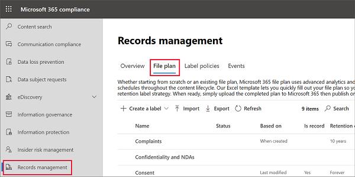
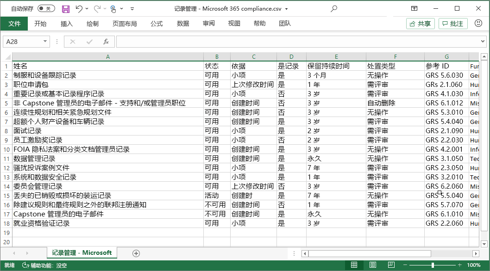

# 使用文件计划管理保留标签

>*[Microsoft 365 安全性与合规性许可指南](https://aka.ms/ComplianceSD)。*

尽管可以从 Microsoft 365 合规性中心的“**信息管理**”创建和管理保留标签，但是“**记录管理**”中的文件计划具有其他管理功能：

- 可以通过从电子表格中导入相关信息来批量创建保留标签。

- 可从现有保留标签中导出信息，以便进行分析和脱机协作，或者用于批量编辑。

- 显示有关保留标签的更多信息，以使可以更轻松地从一个视图查看和查看所有保留标签的设置。

- 文件计划描述符支持每个标签的附加和可选信息。

文件计划可用于所有保留标签，即使未将内容标记为记录也是如此。

若要了解什么是保留标签以及如何使用它们，请参阅[了解保留策略和保留标签](retention.md)。

## 访问文件计划

要访问文件计划，您必须具有以下管理员角色之一：
    
- 保留管理者

- 仅拥有查看权限的保留管理者

在 Microsoft 365 合规性中心中，转到“**解决方案**” > “**记录管理**” > “**文件计划**”。 

如果“**记录管理**”未显示在导航窗格中，请首先向下滚动并选择“**全部显示**”。

## 浏览文件计划

如果已经从 Microsoft 365 合规性中心中的“**信息治理**”创建了保留标签，则这些标签会自动显示在文件计划中。 

同样，如果现在在文件计划中创建保留标签，则如果未将标签配置为将内容标记为记录，则也可以从**信息治理**中使用。

在“**文件计划**”页面上，将看到所有标签及其状态和设置、可选的文件计划描述符、用于分析或启用标签脱机审阅的导出选项，以及用于创建保留标签的导入选项。 

### “标签设置”列

通过选择“**自定义列**”选项，可以显示或隐藏除标签“**名称**”之外的所有列。 但是默认情况下，前几列显示有关标签状态及其设置的信息： 

- **状态**标识标签是包含在标签策略中还是自动应用策略中（**活动**）或不（**非活动**）。

- **基于**标识保留期的方式或时间。 有效值：
    - 事件
    - 创建时间
    - 上次修改时间
    - 标记时间

- **是记录**标识在应用标签时是否将该项目标记为记录。 有效值：
    - 否
    - 是
    - 是(法规)

- **保留期限**标识保留期限。 有效值：
    - 天
    - 月
    - 年限
    - 永久
    - 无

- “**处置类型**”列指明在保留期到期时如何处置内容。 有效值：
    - 无操作
    - 自动删除
    - 需评审

### 文件计划描述符列

文件计划可将详细信息包含在保留标签中。 这些文件计划描述符提供了更多选项，可用于改进要标记的内容的易管理性和组织性。

默认情况下，从“**引用 ID**”开始，接下来的几列将显示这些文件计划描述符，可在创建保留标签时指定，或编辑现有标签。 

为了帮助你开始使用，以下文件计划描述符有一些现成的值： 
- 企业机能/部门
- 类别
- 颁发机构类型
- 预配/引文 

创建或编辑保留标签时的文件计划描述符示例：

文件计划描述符列示例视图：

## 导出所有保留标签以分析或启用脱机评审

在文件计划中，可以将所有保留标签的详细信息都导出到 .csv 文件中，有助于推动定期与组织中数据管理利益干系人一起执行合规性评审。

要导出所有保留标签：在“**文件计划**”页上，单击“**导出**”：

将打开包含所有现有保留标签的 *.csv 文件。 例如：

## 向文件计划导入保留标签

在文件计划中可以批量导入新保留标签，并使用相同的方法来批量修改现有的保留标签。

若要导入新的保留标签和修改现有保留标签，请执行以下操作： 

1. 在“**文件计划**”页面上，单击“**导入**”，以使用“**填写并导入文件计划**” 页面：

   

   

2. 下载空白模板以导入新的保留标签。 或者，你也可以从导出组织中的现有保留标签时导出的 .csv 文件开始。

   

3. 使用以下描述属性的信息以及每个属性的有效值填写模板。 对于导入，每个值最多可以有 64 个字符。  

   |属性|类型|有效值|
   |:-----|:-----|:-----|
   |LabelName|字符串|此属性指定保留标签的名称。|
   |评论|字符串|使用此属性可以添加有关管理员的保留标签的说明。 此说明仅对在合规中心管理保留标签的管理员显示。|
   |注释|字符串|使用此属性可以添加有关用户的保留标签的说明。 当用户将鼠标悬停在 Outlook、SharePoint 和 OneDrive 等应用的标签上时，将显示此说明。 如果将此属性保留为空白，则会显示默认说明，用于说明标签的保留设置。 |
   |IsRecordLabel|字符串|此属性指定标签是否将内容标记为记录。 有效值为：  **TRUE**: 标签将该项目标记为记录和结果，因此此项目无法删除。  **FALSE**: 标签不会将内容标记为记录。 此值为默认值。|
   |RetentionAction|字符串|此属性指定在 RetentionDuration 属性指定的值到期后要采取的操作。 有效值为：  **Delete**：早于 RetentionDuration 属性指定的值的项目将被删除。 **Keep**：在 RetentionDuration 属性指定的保留期内保留项目，然后在保留期到期时不执行任何操作。  **KeepAndDelete**：在 RetentionDuration 属性指定的保留期内保留项目，然后在保留期到期时删除这些项目。   |
   |RetentionDuration|String|此属性指定内容保留的天数。 有效值为：  **Unlimited**：项目将无限期保留。  ***n***：正整数，例如 **365**。 
   |RetentionType|字符串|此属性指定保留期限是从内容创建日期、事件日期、标记的日期还是从上次修改日期开始计算。 有效值为：  **CreationAgeInDays** **EventAgeInDays** **TaggedAgeInDays** **ModificationAgeInDays** |
   |ReviewerEmail|SmtpAddress|填充此属性后，在保留期到期时将触发处置评审。 此属性指定 **KeepAndDelete**保留操作的审阅者的电子邮件地址。 你可以包含单个用户、分发组或安全组的电子邮件地址。 可以指定多个电子邮件地址，中间用分号分隔。|
   |ReferenceId|字符串|该属性指定在 **参考 ID** 文件计划描述符中显示的值，可将其用作组织的唯一值。| 
   |Departmentname|字符串|该属性指定在**功能/部门**文件计划描述符中显示的值。|
   |类别|字符串|该属性指定在**类别**文件计划描述符中显示的值。|
   |SubCategory|字符串|该属性指定在**子类别**文件计划描述符中显示的值。|
   |AuthorityType|字符串|该属性指定在**权限类型**文件计划描述符中显示的值。|
   |CitationName|字符串|该属性指定在**预配/引文**文件计划描述符中显示的引文名称。 例如，“2002 年萨班斯-奥克斯利法案”。 |
   |CitationUrl|字符串|该属性指定在**预配/引文**文件计划描述符中显示的 URL。|
   |CitationJurisdiction|字符串|该属性指定在**预配/引文**文件计划描述符中显示的司法管辖区或机构。 例如，“美国证券交易委员会 (SEC)”。|
   |Regulatory|字符串|保留为空白。 此属性目前不可用。|
   |EventType|String|此属性指定与标签关联的保留规则。 可以使用唯一标识该规则的任何值。 例如： **名称** **可分辨名称 (DN)** **GUID**  可使用 [Get-RetentionComplianceRule](https://docs.microsoft.com/powershell/module/exchange/get-retentioncompliancerule) cmdlet 来查看可用的保留规则。 请注意，因为 EventType 值是组织唯一的，如果从某个组织导出标签，则将该标签导入其他组织时，不能使用该组织中的 EventType 属性值。|
   |||

   下面是包含有关保留标签的信息的模板示例。

   

4. 在**填写并导入文件计划**页上的第 3 步，单击“**浏览文件**”以上传填好的模板。 

   文件计划验证条目并显示导入统计信息。

   

   如果存在验证错误，文件计划导入将继续验证导入文件中的每一项，并在导入文件中显示引用行和行号的所有错误。 复制显示的错误结果，以在返回导入文件时可以对其进行更正。

导入完成后，现在可以将保留标签添加到新的保留标签策略中，或自动应用它们。 可以在“**文件计划**”页上执行以下操作，方法是选择 **+创建标签**，然后选择“**发布标签策略**”或“**自动应用标签**”。

## 后续步骤

若要详细了解如何创建和编辑保留标签及其策略，请参阅以下指南：
- [创建保留标签并在应用中应用它们](create-apply-retention-labels.md)
- [自动向内容应用保留标签](apply-retention-labels-automatically.md)
