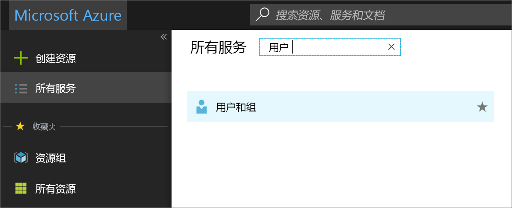
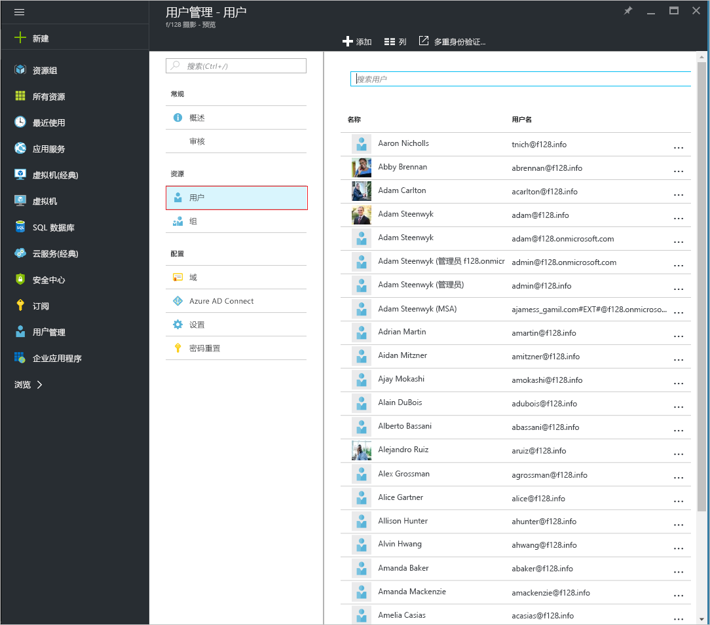
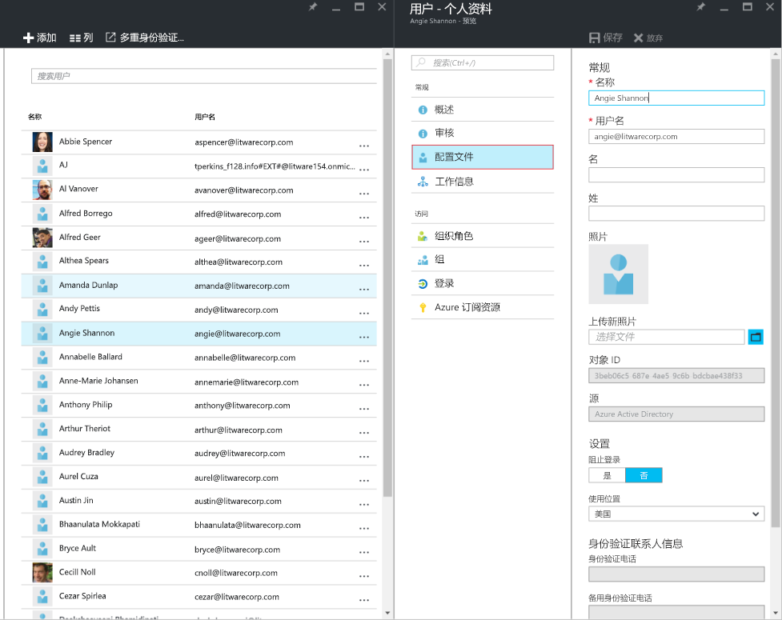
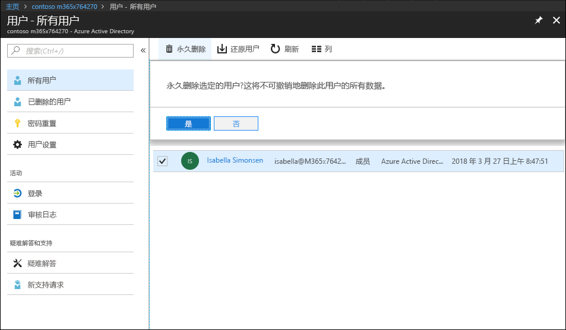
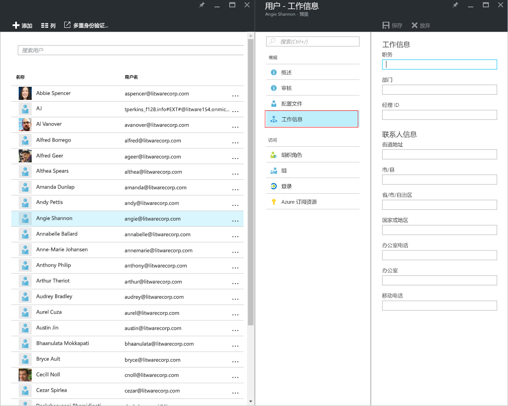
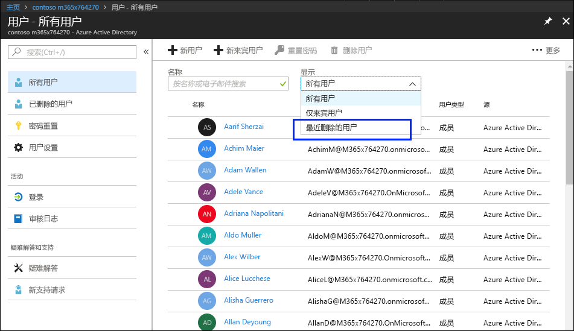
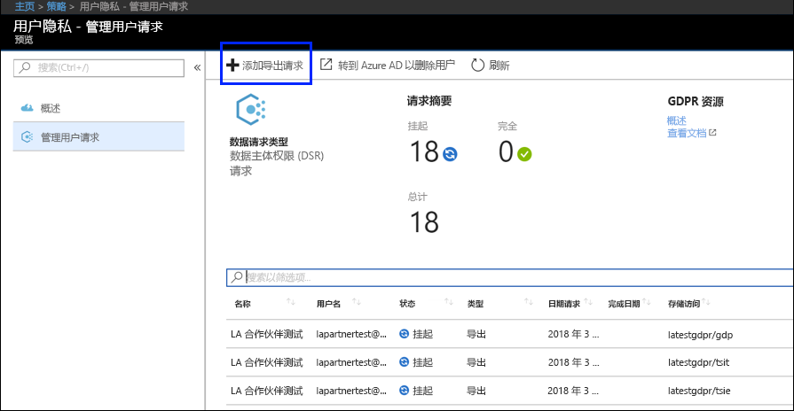
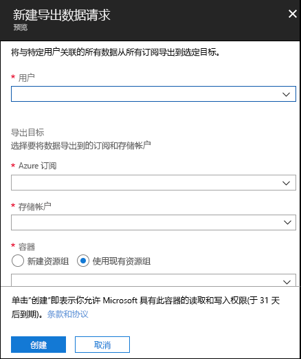

# Azure 与 GDPR 数据主体请求

## 数据主体请求 (DSR) 简介

根据 EU 数据保护条例 (GDPR)，用户（在条例中称为“*数据主体*”）有权管理由雇主或其他类型机构或组织（称为“*数据控制者*”或简称为“*控制者*”）收集的个人数据。根据 GDPR，个人数据的定义非常广泛，包括与身份已识别或可识别的自然人相关的任何数据。根据 GDPR，数据主体有权对自己的个人数据执行以下操作：获取个人数据副本、请求更正个人数据、限制个人数据处理、删除个人数据或接收电子格式的个人数据（以便于转移给其他控制者）。数据主体为了对自己的个人数据执行操作而向控制者发出的正式请求，称为“*数据主体请求*”或“DSR”。

本指南讨论了如何使用 Microsoft 产品、服务和管理工具以帮助我们的控制者客户查找和操作个人数据以响应 DSR。具体而言，这包括如何查找、访问和操作驻留在 Microsoft 云中的个人数据。下面是本指南中所列流程的快速概述：

1.  ***发现*** - 使用搜索和发现工具更轻松地查找可能是 DSR 主体的客户数据。一旦收集了潜在响应文档，则可以执行一个或多个下列步骤中所述的 DSR 操作。或者，你可能会确定请求不符合组织有关响应 DSR 的指导原则。

2.  ***访问*** - 检索驻留在 Microsoft 云中的个人数据，如果提出请求，还制作可供数据主体使用的个人数据副本。

3.  ***纠正*** - 进行更改或者对个人数据实施其他请求的操作（如果适用）。

4.  ***限制*** - 通过移除各种 Azure 服务的许可证或者在可能的情况下关闭所需服务，限制个人数据的处理。你也可以从 Microsoft 云中移除数据并仍将其保留在內部或其他位置。

5.  ***删除*** - 永久删除驻留在 Microsoft 云中的个人数据。

6.  ***导出*** - 向数据主体提供个人数据的电子副本（采用机器可读格式）。

本指南中的每个部分概述了数据控制者组织为响应对 Microsoft 云中个人数据的 DSR 而采取的技术过程。

### 术语

下面提供了与本指南相关的术语定义。

-   *控制者* - 单独或与其他人一起确定个人数据处理的用途和途径的自然人或法人、公共机构、机关或其他实体；如果欧盟或成员国法律确定了此类处理的用途和途径，欧盟或成员国法律可能会规定控制者或具体提名条件。

-   *个人数据*和*数据主体* - 身份已识别或可识别的自然人（“数据主体”）的任何相关信息；身份可识别的自然人是指可被直接或间接识别的自然人，尤其是通过参考姓名、证件号码、位置数据、联机标识等标识，或通过参考特定于该自然人的身体、生理、基因、精神、经济、文化或社会标识的一个或多个因素进行识别。

-   *处理者* - 代表控制者处理个人数据的自然人或法人、公共机构、机关或其他主体。

-   *客户数据* - 客户或代表客户通过使用企业服务提供给 Microsoft 的所有数据，包括所有文字、声音、视频或图像文件以及软件。客户数据包括 (1) 最终用户的身份信息（例如，Azure Active Directory 中的用户名和联系人信息）和客户上传到特定服务或者在特定服务中创建的客户内容（例如，Azure 存储帐户中的客户内容，Azure SQL 数据库的客户内容，或 Azure 虚拟机中的客户虚拟机映像）。

-   *系统生成日志* - Microsoft 生成的日志和相关数据，可帮助 Microsoft 向用户提供企业服务。系统生成日志主要包括化名数据，例如唯一标识符，这通常是系统生成的无法单独识别个人但用于向用户提供企业服务的一个数字。系统生成日志还可能包含有关最终用户的身份信息，例如用户名。

### 如何使用本指南

本指南由两部分组成：

**第 1 部分：响应对客户数据的数据主体请求** - 本指南第 1 部分讨论了如何访问、纠正、限制、删除数据和将数据从你创建数据的应用程序中导出。本节详细介绍了如何针对客户内容以及最终用户的身份信息执行 DSR。

**第 2 部分：响应对系统生成日志的数据主体请求** - 在你使用 Microsoft 的企业服务时，Microsoft 会生成一些信息（称为系统生成日志）以提供服务。本指南第 2 部分讨论了如何访问、删除和导出 Azure 的此类信息。

### 了解 Azure Active Directory 和 Microsoft 服务帐户的 DSR

在考虑提供给企业客户的服务时，必须始终在特定 Azure Active Directory (AAD) 租户环境中执行 DSR。需要注意的是，始终在给定的 AAD 租户内执行 DSR。如果用户参与了多个租户，则务必注意*仅*在收到请求的特定租户内执行给定的 DSR。必须知道的是，这意味着一个企业客户执行 DSR **不会**影响相邻企业客户的数据。

这同样也适用于提供给企业客户的服务环境中的 Microsoft 服务帐户 (MSA)：针对*与 AAD 租户关联*的 MSA 帐户执行 DSR **将仅**与租户内的数据相关。此外，在处理租户内的 MSA 帐户时，务必了解以下内容：

-   如果 MSA 用户创建了 Azure 订阅，订阅将视为 AAD 租户。因此，如上文所述，DSR 的范围仅限于租户。

-   如果删除通过 MSA 帐户创建的 Azure 订阅，**不会影响**实际 MSA 帐户。同样，如上所述，Azure 订阅中执行的 DSR 仅限于租户本身的范围。

在**给定租户外**针对 MSA 帐户本身的 DSR 将通过消费者隐私面板执行。请参考《Windows 数据主体请求指南》了解更多详细信息。

## 第 1 部分：客户数据的 DSR 指南

## 针对客户数据执行 DSR

Microsoft 让你能够通过 Azure 门户访问、删除和导出某些客户数据，也可直接通过特定服务的预先存在的应用程序编程接口 (API) 或用户界面 (UI)（也称为*产品内体验*）。有关此类产品内体验的详细信息，在各个服务的参考文档中进行了介绍。

>[重要提示]  
> 支持产品内 DSR 的服务要求直接使用服务的应用程序编程接口 (API) 或用户界面 (UI)，描述适用的 CRUD（创建、读取、更新、删除）操作。因此，除了在 Azure 门户中内执行 DSR 之外，还必须在给定服务内执行 DSR，以便完成针对给定数据主体的完整请求。请参考特定服务的参考文档以了解更多详细信息。

## 步骤 1：发现

响应 DSR 的第一步是查找作为请求主体的个人数据。这第一步（查找和审查所涉及的个人数据）将帮助你确定 DSR 是否符合组织有关接受或拒绝 DSR 的要求。例如，在查找并审查所涉及的个人数据后，你可以确定请求不符合组织的要求，因为这样做可能会对他人的权利和自由产生负面影响。

找到数据后，可执行特定操作以满足数据主体的请求。

### Azure Active Directory

[Azure Active Directory](https://azure.microsoft.com/services/active-directory/) 是 Microsoft 的基于云的、多租户目录和标识管理服务。你可以使用 [Azure 门户](https://portal.azure.com/)找到最终用户的身份信息，例如在 [Azure Active Directory](https://azure.microsoft.com/services/active-directory/) (AAD) 环境中包含个人数据的客户和员工的用户配置文件和用户工作信息。

这在你想要查找或更改特定用户的个人数据时尤其有用。还可以添加或更改用户配置文件和工作信息。必须使用作为该目录的全局管理员的帐户进行登录。

#### 如何查找或查看用户配置文件和工作信息？

1. 使用作为该目录的全局管理员的帐户登录到 [Azure 门户](https://portal.azure.com/)。

1. 选择“所有服务”****，在文本框中输入“用户和组”****，然后选择“进入”****。

     

3. 在“用户和组”**** 边栏选项卡上，选择“用户”****。

     

4.  在“用户和组 - 用户”**** 边栏选项卡上，从列表中选择用户，然后在所选用户的边栏选项卡上，选择“配置文件”**** 以查看可能包含个人数据的用户配置文件信息。

    

5. 如果需要添加或更改用户配置文件信息，可执行此操作，然后在命令栏中选择“保存”****。

<!-- steps 6 and 7 not in original 
6. On the blade for the selected user, select **Work Info** to view user work information that may contain personal data.

     

7. If you need to add or change user work information, you can do so, and then, in the command bar, select **Save.**

end of text to isolate -->

### 特定于服务的界面

Microsoft 让你能够直接通过特定服务的预先存在的应用程序编程接口 (API) 或用户界面 (UI) 发现客户数据。详细信息在各个服务的参考文档中进行了介绍，描述了适用的（创建、读取、更新、删除）操作。

## 步骤 2：访问

在找到包含潜在响应 DSR 的个人数据的客户数据后，应该由你和你的组织决定将哪些数据提供给数据主体。可以通过实际文档副本、经过适当编校的版本或者你认为适合共享的部分的屏幕截图来提供。对于访问请求的每个响应，需要检索包含响应数据的文档或其他项目的副本。

将副本提供给数据主体时，可能需要删除或修订有关其他数据主体和任何机密信息的个人信息。

以下内容说明了如何在对 DSR 访问请求的响应中获取数据副本。

### Azure Active Directory

Microsoft 提供了门户和产品内体验，让企业客户的租户管理员能够管理 DSR 访问请求。DSR 访问请求允许访问用户的个人数据，包括：(a) 最终用户的身份信息，以及 (b) 系统生成日志。

### 特定于服务的界面

Microsoft 让你能够直接通过特定服务的预先存在的应用程序编程接口 (API) 或用户界面 (UI) 发现客户数据。详细信息在各个服务的参考文档中进行了介绍，描述了适用的（创建、读取、更新、删除）操作。

## 步骤 3：纠正

如果数据主体要求你纠正驻留在你组织的数据中的个人数据，你和你的组织需要确定是否接受请求。纠正数据可能包括以下操作：编辑、修订个人数据或从文档或其他项目类型中移除个人数据。下面提供了对 Microsoft 支持和 FastTrack 数据执行此操作的最便利的方法。

### Azure Active Directory

企业客户能够管理 DSR 纠正请求，包括根据给定 Microsoft 服务的特性的有限编辑功能。作为数据处理者，Microsoft 不提供更正系统生成日志的功能，因为这些日志反映真实活动，包含 Microsoft 服务内的事件历史记录。关于 Azure Active Directory，存在有限编辑功能，可纠正有关最终用户的身份信息，如下文所述。

#### Azure Active Directory：纠正/更正不准确或不完整的个人数据

你可以使用 [Azure 门户](https://portal.azure.com/)在 [Azure Active Directory](https://azure.microsoft.com/services/active-directory/) (AAD) 环境中更正、更新或删除有关最终用户的身份信息，例如包含个人数据的客户和员工用户配置文件，如用户的姓名、工作职务、地址或电话号码。必须使用作为该目录的全局管理员的帐户进行登录。

##### 如何在 Azure Active Directory 中更正或更新用户配置文件和工作信息？

1.  使用作为该目录的全局管理员的帐户登录到 [Azure 门户](https://portal.azure.com/)。

2.  选择“所有服务”****，在文本框中输入“用户和组”****，然后选择“进入”****。

    

3.  在“用户和组”**** 边栏选项卡上，选择“用户”****。
         
    

4.  在“用户和组 - 用户”**** 边栏选项卡上，从列表中选择用户，然后在所选用户的边栏选项卡上，选择“配置文件”**** 以查看需要更正或更新的用户配置文件信息。

    

5.  更正或更新信息，然后在命令栏中选择“保存”****。

6.  在所选用户的边栏选项卡上，选择“工作信息”**** 以查看需要更正或更新的用户工作信息。

    

7.  更正或更新用户工作信息，然后在命令栏中选择“保存”****。

### 特定于服务的界面

Microsoft 让你能够直接通过特定服务的预先存在的应用程序编程接口 (API) 或用户界面 (UI) 发现客户数据。详细信息在各个服务的参考文档中进行了介绍，描述了适用的（创建、读取、更新、删除）操作。

## 步骤 4：限制

数据主体可能会请求限制其个人数据的处理。我们提供 Azure 门户和预先存在的应用程序编程接口 (API) 或用户界面 (UI)。这些体验让企业客户的租户管理员能够通过数据导出和数据删除组合来管理此类 DSR。客户可 (1) 导出用户个人数据的电子副本，包括 (a) 帐户，(b) 系统生成日志，和 (c) 关联日志，然后 (2) 删除帐户以及驻留在 Microsoft 系统中的关联数据。

## 步骤 5：删除

将个人数据从组织的客户数据移除的“擦除权限”是 GDPR 中的一项关键保护措施。移除个人数据包括移除审核日志信息之外的所有个人数据和系统生成日志。在**软删除**用户（请参阅下文的详细信息）后，帐户将禁用 30 天。如果在这 30 天期间不执行任何进一步操作，则将**永久删除**用户（同样请参阅下文的详细信息）。在**永久删除**后，将在下一个 30 天内擦除用户的帐户、个人数据和系统生成日志。如果租户管理员立即发出**永久删除**，将在发出后 30 天內擦除用户的帐户、个人数据和系统生成日志。

>[重要提示] 必须是租户管理员才能从租户中删除用户。

### 通过 Azure 门户删除用户和关联数据

你在收到对数据主体的删除请求后，可以使用 Azure 门户删除用户和关联的个人信息，以及系统生成日志。

删除此数据也意味着从租户删除用户。用户最初会被软删除，这是指帐户可在标记为软删除后的 30 天內由租户管理员恢复。30 天后，帐户将自动从租户中永久删除。在这 30 天期限之前，你可手动将软删除的用户从回收站删除。

下面是从租户删除用户的高级流程。

1.  转到 Azure 门户并找到用户。

2.  删除用户。你最初删除用户时，用户的帐户将发送到回收站。**此时，用户已软删除，这表示帐户已禁用，但并未从 Azure Active Directory 擦除。**

3.  转到“最近已删除的用户”列表并永久删除用户。**此时，该用户将永久删除（也称为硬删除），这表示帐户已从 Azure Active Directory 擦除。**

##### 从 Azure 租户删除用户

1.  打开 Azure 门户，选择“Azure Active Directory”**** 边栏选项卡，然后选择“用户”****。

    将显示“用户 – 所有用户”**** 边栏选项卡。

    

2.  选中想要删除的用户旁边的框，选择“删除用户”****，然后在询问你是否要删除用户时在框中选择“是”****。

    

3.  在“显示”**** 下拉框中，选择“最近已删除的用户”****。

    

4.  再次选择同一用户，选择“永久删除”****，然后在询问你是否确定时在框中选择“是”****。

>[重要提示]  
>请注意，通过单击“是”，**** 将永久且不可挽回地删除用户和所有关联的数据及系统生成日志。如果错误地执行了该操作，必须手动将用户添加回租户。关联的数据和系统生成日志是不可恢复的。

   

### 特定于服务的界面

Microsoft 让你能够直接通过特定服务的预先存在的应用程序编程接口 (API) 或用户界面 (UI) 发现客户数据。详细信息在各个服务的参考文档中进行了介绍，描述了适用的（创建、读取、更新、删除）操作。

## 步骤 6：导出

“数据移植权限”允许数据主体以电子格式请求个人数据副本（这是一种“结构化、常用、机器可读、可互操作的格式"），该副本可传输到另一个数据控制者。Azure 支持此操作，让你的组织可通过本机 JSON 格式将数据导出到指定 Azure 存储容器。

>[重要提示] 必须是租户管理员才能从租户导出用户数据。

### Azure Active Directory

关于客户数据，Microsoft 提供了门户和产品内体验，让企业客户的租户管理员能够管理对一个最终用户的身份信息的导出请求。

### 特定于服务的界面

Microsoft 让你能够直接通过特定服务的预先存在的应用程序编程接口 (API) 或用户界面 (UI) 发现客户数据。详细信息在各个服务的参考文档中进行了介绍，描述了适用的（创建、读取、更新、删除）操作。

## 第 2 部分：系统生成日志

Microsoft 还让你能够访问、删除和导出有关 Azure 用户使用情况的某些系统生成日志。

>[!Important]
> 不支持限制或纠正系统生成日志的功能。系统生成日志包括 Microsoft 云内执行的实际操作和诊断数据，修改此类数据可能会损坏操作历史记录，这会增加诈骗和安全风险。

## 针对系统生成日志执行 DSR

Microsoft 让你能够通过 Azure 门户访问、删除和导出某些系统生成日志，也可以直接通过特定服务的编程接口或用户界面进行。详细信息在各个服务的参考文档中进行了介绍。

>[!Important]  
> 支持产品内 DSR 的服务要求直接使用服务的应用程序编程接口 (API) 或用户界面 (UI)。因此，除了在 Azure 门户内执行 DSR 之外，还必须执行产品内 DSR，以便完成针对给定数据主体的完整请求。请参考特定服务的参考文档以了解更多详细信息。****

## 步骤 1：访问 

租户管理员是组织内唯一可以访问与 Azure 的特定用户使用情况相关联的系统生成日志的人员。为访问请求检索到的数据将以机器可读格式提供，并在允许用户知道数据与哪些服务关联的文件中提供。如上所述，检索到的数据不包括可能会危及服务安全性的数据。

### Azure Active Directory

Microsoft 提供了门户和产品内体验，让企业客户的租户管理员能够管理访问请求。访问请求允许访问用户的个人数据，包括：(a) 最终用户的身份信息，以及 (b) 系统生成日志。该流程与第 1 部分“步骤 2：访问”的“Azure Active Directory”部分中所述的流程相同。

### 特定于服务的界面

Microsoft 让你能够直接通过特定服务的预先存在的应用程序编程接口 (API) 或用户界面 (UI) 发现客户数据。详细信息在各个服务的参考文档中进行了介绍，描述了适用的（创建、读取、更新、删除）操作。

## 步骤 2：删除

租户管理员是组织内唯一可以对 Azure 租户内的特定用户执行 DSR 删除请求的人员。

### Azure Active Directory

Microsoft 提供了门户和产品内体验，让企业客户的租户管理员能够管理 DSR 删除请求。DSR 删除请求遵循第 1 部分“步骤 5：删除”中的“Azure 门户”部分中所述的流程。

### 特定于服务的界面

Microsoft 让你能够直接通过特定服务的预先存在的应用程序编程接口 (API) 或用户界面 (UI) 发现客户数据。详细信息在各个服务的参考文档中进行了介绍，描述了适用的（创建、读取、更新、删除）操作。

## 步骤 3：导出

租户管理员是组织内唯一可以访问与 Azure 的特定用户使用情况相关联的系统生成日志的人员。为导出请求检索到的数据将以机器可读格式提供，并在允许用户知道数据与哪些服务关联的文件中提供。如上所述，检索到的数据不包括可能会危及服务安全性或稳定性的数据。

### 使用 Azure 门户导出系统生成日志

你收到对数据主体的导出请求后，可使用 Azure 门户导出与给定用户相关联的系统生成日志。

下面是从租户导出用户数据的高级流程。

1.  转到 Azure 门户并代表用户创建导出请求。

2.  导出数据并将文件发送给用户。

##### 从 Azure 租户导出用户信息

1.  打开 Azure 门户，选择“所有服务”****，在筛选器中键入“策略”**，然后选择“策略”****。

     

2.  在“策略”边栏选项卡中，**** 依次选择“用户策略”****、“管理用户请求”**** 和“添加导出请求”****。

    

3.  完成“导出数据请求”****：

    

-   **用户。** 键入请求导出的 Azure Active Directory 用户的电子邮件地址。

-   **订阅。** 选择要用于报告资源使用情况和为服务开具帐单的帐户。这也是 Azure 存储帐户所在的位置。

-   **存储帐户。** 选择 Azure 存储 (Blob) 的位置。有关详细信息，请参阅[《Microsoft Azure 存储简介 - Blob 存储》](https://docs.microsoft.com/azure/storage/common/storage-introduction#blob-storage)一文。

-   **容器。** 创建新的（或选择现有的）容器作为存放用户导出的隐私数据的存储位置。

4.  选择“创建”****。

导出请求将进入“待定”**** 状态。可在“用户隐私 - 概述”**** 边栏选项卡上查看报告状态。
>
>[重要提示]  
>由于个人数据可能来自多个系统，因此导出过程可能需要一个月才能完成。

### 特定于服务的界面

Microsoft 让你能够直接通过特定服务的预先存在的应用程序编程接口 (API) 或用户界面 (UI) 发现客户数据。详细信息在各个服务的参考文档中进行了介绍，描述了适用的（创建、读取、更新、删除）操作。

## 通知导出或删除问题
如果在从 Azure 门户导出或删除数据时遇到问题，请转到 Azure 门户“帮助 + 支持”**** 边栏选项卡，并在“订阅管理 > 其他安全与合规请求 > 隐私”边栏选项卡和“GDPR 请求”**** 下提交新票证。

#### 了解更多
[Microsoft 信任中心](https://www.microsoft.com/TrustCenter/Privacy/gdpr/default.aspx)