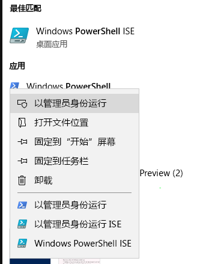
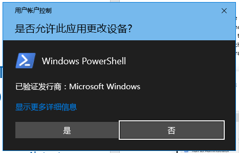
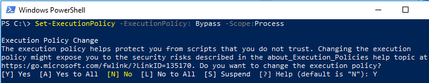

# 用于提交删除请求的 FastTrack 迁移工具集FastTrack Migration Toolset for Submitting Delete Request

## 工具集用途Toolset purpose

如果你是目前正在使用 FastTrack 迁移的客户，那么删除 Office 365 用户帐户将不会删除由 Microsoft FastTrack 团队保留的数据副本（该副本仅保留用于完成迁移）。在迁移过程中，如果你希望 Microsoft FastTrack 团队同时删除数据副本，请通过此工具集提交请求。在正常业务过程中，Microsoft FastTrack 将在迁移完成后立即删除所有数据副本。In the event that you are a customer currently engaged in FastTrack migrations, deleting the Office 365 user account will not delete the data copy held by the Microsoft FastTrack team, which is held for the sole purpose of completing the migration. If during the migration you would like the Microsoft FastTrack team to also delete the data copy, submit a request via this tool set. In the ordinary course of business, Microsoft FastTrack will delete all data copies once the migration is complete.

### 支持的平台Supported platforms
Microsoft 支持 Windows 平台和 PowerShell 控制台中此工具集的初始版本。此工具集支持以下已知平台：Microsoft supports the initial release of this  toolset in the Windows platform and PowerShell console. The following known platforms are supported by this toolset:
 
***表 1 - 此工具集支持的平台******Table 1 — Platforms supported by this toolset***
 
<!--start table here HEADER -->
 
|||||||
|:-----|:-----|:-----|:-----|:-----|:-----|
| |**Windows 7****Windows 7**|**Windows 8****Windows 8**|**Windows 10****Windows 10**|**Windows Server 2012****Windows Server 2012**|**Windows Server 2016****Windows Server 2016**|
|PS 5.0PS 5.0|不Not 支持Supported|支持Supported|支持Supported|支持Supported|支持Supported|
|PS 5.1PS 5.1|不Not 支持Supported|支持Supported|支持Supported|支持Supported|支持Supported|
|||
 
<!-- end of table -->

### 获取工具集Obtaining the toolset

PowerShell 控制台应用程序上的 PowerShell 库中提供此工具集。若要查找和加载此 cmdlet 模块，首先在管理员模式下打开 PowerShell，以使其具有安装模块的相应权限。如果以前未使用过 PowerShell，请转到 Windows 任务栏，并在搜索框中键入“PowerShell”。右键单击并选择控制台应用，然后选择“以管理员身份运行”\*\*\*\*，单击“是”\*\*\*\* 运行 Windows PowerShell。This toolset is available in the PowerShell Gallery on the PowerShell console application.  To locate and load this cmdlet module, first open PowerShell in administrator mode so it has the appropriate permissions to install the module. If you have not used PowerShell previously go to your Windows Task Bar and in the search box type “PowerShell”. Select the console app using right-click and choose **Run as administrator**, then click **Yes** to run Windows PowerShell.

打开控制台后，需要设置用于脚本执行的权限。键入以下命令以允许脚本运行：“Set-ExecutionPolicy - ExecutionPolicy: Bypass - Scope:Process”Now that the console is open, you need to set permissions for script execution. Type the following command to allow the scripts to run: ‘Set-ExecutionPolicy — ExecutionPolicy: Bypass — Scope: Process’

系统将提示你确认此操作，因为管理员可以自行决定更改范围。You will be prompted to confirm this action, as the administrator can change the scope at their discretion.

***设置执行策略******Set Execution Policy***

现在，已将控制台设置为允许脚本，运行下一个命令以安装模块：Now that the console is set to allow the script,  run this next command to install the module:

>`Install-Module -Name Microsoft.FastTrack ` -Repository PSGallery \``Install-Module -Name Microsoft.FastTrack ` -Repository PSGallery \`
>        
>               -WarningAction: SilentlyContinue `
>               -Force’

### 模块的先决条件Prerequisites for module
若要成功执行此模块，可能需要安装独立模块以供使用（如果尚未安装）。可能需要重启 PowerShell。To successfully execute this module, you may need to install dependent modules for use if they are not already installed. You may need to restart PowerShell.  

为了提交 DSR，必须首先使用你的 Office 365 凭据登录：输入正确的凭据将验证你的全局管理员状态并收集租户信息。In order to submit a DSR, you must first log in using your Office 365 credentials — entering the proper credentials will validate your global administrator status and collect tenant information. 

**Login-FastTrackAccount -ApiKey：\<由 FastTrack MVM 提供的 API 密钥\>****Login-FastTrackAccount -ApiKey: \<API Key provided by FastTrack MVM\>**

成功登录后，将存储凭据和密钥，以供 FastTrack 模块在当前 PowerShell 会话的其余部分使用。Once successfully logged in, the credentials and key will be stored for use with FastTrack modules for the remainder of the current PowerShell session.

如果需要连接到云环境（而非商业环境），在以下其中一个有效环境中，需要向 *Login* 命令添加 *-Environment*：If you need to connect to a cloud environment, other than commercial, *-Environment* will need to be added to *Log in* command with one of the following valid environments:
- AzureCloudAzureCloud
- AzureChinaCloudAzureChinaCloud
- AzureGermanCloudAzureGermanCloud
- AzureUSGovernmentCloudAzureUSGovernmentCloud

**Login-FastTrackAcccount -ApiKey\ <API Key provided by FastTrack MVM> -Environment: <cloud environment\>****Login-FastTrackAcccount -ApiKey\ <API Key provided by FastTrack MVM> -Environment: <cloud environment\>**

若要提交 DSR 请求，请运行以下命令：Submit-FastTrackGdprDsrRequest -DsrRequestUserEmail: SubjectUserEmail@mycompany.comTo submit a DSR request, run the following command: Submit-FastTrackGdprDsrRequest -DsrRequestUserEmail: SubjectUserEmail@mycompany.com

成功后，cmdlet 将返回事务 ID 对象。请保留此事务 ID。On success — the cmdlet will return a Transaction ID object. Please retain the Transaction ID.

#### 检查请求事务的状态Checking the status of a request transaction

使用以前获取的事务 ID 运行以下函数：Get-FastTrackGdprDsrRequest -TransactionID: “YourTransactionID”Run the following function using the previously obtained Transaction ID: Get-FastTrackGdprDsrRequest -TransactionID: “YourTransactionID”

#### 事务状态代码Transaction Status Codes
<!--start table here no header -->

|||
|:-----|:-----|:-----|
|**事务****Transaction** |**状态****Status**|
|**已创建****Created** |已创建请求Request has been created|
|**失败****Failed**|无法创建请求，请重新提交，或联系支持人员Request failed to create, please resubmit, or contact support|
|**已完成****Completed**|请求已完成并已被清理Request has been completed and sanitized|
|||

<!-- end of table -->

<!-- original version: **Created**  Request has been created **Failed** Request failed to create, please resubmit, or contact support **Completed** Request has been completed and sanitized -->

## 了解更多Learn more
[Microsoft 信任中心Microsoft Trust Center](https://www.microsoft.com/TrustCenter/Privacy/gdpr/default.aspx)