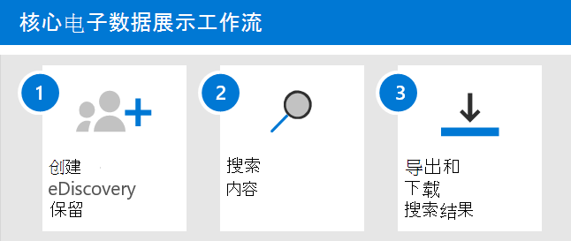

# 开始在 Microsoft 365 中的核心电子数据Microsoft 365

Microsoft 365中的核心电子数据展示提供了一个基本电子数据展示工具，组织可以使用该工具在 Microsoft 365 和 Office 365 中搜索和导出内容。 您还可以使用核心电子数据展示将电子数据展示保留置于内容位置，如 Exchange 邮箱、SharePoint 网站、OneDrive帐户Microsoft Teams。 部署核心电子数据展示不需要任何内容，但在组织开始使用核心电子数据展示搜索、导出和保留内容之前，IT 管理员和电子数据展示管理员必须完成一些先决条件任务。

本文讨论设置核心电子数据展示所需的步骤。 这包括确保访问核心电子数据展示所需的适当许可，并将电子数据展示保留放在内容位置，以及向 IT、法律和调查团队分配权限，以便他们可以访问和管理事例。 本文还简要概述了使用事例搜索和导出内容的情况。

## 步骤 1：验证并分配适当的许可证

核心电子数据展示的许可需要相应的组织订阅和每用户许可。

- **组织订阅：** 若要访问 Microsoft 365 合规中心中的核心电子数据展示并使用保留和导出功能，你的组织必须拥有 Microsoft 365 E3 或 Office 365 E3 订阅或更高版本。 Microsoft 365一线组织必须具有 F5 订阅。

- **每用户许可：** 若要将电子数据展示保留置于邮箱和网站上，必须为用户分配以下许可证之一，具体取决于您的组织订阅：

  - 许可证Microsoft 365 E3或Office 365 E3或更高版本

   或

  - Office 365 E1计划 2 Exchange Online或附加Exchange Online Archiving许可证创建许可证

   或

  - Microsoft 365前端 F5 合规性或 F5 安全&合规性附加许可证  

  AND

  - Office 365 E1具有 SharePoint Online 计划 2 或 OneDrive for Business 2 附加许可证的许可证
  
  若要了解如何分配许可证，请参阅 [向用户分配许可证](../admin/manage/assign-licenses-to-users.md)。

有关安全性和合规性的信息和指导：

- 下载并查看"比较"表中的"电子数据展示和Microsoft 365[部分](https://aka.ms/M365EnterprisePlans)。

- 请参阅安全[Microsoft 365合规性指南& - 服务说明|Microsoft Docs](/office365/servicedescriptions/microsoft-365-service-descriptions/microsoft-365-tenantlevel-services-licensing-guidance/microsoft-365-security-compliance-licensing-guidance)。

## 步骤 2：分配电子数据展示权限

若要访问核心电子数据展示或添加为核心电子数据展示案例的成员，必须为用户分配适当的权限。 具体而言，必须将用户添加为电子数据展示管理员角色组的成员Microsoft 365 合规中心。 此角色组的成员可以创建和管理核心电子数据展示事例。 他们可以添加和删除成员、将电子数据展示保留给用户、创建和编辑搜索以及从核心电子数据展示案例导出内容。

完成以下步骤以将用户添加到电子数据展示管理员角色组：

1. 转到"Microsoft 365 合规中心"，然后使用组织中管理员帐户的凭据Microsoft 365 Office 365登录。

2. 在" <a href="https://go.microsoft.com/fwlink/p/?linkid=2173597" target="_blank">**权限"**</a> 页上，选择 **电子数据展示管理员角色** 组。

3. 在"电子数据展示管理器"飞出页面上， **单击"电子** 数据展示管理器"部分 **旁边的"编辑** "。

4. 在编辑 **角色组向导中的"选择电子数据** 展示管理器"页上，单击" **选择发现管理器"**。

5. 单击 **"** 添加"，然后选中要添加到角色组的所有用户的复选框。

6. 单击 **"** 添加"添加所选用户，然后单击"完成 **"**。

7. 单击 **"** 保存"将用户添加到角色组，然后单击 **"关闭"** 以完成此步骤。

### 有关电子数据展示管理员角色组详细信息

电子数据展示管理员角色组中有两个子组。 这些子组之间的差异基于作用域。

- **电子数据展示管理器**：可以查看和管理他们创建或作为成员的核心电子数据展示事例。 如果另一个电子数据展示管理员创建了一个案例，但没有将第二个电子数据展示管理员添加为该案例的成员，则第二个电子数据展示管理员将无法在合规中心的"核心电子数据展示"页上查看或打开该案例。 通常，可以将您组织中的大多数人员添加到电子数据展示管理员子组。

- **电子数据展示管理员**：可以执行电子数据展示管理员可以执行的所有案例管理任务。 此外，电子数据展示管理员可以：

  - 查看核心电子数据展示页面上列出的所有事例。
  
  - 在将自己添加为案例的成员之后管理组织内的任何案例。

  - 访问和导出组织中任意案例的大小写数据。
  
  - 从电子数据展示案例中删除成员。 只有电子数据展示管理员可以从案例中删除成员。 作为电子数据展示管理器子组的成员的用户无法从案例中删除成员，即使用户创建了案例。

  由于访问权限的范围很广，组织应仅应该只有部分管理员是电子数据展示管理员子组的成员。

有关电子数据展示权限以及分配给电子数据展示管理员角色组的每个角色的说明，请参阅分配 [电子数据展示权限](assign-ediscovery-permissions.md)。

## 步骤 3：创建核心电子数据展示案例

下一步是创建案例并开始使用核心电子数据展示。 完成以下步骤以创建案例并添加成员。 创建案例的用户将自动添加为成员。

1. 转到<a href="https://go.microsoft.com/fwlink/p/?linkid=2077149" target="_blank">Microsoft 365 合规中心</a>，然后使用已分配有相应电子数据展示权限的用户帐户的凭据登录。 组织管理角色组的成员还可以创建核心电子数据展示事例。

2. 在列表的左侧导航窗格中，Microsoft 365 合规中心 **全部显示**"，然后单击 **"eDiscoveryCore** > <a href="https://go.microsoft.com/fwlink/p/?linkid=2174007" target="_blank">**"**</a>。

3. 在" **核心电子数据展示"页上** ，单击" **创建案例"**。

4. 在" **新建案例** "飞出页面上，为案件 (一个) ，然后键入可选说明。 案例名称在组织中必须是唯一的。

5. 单击 **"保存** "创建案例。

   新案例创建并显示在核心电子数据展示页面上。 您可能必须单击"刷新 **"** 以显示新案例。

## 步骤 4 (可选) ：向核心电子数据展示案例添加成员

如果在步骤 3 中创建了案例，并且你是将使用该案例的唯一人员，则不必执行此步骤。 你可以开始使用该案例创建电子数据展示保留项、搜索内容和导出搜索结果。 如果要向其他用户授予对 (或角色组的访问权限) 执行此步骤。

1. 在 **"核心电子数据** 展示"Microsoft 365 合规中心，单击要添加成员的情况的名称。

2. 在案例主页上，**选择"设置**"选项卡，然后选择"访问&**权限"**。

3. 在"**&权限**"飞出页上的"成员 **"** 下，单击"添加"将成员添加到案例。

    还可以选择将角色组添加为案例的成员。 在" **角色组"下**，单击" **添加"**。 只能将您作为成员的角色组分配给案例。 这是因为角色组控制谁可以将成员分配给电子数据展示案例。

4. 在可添加为案例成员的人或角色组列表中，单击要添加 (或角色) 名称的左侧。 如果您有一个可添加为成员的大型人员或角色组列表，请使用"搜索"框搜索列表中的特定人员或角色组。
  
5. 选择要添加为案例成员的人或角色组后，单击"保存"以保存新成员或角色组。

> [!IMPORTANT]
>
>- 如果在已添加为案例成员的角色组中添加或删除角色，则角色组将自动删除为案例 (或角色组是) 成员的任何情况。 这样做的原因是保护组织避免无意中向案件的成员提供其他权限。 同样，如果删除了某个角色组，则它将从它作为成员的所有事例中删除。 有关详细信息，请参阅[分配电子数据展示权限](assign-ediscovery-permissions.md#adding-role-groups-as-members-of-ediscovery-cases)。 
>
>- 如前所述，只有电子数据展示管理员可以从案例中删除成员。 作为电子数据展示管理器子组的成员的用户无法从案例中删除成员，即使用户创建了案例。
>

## 探索核心电子数据展示工作流

为了让你开始使用核心电子数据展示，下面是一个简单的工作流，该工作流为感兴趣的人员创建电子数据展示保留，搜索与调查相关的内容，然后导出该数据以进一步查看。 在每个步骤中，我们还将重点介绍一些你可以浏览的扩展核心电子数据展示功能。

1. **[创建电子数据展示保留](create-ediscovery-holds.md)**。 创建案例后的第一步是 (调查感兴趣的人员的内容位置) 电子数据展示保留"。 内容位置包括Exchange邮箱SharePoint网站、OneDrive帐户，以及与组和组关联的Microsoft Teams Microsoft 365网站。 虽然此步骤是可选的，但创建电子数据展示保留会保留调查期间可能与案例相关的内容。 创建电子数据展示保留时，可以保留特定内容位置中的内容，也可以创建基于查询的保留以仅保留与保留查询匹配的内容。 除了保留内容之外，创建电子数据展示保留的另一个很好的理由就是快速搜索保留的内容位置 (而不必在下一步创建和运行搜索时选择每个位置来搜索) 。 完成调查后，可以解除所创建的任何保留。

2. **[搜索内容](search-for-content-in-core-ediscovery.md)**。 创建电子数据展示保留后，使用内置搜索工具搜索保留的内容位置。 您还可以搜索其他内容位置，查找可能与案例相关的数据。 您可以创建和运行与案例关联的不同搜索。 您可以使用关键字、属性和条件来构建搜索查询，这些查询使用与案例最相关的数据返回搜索结果。 还可以执行以下操作：

   - 查看可帮助您优化搜索查询以缩小结果范围的搜索统计信息。

   - 预览搜索结果以快速验证是否已找到相关数据。

   - 修改查询并重新运行搜索。

3. **[导出和下载搜索结果](export-content-in-core-ediscovery.md)**。 在搜索并查找与调查相关的数据后，你可以将该数据导出Office 365外部人员进行审阅。 导出数据的过程包含两个步骤。 第一步是导出搜索的结果（如果为 Office 365）。 这是通过将搜索结果复制到 Microsoft 提供的位置Azure 存储实现。 下一步是使用电子数据展示导出工具将内容下载到本地计算机。 除了导出的数据文件之外，导出包还包含导出报告、摘要报表和错误报告。
