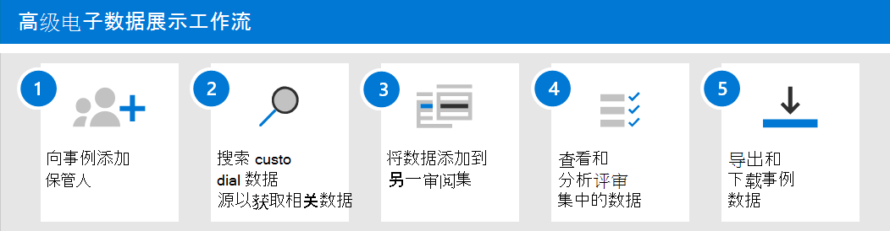

# 高级电子数据展示入门

Microsoft 365 中的高级电子数据展示提供了一种端到端工作流，用于保留、收集、查看、分析和导出对组织的内部和外部调查做出响应的数据。 无需部署高级电子数据展示，但必须有一些先决条件任务，IT 管理员和电子数据展示管理器必须完成这些任务，然后组织才能开始创建并使用高级电子数据展示事例来管理调查。

本文讨论了设置高级电子数据展示所需的步骤。 这包括确保访问高级电子数据展示所需的正确许可，并将保管人添加到案例，以及将权限分配给法律和调查团队以便他们能够访问和管理案例。 此外，本文还提供了使用案例来管理法律调查的高级电子数据展示工作流的高级别概述。

## 步骤1：验证并分配适当的许可证

高级电子数据展示的许可要求相应的组织订阅和每用户许可。

- **组织订阅：** 若要在 Microsoft 365 合规性中心或 Office 365 安全性 & 合规性中心访问高级电子数据展示，您的组织必须具有以下各项之一：

  - Microsoft 365 E5 或 Office 365 E5 订阅
  
  - 带有 E5 合规性加载项的 Microsoft 365 E3 订阅
  
  - 具有高级合规性加载项的 Office 365 E3 订阅

  如果你没有现有的 Microsoft 365 E5 计划，并且想要尝试高级电子数据展示，则可以[将 microsoft 365 添加](https://docs.microsoft.com/office365/admin/try-or-buy-microsoft-365)到现有的 Office 365 订阅，或者注册 Microsoft 365 E5 的[试用版](https://www.microsoft.com/microsoft-365/enterprise)。

- **每用户许可：** 若要在提前电子数据展示事例中将用户添加为保管人，则必须为该用户分配以下许可证之一，具体取决于您的组织订阅：

  - Microsoft 365：必须为用户分配 Microsoft 365 E5 许可证或 E5 合规性附加许可证。

  - Office 365：必须为用户分配 Office 365 E5 许可证或高级合规性附加许可证。

   有关如何分配许可证的信息，请参阅向[用户分配许可证](https://docs.microsoft.com/microsoft-365/admin/manage/assign-licenses-to-users)。

> [!NOTE]
> 用户只需将 E5 许可证（或相应的附加许可证）作为保管人添加到高级电子数据展示事例。 使用高级电子数据展示来管理案例和审阅事例数据的 IT 管理员、电子数据展示管理者、律师、paralegals 或调查人员不需要 E5 或附加许可证。

## 步骤2：分配电子数据展示权限

若要访问高级电子数据展示或添加为高级电子数据展示事例的成员，则必须为用户分配适当的权限。 具体来说，用户必须作为 "Office 365 安全 & 合规中心" 中的 "电子数据展示管理器" 角色组的成员进行添加。 此角色组的成员可以创建和管理高级电子数据展示事例。 他们可以添加和删除成员，将保管人和内容位置置于保留状态，管理合法保留通知，创建和编辑与案例关联的搜索，将搜索结果添加到审阅集，分析审阅集中的数据，以及从高级策略中导出和下载电子数据展示事例。

完成以下步骤以将用户添加到电子数据展示管理器角色组：

1. 转到[https://protection.office.com/permissions](https://protection.office.com/permissions)并使用 Microsoft 365 组织中的管理员帐户的凭据登录。

2. 在 "**权限**" 页上，选择 "**电子数据展示管理器**" 角色组。

3. 在 "电子数据展示管理器" 弹出页面上，单击**电子数据展示管理器**部分旁边的 "**编辑**"。

4. 在编辑角色组向导中的 "**选择电子数据展示管理器**" 页上，单击 "**选择发现管理器**"。

5. 单击 "**添加**"，然后选中要添加到角色组的所有用户的复选框。

6. 单击 "**添加**" 以添加选定的用户，然后单击 "**完成**"。

7. 单击 "**保存**" 将用户添加到角色组，然后单击 "**关闭**" 完成步骤。

### 有关电子数据展示管理器角色组的详细信息

"电子数据展示管理器" 角色组中有两个子组。 这些子组之间的差异基于作用域。

- **电子数据展示管理器：** 可以查看和管理他们创建的或为其成员的高级电子数据展示事例。 如果另一个电子数据展示管理器创建了一个事例，但未将另一个电子数据展示管理器添加为这种情况的成员，则第二个电子数据展示管理器将无法在合规性中心的高级电子数据展示页面上查看或打开该事例。 通常，可以将组织中的大多数用户添加到电子数据展示管理器子组。

- **电子数据展示管理员：** 可以执行电子数据展示管理器可以执行的所有案例管理任务。 此外，电子数据展示管理员可以：

  - 查看高级电子数据展示页面上列出的所有事例。
  
  - 在组织中管理任何事例，然后在将自己添加为案例成员。

  - 组织中的任何事例的访问和导出事例数据。

  由于访问范围很广，组织应仅有几个作为电子数据展示管理员子组成员的管理员。

有关电子数据展示权限的详细信息以及分配给电子数据展示管理器角色组的每个角色的说明，请参阅[在安全 & 合规性中心中分配电子数据展示权限](assign-ediscovery-permissions.md)。

## 步骤3：为高级电子数据展示配置全局设置

在贵组织中的人员开始创建和用例之前，要完成的最后一步是配置适用于组织中的所有案例的全局设置。 目前，唯一的全局设置是*律师-客户端特权检测*（将来将提供更多全局设置）。 此设置使律师-客户端权限模型能够在您分析评审集内的数据时运行。 模型使用机器学习确定文档包含性质合法的内容的可能性。 它还将文档的参与者与律师列表（在设置模型时提交）进行比较，以确定文档是否至少有一个作为律师的参与者。

有关设置和使用律师-客户端权限检测模型的详细信息，请参阅[在高级电子数据展示中设置律师-客户端权限检测](attorney-privilege-detection.md)。

> [!NOTE]
> 这是一种可随时执行的可选步骤。 不实现律师-客户端特权检测模型不会阻止您创建和使用高级电子数据展示事例。

## 步骤4：创建高级电子数据展示事例

下一步是创建一个事例，并开始使用高级电子数据展示。 完成以下步骤以创建事例并添加成员。 创建案例的用户将自动添加为成员。

1. 转到[https://compliance.microsoft.com](https://compliance.microsoft.com)并使用已为其分配了相应电子数据展示权限的用户帐户的凭据登录。 组织管理角色组的成员也可以创建高级电子数据展示事例。

2. 在 Microsoft 365 合规性中心的左侧 nave 中，单击 "**全部显示**"，然后单击 "**电子数据展示 > 高级**"。

3. 在 "**高级电子数据展示**" 页上，单击 "**事例**" 选项卡，然后单击 "**创建事例**"。

4. 在**新的电子数据展示事例**弹出页面上，为事例提供名称（必需），然后键入一个可选的事例编号和说明。 案例名称在您的组织中必须是唯一的。

5. 单击 "**保存**" 以创建事例。

   将创建新事例，并显示新事例中的 "**设置**" 选项卡。 

6. 在 "**设置**" 选项卡上的 "**访问 & 权限**" 磁贴中，单击 "**选择**"，然后单击 "**更新**"。

7. 单击“更新”****。

8. 在 "**管理此案例**" 弹出页面上的 "**管理成员**" 下，单击 "**添加**" 向事例添加成员。

9. 在 "人员" 列表中，选中要向事例添加的人员姓名旁边的复选框。 如上文所述，请确保您添加到此案例的人员已分配了相应的电子数据展示权限。

10. 选择要添加为事例成员的人员后，单击 "**添加**"。

11. 在 "**管理此事例**" 弹出页面中，单击 "**保存**" 以保存新的事例成员列表。

12. 单击 "**主页**" 选项卡转到 "案例" 主页。

## 探索高级电子数据展示工作流

为了让你开始使用高级电子数据展示，下面是一个与[常见电子数据展示做法](overview-ediscovery-20.md#alignment-with-edrm)相适应的简单工作流。 在上述每个步骤中，我们还将重点介绍你可以探索的一些扩展高级电子数据展示功能。

1. 向**[事例添加保管人](add-custodians-to-case.md)**。 创建事例的第一步是添加保管人。 *管理员*是具有对文档或电子文件的管理控制的人员，可能与案例相关。 以下是在向事例添加保管人时所发生的操作（或可以执行的操作）：

   - 如果保管人的 Exchange 邮箱、OneDrive 帐户以及保管人所属的任何 Microsoft 团队或 Yammer 组中的数据，都可以在案例中 "标记" 为 "custodial" 数据。
  
   - 将对保管人数据重新编制索引（通过一个称为 "*高级索引*" 的过程）。 这有助于在下一步中优化搜索。
  
   - 您可以对保管人数据设置保留。 这将保留在调查过程中可能与事例相关的数据。
  
   - 您可以将其他数据源与管理员关联（例如，可以将 SharePoint 网站或 Office 365 组与管理员关联），以便可以对这些数据进行重新编制索引、设置保留和搜索，就像使用保管人邮箱或 OneDrive 帐户中的数据一样。

   - 您可以使用高级电子数据展示中的[通信工作流](managing-custodian-communications.md)向保管人发送合法保留通知。

2. **[在 custodial 数据源中搜索与事例相关的数据](collecting-data-for-ediscovery.md)**。 向事例添加保管人后，使用内置搜索工具在保管人数据位置中搜索可能与事例相关的数据。 使用关键字、属性和条件[构建搜索查询](building-search-queries.md)，以使用最可能与案例相关的数据返回搜索结果。 您还可以：

   - 查看可帮助您优化搜索查询以缩小结果范围的[搜索统计信息](search-statistics.md)。

   - 预览搜索结果以快速验证是否找到了相关数据。

   - 修订查询并重新运行搜索。

3. **[将数据添加到审阅集](add-data-to-review-set.md)**。 配置并验证搜索是否返回所需数据之后，下一步是将搜索结果添加到审阅集。 将数据添加到审阅集时，会将项目从其原始位置复制到安全的 Azure 存储位置。 再次对数据重新编制索引，以便在审阅和分析评审集中的项时对其进行全面和快速的搜索优化。 此外，还可以[将非 Office 365 数据添加到审阅集中](load-non-office-365-data-into-a-review-set.md)。

   此外，还有一种特殊的审阅集，可向其添加数据，称为*对话审阅集*。 这些类型的审查集提供了会话重建功能，用于重构、查看和导出像 Microsoft 团队中的对话对话。 有关详细信息，请参阅[在高级电子数据展示中查看对话](conversation-review-sets.md)。

4. **查看和分析评审集中的数据**。 现在，数据处于审阅集中，您可以使用各种工具和功能来查看和分析事例数据，目的是将数据集的目标减少为与您调查的案例最相关的内容。 下面列出了可在此过程中使用的一些工具和功能。

   - [查看文档](view-documents-in-review-set.md)。 这包括查看评审集中每个文档的元数据，以及在文档的本机版本或文本版本中查看该文档。

   - [创建查询和筛选器](review-set-search.md)。 您可以使用各种搜索条件（包括搜索所有[文件元数据属性](document-metadata-fields-in-advanced-ediscovery.md)的功能）创建搜索查询，以进一步优化和挑选对事例最相关的事例数据。 您还可以使用审阅设置筛选器将其他条件快速应用于搜索查询的结果，以进一步优化这些结果。 

   - [创建和使用标记](tagging-documents.md)。 您可以将标签应用于审阅集中的文档，以确定哪些响应迅速（或不响应），然后在创建搜索查询以包含或排除带标签的文档时使用这些标记。 您还可以进行标记以确定要导出的文档。

   - 对[文档添加批注和密文](view-documents-in-review-set.md#annotate-view)。 您可以在审阅中使用批注工具对文档中的内容进行批注和在文档中对内容进行密文标记作为工作产品。 在审阅过程中，我们会生成 PDF 版本的批注或编辑文档，以降低导出 unredacted 本机版本的文档的风险。

   - [分析事例数据](analyzing-data-in-review-set.md)。 高级电子数据展示中的分析功能非常强大。 在对评审设置中的数据运行分析之后，我们会执行分析，如接近重复检测、电子邮件线程和主题，可帮助减少必须查看的文档量。 我们还会生成汇总运行分析结果的分析报告。 如前所述，运行分析还运行[律师-客户端特权检测模型](attorney-privilege-detection.md#use-the-attorney-client-privilege-detection-model)。

5. **导出和下载事例数据**。 收集、查看和分析事例数据的最后一步是将其导出到高级电子数据展示中，以供外部审阅或调查团队之外的人员进行审阅。 导出数据的过程分为两个步骤。 第一步是将评审集[导出](export-documents-from-review-set.md)到不同的 Azure 存储位置（由 Microsoft 提供，或由组织管理的存储位置）。 然后，使用 Azure 存储资源管理器将数据[下载](download-export-jobs.md)到本地计算机。 除了导出的数据文件之外，导出包的包含还包含导出报告、摘要报告和错误报告。
