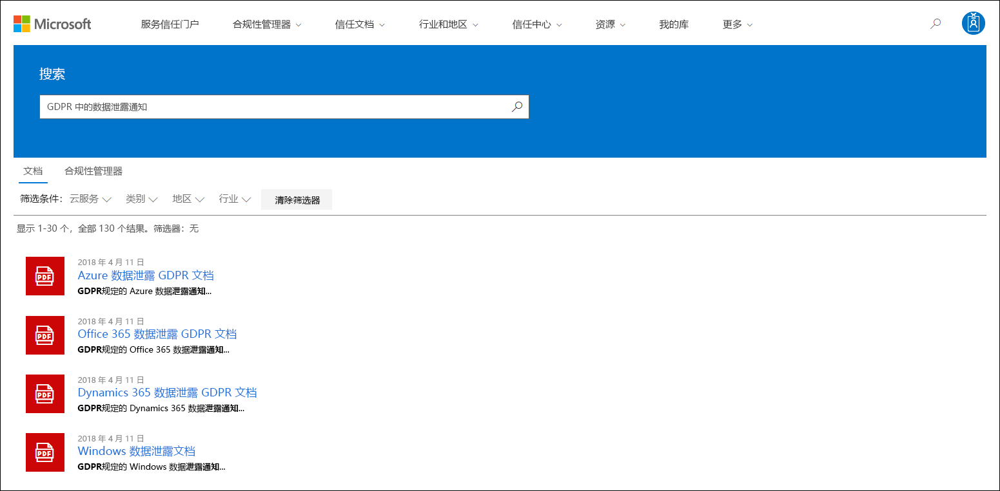
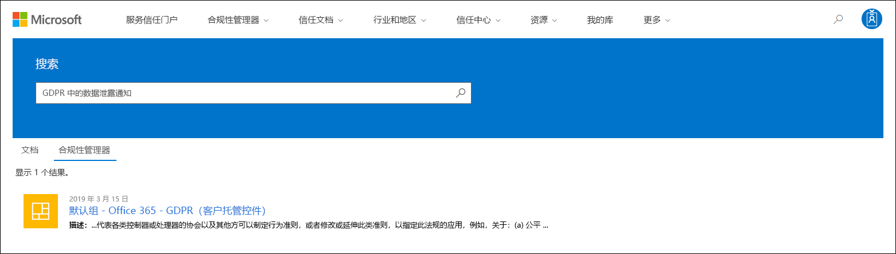

# Microsoft 服务信任门户入门

Microsoft 服务信任门户提供有关 Microsoft 安全性、隐私和合规性做法的各种内容、工具和其他资源。

## 访问服务信任门户

服务信任门户包含 Microsoft 实施用于保护云服务和客户数据中心的控制和流程的详细信息。 若要访问服务信任门户上的某些资源，必须使用 Microsoft 云服务帐户 (（Azure Active Directory 组织帐户或 Microsoft 帐户) ）以经过身份验证的用户身份登录，并查看并接受 Microsoft 合规性材料保密协议。

### 现有客户

现有客户可以通过以下在线订阅之一访问服务信任门户， (<https://aka.ms/STP> 或付费) ：

- Microsoft 365
- Dynamics 365
- Azure

 > [!NOTE]
 > Azure Active Directory组织关联的帐户可以访问各种文档和功能，如合规性管理器。 为个人使用创建的 Microsoft 帐户对服务信任门户内容的访问权限有限。

### 正在评估 Microsoft 联机服务的新客户和客户

若要创建新帐户或创建试用帐户，请使用下列注册表单之一 (用于试用帐户) 访问 STP。

- 注册新的 Microsoft 365 商业应用版[试用帐户](https://go.microsoft.com/fwlink/p/?LinkID=507653)或新的 Office 365 企业版[试用帐户](https://go.microsoft.com/fwlink/p/?LinkID=698279)

- 注册新的 [Dynamics 365 试用帐户](https://go.microsoft.com/fwlink/?LinkId=252780)

- 注册新的 Azure [试用帐户](https://go.microsoft.com/fwlink/?LinkId=722737)。

注册免费试用版或订阅时，必须启用Azure Active Directory以支持对 STP 的访问。

## 使用服务信任门户

可从主菜单访问服务信任门户的功能和内容。

以下各节介绍主菜单中的每个项目。

### 服务信任门户

" **服务信任门户"** 链接显示主页。 它提供了一种快速返回到主页的方法。

### 合规性管理器

> [!IMPORTANT]
> 合规性管理器已从服务信任门户移动到其新位置的 Microsoft 365 合规中心<a href="https://go.microsoft.com/fwlink/p/?linkid=2077149" target="_blank">。</a> 所有客户数据已移至新位置，因此你可以继续使用合规性管理器而不会中断。 有关设置 [信息，请参阅合规性](compliance-manager.md) 管理器文档，了解新功能。 尽管经典版本的合规性管理器仍保留在服务信任门户中，但鼓励所有用户在服务信任门户Microsoft 365 合规中心。

### 信任文档

提供大量安全实现和设计信息，目的是通过了解 Microsoft 云服务如何保护你的数据安全，更轻松地实现法规合规性目标。 若要查看内容，请在“**信任文档**”下拉菜单选择以下其中一个选项。

- **审核报告：** 将显示有关 Microsoft 云服务的独立审核和评估报告列表。 这些报告提供有关 Microsoft 云服务是否符合数据保护标准和法规要求的信息，例如：

  - 国际标准化组织 (ISO) 
  - Service Organization Controls (SOC)
  - 国家标准与技术研究所 (NIST)
  - 联邦风险和授权管理项目 (FedRAMP)
  - 一般数据保护条例 (GDPR)

- **数据保护：** 包含大量资源，如审核控制措施、白皮书、常见问题解答、渗透测试、风险评估工具和合规性指南。

- **Azure 安全与合规蓝图：** 帮助你构建安全且合规的基于云的应用程序的资源。 此区域包含针对政府、财务、医疗保健和零售纵向的蓝图指南。

### 行业和区域

提供有关 Microsoft 云服务的特定于行业和地区的合规性信息。

- **行业：** 目前，此页为金融服务行业提供了特定于行业的登陆页面。 其中包含合规性产品/服务、常见问题解答和成功案例等信息。 面向更多行业的资源将在未来发布，但您可以通过在 STP 中访问"信任文档和数据保护"> **找到更多** 行业的资源。

- **区域：** 提供有关 Microsoft 云服务遵守各种国家/地区法律的法律意见。 特定国家/地区包括澳大利亚、加拿大、捷克共和国、丹麦、德国、波兰、罗马尼亚、西班牙和英国。

### 信任中心

指向 [Microsoft 信任中心的链接](https://www.microsoft.com/trust-center)，提供有关 Microsoft 云中的安全性、合规性和隐私性详细信息。 这包括有关 Microsoft 云服务中可用于满足 GDPR 特定要求的功能的信息、有助于 GDPR 责任的文档以及了解 Microsoft 为支持 GDPR 而采取的技术和组织措施。

### 我的库

此新功能允许您保存 (*或固定*) 文档，以便您可以在"我的库"页上快速访问它们。 你也可以设置通知，在“我的库”中的文档更新时，Microsoft 会给你发送一封电子邮件通知。 有关详细信息， [请参阅本文中的](#my-library-1) 我的库部分。

### "详细信息"

转到 **">** 管理员"以访问仅对全局管理员帐户可用的管理功能。 此选项仅在以全局管理员登录时可见。 "管理员" **下拉菜单中提供了** 两个选项：

- **设置：** 此页面允许你为合规性管理器分配用户角色 (经典) 。

- **用户隐私设置：** 此页面允许您导出包含特定用户的合规性管理器 () 操作项分配的报告。 还可以将所有行动项重新分配给其他用户，并删除指定用户分配的任何行动项。

### 搜索

单击"服务信任门户"页面右上角的放大镜以展开该框，输入搜索词，然后按 **Enter。** 将显示 **"** 搜索"页，搜索词显示在搜索框中，搜索结果如下所示。

默认情况下，搜索返回文档结果。 可以使用下拉列表来优化显示的文档列表，以筛选结果。 可以使用多个筛选器来缩小文档列表。 筛选器包括特定的云服务、合规性或安全实践类别、地区和行业。 单击"文档名称"链接以下载文档。

若要在合规性管理器中列出与搜索 (相关的) 评估中的控制措施，请单击"合规性 **管理器"。** 搜索结果显示评估的创建日期、评估分组的名称、适用的 Microsoft 云服务，以及控制是 Microsoft 还是客户托管。 单击该控件的名称以查看合规性管理器评估中的控件 (经典) 。

> [!NOTE]
> 服务信任门户报告和文档可在发布后至少 12 个月内下载，或直到有新版本的文档可用。

## 我的库

使用"我的库"功能将服务信任门户上的文档和资源添加到我的库页面。 这样，您可以在一个地方访问与自己相关的文档。  若要将文档添加到"我的库"，请单击文档右边的"..."菜单，然后选择"**保存到库"。** 可以通过单击一个或多个文档旁边的复选框，然后单击页面顶部的"保存到库"，将多个文档添加到我的库。 

此外，通知功能还允许您配置"我的库"，以便 Microsoft 更新已添加到"我的库"的文档时，会向用户发送电子邮件。 若要设置通知，请转到"我的库"，然后单击"通知 **设置"。** 可以选择通知频率，并指定组织中要向其中发送通知的电子邮件地址。 电子邮件通知包括指向已更新的文档的链接以及更新的简要说明。

另请注意，我们会识别"我的库"中最近 30 天内已更新的任何文档，无论你是否启用通知。 工具提示中还显示了更新的简要说明。

## 初学者包

初学者包是 Microsoft 为特定行业提供 Microsoft 云服务的一组文档。 目前，服务信任门户为金融服务组织提供以下三个入门包。 这些入门包可帮助组织评估和评估 Microsoft 云中的安全性、合规性和隐私，并提供指南以帮助在高度管控的金融服务行业实施 Microsoft 云服务。

- **评估初学者包：** 用于对金融服务组织的 Microsoft 云进行早期评估。

- **评估初学者包：** 评估后，使用此初学者包中的清单和其他指南来帮助组织评估与安全、合规性和隐私相关的风险。

- **审核初学者包：** 使用此初学者包，可指导你使用审核控件和其他工具，以帮助指导你实现 Microsoft 云服务，帮助降低组织的风险。

若要访问这些初学者包，请转到服务信任门户 **> Industry & Regions > Industry Solutions > Financial Services**。 你可以打开或下载初学者包中的文档，或将它们保存到我的库。

## 本地化支持

通过服务信任门户，可以查看不同语言的网页内容。 若要更改网页语言，只需单击网页左下角的地球图标并选择所需语言即可。

## 提供反馈

我们可以帮助你解决有关服务信任门户的问题，或者你使用门户时遇到的错误。 您还可以使用 STP 页面底部的"反馈"链接，联系我们，告诉我们有关服务信任门户合规性报告和信任资源的问题和反馈。

你的反馈对我们非常重要。 单击页面底部的"反馈"按钮，向我们发送有关您所做的或不喜欢的内容的评论，或者您可能对改进我们产品或产品功能的建议。

