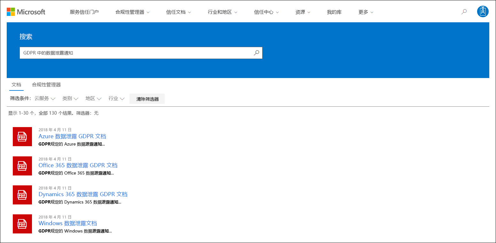

# Microsoft 服务信任门户入门Get started with the Microsoft Service Trust Portal

Microsoft 服务信任门户提供了有关 Microsoft 安全、隐私和合规性做法的各种内容、工具和其他资源。The Microsoft Service Trust Portal provides a variety of content, tools, and other resources about Microsoft security, privacy, and compliance practices.
  
## 访问服务信任门户Accessing the Service Trust Portal

服务信任门户包含有关 Microsoft 实施的控制和过程的详细信息，可保护我们的云服务和其中的客户数据。The Service Trust Portal contains details about Microsoft's implementation of controls and processes that protect our cloud services and the customer data therein. 若要访问服务信任门户上的一些资源，必须使用 Microsoft 云服务帐户（Azure Active Directory 组织帐户或 Microsoft 帐户）以已通过身份验证的用户身份登录，并查看并接受 Microsoft合规性材料的非公开协议。To access some of the resources on the Service Trust Portal, you must log in as an authenticated user with your Microsoft cloud services account (either an Azure Active Directory organization account or a Microsoft Account) and review and accept the Microsoft Non-Disclosure Agreement for Compliance Materials.
  
**现有客户可以** [https://aka.ms/STP](https://aka.ms/STP)使用以下联机订阅之一（试用版或付费版）访问服务信任门户：**Existing customers can access the Service Trust Portal** at [https://aka.ms/STP](https://aka.ms/STP) with one of the following online subscriptions (trial or paid): 
  
- Office 365Office 365

- Dynamics 365Dynamics 365

- AzureAzure
    
 > [!NOTE]
 > 与组织相关联的 Azure Active Directory 帐户可以访问各种文档和功能，如合规性管理器。Azure Active Directory accounts associated with organizations have access to the full range of documents and features like Compliance Manager. 为个人使用创建的 Microsoft 帐户具有对服务信任门户内容的有限访问权限。Microsoft accounts created for personal use have limited access to Service Trust Portal content. 
  
**评估 Microsoft online services 的新客户和客户****New customers and customers evaluating Microsoft online services**
  
若要创建新帐户或创建试用帐户，请使用以下注册表单之一（也可用于试用帐户）以获取对 STP 的访问权限。To create a new account or to create a trial account, use one of the following sign-up forms (also used for trial accounts) to get access to the STP.
  
- 注册新的[office 365 商业版试用帐户](https://go.microsoft.com/fwlink/p/?LinkID=507653)或新的[office 365 企业版试用帐户](https://go.microsoft.com/fwlink/p/?LinkID=698279)Sign up for a new [Office 365 Business trial account](https://go.microsoft.com/fwlink/p/?LinkID=507653) or a new [Office 365 Enterprise trial account](https://go.microsoft.com/fwlink/p/?LinkID=698279)

- 注册新的[Dynamics 365 试用帐户](https://go.microsoft.com/fwlink/?LinkId=252780)Sign up for a new [Dynamics 365 trial account](https://go.microsoft.com/fwlink/?LinkId=252780)

- 注册新的[Azure 试用帐户](https://go.microsoft.com/fwlink/?LinkId=722737)。Sign up for a new [Azure trial account](https://go.microsoft.com/fwlink/?LinkId=722737). 
    
注册免费试用版或订阅时，必须启用 Azure Active Directory 以支持对 STP 的访问。When you sign up for either a free trial, or a subscription, you must enable Azure Active Directory to support your access to the STP.
  
## 使用服务信任门户Using the Service Trust Portal

可从主菜单访问服务信任门户的功能和内容。The Service Trust Portal features and content are accessible from the main menu.
  

以下各节介绍主菜单中的每一项。The following sections describe each item in the main menu.
  
### 服务信任门户Service Trust Portal

**服务信任门户**链接显示主页。The **Service Trust Portal** link displays the home page. 它提供了一种快速返回到主页的方法。It provides a quick way to get back to the home page.

### 合规性管理器Compliance Manager

合规性管理器是一项基于工作流的风险评估工具，可帮助您跟踪、分配和验证与 Microsoft 云服务（如 Office 365、Dynamics 365 和 Azure）相关的组织的法规遵从性活动。Compliance Manager is a workflow-based risk assessment tool that helps you track, assign, and verify your organization's regulatory compliance activities related to Microsoft Cloud services, such as Office 365, Dynamics 365, and Azure. 使用合规性管理器在云的共享职责模型中管理法规遵从性。Use Compliance Manager to manage regulatory compliance within the shared responsibility model of the cloud. 根据要使用的合规性管理器的版本，请参阅以下文章以了解详细信息：Depending on the version of Compliance Manager you want to use, see the following articles for more information:

- [Microsoft 合规性管理器（经典）Microsoft Compliance Manager (Classic)](meet-data-protection-and-regulatory-reqs-using-microsoft-cloud.md)

- [Microsoft 合规性管理器（预览）Microsoft Compliance Manager (Preview)](compliance-manager-overview.md)

### 信任文档Trust Documents

提供了大量安全实施和设计信息，目的是通过了解 Microsoft 云服务如何保护数据，从而更轻松地满足法规遵从性目标。Provides a wealth of security implementation and design information with the goal of making it easier for you to meet regulatory compliance objectives by understanding how Microsoft Cloud services keep your data secure. 若要查看内容，请在 "**信任文档**" 下拉菜单中选择下列选项之一。To review content, select one of the following options on the **Trust Documents** pull-down menu.

- **审核报告：** 将显示有关 Microsoft 云服务的独立审核和评估报告的列表。**Audit Reports:** A list of independent audit and assessment reports on Microsoft's Cloud services is displayed. 这些报告提供了有关 Microsoft 云服务遵从数据保护标准和法规要求的信息，例如：These reports provide information about Microsoft Cloud services compliance with data protection standards and regulatory requirements, such as:
  
    - 国际标准化组织（ISO）International Organization for Standardization (ISO)

    - Service Organization Controls (SOC)Service Organization Controls (SOC)

    - 美国国家标准和技术协会（NIST）National Institute of Standards and Technology (NIST)

    - 联邦风险和授权管理计划（FedRAMP）Federal Risk and Authorization Management Program (FedRAMP)

    - 一般数据保护条例 (GDPR)General Data Protection Regulation (GDPR)

- **数据保护：** 包含大量资源，如已审核的控件、白皮书、常见问题解答、渗透测试、风险评估工具和合规性指南。**Data Protection:** Contains a wealth of resources such as audited controls, white papers, FAQs, penetration tests, risk assessment tools, and compliance guides.

- **Azure 安全性和合规性蓝图：** 帮助您构建安全且合规的基于云的应用程序的资源。**Azure Security and Compliance Blueprints:** Resources that help you build secure and compliant cloud-based applications. 此区域包含适用于政府、财务、医疗保健和零售行业的蓝图指南。This area contain blueprint-guidance for government, finance, healthcare, and retail verticals.

### 行业和区域Industries & Regions

提供有关 Microsoft 云服务的行业和地区特定的合规性信息。Provides industry- and region-specific compliance information about Microsoft Cloud services.

- **行业：** 目前，此页面为金融服务行业提供了行业特定的登陆页面。**Industries:** At this time, this page provides an industry-specific landing page the for the Financial Services industry. 这包含一些信息，如合规性产品、常见问题解答和成功案例。This contains information such as compliance offerings, FAQs, and success stories. 今后将发布更多行业的资源，但是，您可以通过转到 Trust 中的 "**信任文档" > 数据保护**"页，找到更多行业的资源。Resources for more industries will be released in the future, however you can find resources for more industries by going to the **Trust Documents > Data Protection** page in the STP.

- **区域：** 提供有关各国家/地区的各种法律的 Microsoft 云服务合规性的法律意见。**Regions:** Provides legal opinions on Microsoft Cloud services compliance with various the laws of various countries. 具体国家/地区包括澳大利亚、加拿大、捷克共和国、丹麦、德国、波兰、罗马尼亚、西班牙和英国。Specific countries include Australia, Canada, Czech Republic, Denmark, Germany, Poland, Romania, Spain, and the United Kingdom.
  
### 信任中心Trust Center

指向[Microsoft 信任中心](https://www.microsoft.com/trust-center)的链接，该链接提供有关 microsoft 云中的安全性、合规性和隐私的详细信息。Links to the [Microsoft Trust Center](https://www.microsoft.com/trust-center), which provides more information about security, compliance, and privacy in the Microsoft Cloud. 这包括有关 Microsoft 云服务中的功能的信息，可用于满足 GDPR 的特定要求、文档对您的 GDPR 责任有帮助以及您对技术和组织措施的理解Microsoft 已采用支持 GDPR。This includes information about the capabilities in Microsoft Cloud services that you can use to address specific requirements of the GDPR, documentation helpful to your GDPR accountability and to your understanding of the technical and organizational measures Microsoft has taken to support the GDPR.
  
### 我的库My Library

此新功能允许您保存（或*固定*）文档，以便您可以在 "我的库" 页面上快速访问它们。This new feature lets you save (or *pin*) documents so that you can quickly access them on your My Library page. 您还可以设置通知，以便在更新 My Library 中的文档时，Microsoft 会向您发送一封电子邮件。You can also set up notifications so that Microsoft sends you an email message when documents in your My Library are updated. 有关详细信息，请参阅本文中的[我的库](#my-library-1)部分。For more information, see the [My Library](#my-library-1) section in this article.

### "详细信息"More

转到 "**更多 > 管理员**" 以访问仅适用于全局管理员帐户的管理功能。Go to **More > Admin** to access administrative functions that are only available to the global administrator account. 仅当以全局管理员身份登录时，此选项才可见。This option is visible only when you are signed in as a global administrator. "**管理**" 下拉菜单中有两个选项：There are two options in the **Admin** pull-down menu:
  
- **设置：** 此页面允许您为合规性管理器分配基于角色的访问（称为*用户角色*）。**Settings:** This page lets you assign role-based access (known as *user roles*) to Compliance Manager.  有关详细信息，请参阅：For more information, see:
   
  - [合规性管理器中的权限（经典）Permissions in Compliance Manager (Classic)](meet-data-protection-and-regulatory-reqs-using-microsoft-cloud.md#permissions-and-role-based-access-control)
   
  - [合规性管理器中的权限（预览）Permissions in Compliance Manager (Preview)](compliance-manager-overview.md#permissions)

  您还可以配置合规性管理器中的操作是否根据安全分数中相同操作的状态进行更新。You can also configure whether actions in Compliance Manager are updated based on the status of the same action in Secure Score. 仅当您使用的是最新版本的合规性管理器时，才支持此功能。This capability is only supported if you're using the latest version of Compliance Manager. 有关详细信息，请参阅[控制自动安全得分更新](working-with-compliance-manager.md#controlling-automatic-secure-score-updates)。For more information, see [Controlling automatic Secure Score updates](working-with-compliance-manager.md#controlling-automatic-secure-score-updates).

- **用户隐私设置：** 此页面允许您在符合性管理器中为特定用户导出包含措施项分配的报告。**User Privacy Settings:** This page lets you export a report that contains action item assignments in Compliance Manager for a specific user. 您还可以将所有操作项重新分配给其他用户，并从指定的用户中删除任何已分配的操作项。You can also reassign all action items to a different user and remove any assigned action item from the specified user. 有关详细信息，请参阅[用户隐私设置](meet-data-protection-and-regulatory-reqs-using-microsoft-cloud.md#user-privacy-settings)。For more information, see [User Privacy settings](meet-data-protection-and-regulatory-reqs-using-microsoft-cloud.md#user-privacy-settings).

### 搜索Search

单击 "服务信任门户" 页面右上角的放大镜以展开该框，输入搜索词，然后按**enter**。Click the magnifying glass in the upper right-hand corner of the Service Trust Portal page to expand the box, enter your search terms, and press **Enter**. 将显示**搜索**页面，搜索词显示在 "搜索" 框和下面列出的搜索结果中。The **Search** page is displayed, with the search term displayed in the search box and the search results listed below.
  

默认情况下，第 i 个搜索将返回文档结果。By default, th search returns document results. 您可以使用下拉列表筛选结果，以优化显示的文档列表。You can filter the results by using the dropdown lists to refine the list of documents displayed. 您可以使用多个筛选器缩小文档列表。You can use multiple filters to narrow the list of documents. 筛选器包括特定云服务、合规性类别或安全措施、地区和行业。Filters include the specific cloud services, categories of compliance or security practices, regions, and industries. 单击文档名称链接以下载该文档。Click the document name link to download the document.
  
若要在与搜索词相关的合规性管理器中列出评估，请单击 "**合规性管理器**"。To list controls from Assessments in Compliance Manager related your search terms, click **Compliance Manager**. 搜索结果显示了评估的创建日期、评估分组的名称、适用的 Microsoft 云服务，以及该控件是 Microsoft 还是客户托管。The search results show the date the assessment was created, the name of the assessment grouping, the applicable Microsoft Cloud service, and whether the control is Microsoft or Customer Managed. 单击控件的名称以查看合规性管理器中的评估中的控件。Click the name of the control to view the control in the Assessment in Compliance Manager.
  

  
> [!NOTE]
> 服务信任门户报告和文档可在发布后至少12个月内下载，或者直到新版本的文档可用。Service Trust Portal reports and documents are available to download for at least 12 months after publishing or until a new version of document becomes available.
  
## 我的库My Library

使用 "我的库" 功能将服务信任门户上的文档和资源添加到 "我的库" 页面。Use the My Library feature to add documents and resources on the Service Trust Portal to your My Library page. 这样，您就可以在一个位置访问与您相关的文档。This lets you access documents that are relevant to you in a single place.  若要将文档添加到我的库中，请单击文档右侧**的 "...** " 菜单，然后选择 "**保存到库**"。To add a document to your My Library, click the **...** menu to the right of a document and then select **Save to library**. 通过单击一个或多个文档旁边的复选框，然后单击页面顶部的 "**保存到库**"，可以向 "我的库" 中添加多个文档。You can add multiple documents to your My Library by clicking the checkbox next to one or more documents, and then clicking **Save to library** at the top of the page.

此外，通知功能还允许您配置 My Library，以便在 Microsoft 更新已添加到 "我的媒体库" 中的文档时向您发送一封电子邮件。Additionally, the notifications feature lets you configure your My Library so that an email message is sent to you whenever Microsoft updates a document that you've added to your My Library. 若要设置通知，请转到 "我的媒体库"，然后单击 "**通知设置**"。To set up notifications, go to your My Library and click **Notification Settings**. 您可以选择通知的频率，并在组织中指定要向其发送通知的电子邮件地址。You can choose the frequency of notifications and specify an email address in your organization to send notifications to. 电子邮件通知包括已更新的文档的链接和更新的简短说明。Email notifications include links to the documents that have been updated and a brief description of the update.

另请注意，无论您是否打开通知，我都会在我的库中识别所有在最近30天内更新过的文档。Also note that we identify any documents in your My Library that have been updated within the last 30 days, regardless of whether or not you turn on notifications. 在工具提示中也会显示更新的简短说明。A brief description of the update is also displayed in a tool tip.

## 初学者包Starter packs

初学者包是 Microsoft curated 的一组有关特定行业的 Microsoft 云服务的文档。Starter packs are a Microsoft-curated set of documentation about Microsoft Cloud services for specific industries. 目前，服务信任门户为金融服务组织提供了以下三个初学者包。Currently, the Service Trust Portal offers the following three starter packs for financial services organizations. 这些初学者 pack 可帮助组织评估和评估 Microsoft 云中的安全性、合规性和隐私，并提供指导以帮助实现高度管控金融服务行业中的 Microsoft 云服务。These starter packs help organizations evaluate and assess security, compliance, and privacy in the Microsoft Cloud and provide guidance to help implement Microsoft Cloud services in the highly regulated financial services industry.

- **评估初学者包：** 用于针对金融服务组织的 Microsoft 云的前期评估。**Evaluation Starter Pack:** Use for early evaluation of the Microsoft cloud for financial services organizations.

- **评估入门包：** 评估之后，请使用此初学者包中的清单和其他指导来帮助您的组织评估与安全性、合规性和隐私相关的风险。**Assessment Starter Pack:** After evaluation, use the checklists and other guidance in this starter pack to help your organization assess risks related to security, compliance, and privacy.

- **审核初学者包：** 用户此初学者工具包，以获取有关使用审核控件和其他工具的指南，以帮助您实施 Microsoft 云服务，以帮助减少组织对风险的暴露程度。**Audit Starter Pack:** User this starter pack for guidance on using auditing controls and other tool to help guide your implementation of Microsoft Cloud services in a way that helps reduce your organization's exposure to risk.

若要访问这些初学者包，请转到**服务信任门户 > 行业 & 区域 > 行业解决方案 > 金融服务**。To access these starter packs, go to **Service Trust Portal > Industries & Regions > Industry Solutions > Financial Services**. 您可以从初学者包中打开或下载文档，也可以将其保存到 "我的媒体库" 中。You can open or a download documents from a starter pack or save them to your My Library.

## 本地化支持Localization support

服务信任门户使您能够以不同的语言查看页面内容。The Service Trust Portal enables you to view the page content in different languages. 若要更改页面语言，只需单击页面左下角的 "地球" 图标，然后选择您选择的语言。To change the page language, simply click on the globe icon in the lower left corner of the page and select the language of your choice. 
  

  
## 反馈Feedback

我们可以帮助解决有关服务信任门户的问题，或在使用门户时遇到的错误。We can help with questions about the Service Trust Portal, or errors you experience when you use the portal. 您还可以使用 STP 页面底部的反馈链接，联系我们并提供有关服务信任门户合规性报告和信任资源的问题和反馈。You can also contact us with questions and feedback about Service Trust Portal compliance reports and trust resources by using the Feedback link on the bottom of the STP pages.
  
您的反馈对我们意义重大。Your feedback is important to us. 单击页面底部的 "反馈" 按钮，向我们发送有关您所做的操作或不喜欢的内容，或者您可能需要改进我们的产品或产品功能的建议。Click on the Feedback button at the bottom of the page to send us comments about what you did or did not like, or suggestions you may have for improving our products or product features.
  

