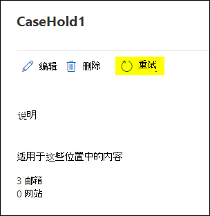

# <a name="troubleshoot-ediscovery-hold-errors"></a>解决电子数据展示保留错误

本文讨论电子数据展示保留中可能会出现的常见问题以及如何解决这些问题。 本文还包括帮助您缓解或避免这些问题的建议做法。

## <a name="recommended-practices"></a>建议的做法

若要减少与电子数据展示保留相关的错误数，建议采用以下做法：

- 如果保留分发仍处于待定状态，状态为 或 ，请等到保留分发完成，然后再 `On (Pending)` `Off (Pending)` 进行进一步更新。

- 在进一步更新保留策略之前，检查保留策略是否挂起。 运行以下命令或将其保存到 PowerShell 脚本。

    ```powershell
    $status = Get-CaseHoldPolicy -Identity <policyname> -DistributionDetail
    if($status.DistributionStatus -ne "Pending"){
        # policy no longer pending
        Set-CaseHoldPolicy -Identity <policyname> -AddExchangeLocation $user1
    }else{
        # policy still pending
        Write-Host "Hold policy still pending."
    }
   ```

- 将更新合并到单个批量请求中的电子数据展示保留，而不是针对每个事务重复更新保留策略。 例如，若要使用 [Set-CaseHoldPolicy](/powershell/module/exchange/set-caseholdpolicy) cmdlet 将多个用户邮箱添加到现有保留策略，请运行命令 (或将 作为代码块添加到脚本) 以便它只运行一次以添加多个用户。

  **正确**

    ```powershell
    Set-CaseHoldPolicy -Identity "policyname" -AddExchangeLocation "User1", "User2", "User3", "User4", "User5"
    ```

   **错误**

    ```powershell
    $users = "User1", "User2", "User3", "User4", "User5"
    ForEach($user in $users)
    {
        Set-CaseHoldPolicy -Identity "policyname" -AddExchangeLocation $user
    }
    ```

   在上一错误示例中，cmdlet 将单独运行五次以完成任务。 有关将用户添加到保留策略的建议做法详细信息，请参阅 [详细信息](#more-information) 部分。

- 在联系 Microsoft 支持部门，了解电子数据展示保留问题之前，请根据 ResultCode 检查 DistributionResults，了解导致策略失败的原因：

   ```powershell
   Get-CaseHoldPolicy -Identity "policyname" -DistributionDetail | Select -ExpandProperty DistributionResults
   ```

   

## <a name="error-policysynctimeout"></a>错误：PolicySyncTimeout

如果在 **ResultCode： PolicySyncTimeout** 和以下错误消息中看到此错误，请检查 LastResultTime 以查看自同步达到超时时间以来是否超过两个小时。

> 部署策略所花时间超过预期。 更新最终部署状态可能需要 2 小时，因此请在几小时后重新检查。

### <a name="resolution"></a>解决方案

运行 **Set-CaseHoldPolicy -Identity "policyname" -RetryDistribution** 将解决该问题。

   ```powershell
   Set-CaseHoldPolicy "policyname" -RetryDistribution
   ```

此外，在策略的"案例保留Microsoft 365 合规中心，可以通过单击"重试"重新部署 **策略**。



## <a name="error-policynotifyerror"></a>错误：PolicyNotifyError

如果在 **ResultCode： PolicyNotifyError** 中看到此错误和以下错误消息，数据中心问题中断了策略同步。

> 由于临时的数据中心问题，无法将策略部署到Office 365源。 当前策略不会应用于源中任何内容，因此阻止的部署没有影响。 若要解决此问题，请尝试重新部署策略。

### <a name="resolution"></a>解决方案

运行 **Set-CaseHoldPolicy -Identity "policyname" -RetryDistribution** 将解决该问题。

   ```powershell
   Set-CaseHoldPolicy "policyname" -RetryDistribution
   ```

此外，在策略的"案例保留Microsoft 365 合规中心，可以通过单击"重试"重新部署 **策略**。


## <a name="error-internalerror"></a>错误：InternalError

如果在 **ResultCode： InternalError** 中看到此错误和以下错误消息，则此问题必须由 Microsoft 解决。

> 由于数据中心出现意外问题，策略Office 365中断。 请联系 Microsoft 支持部门以修复部署问题。

### <a name="resolution"></a>解决方案

请联系 Microsoft 支持人员，了解以下信息：

- 策略名称
- Microsoft 365 服务或功能
- 结果代码
- 结果消息
- 其他诊断

## <a name="error-failedtoopencontainer"></a>错误：FailedToOpenContainer

如果在 **ResultCode： FailedToOpenContainer** 中看到此错误，以及将保管人和数据源置于保留状态时出现以下错误消息，请使用解决方案步骤解决问题。

> 邮箱或SharePoint可能不存在。  如果不正确，请联系 Microsoft 支持部门。  否则，请从此策略中删除它。

### <a name="resolution"></a>解决方案

- 在[PowerShell 中Exchange Online Get-Mailbox](/powershell/module/exchange/get-mailbox)以检查用户邮箱在你的组织中是否存在。

- 在 SharePoint Online PowerShell 中运行[Get-SPOSite](/powershell/module/sharepoint-online/get-sposite) cmdlet，检查站点在你的组织中是否存在。

- 检查网站 URL 是否发生了更改。

- 如果对象不存在，请从策略中删除邮箱或站点。

## <a name="error-siteinreadonlyornotaccessible"></a>错误：SiteInReadonlyOrNotAccessible

如果在 **ResultCode： SiteInReadonlyOrNotAccessible** 和以下错误消息中看到此错误，SharePoint网站将进入只读模式。

> SharePoint网站是只读的或无法访问的。 请与网站管理员联系，使网站可写，然后重新部署此策略。

### <a name="resolution"></a>解决方案

解锁网站 (或要求管理员将其解锁) 以解决此问题。 若要详细了解如何更改网站的锁定状态，请参阅 [锁定和解锁网站](/sharepoint/manage-lock-status)。

## <a name="error-siteoutofquota"></a>错误：SiteOutOfQuota

如果在 **ResultCode： SiteOutOfQuota** 中看到此错误和以下错误消息，SharePoint网站已达到其存储配额。

> 网站SharePoint配额不足。 请为网站集分配更多配额，然后重新部署此策略。

### <a name="resolution"></a>解决方案

向网站集中添加更多 (或要求管理员向网站) 更多存储空间。 若要详细了解如何管理网站的存储配额，请参阅管理 [网站集存储限制](/sharepoint/manage-site-collection-storage-limits)。

向站点添加了更多存储配额后，需要重新部署策略。

   ```powershell
   Set-CaseHoldPolicy "policyname" -RetryDistribution
   ```

此外，在策略的"案例保留Microsoft 365 合规中心，可以通过单击"重试"重新部署 **策略**。


## <a name="error-recipienttypenotallowed"></a>错误：RecipientTypeNotAllowed

如果在 **ResultCode： RecipientTypeNotAllowed** 和以下错误消息中看到此错误，Exchange分配给该策略的邮箱位置。

> 收件人类型不允许保留。

### <a name="resolution"></a>解决方案

在[PowerShell 中Exchange Online Get-Recipient](/powershell/module/exchange/get-recipient)以检查 Endpoint 中的地址是否有效。

如果上述 cmdlet 显示 SMTP 地址不是有效的邮箱，请将其从策略中删除。

```powershell
Set-CaseHoldPolicy "policyname" -RemoveExchangeLocation "non-mailbox user"
```

## <a name="more-information"></a>更多信息

"建议的做法"部分中有关为多个用户更新保留策略的指南是系统阻止同时更新保留策略的结果。 这意味着，当更新的保留策略应用于新内容位置且保留策略为挂起状态时，其他内容位置无法添加到保留策略。 以下是一些需要记住的以帮助你缓解此问题的一些内容：
  
- 每次更新保留时，它会立即进入挂起状态。 挂起状态状态表示保留正在应用于内容位置。
  
- 如果您有一个脚本，该脚本运行循环并将位置按一个 (添加到策略中 (类似于"推荐做法"部分) 中显示的错误示例，则第一个内容位置 (例如，用户邮箱) 将启动触发挂起状态的同步过程。 这意味着在后续循环中添加到策略的其他用户将导致错误。
  
- 如果您的组织使用运行循环来更新保留策略的内容位置的脚本，则必须更新该脚本，以便它在单个批量操作 (中更新位置，如) 的"建议做法"部分的正确示例所示。
